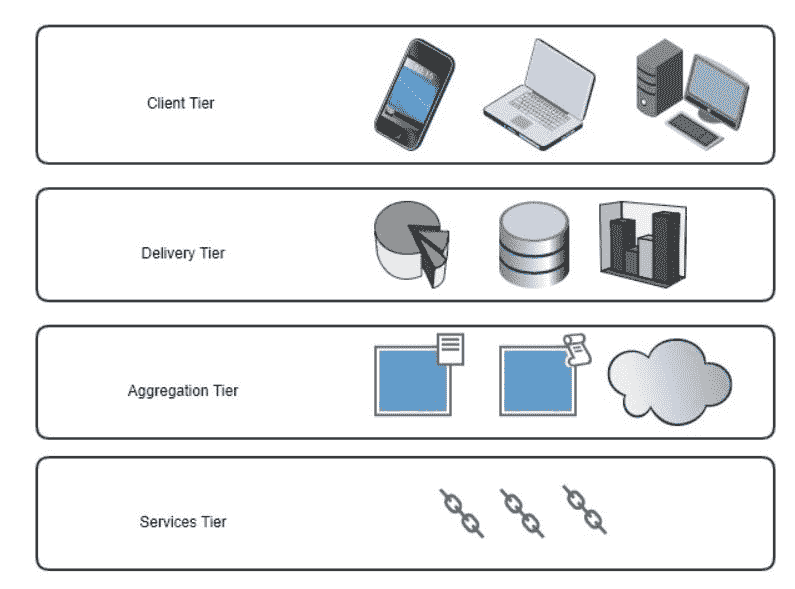
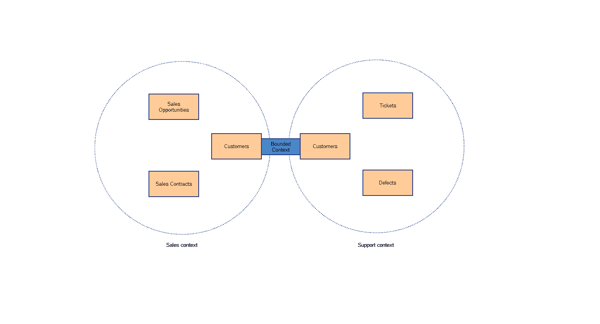
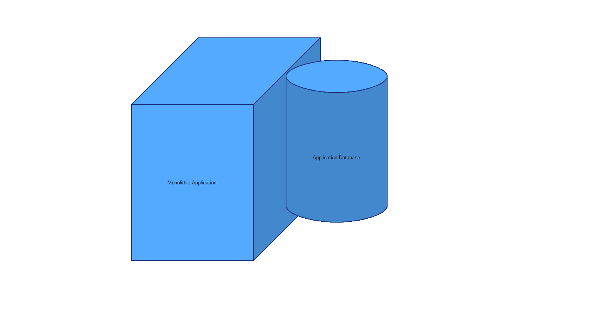

# 十一、迁移

欢迎来到我们学习云本地编程和 Go 语言世界之旅的第 11 章。在本章中，我们将介绍一些将应用从单片架构迁移到微服务架构的实用技术。我们已经在[第 2 章](02.html)、*使用 Rest API 构建微服务中介绍了单片和微服务架构。*但是，如果您单独阅读本章，我们将在本章开始介绍单片和微服务架构的实际定义。

在本章中，我们将介绍以下主题：

*   单片应用和微服务架构综述
*   从单片应用迁移到微服务应用的技术
*   高级微服务设计模式
*   微服务架构中的数据一致性

# 什么是单片应用？

一个**单片应用**仅仅是一个单独的软件，它同时承担多个独立的任务。让我们以一个在线商店应用为例。在单片架构中，我们将拥有一个单独的软件来处理客户、他们的订单、数据库连接、网站、库存以及在线商店成功所需的任何其他任务

对于软件设计来说，一个单一的软件做任何事情似乎都是一种低效的方法，在某些场景中就是这样。然而，必须指出的是，单片应用并不总是坏的。在某些情况下，单个软件服务完成所有工作是可以接受的想法。这包括最低可行的产品或 MVP，在这些产品或 MVP 中，我们尝试快速构建一些东西，以供测试用户尝试。它还包括预期不会有大量数据负载或流量的用例，例如传统棋盘游戏爱好者的在线商店。

# 什么是微服务？

与单片应用相比，**微服务架构**采用不同的方法构建软件。在微服务架构中，任务分布在多个较小的软件服务中，这些服务称为微服务。在设计良好的微服务架构中，每个微服务都应该是自包含、可部署和可扩展的。设计良好的微服务也享受干净的 API，允许其他微服务与它们通信。独立软件服务协同工作以实现共同目标的概念并不新鲜；它过去以**面向服务的架构**（**SOA**的形式存在。然而，现代微服务架构将这一想法进一步推进，坚持软件服务相对较小、独立且完全独立。

让我们回到在线商店的例子。在微服务架构的情况下，我们将有一个用于客户处理的微服务，一个用于库存处理的微服务，等等。

典型的微服务内部包含多个基本层，用于处理日志记录、配置、与其他微服务通信的 API 以及持久性。还有微服务的核心代码，它涵盖了该服务应该完成的主要任务。以下是微服务的内部外观：

微服务的内部外观

当涉及到可伸缩性和灵活性时，微服务架构比单片应用具有重大优势。微服务允许您无限期地扩展，利用多种编程语言的功能，并优雅地容忍故障。

# 从单片应用迁移到微服务

现在，假设您有一个单片应用，您的业务正在增长，您的客户要求更多的功能，并且您需要迁移到一个既灵活又可扩展的架构。是时候使用微服务了。迁移时要记住的第一条关键经验法则是，要成功地从单片应用迁移到微服务，我们不需要遵循任何黄金步骤。我们需要采取的步骤因情况和组织而异。话虽如此，我们可以在本章中介绍一些非常有用的概念和想法，它们将帮助您就如何进行迁移做出明智的决定。

# 人与技术

从单一应用过渡到微服务时，最容易被忽视的一个方面是**人员因素**。我们通常会想到技术和架构，但是那些编写代码、管理项目和重新设计应用的团队呢？从单一应用向微服务的转变是一种范式转变，需要在组织中妥善规划。

在决定进入微服务之后，我们首先要考虑的是参与开发过程的团队的结构。通常，以下人员由处理单片应用的团队组成：

*   习惯于使用单一编程语言而非其他语言处理非常特定的应用片段的开发人员
*   IT 基础设施团队习惯于只更新几个托管单片应用及其数据库的服务器
*   团队领导从 a 到 Z 拥有一个应用而不是整个软件服务

如前所述，微服务迁移代表了一种范式转变。这意味着，当过渡到微服务架构时，需要在组织中采用新的思维方式。考虑以下事项：

*   开发人员需要分成更小的团队，每个团队负责一个或多个微服务。开发人员将需要舒适地负责整个软件服务，而不是一堆软件模块或类。当然，如果组织足够大，您仍然可以让开发人员负责微服务中的特定模块。然而，如果开发人员接受培训，将他们的产品视为整个微服务，这是值得的，因为这将产生一个设计更好的微服务。开发人员还需要熟悉如何使用合适的编程语言来完成这项工作。例如，Java 对于数据处理和流水线非常重要，Go 对于构建快速可靠的微服务非常好，C#对于 Windows 服务非常好，等等
*   IT 基础设施团队需要了解横向扩展、冗余、可扩展的云平台，以及部署大量分布在众多服务器中的服务所涉及的规划过程。
*   团队领导将承担整个软件服务从 A 到 Z 的职责。他们将需要考虑实现细节，例如如何扩展服务，是否与其他服务共享数据库或拥有自己的数据库，以及服务如何与其他服务进行通信。

# 将单片应用切割成碎片

现在我们讨论了迁移的人的方面，让我们深入研究一下技术细节。几乎所有人都同意的一条金科玉律是，从头开始编写所有内容并忽略现有单片应用（也称为“大爆炸重写”）中的所有代码不是一个好主意。相反，从单片应用迁移到微服务的最佳方法是随着时间的推移逐块切割单片应用。每一个分离的部分都成为一个微服务。对于每一个新的微服务，我们都需要确保它仍然可以与 Monlitic 应用以及其他新的微服务进行通信。如果这种方法进展顺利，单片应用将随着时间的推移不断缩小，直到它成为一种微服务

单片应用

这听起来很简单；然而，在现实生活中，这通常不是那么简单。让我们介绍一些规划策略，以使逐件方法更具可执行性

# 我们如何破译密码？

我们需要问的一个关键技术问题是，我们到底应该如何破解单片应用的代码？以下是一些需要记住的要点：

*   如果一个应用写得很好，那么不同的类或软件模块之间就会有清晰而明显的分离。这使得分割代码变得更容易。
*   另一方面，如果代码中没有明确的分离，我们需要对现有代码进行重构，然后才能开始将代码片段移动到新的微服务。
*   通常最好不要在不尝试将新功能分离到新的微服务中的情况下向单片应用添加新代码或功能。

# 胶码

为了使新的微服务适应原始应用而不破坏其功能，微服务需要能够与原始应用交换信息。为了实现这一点，我们可能需要编写一些粘合代码，将新旧代码链接起来。粘合代码通常包括一些 API 接口，这些接口将充当原始应用和微服务之间的通信通道。粘合代码还将包括使新微服务与现有应用协同工作所需的任何代码：

胶码

粘合代码可能是临时的，也可能是永久的，这取决于我们的应用。有时，粘合代码可能需要进行一些数据建模转换或与旧数据库通信以使事情正常工作。

如果您的应用是 web 应用，那么粘合代码可能包括一个临时 web HTTP API，它可以将新分离的微服务与查看层连接起来

# 微服务设计模式

在本节中，我们将讨论一些重要的设计模式和架构方法，它们可以帮助我们构建健壮有效的云就绪微服务。让我们开始吧。

# 祭祀建筑

**牺牲式建筑**是一种重要的设计方法，通常不会得到应有的重视。Martin Folwer 在 2014 年提到过，可在[上找到 https://martinfowler.com/bliki/SacrificialArchitecture.html](https://martinfowler.com/bliki/SacrificialArchitecture.html) 。

牺牲式架构的核心思想是，我们应该以一种在未来易于替换的方式编写软件。为了更好地理解前面的语句，让我们考虑一个示例场景。比如说，几年前，我们构建了一个计算机网络应用，该应用利用我们的开发人员设计的自定义数据序列化格式。今天，我们需要用一种更现代的编程语言重写应用，这种语言可以处理更多的数据负载和用户请求。无论从何种角度来看，这项任务都不会很有趣或容易，因为我们的应用依赖于定制的序列化和通信协议，而这些协议只能由应用的原始开发人员理解。

现在，如果我们使用了更标准化的序列化格式，比如协议缓冲区，会怎么样？重写或更新应用的任务将更容易、更高效，因为协议缓冲区受到各种编程语言和框架的支持。牺牲架构的意义在于使用标准序列化格式而不是自定义格式构建应用。

当我们在设计软件时考虑到牺牲架构，升级、重构和/或改进应用的任务就会变得更加简单。如果我们的单片应用在设计时考虑了牺牲性的架构，那么将应用的各个部分分离为微服务就变得容易了。

如果我们在编写胶水代码时考虑到牺牲性的架构，那么在将来改进胶水代码或者完全抛弃它并用其他东西替换它就变得容易多了。如果我们在构建新的微服务时考虑到牺牲性的架构，那么我们就有能力快速、无痛、高效地增长和发展我们的微服务。

# 四层参与平台

**四层参与平台**是一种针对整个应用的架构方法。Forrester research 在；[https://go.forrester.com/blogs/13-11-20-mobile_needs_a_four_tier_engagement_platform/](https://go.forrester.com/blogs/13-11-20-mobile_needs_a_four_tier_engagement_platform/) 。这种架构非常适合面向移动和网络时代的现代应用。该架构允许扩展性、灵活性和性能。它还使得云服务和内部微服务的集成变得非常简单和高效

四层参与架构

此架构背后的主要思想是，整个应用应分为四个主要层：

*   **客户端层**：**该层负责用户体验；它根据用户的上下文环境定制用户体验。上下文环境包括用户设备类型、用户位置、一天中的时间等。例如，如果您产品的用户正在使用智能手表，则客户端层应呈现适合智能手表的内容。如果他们正在使用平板电脑，一个非常适合平板电脑的用户界面会向用户致意。如果用户正在查看来自中国的数据，客户端层需要以中文显示信息。如果用户正在查看来自加拿大的数据，则需要以英语显示信息**
***   **交付层**：交付层负责按照客户层的要求向用户交付优化后的数据。这是通过动态优化实现的，例如图像压缩或带宽减少。该层可以利用监控工具跟踪用户活动，然后利用算法使用这些信息提供更好的客户体验。这一层也是我们使用缓存算法和技术为客户确保更好性能的地方*   **聚合层**：该层是将来自不同来源的数据进行聚合，形成稳定、统一的数据模型，然后将数据模型移交给前一层。该层承担的任务包括：
    *   充当层之间的 API 集线器，提供服务可发现性和对前面层的数据访问。
    *   集成内部服务（如内部微服务）和外部服务（如 AWS 云服务）的输出。
    *   合并来自不同源类型的数据，例如，从一个源读取 base64 编码的消息，从另一个源读取 JSON 编码的消息，然后将它们链接在一起以形成统一的数据模型。
    *   将数据编码为适合交付给用户的格式。
    *   指定对数据的基于角色的访问。*   **服务层：**该层由我们的外部服务和内部服务组成。它为层提供原始数据和功能。这些层由一组可部署的内部和外部服务组成。服务层是我们与 MySQL 或 DynamoDB 等数据库通信的地方；在这里，我们将使用第三方服务，如 AWS S3 或 Twilio。这一层应该设计成可插拔的，这意味着我们可以根据自己的意愿轻松地向其中添加或删除服务**

 **如果我们使用前面的架构模式设计现代应用，我们将获得无限的灵活性和可伸缩性。例如，我们可以在客户端层中针对新的用户设备类型，而不需要在其他层中更改太多代码。我们可以在服务层中添加或删除微服务或云服务，而无需在其上面的层中更改太多代码。我们可以在聚合层中支持新的编码格式，如 Thrift 或协议缓冲区，而无需更改其他层上的代码。Netflix 和 Uber 等公司目前正在使用这一四层参与平台。

# 领域驱动设计中的有界上下文

**领域驱动****设计**（**DDD**）是一种流行的设计模式，我们可以使用它来内部设计微服务。域驱动设计通常针对可能随时间呈指数增长的复杂应用。如果您的单片应用已经通过 DDD 进行了设计，那么迁移到微服务架构将非常简单。否则，如果您期望新的微服务在范围和复杂性上增长，那么考虑 DDD 可能是一个好主意。

领域驱动设计是一个庞大的主题。维基百科文章可在[找到 https://en.wikipedia.org/wiki/Domain-driven_design](https://en.wikipedia.org/wiki/Domain-driven_design) 。然而，在本节中，我们将介绍一些有助于我们实际理解 DDD 的简要概念。然后，您将了解为什么这种设计方法适合复杂的微服务架构。

领域驱动设计的思想是，一个复杂的应用应该被视为在*领域*中运行。领域被简单地定义为知识或活动的领域。软件应用的领域可以描述为与软件用途相关的一切。因此，例如，如果我们的软件应用的主要目标是促进规划社交活动，那么规划社交活动就成为我们的领域

一个域包含*上下文*；每个上下文都代表了域的一个逻辑部分，人们在其中使用相同的语言。语境中使用的语言只能根据它所属的语境来理解。

根据我的经验，如果没有一个例子，很难理解上下文是什么。让我们举一个简单的例子。假设 social events 应用背后的组织是一个大型组织，有一个销售部门、一个营销部门和一个支持部门。这意味着该组织的领域驱动设计可能需要包括以下三个主要上下文：销售上下文、营销上下文和支持上下文

销售人员使用的某些语言仅与销售人员相关。例如，销售漏斗、销售机会或销售渠道的概念对销售非常重要，但可能与支持部门无关。这就是为什么，销售上下文可以包含销售漏斗的概念，但在支持上下文中，您不会发现太多这种语言或概念。

领域

域还包含模型。每个模型都是一个抽象，描述了领域中的一个独立概念。模型最终转化为软件模块或对象。模型通常存在于上下文中。例如，在销售上下文中，我们需要模型来表示销售合同、销售漏斗、销售机会、销售渠道和客户等，而在支持上下文中，我们需要模型来显示票据、客户和缺陷。以下是一个简单的图表，显示了销售上下文和支持上下文中的一些模型：

销售和支持联系人

不同的语境可以共享相同的语言或概念，但关注的是它的不同方面。在我们庞大的组织示例中，销售人员使用的一个词对支持人员的含义可能并不总是相同的。例如，用于销售的单词*customer*表示可能从组织购买产品，但尚未购买的客户。另一方面，支持部门的客户可能是已经购买了产品、购买了支持合同并且产品存在某种问题的客户。因此，这两种情况下共享的概念，客户；然而，当涉及到这个概念时，他们关心不同的事情

同一种语言在不同的语境中可能意味着不同的东西，这一事实引出了 DDD 领域的一个关键思想，即有界语境。有界上下文是共享一个概念的上下文，但它们实现了自己的概念模型。例如，*客户*的概念由销售上下文中的模型表示，该模型反映了销售部门关心的客户版本。客户的概念也根据其版本在支持上下文中建模。尽管它们是两个模型，但它们仍然是相互关联的。这是因为，归根结底，他们都是社交活动策划公司的客户。下面是一个简单的示意图，显示了它的外观：

有限的销售和支持联系人

上下文和有界上下文是域驱动程序设计和微服务世界开始相遇的地方。当涉及到复杂的现代微服务时，它是一个关键的设计因素，因为上下文可以很容易地映射到微服务。如果您试图定义有界上下文，您将发现自己不仅定义了实际中的微服务，还定义了在微服务之间应该共享哪些信息以形成整个应用。有界上下文的一个简单定义是，它是一个自包含的逻辑块，是更大应用的一部分。同样的定义也适用于描述精心设计的微服务，无需添加任何内容。有时，一个有界上下文可以划分为多个服务，但这通常取决于应用的复杂程度

在这里的示例中，我们将得到一个处理销售操作的微服务和一个处理支持操作的微服务。

如果您的单片应用已经在设计时考虑了 DDD 原则，那么迁移到微服务架构会变得更容易。这是因为从形成有界上下文的代码过渡到自包含的微服务是有意义的

另一方面，如果您的单片应用不是这样设计的，但是应用复杂且不断增长，那么 DDD 原则可以用于构建未来的微服务。

# 数据一致性

为应用提供动力的数据库是一个至关重要的模块，在迁移到微服务架构时必须非常小心和尊重它。在单片应用的世界中，您可能会处理少量通过 fat 数据处理层连接到单片应用的数据库（一个或两个），如下所示：

带数据库的单片应用

然而，在微服务和分布式云架构的情况下，情况可能会大不相同。这是因为该架构可能包括更广泛的数据模型和数据库引擎，以满足分布式微服务的需求。微服务可以拥有自己的数据库，与其他应用共享数据库，或者同时使用多个数据库。现代微服务架构中的数据一致性和建模是一个非常重要的挑战，我们需要在其失控之前通过良好的应用设计来应对

在下一节中，我们将讨论在将数据模型从单一应用范式转变为微服务时需要记住的一些策略。

# 用于数据一致性的事件驱动架构

在微服务架构中，我们可以用来保护数据一致性的一个关键设计模式是事件驱动设计。使用微服务很难保持数据一致性的原因是，每个微服务通常负责来自整个应用的一段数据。应用的微服务处理的数据存储的总和表示应用的总状态。因此，这意味着当一个微服务更新其数据库时，受此数据更改影响的其他微服务需要了解它，以便它们可以采取适当的措施并更新自己的状态

让我们从本章的“有界上下文”部分以销售和支持微服务为例。如果新客户购买了产品，sales microservice 将需要更新自己的数据库，以反映新客户作为实际付费客户而不仅仅是潜在客户的状态。此事件还需要与 support microservice 进行沟通，以便它能够更新自己的数据库，以反映这样一个事实，即有一个新的付费客户在需要时值得客户或技术支持

在微服务世界中，事件驱动设计就是关于微服务之间的这种事件通信。微服务之间的消息队列或消息代理可用于在微服务之间传递事件消息。在[第 4 章](04.html)、*使用消息队列的异步微服务架构*中详细讨论了消息代理。当某个事件发生时需要通知的微服务必须订阅这些事件。

例如，支持服务将需要订阅消息队列中表示购买产品的客户的事件主题。然后，每当客户购买产品时，sales microservice 就会触发此事件。由于支持服务已订阅该活动，因此它将在不久后收到该活动的通知，其中将包括新客户的信息。从那里，支持服务将能够执行自己的逻辑，以确保支持组织在需要帮助时随时为该客户做好准备，甚至可能为新客户发送欢迎电子邮件。

现在，这一切听起来都不错，但是如果 support microservice 在接收新客户事件之前失败了怎么办？这意味着支持服务最终将不了解新客户，因此不会应用任何逻辑将新客户的相关信息添加到支持数据库中。这是否意味着当客户稍后打电话寻求帮助时，支持团队不会提供帮助，因为他们在系统中看不到客户？显然，我们不希望这种情况发生。一种方法是建立一个存储客户数据的中央数据库，这些数据将在不同的微服务之间共享，但如果我们寻求一种灵活的设计，其中每个微服务对其整个状态完全负责，该怎么办。这就是事件来源和 CQR 的概念。

# 活动来源

事件源背后的基本思想是，我们需要利用记录的事件流来形成状态，而不是完全依赖本地数据库来读取状态。为了实现这一点，我们需要存储所有当前和过去的事件，以便稍后检索它们。

我们需要一个例子来巩固这一理论定义。假设支持服务在接收新客户事件之前就失败并崩溃了。如果支持服务不使用事件源，那么当它重新启动时，它将无法在自己的数据库中找到客户信息，也永远不会知道客户的情况。但是，如果它使用事件源，那么它将查看与所有其他微服务共享的事件存储，而不是只查看其本地数据库。事件存储将记录在我们的微服务之间触发的任何事件。在该事件存储中，支持服务将能够重播最近触发的新客户事件，并将看到该客户当前不存在于本地支持 microservice 数据库中。然后，支持服务可以将此信息作为正常信息处理

同样，这种设计的一个关键技巧是永远不要丢弃任何过去或新的事件。这是通过将它们保存在事件存储中实现的；下面是它的样子：

实现事件存储有多种方法；它可以是 SQL 数据库、NoSQL 数据库，甚至是支持永久保存事件的消息队列。Kafka 是消息队列的一个例子，它声称也是事件源的一个好引擎

有多种方法来解决事件来源问题；我们在本节中介绍的场景代表了一种将事件存储与快照一起使用的方法。本例中的快照是 support microservice 本地数据库，它还试图保持快照状态。但是，最终状态仍应在事件存储中。

还有其他实现事件源的方法，其中不使用快照，并且始终必须从事件存储派生整个状态

事件源的缺点是它的复杂性会呈指数级增长。这是因为在某些环境中，我们可能需要重播大量事件以构建系统的当前状态，这需要大量的处理和复杂性。为了形成数据模型，将来自不同重播事件的数据连接起来，我们需要运行的查询很容易变得痛苦。

控制事件源复杂性的一种流行方法是 CQR。

# CQRS

**命令查询责任分离**（**CQRS**的基本思想是，表示任何与更改数据相关的操作（如添加、更新或删除）的命令应与任何与读取数据相关的查询分离。在微服务架构中，这可能意味着一些服务应该负责命令，而另一些服务则负责查询

CQR 的一个关键优势是关注点分离。这是因为我们将写关注点和读关注点分开，并允许它们独立扩展。例如，假设我们使用的是一个复杂的应用，我们需要不同的数据视图模型。我们希望将所有客户数据存储在弹性搜索集群中，以便能够高效地搜索和检索客户信息。同时，我们希望将所有客户数据存储在图形数据库中，因为我们希望数据的图形视图。

在这种情况下，我们将创建 micrservices，负责从事件流（消息队列）查询客户事件，然后在通过事件源接收到新客户事件时更新弹性搜索和图形数据库。这些服务将是 CQR 的查询部分。另一方面，我们将有其他微服务，负责在需要时触发新事件。这些服务最终将成为 CQR 的命令部分

然后，这些读写微服务可以与我们的其他服务一起构成我们的应用

# 总结

在本章中，我们将深入探讨从单片应用迁移到微服务应用的实际方面。我们仔细研究了一些先进的设计模式和架构，我们可以利用这些模式和架构从单片应用切换到微服务应用。本章结束了本书的学习历程。

在下一章中，我们将讨论一些技术和主题，您可以在获得本书中包含的知识后开始探索这些技术和主题。**