# 九、Web 级架构的基础

[第 5 章](05.html)、*介绍 Goophr*、[第 6 章](06.html)、*Goophr 礼宾部*、[第 7 章](07.html)、*Goophr 图书管理员*都是关于分布式搜索索引系统的设计与实现，从基本概念开始，运行各个组件并验证它们是否按预期工作。在[第 8 章](08.html)*部署 Goophr*中，我们借助**docker compose**将各个组件连接起来，以便我们能够轻松可靠地启动和连接所有组件。在过去的四章中，我们已经取得了相当大的成就，但您可能已经注意到，我们在一台机器上运行一切，很可能是笔记本电脑或台式机。

理想情况下，我们应该下一步尝试准备我们的分布式系统，使其在繁重的用户负载下可靠地工作，并通过 web 将其公开以供一般使用。然而，现实情况是，我们必须对现有系统进行大量升级，使其具有足够的可靠性和弹性，以便能够在真实的流量下工作。

在本章中，我们将介绍在为 web 进行设计时应牢记的各种因素。我们将研究：

*   扩展 web 应用程序
*   Monolith 应用程序与微服务
*   部署选项

## 扩展 web 应用程序

在本章中，我们将不讨论 Goophr，而是讨论一个简单的用于博客的 web 应用程序，以便我们能够集中精力在 web 上扩展它。这样的应用程序可能由运行数据库和博客服务器的单个服务器实例组成。

扩展 web 应用程序是一个复杂的主题，我们将在这个主题上投入大量时间。正如我们将在本节中看到的，有多种方法可以扩展系统：

*   将系统作为一个整体进行扩展
*   拆分系统并缩放单个组件
*   选择特定的解决方案以更好地扩展系统

让我们从最基本的设置开始，一个服务器实例。

### 单服务器实例

单个服务器设置通常包括：

*   用于服务网页和处理服务器端逻辑的 web 服务器
*   用于保存与博客相关的所有用户数据（博客文章、用户登录详细信息等）的数据库

下图显示了此类服务器的外观：

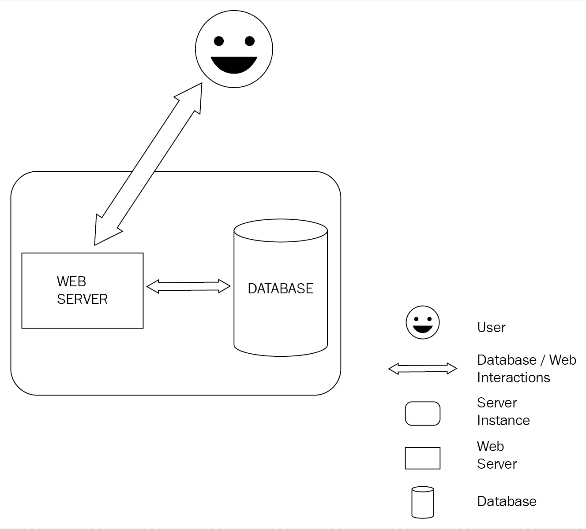

该图显示了一个简单的设置，其中用户与博客服务器交互，博客服务器将在内部与数据库交互。在同一实例上设置数据库和博客服务器将是高效的，并且只对一定数量的用户作出响应。

当系统开始减速或存储空间开始填满时，我们可以将应用程序（数据库和博客服务器）重新部署到具有更多存储、RAM 和 CPU 能力的不同服务器实例上；这被称为**垂直缩放**。正如您可能怀疑的那样，这可能是一种耗时且不方便的服务器升级方式。如果我们能尽可能长时间地推迟升级，不是更好吗？

需要考虑的一个重要问题是，该问题可能是由以下因素的任意组合造成的：

*   由于数据库或博客服务器，内存不足
*   由于 web 服务器或数据库需要更多 CPU 周期而导致性能下降
*   由于数据库问题，存储空间不足

针对上述任何因素扩展整个应用程序都不是解决此问题的最佳方法，因为我们花费了大量资金，而我们本可以用更少的资源解决此问题！那么，我们应该如何设计我们的系统，以便我们能够以正确的方式解决正确的问题呢？

### web 和数据库的独立层

如果我们采取前面提到的三个问题，我们可以用一种或两种方法解决每一个问题。让我们先来看看它们：

**问题**内存不足

**溶液**：

*   **由于数据库**：增加数据库的 RAM
*   **由于博客服务器**：增加博客服务器的 RAM

**问题 2**性能下降

**溶液**：

*   **由于数据库***：*增加数据库的 CPU 功率
*   **由于博客服务器**：增加博客服务器的 CPU 功率

**问题**存储空间不足

**溶液**：

*   **由于数据库**：增加数据库的存储空间

使用此列表，我们可以根据需要升级系统，以解决我们面临的特定问题。但是，我们首先需要正确识别导致问题的组件。因此，即使在开始垂直扩展应用程序之前，我们也应该将数据库与 web 服务器分离，如下图所示：

这个数据库和博客服务器位于不同服务器实例上的新设置将使我们能够监视哪个组件出现问题，并仅垂直扩展该特定组件。我们应该能够用这个新的设置来服务更大的用户流量。

但是，随着服务器负载的增加，我们可能会遇到其他问题。例如，如果我们的博客服务器没有响应会发生什么？我们将不再能够为博客帖子提供服务，也没有人能够在上述博客帖子上发表评论。这是没有人愿意面对的情况。如果我们能够在博客服务器关闭的情况下继续提供流量服务，那不是很好吗？

### 多个服务器实例

使用博客服务器或任何应用程序（业务逻辑）服务器的单个服务器实例为大量用户提供服务是危险的，因为我们实际上是在创建单点故障。避免这种情况的最合理和最简单的方法是使用我们博客服务器的重复实例来处理传入的用户流量。这种将单个服务器扩展到多个实例的方法称为**水平扩展**。然而，这提出了一个问题：我们如何在博客服务器的各个实例之间可靠地分配流量？为此，我们使用**负载平衡器**。

#### 负载平衡器

负载平衡器是一种 HTTP 服务器，负责根据开发人员定义的规则将流量（路由）分发到各种 web 服务器。一般来说，负载平衡器是一种非常快速和专门的应用程序。尝试在 web 服务器中实现类似的逻辑可能不是最优的，因为 web 服务器可用的资源必须在处理业务逻辑请求和需要路由的请求之间进行分配。此外，负载平衡器为我们提供了许多现成的功能，例如：

*   **负载平衡算法**：下面是一些负载平衡算法：
    *   **随机**：在服务器间随机分布。
    *   **循环**：在服务器间按顺序均匀分布。
    *   **非对称负载**：按一定比例分布在服务器之间。例如，对于 100 个请求，将 80 个发送到服务器 A，将 20 个发送到服务器 B。
    *   **最少连接**：向活动连接数最少的服务器发送新请求（非对称负载也可以与最少连接集成）。
*   **会话持久性**：想象一个电子商务站点，用户将商品添加到他的购物车中，购物车中的商品信息存储在服务器 a 上。但是，当用户想要完成购买时，请求会发送到另一个服务器 B！这对于用户来说是一个问题，因为与他的购物车相关的所有详细信息都在服务器 A 上。负载平衡器具有确保将此类请求重定向到相关服务器的规定。
*   **HTTP 压缩**：负载平衡器还提供了使用`gzip`对传出响应进行压缩的功能，以减少发送给用户的数据量。这将大大改善用户体验。
*   **HTTP 缓存**：对于提供多于 REST API 内容的站点，可以缓存很多文件，因为它们不会经常更改，缓存的内容可以更快地交付。

根据所使用的负载平衡器，它们可以提供比上述功能多得多的功能。这应该让我们了解负载平衡器的功能。

下图显示了负载平衡器和多台服务器如何协同工作：

用户的请求到达负载平衡器，然后负载平衡器将请求路由到博客服务器的多个实例之一。但是，请注意，即使现在，我们仍在使用相同的数据库进行读写操作。

### 多可用区

在上一节中，我们讨论了单点故障以及为什么拥有多个应用服务器实例是件好事。我们可以进一步扩展这个概念；如果我们的所有服务器都在一个位置，并且由于一些重大故障或停机，我们的所有服务器都停机了怎么办？我们将无法为任何用户流量提供服务。

我们可以看到，将服务器放在一个位置也会导致单点故障。解决方案是在多个位置提供应用服务器实例。接下来的问题是：我们如何决定部署服务器的位置？我们应该将服务器部署到单个国家的多个位置，还是应该将它们部署到多个国家？我们可以用云计算术语将这个问题重新表述如下。

我们需要决定是否要将服务器部署到**多个区域**或**多个区域**，或者两者的组合。

需要注意的一点是，部署到多个区域可能会导致网络延迟，我们可能希望首先部署到多个区域。但是，在部署到多个区域之前，我们需要确保两个事实：

*   我们的网站流量大，单服务器设置无法再处理
*   我们有大量来自另一个国家的用户，在他们附近的区域部署服务器可能是个好主意

一旦我们考虑到这些因素并决定部署到其他区域，我们的博客系统作为一个整体可能看起来像这样：

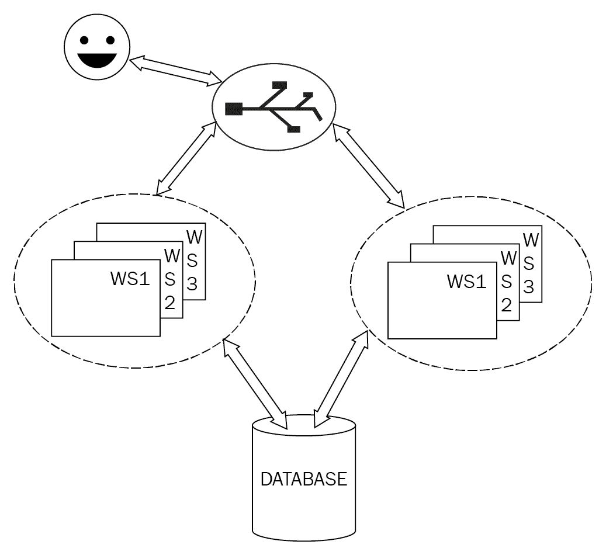

### 数据库

我们一直在扩展应用程序/博客服务器，并了解了如何垂直和水平扩展服务器，以及如何考虑多个区域和区域以实现整个系统的高可用性和性能。

您可能已经注意到，在以前的所有设计中，我们仍然依赖于单个数据库实例。到目前为止，您可能已经意识到，拥有任何服务/服务器的单个实例都可能成为单点故障，并可能导致系统完全停止。

棘手的是，我们不能像在应用服务器上那样使用运行多个数据库实例的简单策略。我们之所以能够对应用服务器使用此策略，是因为应用服务器负责业务逻辑，并且它在自身中维护的少量状态是暂时的，而所有重要信息都被推送到数据库中，而数据库是唯一的真相来源，具有讽刺意味的是，也是唯一的失败来源。在我们深入研究扩展数据库的复杂性以及随之而来的挑战之前，让我们先看看一个需要解决的重要主题。

#### SQL 与 NoSQL

对于新手来说，数据库有两种类型：

*   **关系数据库**：这些数据库使用 SQL（略有变化）查询数据库
*   **NoSQL 数据库**：这些数据库可以存储非结构化数据，并使用特定于数据库的查询语言

关系数据库已经存在很长一段时间了，人们已经投入了大量精力来优化它们的性能并使它们尽可能健壮。然而，可靠性和性能要求我们计划并将数据组织到定义良好的表和关系中。我们的数据绑定到数据库表的模式。每当我们需要向表中添加更多字段/列时，我们都必须将表迁移到新架构，这将要求我们创建迁移脚本，负责添加新字段，并提供条件和数据来填充表中已存在行的新创建字段。

NoSQL 数据库往往具有更自由的结构。我们不需要为表定义模式，因为数据存储为单行/文档。我们可以将任何模式的数据插入到单个表中，然后查询它。由于数据不局限于模式规则，我们可能最终将错误或格式错误的数据插入数据库。这意味着我们必须确保检索到正确的数据，还必须采取预防措施以确保不同模式的数据不会使程序崩溃。

##### 我们应该使用哪种类型的数据库？

一开始，人们可能会倾向于使用 NoSQL，因为这样我们就不必担心数据结构和连接查询了。但是，重要的是要认识到，我们不是以 SQL 形式编写这些查询，而是将所有数据检索到用户空间（即程序）中，然后在程序中编写手动连接查询。

相反，如果我们依赖关系数据库，我们可以确保更小的存储空间、更高效的连接查询和具有定义良好的模式的数据。所有关系数据库和一些 NoSQL 数据库都提供了索引，这也有助于优化以实现更快的搜索查询。然而，使用表和联接的关系数据库的一个主要缺点是，随着数据的增长，联接可能会开始变慢。至此，您将清楚地知道哪些数据部分可以利用 NoSQL 解决方案，并将开始在 SQL 和 NoSQL 系统的组合中维护数据。

简而言之，从关系数据库开始，一旦您的表中有大量的数据，并且不能进行进一步的数据库调整，那么就考虑移动表，这些表确实需要 NoSQL 数据包的高性能。

#### 数据库复制

既然我们已经确定了为什么选择使用关系数据库，那么让我们进入下一个问题：我们如何确保我们的数据库不会成为单一故障点？

让我们首先考虑如果数据库失败的后果是什么：

*   我们无法将新数据写入数据库
*   我们无法从数据库中读取数据

在这两种后果中，后者更为关键。考虑我们的博客应用程序，同时能够写新的博客文章是重要的，我们网站上的绝大多数用户都是读者。这是大多数面向日常用户的应用程序的标准。因此，我们应该努力确保始终能够从数据库中读取数据，即使我们不再能够向数据库写入新数据。

数据库复制和冗余试图解决这些问题，通常，解决方案是作为数据库或插件的一部分提供的。在本节中，我们将讨论用于数据库复制的三种策略：

*   主副本复制
*   主复制
*   故障转移群集复制

##### 主副本复制

这是最直接的复制方法。可以解释如下：

1.  我们使用一组数据库：

数据库集群

2.  将其中一个数据库指定为主数据库，将其余数据库指定为副本：

DB-3 被指定为主机

3.  所有写入操作都会执行到主机：

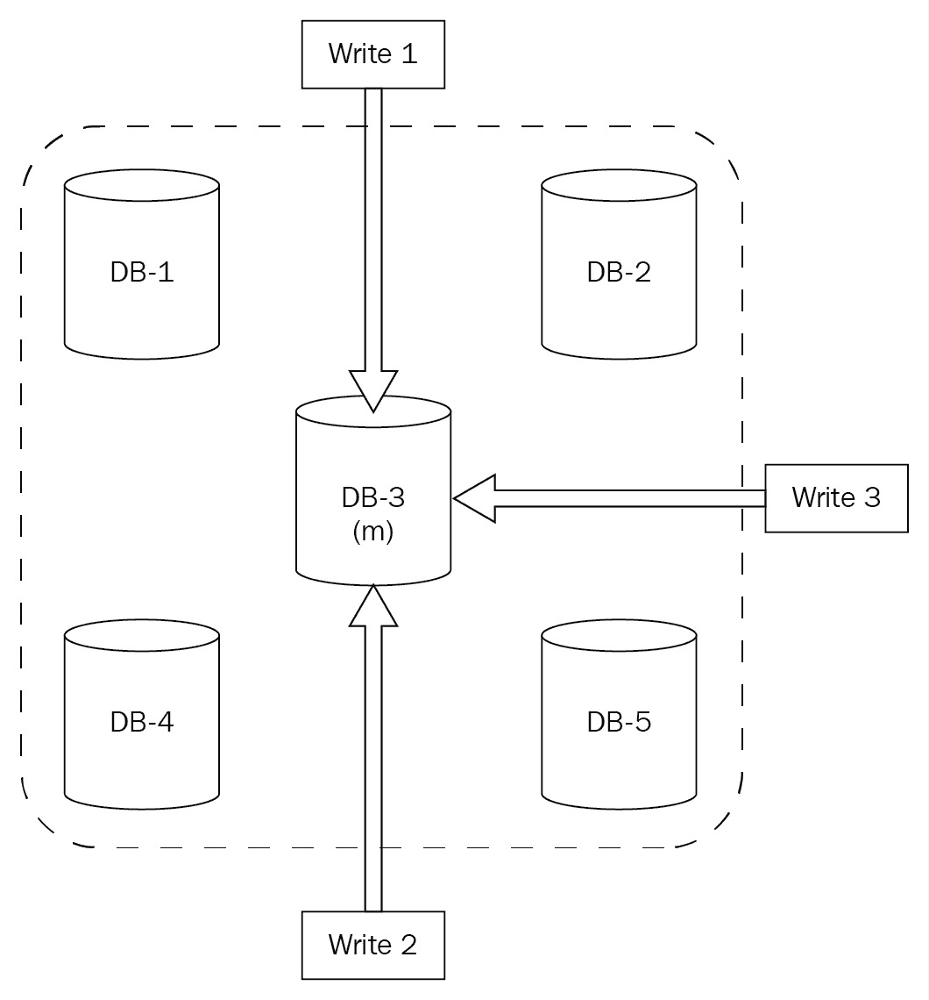

在主机上执行三次写入

4.  所有读取都是从副本执行的：

>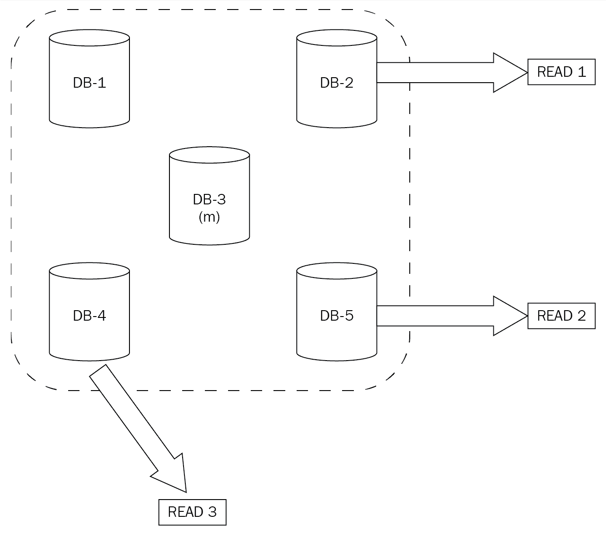

从复制副本执行的读取

5.  主数据库确保所有副本都具有最新状态，即主数据库的状态：

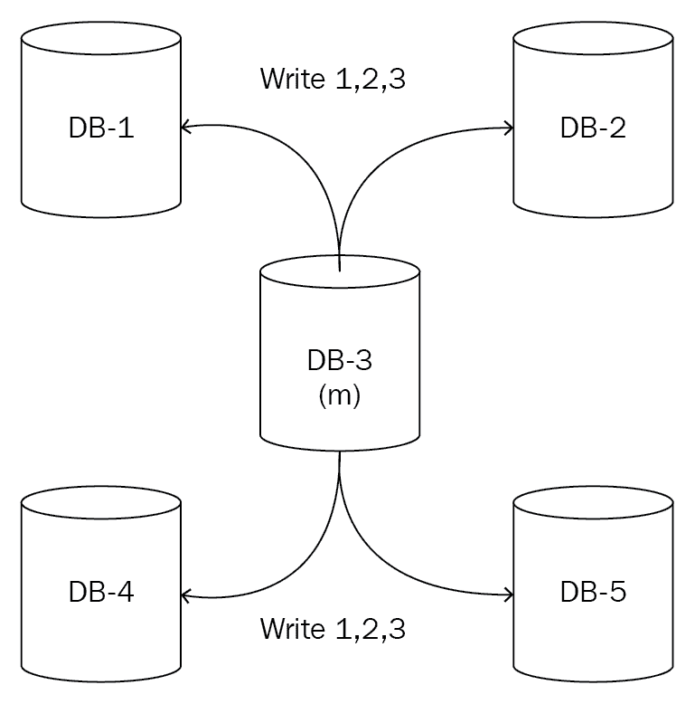

主服务器使用最新更新更新所有副本

6.  主数据库中的故障仍然允许从 Replicator 数据库读取数据，但不允许写入：

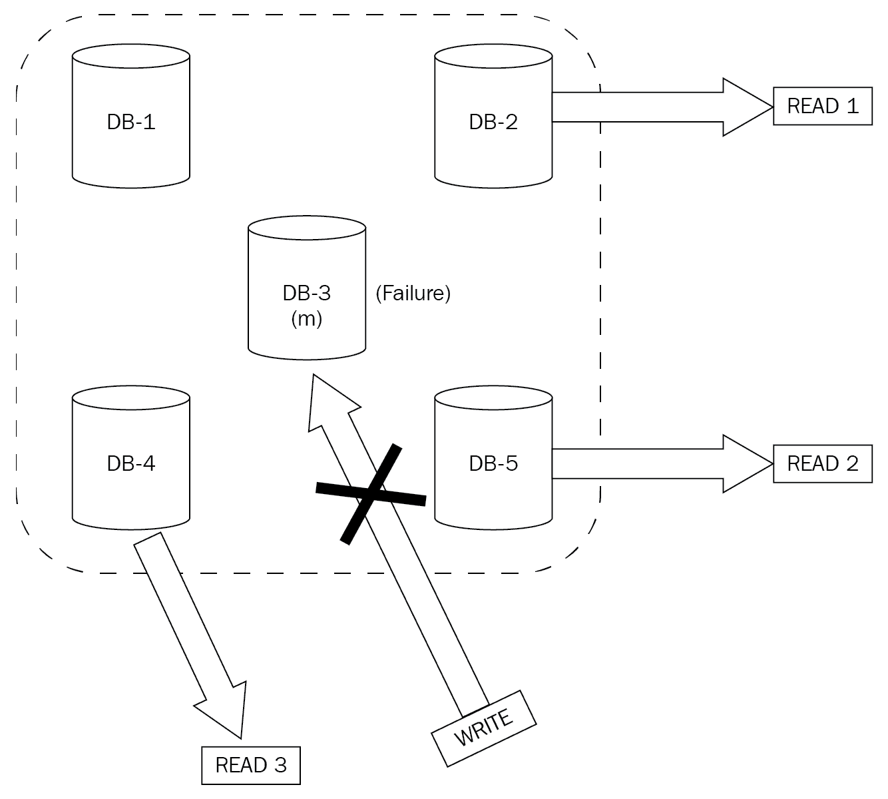

主机故障；不写，只读

##### 主复制

您可能已经注意到主副本设置存在两个问题：

*   master 广泛用于数据库写入，因此经常受到胁迫
*   使用副本解决了读取问题，但仍然存在写入的单点故障

Master-Master 复制试图通过使每个数据库都成为 Master 来解决这些问题。可以解释如下：

1.  我们使用一组数据库：

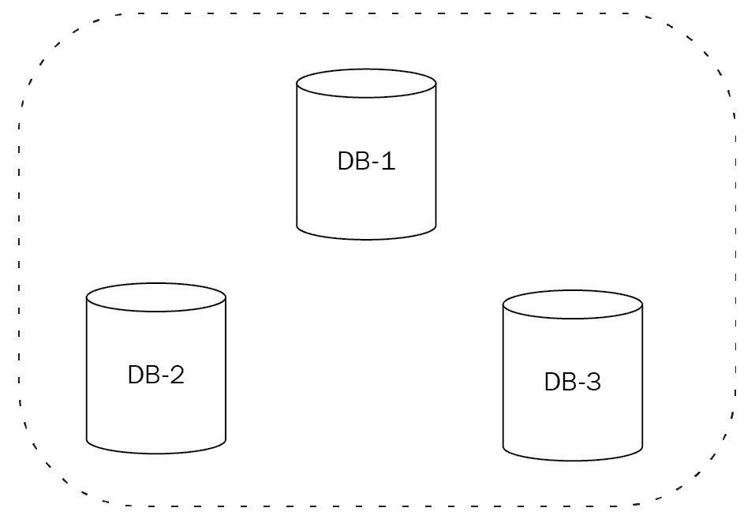

数据库集群

2.  我们将每个数据库指定为主数据库：

所有数据库都被指定为主数据库

3.  可以从任何主机执行读取：

在母版上执行的读取

4.  可以对任何主机执行写入操作：

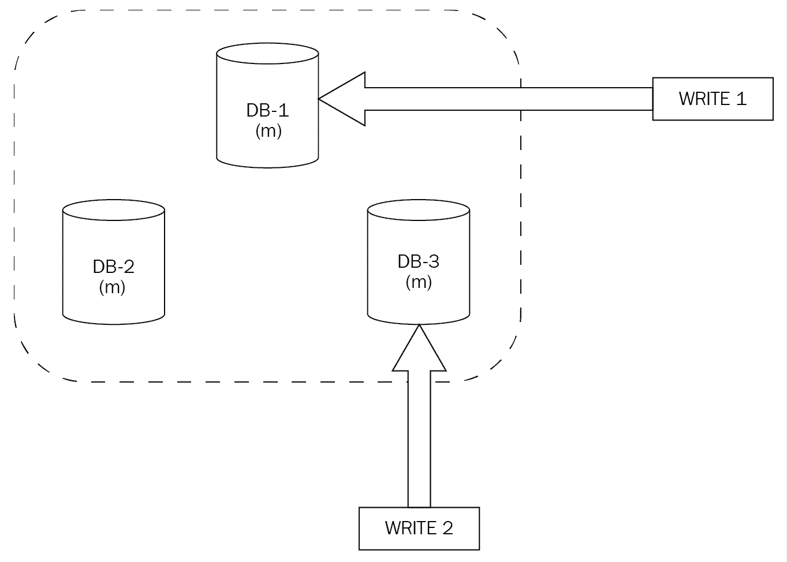

对 DB-1 和 DB-3 进行的写入

5.  每台主机都会使用以下写入操作更新每台其他主机：

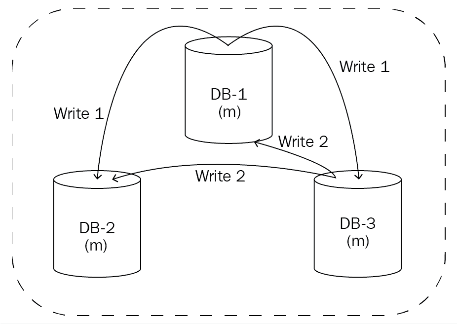

数据库状态在主机间同步

6.  因此，状态在所有数据库中都得到维护：

DB-1 故障，读写成功

这一战略似乎运作良好，但也有其自身的局限性和挑战；主要的一个问题是写操作之间的冲突解决。这里有一个简单的例子。

我们有两个主数据库**DB-1**和***DB-2**、*，都有数据库系统的最新状态：**

 **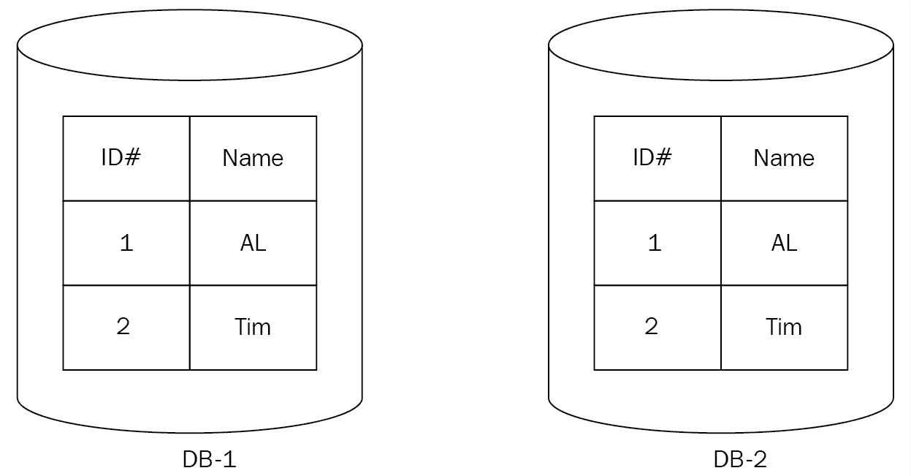

DB-1 和 DB-2 的最新状态

我们需要同时执行两个写操作，因此我们将“Bob”发送到**DB-1**并将“Alice”发送到**DB-2***。*

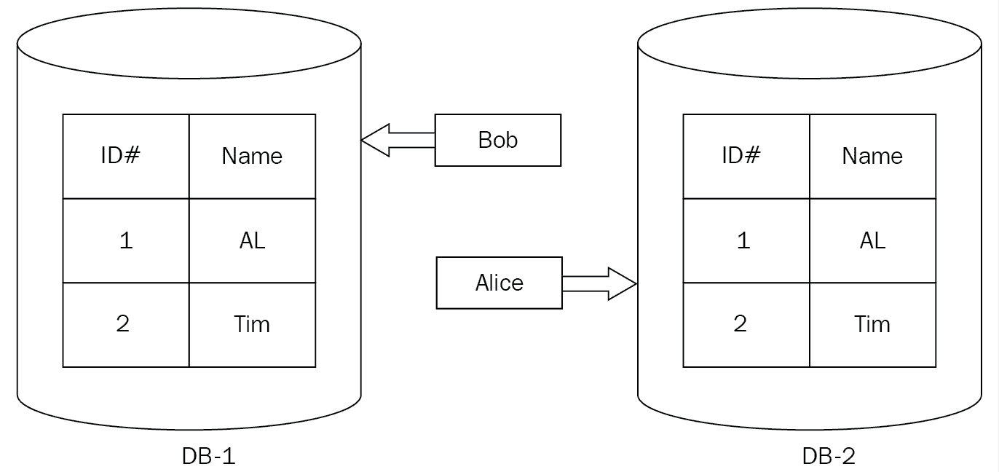

将“Bob”写入 DB-1，将“Alice”写入 DB-2

现在，两个数据库都已将数据写入各自的表中，它们需要使用另一个主机的最新状态更新另一个主机：

数据库同步前的状态

这将导致冲突，因为在这两个表中，**ID#3**为**DB-1**填充了**Bob**，为**DB-2**填充了**Alice**：

更新 DB-1 和 DB-2 状态时发生冲突，因为 ID#3 已填充。

事实上，总体战略将具有处理此类问题的内置机制，但这些机制可能会导致绩效惩罚或其他挑战。这是一个复杂的主题，如果我们想使用主复制，我们必须决定哪些权衡是值得的。

##### 故障转移群集复制

主副本复制允许我们进行简单的读写设置，但有可能无法写入主数据库。主复制允许我们能够读取和写入数据库，即使其中一个主复制失败。然而，在所有主机上保持一致状态的复杂性以及可能的性能损失可能意味着它不是所有情况下的理想选择。

故障转移群集复制通过提供这两种复制策略的功能，试图采取折衷的做法。可以解释如下：

1.  我们使用一组数据库。
2.  根据所使用的主选择策略，数据库被指定为主数据库，这可能因数据库而异。
3.  其余的数据库被指定为副本。

4.  主机负责用数据库的最新状态更新副本。
5.  如果主数据库由于某种原因失败，则会选择将剩余的数据库之一指定为新的主数据库。

那么我们应该使用哪种复制策略呢？最好从最简单的策略开始，即主副本策略，因为这将非常容易地满足大多数初始需求。现在让我们看看如果我们使用主副本策略进行数据库复制，应用程序会是什么样子：

具有主副本数据库设置的应用程序

## 整体与微服务

大多数新项目一开始都是一个代码库，其中所有组件通过直接的函数调用彼此交互。然而，随着用户流量和代码库的增加，我们将开始面临代码库的问题。以下是一些可能的原因：

*   您的代码库的大小正在增长，这意味着任何新开发人员都需要更长的时间来理解整个系统。
*   添加新功能需要更长的时间，因为我们必须确保更改不会破坏任何其他组件。
*   由于以下原因，为每个新功能重新部署代码可能会变得很麻烦：
    *   部署失败和/或失败
    *   其中一个重新部署的组件出现意外错误，导致程序崩溃和/或
    *   由于大量的测试，构建过程可能需要更长的时间
*   扩展整个应用程序以支持 CPU 密集型组件

微服务通过将应用程序的主要组件拆分为单独的较小应用程序/服务来提供解决方案。这是否意味着我们应该从一开始就将应用程序拆分为微服务，这样我们就不会面临这个问题？这是处理这个问题的一种可能的方法。然而，这种方法也有一些缺点：

*   **移动部件太多**：将每个组件划分为自己的服务意味着我们必须监控和维护每个组件的服务器。
*   **复杂性增加**：微服务增加了故障可能原因的数量。整体中的故障可能仅限于服务器停机或代码执行问题。但是，使用微服务，我们必须：
    *   确定哪个组件的服务器停机或停机
    *   如果某个组件出现故障，请确定故障组件，然后进一步调查故障是否由以下原因造成：
        *   错误代码或
        *   由于其中一个从属部件出现故障

*   **更难调试整个系统**：前面几点中描述的增加的复杂性使得调试整个系统更加困难。

现在我们已经看到了微服务和巨石架构的一些优缺点，哪一个更好？到目前为止，答案应该相当明显：

*   小型到中型的代码库受益于单片石提供的简单性
*   大型代码库受益于微服务架构提供的粒度控制

这意味着，我们应该设计我们的 monolith 代码库，并期望它最终会发展到一个非常大的规模，然后我们将不得不将其重构为微服务。为了尽可能轻松地将代码库重构为微服务，我们应该尽早识别可能的组件，并使用**中介设计模式**实现它们与其余代码之间的交互。

### 中介设计模式

中介器充当代码中组件之间的中介，这导致各个组件之间的耦合非常松散。这使我们能够对代码进行最小的更改，因为我们只需要更改中介体和正在提取到其自身微服务中的组件之间的交互。

让我们看一个例子。我们有一个整体，由**代码基 a**定义。它由五个组件组成：**组件 1**到**组件 5**。我们意识到**组件 1**和**组件 2**依赖于与**组件 5**的交互，而**组件 2**和**组件 3**依赖于**组件 4**。如果**组件 1**和**组件 2**直接调用**组件 5**，同样的**组件 2**和**组件 4**直接调用**组件 4**，那么我们将创建紧密耦合的组件。

如果我们要引入一个函数，该函数从调用组件获取输入并调用必要的组件作为代理，并且如果所有数据都是使用定义良好的结构传递的，那么我们就会引入中介设计模式。如下图所示：

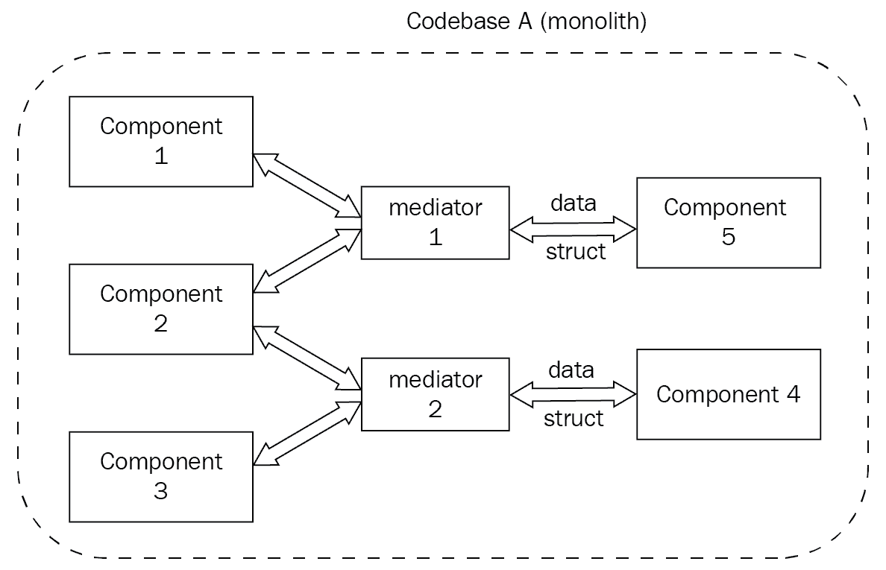

通过中介器连接的代码库中的组件

现在，如果出现一种情况，我们可能需要将其中一个组件分离到它自己的独立微服务中，我们只需要更改代理功能的实现。在我们的示例中，`Component 5`被分离到它自己单独的微服务中，我们将代理功能**中介 1**的实现更改为使用 HTTP 和 JSON 与**组件 5**进行通信，而不是通过函数调用和结构进行通信。下图对此进行了说明：

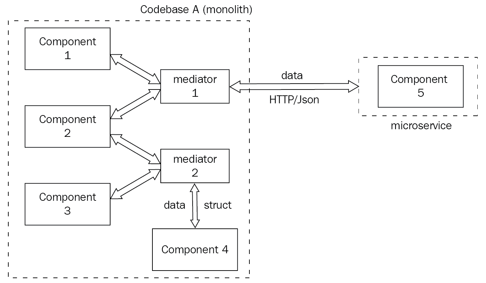

分为微服务的组件和中介实现中的更改

## 部署选项

我们已经研究了扩展应用程序的各种策略、不同类型的数据库、如何构造代码，最后还研究了如何使用中介模式实现从整体到微服务的过渡。然而，我们还没有讨论将在何处部署上述 web 应用程序和数据库。让我们简单地看看部署场景。

直到 21 世纪初，大多数服务器都部署在编写软件的公司拥有的硬件上。将有专门的基础设施和团队来处理软件工程的这一关键部分。这主要是数据中心的主题。

然而，在 21 世纪初，公司开始意识到数据中心可以被抽象出来，因为大多数开发人员对处理这些问题不感兴趣。这使得软件的开发和部署更便宜、更快，特别是对于 web 应用程序。现在，开发人员可以通过 SSH 访问服务器实例，而不是在数据中心购买硬件和空间。从一开始，该领域最著名的公司之一就是 Amazon.com，Inc。这使他们能够将业务扩展到电子商务之外。

这些服务还引发了一个问题：开发人员是否需要安装和维护通用应用程序，如数据库、负载平衡器或其他此类服务？事实上，并不是所有的开发者或公司都想参与维护这些服务。这就产生了对现成应用程序实例的需求，这些实例将由作为服务销售这些应用程序的公司来维护。

有许多公司最初都是软件公司，它们维护自己的数据中心，比如亚马逊、谷歌和微软，现在它们拥有一系列供一般消费者使用的服务。

### 多实例的可维护性

上述服务的可用性极大地改善了我们的生活，但是维护大量跨多个服务器实例运行的应用程序涉及到很多复杂性。例如：

*   我们如何在不关闭整个服务的情况下更新服务器实例？这能用更少的努力做到吗？
*   有没有可靠的方法可以轻松地扩展我们的应用程序（垂直和水平）？

鉴于所有现代部署都使用容器，我们可以使用有助于解决可维护性问题的容器编排软件。库伯内特斯（[https://kubernetes.io/](https://kubernetes.io/) 和 Mesos（[http://mesos.apache.org/](http://mesos.apache.org/) 是两种此类解决方案的示例。

## 总结

在本章中，我们以一个简单的博客应用程序为例，展示了如何扩展它以满足不断增长的用户流量的需求。我们还研究了扩展数据库所涉及的复杂性和策略。

然后，我们简要地介绍了如何构造我们的代码库，以及我们需要考虑的权衡。最后，我们研究了一种方法，可以轻松地将代码库从一个整体重构为微服务。**