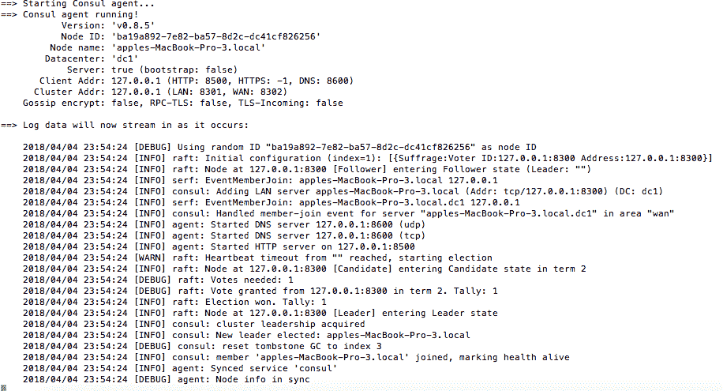
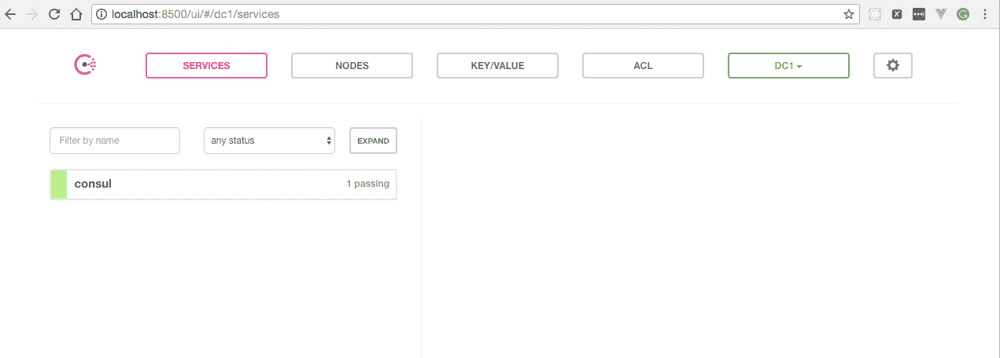
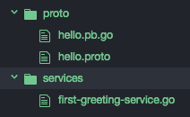
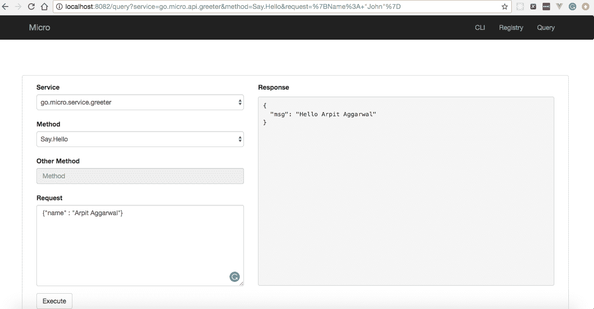
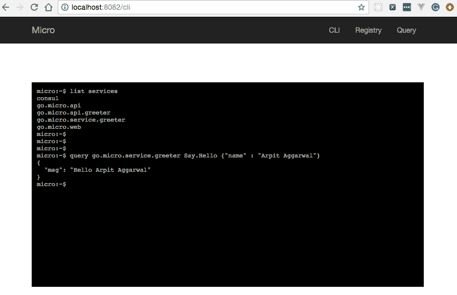

# 六、使用 Micro 在 Go 中编写微服务——一个微服务工具包

在本章中，我们将介绍以下配方：

*   创建第一个协议缓冲区
*   启动微服务发现客户端
*   创建您的第一个微服务
*   创建第二个微服务
*   创建微 API
*   使用命令行界面和 web UI 与微服务交互

# 介绍

随着组织现在转向 DevOps，微服务也开始流行起来。由于这些服务本质上是独立的，可以用任何语言开发，因此组织可以专注于其开发。了解本章所涵盖的概念后，我们将能够以相当简单的方式使用 Go-Micro 编写微服务。

在本章中，我们将从编写协议缓冲区开始。然后，我们将学习如何启动 Concur，这是一个微服务发现客户端，并最终继续创建微服务，并通过命令行和 web 仪表板与它们交互。

# 创建第一个协议缓冲区

协议缓冲区是一种灵活、高效、自动化的机制，用于编码和序列化 Go 支持的结构化数据。在此配方中，我们将学习如何编写第一个协议缓冲区。

# 准备好了…

1.  通过执行以下命令验证`protoc`是否已安装：

```go
$ protoc --version
 libprotoc 3.3.2
```

2.  通过以下方式安装`protobuf`：

```go
$ git clone https://github.com/google/protobuf
$ cd protobuf
$ ./autogen.sh
$ ./configure
$ make
$ make check
$ make install
```

# 怎么做…

1.  在`proto`目录中创建`hello.proto`并定义一个名为`Say`的`service`接口，该接口有`Request`和`Response`两种数据类型，如下所示：

```go
syntax = "proto3";
service Say 
{
  rpc Hello(Request) returns (Response) {}
}
message Request 
{
  string name = 1;
}
message Response 
{
  string msg = 1;
}
```

2.  使用以下命令编译`hello.proto`：

```go
$ protoc --go_out=plugins=micro:. hello.proto
```

# 它是如何工作的…

命令执行成功后，将在`proto`目录中创建`hello.pb.go`，如下图所示：


让我们了解一下我们编写的`.proto`文件：

*   `syntax = "proto3";`：这里我们指定我们使用的是`proto3`语法，这使编译器理解协议缓冲区必须使用版本 3 进行编译。如果我们没有明确指定语法，那么编译器会假定我们使用的是`proto2`
*   `service Say { rpc Hello(Request) returns (Response) {} }`：这里我们定义了一个名为`Say`的 RPC 服务和一个采用`Request`并返回`Response`的`Hello`方法。
*   `message Request { string name = 1; }`：这里我们定义了`Request`数据类型，它有一个`name`字段。
*   `message Response { string msg = 1; }`：这里我们定义了`Response`数据类型，它有一个`msg`字段。

# 启动微服务发现客户端

在部署了多个服务的微服务体系结构中，服务发现客户端可以通过 DNS 或 HTTP 帮助应用找出它们所依赖的服务。当我们谈论服务发现客户机时，最常见和最著名的客户机之一是 HashiCorp 的`Consul`，我们将在本食谱中介绍它。

# 准备好了…

通过执行以下命令验证`Consul`是否已安装：

```go
$ consul version
 Consul v0.8.5
 Protocol 2 spoken by default, understands 2 to 3 (agent will automatically use protocol >2 when speaking to compatible agents)
```

# 怎么做…

执行以下命令，在服务器模式下启动`consul agent`：

```go
$ consul agent -dev
```

# 它是如何工作的…

命令成功执行后，领事代理将开始在服务器模式下运行，并提供以下输出：



我们还可以通过执行以下命令列出领事集群的成员：

```go
$ consul members
```

这将给我们带来以下结果：


由于至少有一台服务器可以在服务器模式或客户端模式下运行 CONSER，为了使设置保持最低限度，我们已在服务器模式下启动了代理，但不建议这样做，因为在故障情况下可能会丢失数据

此外，浏览到`http://localhost:8500/ui/`将显示 Consour web UI，我们可以在其中查看所有服务和节点，如下所示：



# 创建您的第一个微服务

微服务只是一段代码，它作为一个独特的流程运行，并通过一个定义良好的轻量级机制进行通信，以服务于一个业务目标，我们将使用`https://github.com/micro/micro`在这个配方中编写它，尽管有许多可用的库，如`https://github.com/go-kit/kit`和`https://github.com/grpc/grpc-go`，它们也有相同的用途。

# 准备好了…

1.  执行以下命令启动`consul agent`：

```go
$ consul agent -dev
```

2.  通过执行以下命令安装并运行`micro`：

```go
$ go get github.com/micro/micro
$ micro api
 2018/02/06 00:03:36 Registering RPC Handler at /rpc
 2018/02/06 00:03:36 Registering API Default Handler at /
 2018/02/06 00:03:36 Listening on [::]:8080
 2018/02/06 00:03:36 Listening on [::]:54814
 2018/02/06 00:03:36 Broker Listening on [::]:54815
 2018/02/06 00:03:36 Registering node: go.micro.api-a6a82a54-0aaf-11e8-8d64-685b35d52676
```

# 怎么做…

1.  通过执行命令`$ mkdir services && cd services && touch first-greeting-service.go`在`services`目录中创建`first-greeting-service.go`。
2.  将以下内容复制到`first-greeting-service.go`：

```go
package main
import 
(
  "log"
  "time"
  hello "../proto"
  "github.com/micro/go-micro"
)
type Say struct{}
func (s *Say) Hello(ctx context.Context, req *hello.Request, 
rsp *hello.Response) error 
{
  log.Print("Received Say.Hello request - first greeting service")
  rsp.Msg = "Hello " + req.Name
  return nil
}
func main() 
{
  service := micro.NewService
  (
    micro.Name("go.micro.service.greeter"),
    micro.RegisterTTL(time.Second*30),
    micro.RegisterInterval(time.Second*10),
  )
  service.Init()
  hello.RegisterSayHandler(service.Server(), new(Say))
  if err := service.Run(); err != nil 
  {
    log.Fatal("error starting service : ", err)
    return
  }
}
```

一切就绪后，目录结构应如下所示：



3.  移动到`services`目录，使用以下命令运行程序：

```go
$ go run first-greeting-service.go
```

# 它是如何工作的…

一旦我们运行该程序，RPC 服务器将在端口`8080`上开始本地侦听

接下来，从命令行执行一个`POST`请求，如下所示：

```go
$ curl -X POST -H 'Content-Type: application/json' -d '{"service": "go.micro.service.greeter", "method": "Say.Hello", "request": {"name": "Arpit Aggarwal"}}' http://localhost:8080/rpc
```

这将为我们提供 Hello，后面跟着名称，作为服务器的响应，如以下屏幕截图所示：


查看`first-greeting-service.go`的日志，我们会发现请求是由第一个问候服务提供的，如下所示：


让我们看看我们编写的程序：

*   使用`import ("log" "time" hello "../proto" "github.com/micro/go-micro" "golang.org/x/net/context")`，我们导入了`"hello "../proto"`，一个包含协议缓冲源代码和编译后的协议缓冲后缀`.pb.go`的目录。此外，我们还导入了`github.com/micro/go-micro`包，其中包含编写微服务所需的所有库。

*   接下来，我们定义了一个`main()`处理程序，在这里我们使用`micro.NewService()`创建一个名为`go.micro.service.greeter`的新服务，初始化它，向它注册处理程序，最后启动它。

# 创建第二个微服务

在此配方中，我们将使用`go-micro`创建另一个微服务，它是`first-greeting-service.go`的复制品，除了控制台上打印的记录器消息，该消息演示了具有相同名称的服务的两个不同实例之间客户端负载平衡的概念。

# 怎么做…

1.  通过执行命令`$ cd services && touch second-greeting-service.go`在`services`目录中创建`second-greeting-service.go`。
2.  将以下内容复制到`second-greeting-service.go`：

```go
package main
import 
(
  "context"
  "log"
  "time"
  hello "../proto"
  "github.com/micro/go-micro"
)
type Say struct{}
func (s *Say) Hello(ctx context.Context, req *hello.Request, 
rsp *hello.Response) error 
{
  log.Print("Received Say.Hello request - second greeting
  service")
  rsp.Msg = "Hello " + req.Name
  return nil
}
func main() 
{
  service := micro.NewService
  (
    micro.Name("go.micro.service.greeter"),
    micro.RegisterTTL(time.Second*30),
    micro.RegisterInterval(time.Second*10),
  )
  service.Init()
  hello.RegisterSayHandler(service.Server(), new(Say))
  if err := service.Run(); err != nil 
  {
    log.Fatal("error starting service : ", err)
    return
  }
}
```

一切就绪后，目录结构应如下所示：


3.  移动到`services`目录，使用以下命令运行程序：

```go
$ go run second-greeting-service.go
```

# 它是如何工作的…

一旦我们运行该程序，RPC 服务器将在端口`8080`上开始本地侦听

接下来，从命令行执行一个`POST`请求，如下所示：

```go
$ curl -X POST -H 'Content-Type: application/json' -d '{"service": "go.micro.service.greeter", "method": "Say.Hello", "request": {"name": "Arpit Aggarwal"}}' http://localhost:8080/rpc
```

这将为我们提供 Hello，后面跟着名称，作为服务器的响应，如下所示：


查看`second-greeting-service.go`的日志，我们会发现请求是由第二个问候服务提供的：


现在，如果我们再次执行一个`POST`请求，那么它将在`first-greeting-service.go`控制台中打印日志，这是因为 Go Micro 提供的基于发现的智能客户端负载平衡服务：


# 创建微 API

到目前为止，我们已经通过名称和访问方法显式地调用了后端服务。在本食谱中，我们将学习如何使用 Go Micro API 访问服务，Go Micro API 实现 API 网关模式，为微服务提供单一入口点。使用 Go Micro API 的优点是，它通过 HTTP 提供服务，并使用 HTTP 处理程序动态路由到适当的后端服务。

# 准备好了…

通过执行以下命令，在单独的终端中启动`consul agent`、`micro API`、`first-greeting-service.go`和`second-greeting-service.go`：

```go
$ consul agent -dev
$ micro api
$ go run first-greeting-service.go
$ go run second-greeting-service.go
```

# 怎么做…

1.  通过执行命令`$ mkdir api && cd api && touch greeting-api.go`在`api`目录中创建`greeting-api.go`。
2.  将以下内容复制到`greeting-api.go`：

```go
package main
import 
(
  "context"
  "encoding/json"
  "log"
  "strings"
  hello "../proto"
  "github.com/micro/go-micro"
  api "github.com/micro/micro/api/proto"
)
type Say struct 
{
  Client hello.SayClient
}
func (s *Say) Hello(ctx context.Context, req *api.Request, 
rsp *api.Response) error 
{
  log.Print("Received Say.Hello request - Micro Greeter API")
  name, ok := req.Get["name"]
  if ok 
  {
    response, err := s.Client.Hello
    (
      ctx, &hello.Request
      {
        Name: strings.Join(name.Values, " "),
      }
    )
    if err != nil 
    {
      return err
    }
    message, _ := json.Marshal
    (
      map[string]string
      {
        "message": response.Msg,
      }
    )
    rsp.Body = string(message)
  }
  return nil
}
func main() 
{
  service := micro.NewService
  (
    micro.Name("go.micro.api.greeter"),
  )
  service.Init()
  service.Server().Handle
  (
    service.Server().NewHandler
    (
      &Say{Client: hello.NewSayClient("go.micro.service.
      greeter", service.Client())},
    ),
  )
  if err := service.Run(); err != nil 
  {
    log.Fatal("error starting micro api : ", err)
    return
  }
}
```

一切就绪后，目录结构应如下所示：


3.  移动到`api `目录，使用以下命令运行程序：

```go
$ go run greeting-api.go
```

# 它是如何工作的…

一旦我们运行程序，HTTP 服务器将在端口`8080`上开始本地侦听

接下来，浏览`http://localhost:8080/greeter/say/hello?name=Arpit+Aggarwal`如下：


这将为您提供响应 Hello，后跟作为 HTTP 请求变量接收的名称。此外，查看`second-greeting-service.go`的日志，我们会发现请求是由第二个问候服务提供的，如下所示：


现在，如果我们再次执行一个`GET`请求，那么它将在`first-greeting-service.go`控制台中打印日志，这是因为 Go Micro 提供的基于发现的智能客户端负载平衡服务：


# 使用命令行界面和 web UI 与微服务交互

到目前为止，我们已经使用命令行执行`GET`和`POST`HTTP 请求来访问服务。这也可以通过 Go Micro web 用户界面实现。我们需要做的就是开始`micro web`，我们将在本食谱中介绍。

# 怎么做…

1.  使用`go get`命令安装`go get github.com/micro/micro`包，如下所示：

```go
$ go get github.com/micro/micro
```

2.  使用以下命令运行 web UI：

```go
$ micro web
```

# 它是如何工作的…

命令执行成功后，浏览`http://localhost:8082/registry`将列出所有已注册的服务，如下图所示：


使用带有请求`{"name" : "Arpit Aggarwal"}`的 web UI 查询我们的`greeter`服务将向您提供响应`{"msg": "Hello Arpit Aggarwal"} `：



使用`CLI`命令`query go.micro.service.greeter Say.Hello {"name" : "Arpit Aggarwal"}`查询同一`greeter`服务时，您会得到响应`{"msg": "Hello Arpit Aggarwal"}`：

