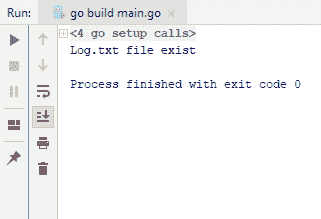
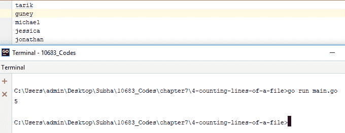
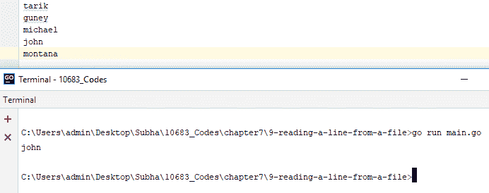
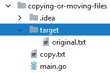
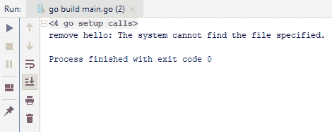
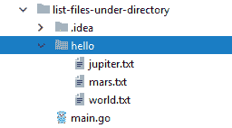

# 七、文件和目录


在上一章中，您学习了如何处理错误和日志记录。在本章中，我们将看到使用 Go 语言处理文件和目录的方法。您还将学习解析和使用各种格式，如 XML、YAML 和 JSON。本章将涵盖以下主题：

*   检查文件是否存在
*   读取文本文件的全部内容
*   写入文件
*   创建临时文件
*   计算文件中的行数
*   读取文件中的特定行
*   比较两个文件的内容
*   删除文件
*   复制或移动文件
*   重命名文件
*   删除目录及其内容
*   列出目录下的所有文件


# 检查文件是否存在


我们将从检查文件是否存在开始。首先，让我们通过点击新建文件并将其命名为`log.txt`来创建一个文件。

要开始检查文件是否存在，我们将使用`os.Stat`包。它返回两个值：第一个是文件信息，第二个是错误。我们不需要文件信息，只需要错误本身，因为我们将检查错误以查看文件是否存在。如果错误为`nil`（未发生错误），则文件存在。请查看以下代码：

```go
package main
import (
  "os"
  "fmt"
)
func main(){
  if _, err := os.Stat("log.txt"); err == nil{
    fmt.Println("Log.txt file exists")
  }
}
```

运行上述代码时，您将获得以下输出：



为了检查文件是否以相反的方式存在，我们只需键入`os.IsNotExist()`并将捕获的`err`传递给控制台，然后将其打印出来。请查看以下代码：

```go
package main
import (
  "os"
  "fmt"
)
func main(){
  if _, err := os.Stat("log.txt"); os.IsNotExist(err){
    fmt.Println("Log.txt file does not exist")
  }else{
    fmt.Println("Log.txt file exists")
  }
}
```

在运行前面的代码时，我们将得到相同的输出，即[T0]。现在，让我们尝试运行相同的代码，但是这次我们删除了`log.txt`文件。您将获得以下输出：


您可以看到，现在输出显示`Log.txt file does not exist`，这就是您可以轻松检查文件是否存在的方式。在下一节中，我们将了解如何读取文件的全部内容。


# 读取文本文件的全部内容


在本节中，我们将了解如何读取文件的全部内容。我们将创建一个名为`names`的新文件，我有一组名称，例如`Tarik`、`Guney`、`Michael`、`John`和`Montana`。我们要读这个文件。我们将使用提供读取文件功能的`io`实用程序包，它接受文件的路径，即`names.txt`。它返回两个内容：文件的实际内容和错误。如果没有错误发生，我们将首先将[T8]转换为[T9]表示。现在，让我们使用以下代码将内容写入控制台：

```go
package main
import (
  "io/ioutil"
  "fmt"
)
func main(){
  contentBytes, err := ioutil.ReadFile("names.txt")
  if err == nil{
```

```go
    var contentStr string = string(contentBytes)
    fmt.Println(contentStr)
  }
}
```

使用`go run main.go`命令在终端运行代码时，您将获得以下输出：


因此，您可以看到我们已经读取了文件中的所有名称。这就是您可以轻松地将文件的全部内容读入内存的方式。

在下一节中，我们将看到如何写入文件。


# 写入文件


在本节中，我们将了解如何写入文件。与读取文件类似，我们将使用`ioutil`包。我们将使用`ioutil.WriteFile`函数，它接受三个参数。第一个参数是要写入的文件名，第二个参数是要写入的数据，最后一个参数是文件权限。这里的好处是，如果文件不存在，那么`WriteFile`将使用`perm`参数赋予的权限创建文件，如果文件顺序存在，那么它将在写入之前截断文件。我们将继续写一些东西到我们的文件中，因为我们的文件还不存在，它将为我们创建一个新文件。我们将写入`Hello, World`，这是一个`string`参数，我们将把它转换成`byte`数组，然后才能将它传递到`WriteFile`。文件名为`hello_world`，第二个参数为`hello`变量的字节表示形式。这将返回一个错误。如果不是`nil`，则表示发生了什么。让我们检查一下代码：

```go
package main
import (
  "io/ioutil"
  "fmt"
)
```

```go
func main() {
  hello := "Hello, World"
  err := ioutil.WriteFile("hello_world", []byte(hello), 0644)
  if err != nil{
    fmt.Println(err)
  }
}
```

在运行代码时，您将看到没有错误发生，并且我们的`hello_world`文件存在。如果你打开文件，你会看到`Hello, World`还是用同样的方式写的：


如果我们使用不同的`string`和`Hello, World Again`再次运行代码，您将看到以前的内容被删除并替换为新内容，如以下屏幕截图所示：


这就是写入文件的基本方式。在下一节中，我们将看到如何创建临时文件。


# 创建临时文件


在本节中，我们将了解如何创建临时文件。我们还有一个变量，它包含一个名为[T0]的字符串。我们将使用`ioutil`包，它提供`TempFile()`方法。第一个参数是目录；如果您不向它传递任何内容，它将使用默认的临时目录，我们将在本例中使用该目录，第二个是为您的临时文件提供前缀，即`hello_world_temp`。它返回两个东西：第一个是创建的临时文件，第二个是错误（`err`。现在，如果发生任何错误，那么我们将惊慌失措，并将错误作为消息抛出。

当您处理完临时文件后，建议您删除该文件，我们可以使用`defer`函数，其中有`os.Remove()`方法。您只需提供文件名，它就会找到并删除它。现在我们将把[T2]写入我们的文件。现在让我们检查代码：

```go
package main
import (
 "io/ioutil"
 "fmt"
)
func main(){
 helloWorld := "Hello, World"
 file, err := ioutil.TempFile("", "hello_world_temp")
 if err != nil{
 panic(err)
 }
 defer os.Remove(file.Name())
 if _, err := file.Write([]byte(helloWorld)); err != nil {
 panic(err)
 }
 fmt.Println(file.Name())
}
```

运行上述代码时，您将获得以下输出：


路径是我们的文件所在的位置，所选部分是我们的文件名，这是一个临时文件，当然，此文件会被删除。如果它没有被删除，我们会在那个位置看到它。现在，我们不打算通过注释前面代码块中的`deferos.Remove(file.Name())`行并运行它来删除该文件。

此外，我们将打开该文件，通过使用终端，我们将仅使用`less`命令（在 Linux 中）和`more <`命令（在 Windows 中）显示该文件的内容，如屏幕截图所示：


如果你看前面的截图，你会看到`Hello, World`出现在那里。

这就是在 Go 中创建临时文件的方法。

在下一节中，我们将了解如何计算文件的行数。


# 计算文件中的行数


在本节中，我们将了解如何计算文件的行数。考虑到我们有一个文件，它在每行中有一堆名字，我们必须计算文件中有多少行。首先，我们将使用`os.Open`包打开文件，文件名为`names.txt`。它返回一个错误，但在本例中，我们不关心该错误，因为我们知道该文件存在。所以，我要用一个文件扫描器来扫描文件。我们有一个`bufio.NewScanner`软件包，它有一个新的扫描仪，它接受一个读卡器，所以我们可以传递文件。行计数将从`0`开始，我们将为`fileScanner.scan`执行此操作。因此，只要扫描，它就会增加行数。最后，我们将把行的编号写入控制台。当然，当一切完成后，我们将使用`defer file.Close()`功能。让我们检查一下代码：

```go
package main
import (
  "os"
  "bufio"
  "fmt"
)
func main() {
  file, _ := os.Open("names.txt")
  fileScanner := bufio.NewScanner(file)
  lineCount := 0;
  for fileScanner.Scan(){
    lineCount++
  }
  defer file.Close()
  fmt.Println(lineCount)
}
```

运行上述代码时，将获得如下输出：



输出打印出`5`，您也可以到文件中手动计数确认。

在下一节中，我们将了解如何读取文件中的特定行。


# 读取文件中的特定行


在本节中，我们将了解如何读取文件中的特定行。我们有一个名为`names.txt`的文件，每行都有一组名称：


我们只想读取文件中的第三行。请查看以下代码：

```go
package main
import (
  "os"
  "bufio"
  "fmt"
)
func main(){
  fmt.Println(ReadLine(3))
}
func ReadLine(lineNumber int) string{
  file, _ := os.Open("names.txt")
  fileScanner := bufio.NewScanner(file)
  lineCount := 0
  for fileScanner.Scan(){
    if lineCount == lineNumber{
      return fileScanner.Text()
    }
    lineCount++
  }
  defer file.Close()
  return ""
}
```

首先，我们将有一个`ReadLine()`函数，它接受行号并返回字符串。首先，我们将使用`os.Open()`函数打开文件，其次我们将使用`fileScanner`。然后我们将传递该文件，我们将使用的行计数将从`0`开始。如果行数等于给我们的行号，那么我们将返回文件`scanner.txt`；否则，我们将增加计数器。最后，我们将使用`defer file.Close()`函数。运行上述代码时，您将获得以下输出：



因此，它返回`john`，当您开始计算`0`时，它位于第三行。如果您想让索引与人们在计算文件中的行数时所期望的更加一致，可以更改索引并从`1`开始。这就是如何从文件中轻松获取特定行的方法。

在下一节中，我们将看到如何比较两个文件的内容。


# 比较两个文件的内容


在本节中，我们将看到如何比较这两个文件的内容。首先，我们将创建两个内容相同的文本文件来比较，`one.txt`和`two.txt`。我们将使用`ioutil`包将文件读入内存；一如既往，我们将确保在导入第一个文件时没有错误，如果出现错误，我们只会惊慌失措。我们还将导入第二个文件。有一种非常简单的方法可以检查这两个文件是否具有相同的内容（相等），即使用`byte`包中定义的`Equal`函数。请查看以下代码：

```go
package main
import (
  "io/ioutil"
  "bytes"
  "fmt"
)
func main(){
  one, err := ioutil.ReadFile("one.txt")
  if err != nil{
    panic(err)
  }
  two, err2 := ioutil.ReadFile("two.txt")
  if err2 != nil{
    panic(err2)
  }
  same := bytes.Equal(one, two)
  fmt.Println(same)
}
```

运行上述代码时，您将获得以下输出：


输出为`true`，表示文件内容相等。如果更改一个文件中的内容并再次运行相同的代码，则输出为`false`。这就是检查两个不同文件中的内容是否相同的方法。

在下一节中，我们将学习如何使用 Go 语言删除文件。


# 删除文件


在本节中，我们将了解如何在 Go 中删除文件。删除文件是 Go 中最简单的操作之一，因为`os`包提供了一个名为`Remove()`的函数，允许您删除任何文件。因此，首先，我们将创建一个新文件并将其命名为`new.txt`。以下截图将显示创建`new.txt`后的文件夹结构：


我们将看到如何删除[T0]文件。`Remove()`函数接受文件的路径。如果有什么事情发生，它会返回一个错误，我们将`catch`该错误，如果不是`nil`则会惊慌失措。请查看以下代码：

```go
package main
import "os"
func main() {
  err := os.Remove("new.txt")
  if err != nil{
    panic(err)
  }
}
```

让我们运行代码并检查输出：


您可以看到`new.txt`文件已消失，我们已成功删除该文件。所以，我要做的是继续运行这个，正如您所看到的，`new.txt`文件消失了。让我们再次运行此操作，看看会出现什么类型的恐慌，以及当您尝试删除一个首先不存在的文件时会看到什么错误消息：


好的，这就是如何在 Go 中轻松删除文件的方法。在下一节中，我们将了解如何复制或移动文件。


# 复制或移动文件


在本节中，我们将了解如何复制或移动文件。有多种方法可以做到这一点，其中一些取决于您将要使用的操作系统。但是，我们将看到在不太依赖操作系统的情况下复制或移动文件的最简单方法。首先，我们将添加一个要复制的文件，并将其命名为`original.txt`，并添加一些包含`Hello, World`的内容。然后，我们将使用`os.Open()`打开该文件，它将返回两个东西，原始的，这是我们的文件，以及一个错误。如果没有错误，我们将继续执行[T3]，然后关闭文件。此外，我们将使用`os.Create()`并在同一位置创建一个新文件，这也将返回一个错误。现在最简单的方法就是使用`io.Copy()`。因此，代码将如下所示：

```go
package main
import (
  "os"
  "io"
)
func main(){
  original, err := os.Open("original.txt")
  if err != nil{
    panic(err)
  }
  defer original.close()
  original_copy, err2 := os.Create("copy.txt")
  if err2 != nil{
    panic(err2)
  }
  defer original_copy.Close()
  _, err3 := io.Copy(original_copy, original)
  if err3 != nil{
    panic(err3)
  }
}
```

运行代码时，我们看到出现了`copy.txt`，打开代码时，我们可以看到其中的`Hello, World`是从`original.txt`文件复制的：


现在，让我们检查如何移动文件。首先，我们将创建一个名为`target`的新文件夹，并将`original.txt`复制到`target`中，并删除放置在`target`文件夹外的`original.txt`文件。为此，`original_copy, err2 := os.Create("copy.txt")`将更改为`original_copy, err2 := os.Create("target/original.txt")`。如果您看到以下屏幕截图，您会注意到`original.txt`文件已复制到`target`文件夹下：


我们现在可以删除外部`original.txt`文件。在前面代码中的`main`函数末尾添加以下两行代码：

```go
original.Close()
os.Remove("original.txt")
```

运行上述代码时，您将获得以下输出：



如您所见，代码通过移动和删除文件有效地移动了`original.txt`文件。这就是如何在 Go 中简单地复制和移动文件。

在下一节中，我们将看到如何在 Go 中轻松重命名文件。


# 重命名文件


在本节中，我们将了解如何在 Go 中重命名文件。首先，我们将创建一个新文件，并将其命名为`old.txt`，文件夹结构如下图所示：


我们将此文件的名称更改为`new.txt`。要做到这一点，最简单的方法是使用提供`Rename()`功能的`os`包。函数接受旧路径`old.txt`和新路径`new.txt`。让我们检查一下代码：

```go
package main
import "os"
func main() {
  os.Rename("old.txt", "new.txt")
}
```

在运行代码时，您可以在下面的屏幕截图中看到名称`old.txt`已更改为`new.txt`：


这就是我们在 Go 中重命名文件的基本方法。

在下一节中，我们将看到如何删除目录及其所有内容。


# 删除目录及其内容


在本节中，我们将了解如何删除目录及其内容。我们将使用`os`包，它提供两个功能，`Remove()`和`RemoveAll()`。我们将检查这两个函数。首先，我们将创建一个名为`hello`的新目录，并将其保留为空，如下面的屏幕截图所示：


如前所述，我们将使用`os`包，它接受文件或目录。我们要传递一个目录，如果发生什么事情，它总是返回一个错误。我们必须检查此错误是否为`nil`。请查看以下代码：

```go
package main
import (
  "os"
  "fmt"
)
func main(){
  err := os.Remove("hello")
  if err != nil{
    fmt.Println(err)
  }
}
```

如果运行代码，将获得以下文件夹结构作为输出：


如果您比较两个输出屏幕截图，您可以看到我们已经有效地删除了我们的`hello`目录。但是，如果目录中有一个文件（比如说`world.txt`），即该目录不是空的，并且您运行相同的代码，则该目录不会被删除，如果`hello`目录中有文件，则会显示以下消息：



现在，有一个选项可以删除文件和目录。我们可以使用本节开头提到的`RemoveAll()`函数。若要执行此操作，只需将上述代码中的`err := os.Remove("hello")`更改为`err := os.RemoveAll("hello")`。

运行上述代码时，您会发现您已成功删除了文件和目录，并且将再次查看以下文件夹结构：


在下一节中，我们将看到如何列出目录下的所有文件。


# 列出目录下的所有文件


在本节中，我们将了解如何列出目录下的所有文件。我们将创建一个名为`hello`的新目录，包含三个文件；即`jupiter.txt`、`mars.txt`、`world.txt`：



我们要做的是读取所有文件并将其名称输出到控制台。我们将使用`ioutil.ReadDir`包并传入`hello`，这是我们目录的名称。这将返回两种类型的内容：两个文件和一个错误。我们将检查错误是否为`nil`，并使用 panic 打印出内容。我们还将使用`for`循环对文件进行迭代。请查看以下代码：

```go
package main
import (
  "io/ioutil"
  "fmt"
)
func main() {
  files, err := ioutil.ReadDir("hello")
  if err != nil{
    panic(nil)
  }
  for _,f := range files{
    fmt.Println(f.Name())
  }
}
```

如果运行上述代码，将获得以下输出：


这就是如何简单地列出目录下的所有文件。


# 总结


在本章中，您学习了如何在操作系统中使用文件和目录。您还学习了解析和使用各种格式，如 XML、YAML 和 JSON。在下一章中，我们将学习并发的诀窍，我们将从并发运行多个函数开始。


