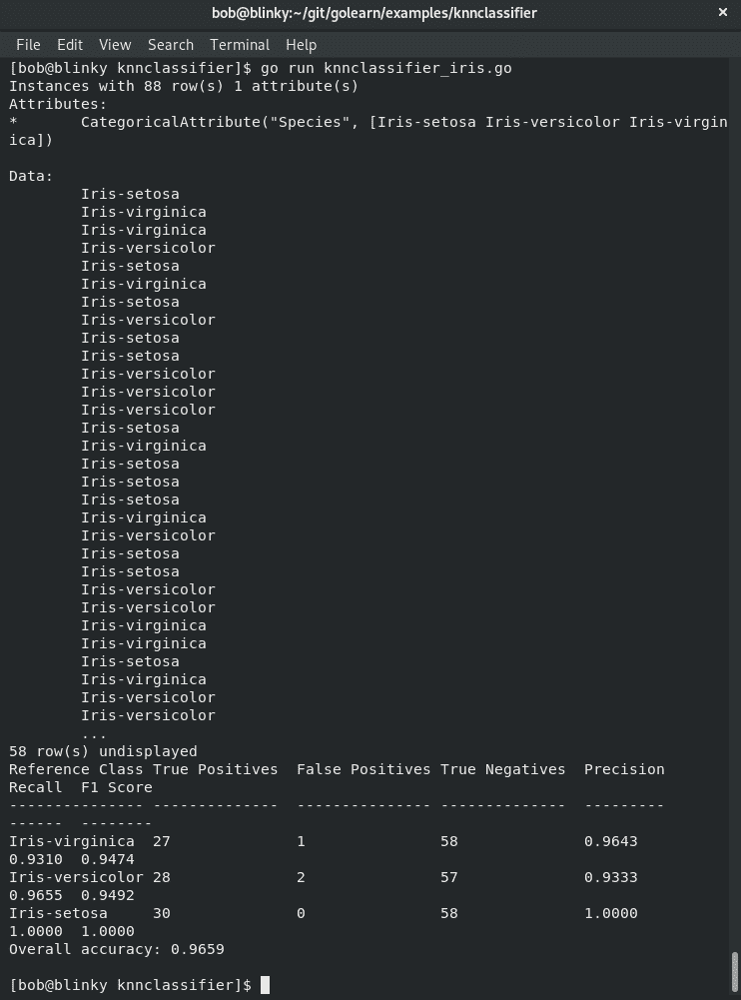
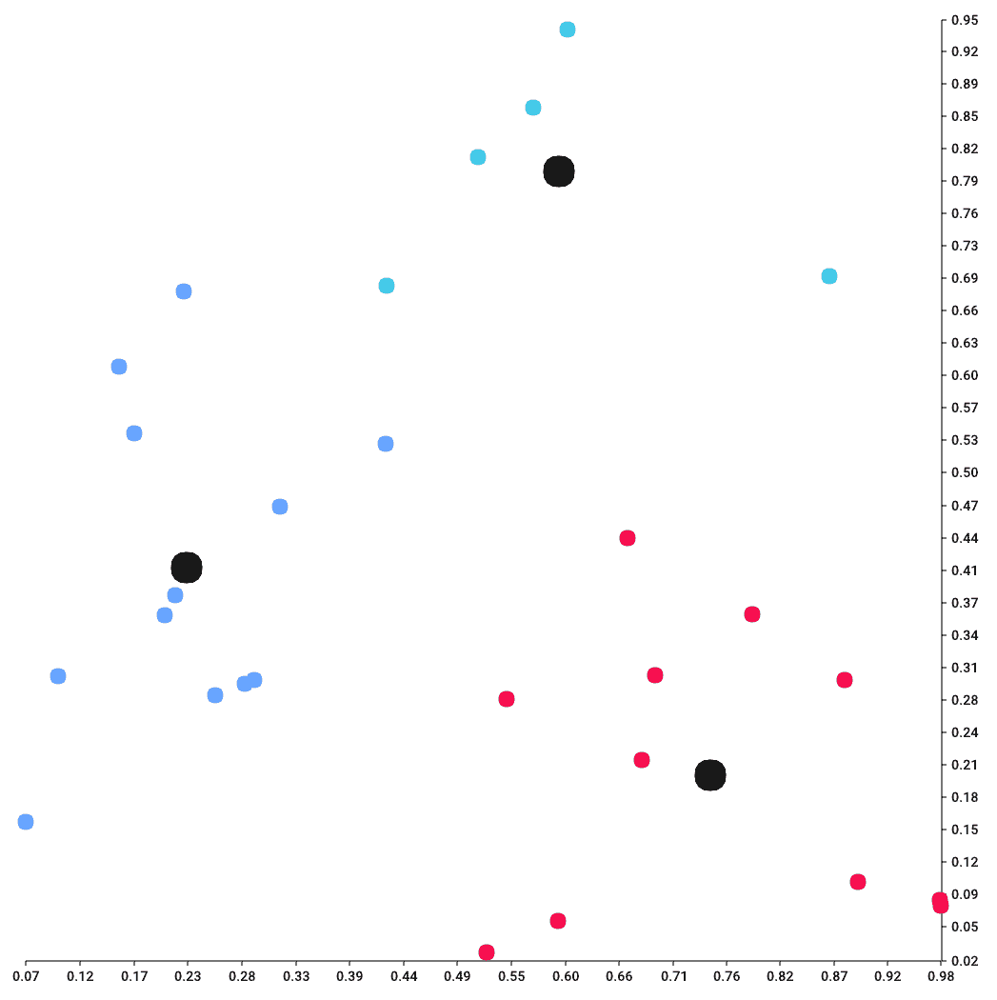
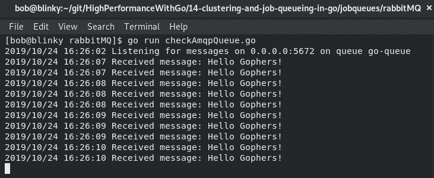
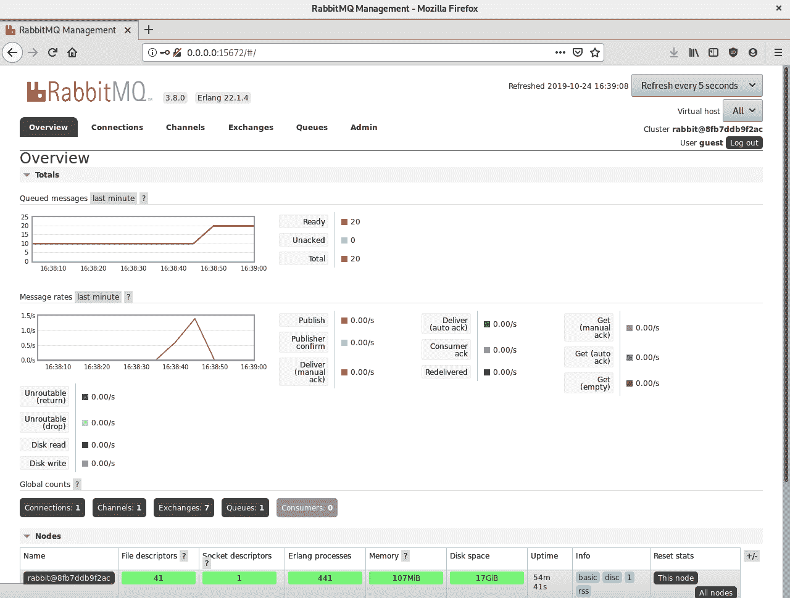

# 十三、集群和作业队列

Go 中的集群和作业队列是让分布式系统同步工作并提供一致消息的好方法。分布式计算很困难，在集群和作业队列中观察潜在的性能优化变得非常重要。

在本章中，我们将学习以下主题：

*   基于层次和质心算法的聚类
*   Goroutines 作为队列
*   作为作业队列的缓冲通道
*   实施第三方排队系统（Kafka 和 RabbitMQ）

了解不同的集群系统可以帮助您识别大量数据，以及如何在数据集中准确地对它们进行分类。了解排队系统将帮助您将大量信息从数据结构移动到特定的排队机制中，以便将大量数据实时传递到不同的系统。

# Go 中的聚类

聚类是一种方法，您可以使用它在给定的数据集中搜索一致的数据组。使用比较技术，我们可以在数据集中查找包含相似特征的项目组。然后将这些单独的数据点划分为集群。聚类是解决多目标问题的常用方法

聚类有两种一般分类，它们都有不同的子分类：

*   **硬集群**：数据集中的数据点要么是集群的显式部分，要么不是集群的显式部分。硬聚类可以进一步分类如下：

    *   **严格分区**：一个对象只能属于一个集群。
    *   **带离群值的严格分区**：严格分区，其中还包括一个概念，即对象可以被分类为离群值（意味着它们不属于集群）。
    *   **重叠聚类**：单个对象可以与一个或多个聚类关联。
*   **软集群**：根据明确的标准为数据点分配与特定集群关联的概率。它们可进一步分类如下：

还有许多不同的算法类型用于聚类。下表显示了一些示例：

| **名称** | **定义** |
| 等级制的 | 用于尝试构建群集的层次结构。通常基于自顶向下或自底向上的方法，尝试从一个到多个集群（自顶向下）或多个到几个集群（自下而上）分割数据点。 |
| 质心 | 用于查找作为簇中心的特定点位置。 |
| 密集 | 用于查找数据集中具有密集数据点区域的位置。 |
| 分配 | 用于利用分布模型对群集中的数据点进行排序和分类。 |

在本书中，我们将重点介绍在计算机科学（即机器学习）中常用的分层和质心算法。

# K-近邻

层次聚类是一种聚类方法，其中与子聚类关联的对象也与父聚类关联。该算法首先将数据结构中的所有单个数据点分配给各个集群。最近的簇彼此合并。此模式将继续，直到所有数据点都与另一个数据点关联。层次聚类通常使用一种称为**树状图**的图表技术来显示。层次聚类是*O（n<sup>2</sup>*，因此通常不用于大型数据集。

**K-最近邻**（**KNN**算法）是机器学习中常用的一种分层算法。在 Go 中查找 KNN 数据最常用的方法之一是使用`golearn`包。一个经典的 KNN 示例被用作机器学习示例，它是虹膜花的分类，可以在[中看到 https://github.com/sjwhitworth/golearn/blob/master/examples/knnclassifier/knnclassifier_iris.go](https://github.com/sjwhitworth/golearn/blob/master/examples/knnclassifier/knnclassifier_iris.go) 。

给定一个具有萼片和花瓣长度和宽度的数据集，我们可以看到关于该数据集的计算数据：



我们可以看到这个预测模型的计算精度。在前面的输出中，我们有以下描述符：

| **描述符** | **定义** |
| 参考类 | 与输出关联的标题。 |
| 真正的积极因素 | 该模型正确地预测了积极的反应。 |
| 假阳性 | 该模型错误地预测了积极的反应。 |
| 真正的否定 | 该模型正确地预测了负面反应。 |
| 精确 | 不将实例标记为正而实际为负的能力。 |
| 回忆起 | *真阳性/（真阳性+假阴性之和）*的比率。 |
| F1 成绩 | 精确性和召回率的加权调和平均值。该值介于 0.0 和 1.0 之间，1.0 是该值的最佳可能结果。 |

最后但并非最不重要的一点是，我们有一个总体准确度，它告诉我们我们的算法预测结果的准确度。

# K-均值聚类

K-均值聚类是机器学习中最常用的聚类算法之一。K-means 试图识别数据集中数据点的基本模式。在 K-means 中，我们将*K*定义为我们的簇具有的质心（具有均匀密度的对象的中心）的数量。然后，我们根据这些质心对不同的数据点进行分类。

我们可以使用 K-means 库，可在[找到 https://github.com/muesli/kmeans](https://github.com/muesli/kmeans) ，以便对数据集执行 K 均值聚类。让我们来看一看：

1.  首先，我们实例化`main`包并导入我们所需的包：

```go
package main

import (
  "fmt"
  "log"
  "math/rand"

  "github.com/muesli/clusters"
  "github.com/muesli/kmeans"
)
```

2.  接下来，我们使用`createDataset`函数创建一个随机二维数据集：

```go
func createDataset(datasetSize int) clusters.Observations {
  var dataset clusters.Observations
  for i := 1; i < datasetSize; i++ {
    dataset = append(dataset, clusters.Coordinates{
      rand.Float64(),
      rand.Float64(),
    })
  }
  return dataset
}
```

3.  接下来，我们创建一个函数，允许我们打印数据以供使用：

```go
func printCluster(clusters clusters.Clusters) {
  for i, c := range clusters {
    fmt.Printf("\nCluster %d center points: x: %.2f y: %.2f\n", i, c.Center[0], c.Center[1])
    fmt.Printf("\nDatapoints assigned to this cluster: : %+v\n\n", c.Observations)
  }
}
```

在`main`函数中，我们定义了集群大小、数据集大小和阈值大小

4.  现在，我们可以创建一个新的随机 2D 数据集，并对该数据集执行 K 均值聚类。我们绘制结果并按如下方式打印集群：

```go
func main() {

  var clusterSize = 3
  var datasetSize = 30
  var thresholdSize = 0.01
  rand.Seed(time.Now().UnixNano())
  dataset := createDataset(datasetSize)
  fmt.Println("Dataset: ", dataset)

  km, err := kmeans.NewWithOptions(thresholdSize, kmeans.SimplePlotter{})
  if err != nil {
    log.Printf("Your K-Means configuration struct was not initialized properly")
  }

  clusters, err := km.Partition(dataset, clusterSize)
  if err != nil {
    log.Printf("There was an error in creating your K-Means relation")
  }

  printCluster(clusters)
}

```

执行此功能后，我们将能够看到数据点在各自的集群中分组：


在我们的结果中，我们可以看到以下内容：

*   我们的初始（随机生成）2D 数据集
*   我们的三个定义集群
*   分配给每个群集的关联数据点

该程序还生成聚类每个步骤的`.png`图像。最后创建的是数据点集群的可视化：



如果要将大型数据集分组为较小的组，K-means 聚类是一种非常好的算法。它有一个 O 表示法*O（n）*，因此它通常适用于大型数据集。K-均值聚类的实际应用可能包括以下二维数据集：

*   使用 GPS 坐标在地图上识别犯罪多发区
*   为待命开发人员识别页面集群
*   根据阶跃输出与休息天数的比较确定运动员的性能特征

在下一节中，让我们探索 Go 中的作业队列。

# 探索 Go 中的工作队列

作业队列通常用于处理计算机系统中的工作单元。它们通常用于调度同步和异步函数。在处理较大的数据集时，可能会有需要花费大量时间处理的数据结构和算法。要么系统正在处理非常大的数据段，要么应用于数据集的算法非常复杂，要么两者兼而有之。能够将这些作业添加到作业队列中，并以不同的顺序或在不同的时间执行它们，对于维护系统的稳定性和给最终用户更好的体验非常有帮助。作业队列也经常用于异步作业，因为作业完成的时间对最终用户影响不大。如果实现了优先级队列，作业系统还可以对优先级队列中的作业进行优先级排序。这允许系统首先处理最重要的作业，然后是没有明确截止日期的作业。

# Goroutines 作为作业队列

也许您不需要特定任务的作业队列。在任务中使用 goroutine 通常就足够了。假设我们希望在某个特定任务期间异步发送电子邮件。我们可以在我们的功能中使用 goroutine 发送此电子邮件

对于这个例子，我将通过 Gmail 发送一封电子邮件。要做到这一点，您可能需要允许不太安全的应用程序访问以使电子邮件身份验证生效（[https://myaccount.google.com/lesssecureapps?pli=1](https://myaccount.google.com/lesssecureapps?pli=1) ）。从长远来看，不建议这样做；这只是一种显示真实电子邮件交互的简单方式。如果您对构建更强大的电子邮件解决方案感兴趣，您可以使用位于[的 Gmail APIhttps://developers.google.com/gmail/api/quickstart/go](https://developers.google.com/gmail/api/quickstart/go) 。让我们开始：

1.  首先，我们将实例化我们的`main`包，并将必要的包导入我们的示例程序：

```go
package main

import (
  "log"
  "time"

  "gopkg.in/gomail.v2"
)

```

2.  然后，我们将创建我们的`main`函数，它将执行以下操作：
    *   记录一个`Doing Work`行（代表在我们的函数中做其他事情）。
    *   记录一条`Sending Emails`行（代表电子邮件添加到 goroutine 的时间）。
    *   生成一个 goroutine 来发送电子邮件。
    *   睡眠以确保 goroutine 完成（如果愿意，我们也可以在这里使用`WaitGroup`：

```go
func main() {

    log.Printf("Doing Work")
    log.Printf("Sending Emails!")
    go sendMail()
    time.Sleep(time.Second)
    log.Printf("Done Sending Emails!")
}
```

在`sendMail`功能中，我们接收收件人，设置发送电子邮件所需的正确电子邮件标题，然后使用`gomail`拨号器发送。如果希望看到此程序成功执行，则需要更改`sender`、`recipient`、`username`和`password`变量：

```go
func sendMail() {
    var sender = "USERNAME@gmail.com"
    var recipient = "RECIPIENT@gmail.com"
    var username = "USERNAME@gmail.com"
    var password = "PASSWORD"
    var host = "smtp.gmail.com"
    var port = 587 

    email := gomail.NewMessage()
    email.SetHeader("From", sender)
    email.SetHeader("To", recipient)
    email.SetHeader("Subject", "Test Email From Goroutine")
    email.SetBody("text/plain", "This email is being sent from a Goroutine!")

    dialer := gomail.NewDialer(host, port, username, password)
    err := dialer.DialAndSend(email)
    if err != nil {
        log.Println("Could not send email")
        panic(err)
    }   
}
```

我们可以从结果中看出，我们能够有效地完成一些工作并发送电子邮件：


在这本书中，作为一个核心租户，执行任务的最有效的方法往往是最简单的方法。如果您不需要构建一个新的作业排队系统来执行一个简单的任务，那么应该避免它。在较大的公司，通常有专门的团队来维护大规模数据的作业队列系统。从性能和成本角度来看，它们都很昂贵。它们对于管理大型数据系统通常很重要，但如果我没有提到在将分布式作业队列添加到技术堆栈之前应该仔细考虑的话，我觉得我是失职了。

# 作为作业队列的缓冲通道

Go 的缓冲通道是工作队列的完美示例。正如我们在[第 3 章](03.html)*理解并发性*中所了解的，缓冲通道是具有有限大小的通道。它们通常比其无界对应物更具性能。它们对于从已启动的显式数量的 goroutine 中检索值非常有用。因为它们是**先进先出**（**FIFO**）的排队机制，所以它们可以有效地用作固定大小的排队机制，我们可以按照请求进入的顺序处理请求。我们可以使用缓冲通道编写简单的作业队列。让我们来看一看：

1.  我们首先实例化`main`包，导入所需的库，并设置常量：

```go
package main

import (
  "log"
  "net/http"
)

const queueSize = 50
const workers = 10
const port = "1234"
```

2.  然后，我们创建一个`job`结构。这将跟踪作业名称和有效负载，如以下代码块所示：

```go
type job struct {
  name string
  payload string
}
```

3.  我们的`runJob`函数只是打印一条成功消息。如果我们愿意的话，我们可以在这里增加更紧张的工作：

```go
func runJob(id int, individualJob job) {
  log.Printf("Worker %d: Completed: %s with payload %s", id, individualJob.name, individualJob.payload)
}

```

我们的主要功能是创建一个定义的`queueSize`的`jobQueue`通道。然后，它遍历 worker 并为每个 worker 生成 goroutine。最后，它遍历作业队列并运行必要的作业：

```go
func main() {
  jobQueue := make(chan job, queueSize)
  for i := 1; i <= workers; i++ {
    go func(i int) {
      for j := range jobQueue {
        runJob(i, j)
      }
    }(i)

  }

```

我们这里还有一个 HTTP 处理函数，用于从外部源获取请求（在我们的例子中，它将是一个简单的 cURL 请求，但您可能有许多来自外部系统的不同请求）：

```go
http.HandleFunc("/", func(w http.ResponseWriter, r *http.Request) {
    submittedJob := job{r.FormValue("name"), r.FormValue("payload")}
    jobQueue <- submittedJob
  })

  http.ListenAndServe(":"+port, nil)
}
```

4.  在此之后，我们启动作业队列并执行一个请求来测试该命令：

```go
for i in {1..15}; do curl localhost:1234/ -d id=$i -d name=job$i -d payload=”Hi from Job $i”; done
```

以下屏幕截图显示了结果集，其中显示了完成不同作业的不同工人：


请注意，每个工人都尽其所能完成了工作。这对我们继续发展需要这些工作的系统很有帮助。

# 集成作业队列

有时我们可能不想使用内置的排队系统。也许我们已经有了一个包含其他消息队列系统的管道，或者也许我们知道我们将不得不维护一个非常大的数据入口。通常用于此任务的两个系统是 ApacheKafka 和 RabbitMQ。让我们快速查看如何使用 GO 与这两个系统集成。

# 卡夫卡

ApacheKafka 被称为*分布式流媒体系统*，这只是分布式作业队列的另一种说法。Kafka 是用 Java 编写的，它使用发布/订阅模型的思想进行消息排队。它通常用于编写实时流数据管道。

我们假设您已经设置了一个 Kafka 实例。如果没有，则可以使用以下 bash 脚本获取快速 Kafka 实例：

```go
#!/bin/bash
rm -rf kafka_2.12-2.3.0
wget -c http://apache.cs.utah.edu/kafka/2.3.0/kafka_2.12-2.3.0.tgz
tar xvf kafka_2.12-2.3.0.tgz
./kafka_2.12-2.3.0/bin/zookeeper-server-start.sh kafka_2.12-2.3.0/config/zookeeper.properties &
./kafka_2.12-2.3.0/bin/kafka-server-start.sh kafka_2.12-2.3.0/config/server.properties
wait
```

我们可以按如下方式执行此 bash 脚本：

```go
./testKafka.sh
```

完成后，我们可以运行`kafka`读写 Go 程序来读写卡夫卡。让我们逐一调查一下。

我们可以用`writeToKafka.go`程序写卡夫卡。让我们来看一看：

1.  首先，我们初始化`main`包并导入所需的包：

```go
package main

import (
  "context"
  "fmt"
  "log"
  "time"

  "github.com/segmentio/kafka-go"
)
```

2.  在我们的`main`函数中，我们创建到卡夫卡的连接，设置写入截止日期，然后将消息写入卡夫卡主题/分区。在本例中，它只是一个从 1 到 10 的简单消息计数：

```go
func main() {
    var topic = "go-example"
    var partition = 0 
    var connectionType = "tcp"
    var connectionHost = "0.0.0.0"
    var connectionPort = ":9092"

    connection, err := kafka.DialLeader(context.Background(), connectionType,              
      connectionHost+connectionPort, topic, partition)
    if err != nil {
        log.Fatal(err)
    } 
    connection.SetWriteDeadline(time.Now().Add(10 * time.Second))

    for i := 0; i < 10; i++ {
        connection.WriteMessages(
            kafka.Message{Value: []byte(fmt.Sprintf("Message : %v", i))},
        )
    }

    connection.Close()
} 
```

3.  `readFromKafka.go`程序实例化`main`包并导入所有必要的包，如下所示：

```go
package main
import (
    "context"
    "fmt"
    “log”
    "time"
    "github.com/segmentio/kafka-go"
)

```

4.  然后，我们的`main`函数设置卡夫卡主题和分区，然后创建连接、设置连接截止日期和设置批量大小。

有关卡夫卡主题和分区的更多信息，请访问：[http://kafka.apache.org/documentation/#intro_topics](http://kafka.apache.org/documentation/#intro_topics) 。

5.  我们可以看到我们的`topic`和`partition`被设置为变量，我们的连接被实例化：

```go
func main() {

    var topic = "go-example"
    var partition = 0
    var connectionType = "tcp"
    var connectionHost = "0.0.0.0"
    var connectionPort = ":9092"

    connection, err := kafka.DialLeader(context.Background(), connectionType,  
      connectionHost+connectionPort, topic, partition)
    if err != nil {
        log.Fatal("Could not create a Kafka Connection")
    }

```

6.  然后，我们设定了一个连接的截止日期，并阅读了我们的批次。最后，我们关闭了我们的联系：

```go
  connection.SetReadDeadline(time.Now().Add(1 * time.Second))
  readBatch := connection.ReadBatch(500, 500000)

  byteString := make([]byte, 500)
  for {
    _, err := readBatch.Read(byteString)
    if err != nil {
        break
    }
    fmt.Println(string(byteString))
  }

  readBatch.Close()
  connection.Close()
}
```

7.  执行`readFromKafka.go`和`writeFromKafka.go`文件后，我们可以看到结果输出：


我们的 Kafka 实例现在拥有我们从`writeToKafka.go`程序发送的消息，这些消息现在可以被我们的`readFromKafka.go`程序使用。

要在完成 Kafka 和 zookeeper 服务后停止它们，我们可以执行以下命令：

```go
./kafka_2.12-2.3.0/bin/kafka-server-stop.sh
./kafka_2.12-2.3.0/bin/zookeeper-server-stop.sh
```

许多企业使用 Kafka 作为消息代理系统，因此能够理解如何在 Go 中读取和写入这些系统有助于在企业环境中大规模创建内容。

# 兔子

RabbitMQ 是一种流行的用 Erlang 编写的开源消息代理。它使用一种称为**高级消息排队协议**（**AMQP**的协议，以便通过其排队系统传递消息。无需更多的麻烦，让我们设置一个 RabbitMQ 实例，并使用 Go:

1.  首先，我们需要使用 Docker 启动 RabbitMQ 实例：

```go
docker run -d --name rabbitmq -p 5672:5672 -p 15672:15672 rabbitmq:3-management
```

2.  然后，我们有一个 RabbitMQ 实例，该实例与管理门户一起在主机上运行
3.  现在，我们可以使用 Go AMQP 库（[https://github.com/streadway/amqp](https://github.com/streadway/amqp) ），以便使用 Go 在 RabbitMQ 系统之间传递消息。

我们将从创建一个侦听器开始。让我们一步一步来看看这个过程：

1.  首先，我们实例化`main`包，导入必要的依赖项，并设置显式变量：

```go
package main

import (
  "log"

  "github.com/streadway/amqp"
)

func main() {
    var username = "guest"
    var password = "guest"
    var protocol = "amqp://"
    var host = "0.0.0.0"
    var port = ":5672/"
    var queueName = "go-queue"

```

2.  然后，我们创建到`amqp`服务器的连接：

```go
  connectionString := protocol + username + ":" + password + "@" + host + port
  connection, err := amqp.Dial(connectionString)
  if err != nil {
    log.Printf("Could not connect to Local RabbitMQ instance on " + host)
  }
  defer connection.Close()

  ch, err := connection.Channel()
  if err != nil {
    log.Printf("Could not connect to channel")
  }
  defer ch.Close()
```

3.  接下来，我们声明正在侦听的队列并使用队列中的消息：

```go
  queue, err := ch.QueueDeclare(queueName, false, false, false, false, nil)
  if err != nil {
    log.Printf("Could not declare queue : " + queueName)
  }

  messages, err := ch.Consume(queue.Name, "", true, false, false, false, nil)
  if err != nil {
    log.Printf("Could not register a consumer")
  }

  listener := make(chan bool)

  go func() {
    for i := range messages {
      log.Printf("Received message: %s", i.Body)
    }
  }()

  log.Printf("Listening for messages on %s:%s on queue %s", host, port, queueName)
  <-listener
}
```

4.  现在，我们可以创建发送函数。同样，我们声明包，导入依赖项，并设置变量：

```go
package main

import (
  "log"

  "github.com/streadway/amqp"
)

func main() {
  var username = "guest"
  var password = "guest"
  var protocol = "amqp://"
  var host = "0.0.0.0"
  var port = ":5672/"
  var queueName = "go-queue"
```

5.  我们使用与侦听器相同的连接方法。我们可能会在生产实例中抽象出这一点，但为了便于理解，此处将其包括在内：

```go
  connectionString := protocol + username + ":" + password + "@" + host + port
  connection, err := amqp.Dial(connectionString)
  if err != nil {
    log.Printf("Could not connect to Local RabbitMQ instance on " + host)
  }
  defer connection.Close()

  ch, err := connection.Channel()
  if err != nil {
    log.Printf("Could not connect to channel")
  }
  defer ch.Close()
```

6.  然后，我们声明要使用的队列，并将消息正文发布到该队列：

```go
  queue, err := ch.QueueDeclare(queueName, false, false, false, false, nil)
  if err != nil {
    log.Printf("Could not declare queue : " + queueName)
  }

  messageBody := "Hello Gophers!"
  err = ch.Publish("", queue.Name, false, false,
    amqp.Publishing{
      ContentType: "text/plain",
      Body: []byte(messageBody),
    })
  log.Printf("Message sent on queue %s : %s", queueName, messageBody)
  if err != nil {
    log.Printf("Message not sent successfully on queue %s", queueName, messageBody)
  }
}
```

7.  在我们创建了这两个程序之后，我们可以对它们进行测试。我们将使用 while true 循环迭代消息发送程序：


完成此操作后，我们将看到进入接收器的消息：



通过查看位于`http://0.0.0.0:15672`的 RabbitMQ 管理门户，我们还可以看到此活动的输出，默认情况下使用 guest 的用户名和密码：



该门户为我们提供了关于 RabbitMQ 作业队列的各种不同信息，包括排队的消息数量、发布/订阅模型状态以及关于 RabbitMQ 系统各个部分（连接、通道、交换和队列）的结果。如果您需要与 RabbitMQ 队列通信，了解此排队系统的工作原理将有助于您。

# 总结

在本章中，我们学习了使用分层和质心算法进行集群、将 goroutines 作为队列、将缓冲通道作为作业队列以及实现第三方队列系统（Kafka 和 RabbitMQ）。

了解所有这些集群和作业排队技术将有助于您更好地使用算法和分布式系统，并解决计算机科学问题。在下一章中，我们将学习如何使用 Prometheus exporter、APMs、SLI/SLO 和日志来测量和比较不同版本的代码质量。