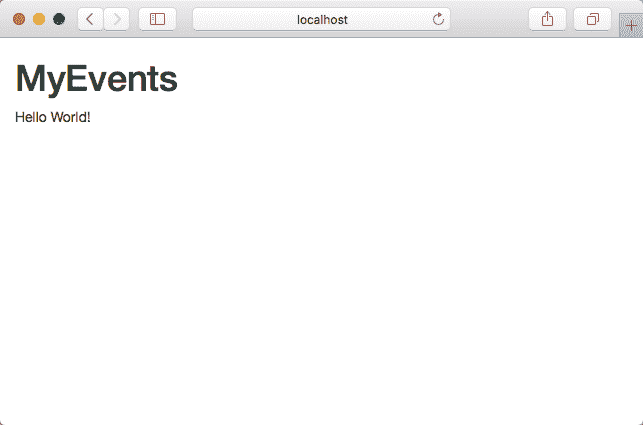
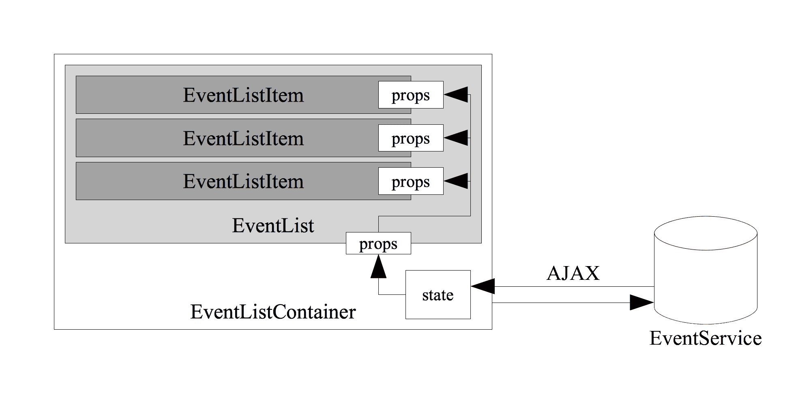
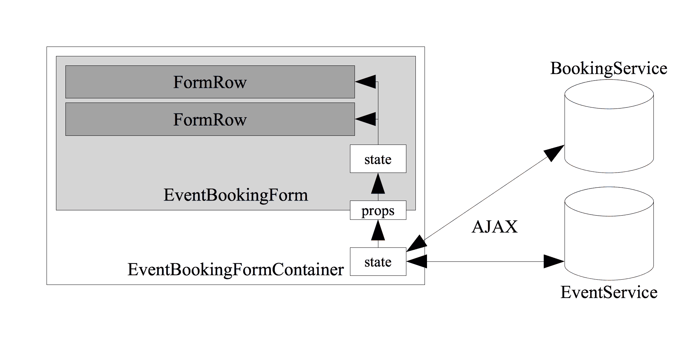

# 使用 React 构建前端

在前面的章节中，您已经使用 Go 构建了多个微服务，并使用 RESTWeb 服务和异步消息队列将它们集成在一起。然而，如果没有用户可以轻松交互的界面，即使是最具可扩展性的云应用程序也只有原来的一半有用（当然，除非向用户提供 RESTAPI 是您的实际产品）。为了使前几章中构建的 API 更加具体，我们现在将向应用程序添加一个基于 web 的前端。

为此，我们将暂时离开围棋编程的世界，到 JavaScript 编程的世界来一次短暂的旅行。更准确地说，我们将了解 React 框架，并将使用它为（现在几乎完成的）MyEvents 后端构建前端应用程序。

在构建前端应用程序的同时，我们还将接触到极其多样化的 JavaScript 生态系统的许多组件。例如，为了能够以类型安全的方式编程，我们将使用 TypeScript 编译器。此外，我们将使用 Webpack 模块绑定器轻松部署 JavaScript 应用程序，以便在所有现代 web 浏览器中轻松使用。

在本章中，我们将介绍以下主题：

*   设置 Node.js/TypeScript/React 开发环境
*   启动一个新项目
*   反应组分
*   Webpack 模块绑定器
*   使用 RESTful 后端构建 React 应用程序

# 从 React 开始

在本章中，我们将在围棋生态系统之外迈出一小步。为了使用 React，您将需要一个提供 Node.js、npm 和 TypeScript 编译器的开发环境，我们将在下一节中对其进行设置。

# 设置 Node.js 和 TypeScript

JavaScript 是一种动态类型化语言。虽然（像 Go）它确实有数据类型的概念，但 JavaScript 变量（不像 Go）基本上可以在任何时候具有任何类型。由于我们不希望您在进入 JavaScript 世界的短暂旅程中错过 Go 编译器和 Go 的类型安全性，因此在本例中我们将使用 TypeScript。TypeScript 是一个类型安全的 JavaScript 超集，它将静态类型和基于类的 OOP 添加到 JavaScript 中。您可以使用 TypeScript 编译器（或简称为*tsc*）将 TypeScript 编译成 JavaScript。

首先，除了 Go 运行时之外，还需要在开发机器上设置一个工作 Node.js 运行时。请看[https://nodejs.org/en/download](https://nodejs.org/en/download) 学习如何在您的机器上设置 Node.js。如果您正在运行 Linux（或使用包管理器（如 Homebrew）的 macOS），请参阅[https://nodejs.org/en/download/package-manager](https://nodejs.org/en/download/package-manager) 。

安装 Node.js 后，继续使用**节点包管理器**（**npm**安装 TypeScript 编译器）：

```go
$ npm install -g typescript
```

这将下载 TypeScript 编译器并将其安装到系统的`PATH`中。运行上述命令后，您应该能够在命令行上调用 tsc。

在这个项目中，我们还将使用 Webpack 模块绑定器。模块绑定器接受 Node.js 模块并生成可在浏览器环境中使用的静态 JavaScript 文件。您可以通过 npm 安装 Webpack，就像您为 TypeScript 编译器所做的那样：

```go
$ npm install -g webpack
```

# 初始化 React 项目

首先为 React 前端应用程序创建一个新目录。接下来，将目录初始化为新的`npm`包：

```go
$ npm init
```

`npm init`命令将提示您输入有关项目的一些（或多或少）重要信息。最后生成一个`package.json`文件，大致如下：

```go
{ 
  "name": "myevents-ui", 
  "version": "1.0.0", 
  "description": "", 
  "main": "dist/bundle.js", 
  "author": "Martin Helmich", 
  "license": "MIT" 
} 
```

通常，我们的应用程序将具有以下目录结构：

*   我们的 TypeScript 源文件将放在`src/`目录中。
*   编译后的 JavaScript 文件将放在`dist/`目录中。因为我们将使用 Webpack 作为模块绑定器，所以我们的`dist/`目录很可能只包含一个包含整个编译源代码的文件。
*   我们将通过 npm 作为依赖项安装的库将安装到`node_modules/`目录中。

我们现在可以使用 npm 向项目添加依赖项。让我们首先安装 React 和 ReactDOM 包：

```go
$ npm install --save react@16 react-dom@16 @types/react@16 @types/react-dom@16
```

TypeScript 编译器需要`@types`包。由于 React 是一个 JavaScript（不是 TypeScript）库，TypeScript 编译器将需要关于 React 库定义的类及其方法签名的附加信息。例如，这些**类型**可能包含 React 提供的某些函数需要哪些参数类型及其返回类型的信息。

我们还需要一些开发依赖项：

```go
$ npm install --save-dev typescript awesome-typescript-loader source-map-loader
```

Webpack 模块绑定器需要这些库来将源文件编译为 JavaScript 文件。但是，我们将只在*构建*应用程序时需要这些依赖项，而不是在*实际运行*应用程序时需要这些依赖项。因此，我们使用`--save-dev`标志将它们声明为开发依赖项。

接下来，我们需要配置 TypeScript 编译器。为此，在项目目录中创建一个新的`tsconfig.json`文件：

```go
{ 
  "compilerOptions": { 
    "outDir": "./dist/", 
    "module": "commonjs", 
    "target": "es5", 
    "sourceMap": true, 
    "noImplicitAny": true, 
    "jsx": "react" 
  }, 
  "include": [ 
    "./src/**/*" 
  ] 
} 
```

请注意，我们是如何配置 TypeScript 编译器的，以使用`include`属性从`src/`目录加载其源文件，并使用`outDir`属性将编译后的输出文件保存到`dist/`。

最后，我们还需要通过创建一个`webpack.config.js`文件来配置 Webpack 模块绑定器：

```go
module.exports = { 
  entry: "./src/index.tsx", 
  output: { 
    filename: "bundle.js", 
    path: __dirname + "/dist" 
  }, 
  resolve: { 
    extensions: [".ts", ".tsx"] 
  }, 
  module: { 
    rules: [ 
      { 
        test: /\.tsx?$/, 
        loader: "awesome-typescript-loader" 
      } 
    ] 
  }, 
  externals: { 
    "react": "React", 
    "react-dom": "ReactDOM" 
  } 
} 
```

此文件将 Webpack 配置为在所有`.ts`和`.tsx`文件上使用 TypeScript 加载程序，编译它们，并将所有模块捆绑到`dist/bundle.js`文件中。不过，在实际执行此操作之前，需要添加一些源文件进行编译。

在这样做之前，让我们来看看反应是如何工作的。

# 基本反应原理

React 应用程序由**组件**构建。组件是一个 JavaScript 类，它接受一组值（称为属性，或简而言之，*props*），并返回可由浏览器呈现的 DOM 元素树。

考虑下面的简单例子。我们将从纯 JavaScript 实现开始，稍后向您展示如何使用 TypeScript 添加静态类型：

```go
class HelloWorld extends React.Component { 
  render() { 
    return <div className="greeting"> 
      <h1>Hello {this.props.name}!</h1> 
    </div>; 
  } 
} 
```

即使您已经习惯了 JavaScript，语法对您来说也可能是新的。从技术上讲，前面的代码示例不是普通的 JavaScript（任何浏览器都会拒绝实际运行此代码），而是**JSX**。JSX 是 JavaScript 的一个特殊语法扩展，允许您使用各自的 HTML 表示直接定义 DOM 元素。这使得定义 React 组件变得更加容易。在不使用 JSX 的情况下，前面的代码示例需要编写如下：

```go
class HelloWorld extends React.Component { 
  render() { 
    return React.createElement("div", {class: "greeting"}, 
      React.createElement("h1", {}, `Hello ${this.props.name}!`) 
    ); 
  } 
} 
```

当然，要在浏览器中实际运行 JSX 源代码，首先需要将其转换为普通的旧 JavaScript。这将由 Webpack 模块绑定器在实际构建应用程序时完成。

还有一个 JSX 的 TypeScript 变体，称为**TSX**。它的工作方式完全相同，但是使用静态类型。使用 TypeScript 构建 React 组件时，还可以为组件道具定义接口。

因为这实际上是一本围棋书，所以需要注意的是，TypeScript 接口与围棋接口是完全不同的。Go 接口描述结构需要实现的一组方法，而 TypeScript 接口定义对象需要具有的属性和/或方法。

要将 React 组件与 props 接口关联，`React.Component`类具有一个类型参数，您可以在扩展该类时指定该参数：

```go
export interface HelloWorldProps { 
  name: string; 
} 

export class HelloWorld extends React.Component 
<HelloWorldProps, any> { 
  render() { 
    // ... 
  } 
} 
```

组件可以相互嵌套。例如，您现在可以在另一个组件中重用前面的`HelloWorld`组件：

```go
import {HelloWorld} from "./hello_world"; 

class ExampleComponents extends React.Component<{}, any> { 
  render() { 
    return <div class="greeting-list"> 
      <HelloWorld name="Foo"/> 
      <HelloWorld name="Bar"/> 
    </div> 
  } 
} 
```

使用 TypeScript 的一个优点是，当您使用的组件的道具是通过接口定义的时，TypeScript 编译器会检查您是否实际为该组件提供了正确的道具。例如，在前面的示例中省略`name`属性（或将另一个值传递给它而不是字符串）将触发编译错误。

传递给 React 组件的道具被视为不可变的。这意味着当道具的某个值发生更改时，该组件将不会重新渲染。但是，每个 React 组件可能都有一个内部状态，可以对其进行更新。每次更改组件的状态时，都将重新渲染该组件。考虑下面的例子：

```go
export interface CounterState { 
  counter: number; 
} 

export class Counter extends React.Component<{}, CounterState> { 
  constructor() { 
    super(); 
    this.state = {counter: 0}; 
  } 

  render() { 
    return <div>Current count: {this.state.counter}</div>; 
  } 
} 
```

现在，我们可以随时使用组件的`setState()`方法更新此状态。例如，我们可以让计时器每秒递增计数器：

```go
constructor() { 
  super();
   this.state = {counter: 0}; 

  setInterval(() => { 
    this.setState({counter: this.state.counter + 1}); 
  }, 1000); 
} 
```

更改组件的状态将导致其重新渲染。在前面的示例中，这将导致计数器每秒明显增加 1。

当然，我们也可以结合道具和状态。一个常见的用例是使用传递到组件中的道具来初始化该组件的状态：

```go
export interface CounterProps { 
  start: number; 
} 

export interface CounterState { 
  counter: number 
} 

export class Counter extends React.Component<CounterProps, CounterState> { 
  constructor(props: CounterProps) { 
    super(props); 

    this.state = { 
      counter: props.start 
    }; 

    setInterval(() => { 
      // ... 
  } 
} 
```

有了关于 React 组件的知识，我们现在可以开始为 MyEvents 平台构建前端了。

# 启动前端

我们将首先构建一个简单的 React 应用程序，该应用程序从服务器获取可用事件的列表，并将其显示为一个简单的列表。

在开始之前，我们需要引导 React 应用程序。为此，我们需要构建一个`index.html`文件，作为应用程序的入口点。通常，此文件不会很长，因为它的大部分逻辑将以 React 组件的形式存在：

```go
<!DOCTYPE html> 
<html lang="en"> 
  <head> 
    <meta charset="UTF-8"> 
    <title>MyEvents</title> 
  </head> 
  <body> 
    <div id="myevents-app"></div> 

    <script src="./node_modules/react/umd/react.production.min.js"></script> 
    <script src="./node_modules/react-dom/umd/react-dom.production.min.js"></script> 
    <script src="./dist/bundle.js"></script> 
  </body> 
</html> 
```

让我们更详细地看一下这个 HTML 文件。具有`myevents-app`ID 的`DIV`稍后将成为呈现 React 应用程序的位置。然后，文件的大部分内容包括从各自的 npm 包中加载 React 库和加载实际的应用程序包（将由 Webpack 构建）。

为了使我们的应用程序看起来更美观，我们还将在前端添加 Twitter 引导框架。通常，您可以使用`npm`安装引导程序：

```go
$ npm install --save bootstrap@^3.3.7
```

安装引导程序后，您可以在`index.html`文件的标题部分包含相应的 CSS 文件：

```go
<!DOCTYPE html> 
<html lang="en"> 
<head> 
  <meta charset="UTF-8"> 
  <title>MyEvents</title> 
  <link rel="stylesheet" href="./node_modules/bootstrap/dist/css/bootstrap.min.css"/> 
</head> 
<body> 
  <!-- ... --> 
</body> 
</html> 
```

首先，让我们添加一个新的 React 组件。为此，请在项目目录中创建`src/components/hello.tsx`文件：

```go
import * as React from "React"; 

export interface HelloProps { 
  name: string; 
} 

export class Hello extends React.Component<HelloProps, {}> { 
  render() { 
    return <div>Hello {this.props.name}!</div>; 
  } 
} 
```

React 应用程序的实际入口点将放在`src/index.tsx`文件中。您可能还记得，这也是我们在`webpack.config.js`文件中指定为 Webpack module bundler 入口点的文件：

```go
import * as React from "react"; 
import * as ReactDOM from "react-dom"; 
import {Hello} from "./components/hello"; 

ReactDOM.render( 
  <div className="container"> 
    <h1>MyEvents</h1> 
    <Hello name="World"/> 
  </div>, 
  document.getElementById("myevents-app") 
); 
```

请看前面代码示例中的`className`属性。在 JSX 或 TSX 中使用普通 HTML 元素时，需要使用`className`而不是`class`。这是因为`class`在 JavaScript 和 TypeScript 中都是保留关键字，因此仅使用`class`将严重混淆编译器。

创建完所有这些文件后，您现在可以运行 Webpack bundler 来创建您的`bundle.js`文件：

```go
$ webpack
```

在开发过程中，您还可以让 Webpack bundler 持续运行，在源文件发生更改时更新您的`bundle.js`文件。只需让启动的进程在后台的 shell 窗口中运行：

```go
$ webpack --watch
```

您现在可以在浏览器中打开`index.html`文件。但是，在浏览器中直接打开本地文件会在以后向我们的后端服务发出 HTTP 请求时导致问题。您可以使用`http-server`npm 的包快速设置一个 HTTP 服务器，该服务器可以为这些本地文件提供服务。只需通过`npm`安装，然后在项目目录中运行：

```go
$ npm install -g http-server
$ http-server
```

Node.js HTTP 服务器默认在 TCP 端口`8080`监听，您可以在浏览器中导航到`http://localhost:8080`进行访问：



输出(http://localhost:8080)

祝贺您刚刚构建了第一个 React 应用程序。当然，对于 MyEvents 平台，我们需要的不仅仅是 Hello World！我们的首要任务之一是从后端服务加载可用事件，并以美观的方式显示它们。

# 实施事件列表

要显示可用事件的列表，我们需要一个从后端服务加载这些事件的解决方案，更准确地说，是您在[第 2 章](02.html)、*使用 REST API 构建微服务*和[第 3 章](03.html)、*保护微服务*中构建的事件服务的 REST API .

# 带上你自己的客户

React 是一个模块化框架。与其他 JavaScript 前端框架（如 Angular）不同，React 不提供自己的 REST 调用库，而是希望您提供自己的库。要从服务器加载数据，我们将使用 fetch API。FetchAPI 是一个更新的 JavaScript API，用于对许多现代浏览器（主要是 Firefox 和 Chrome）中实现的后端服务进行 AJAX 调用。对于尚未实现 fetch API 的旧浏览器，有一个`polyfill`库，您可以通过`npm`将其添加到应用程序中：

```go
$ npm install --save whatwg-fetch promise-polyfill
```

您需要将这两个`polyfill`库与其他 JavaScript 库一起包含在您的`index.html`文件中：

```go
<script src="./node_modules/react/dist/react.min.js"></script> 
<script src="./node_modules/react-dom/dist/react-dom.min.js"></script> 
<script src="./node_modules/promise-polyfill/promise.min.js"></script> 
<script src="./node_modules/whatwg-fetch/fetch.js"></script> 
<script src="./dist/bundle.js"></script> 
```

fetch`polyfill`库将在可用时使用浏览器的 fetch API，在不可用时提供自己的实现。几年后，当更多浏览器支持 FetchAPI 时，您将能够安全地删除`polyfill`。

# 构建事件列表组件

现在让我们考虑一下事件列表需要哪些 React 组件。下图显示了我们将要构建的组件的概述：



事件列表将由哪些组件构成的概述

这些组件将承担以下责任：

*   `EventListContainer`组件将负责从后端服务加载事件列表，并在其自身状态下管理事件列表。然后，它将当前事件集传递给`EventList`组件的道具。
*   `EventList`组件将负责呈现事件列表所在的容器。首先，我们将选择一个简单的表视图。然后，此表将填充一组`EventListItem`，每个事件一个。
*   `EventListItem`组件将在事件列表中呈现单个事件项。

从技术上讲，我们可以让`EventList`组件从后端服务加载事件并管理事件列表显示。但是，这将违反**单一责任原则**；这就是为什么我们有两个组件，一个加载事件并将其传递给另一个，另一个向用户呈现事件。

让我们先告诉 TypeScript 编译器事件的实际外观。为此，我们将定义一个 TypeScript 接口，该接口描述当使用`GET`获取 URL`/events`时，后端服务交付的 JSON 响应。创建具有以下内容的新`./src/models/event.ts`文件：

```go
export interface Event { 
  ID string; 
  Name string; 
  Country string; 
  Location { 
    ID string; 
    Name string; 
    Address string; 
  }; 
  StartDate number; 
  EndDate number; 
  OpenTime: number; 
  CloseTime: number; 
} 
```

请注意此接口定义与事件服务代码中定义的`persistence.Event`结构的对应程度。为了使前端和后端能够很好地协同工作，这两个定义在更改时需要保持同步。

现在可以继续构建 React 组件。我们将通过实施`EventListItem`从下至上。为此，创建一个新的`src/components/event_list_item.tsx`文件：

```go
import {Event} from "../models/event"; 
import * as React from "react"; 

export interface EventListItemProps { 
  event: Event; 
} 

export class EventListItem extends React.Component<EventListItemProps, {}> { 
  render() { 
    const start = new Date(this.props.event.StartDate * 1000); 
    const end = new Date(this.props.event.EndDate * 1000); 

    return <tr> 
      <td>{this.props.event.Name}</td> 
      <td>{this.props.event.Location.Name}</td> 
      <td>{start.toLocaleDateString()}</td> 
      <td>{end.toLocaleDateString()}</td> 
      <td></td> 
    </tr> 
  } 
} 
```

接下来，在`src/components/event_list.tsx`文件中定义`EventList`组件：

```go
import {Event} from "../models/event"; 
import {EventListItem} from "./event_list_item"; 
import * as React from "react"; 

export interface EventListProps { 
  events: Event[]; 
} 

export class EventList extends React.Component<EventListProps, {}> { 
  render() { 
    const items = this.props.events.map(e => 
      <EventListItem event={e} /> 
    ); 

    return <table className="table"> 
      <thead> 
        <tr> 
          <th>Event</th> 
          <th>Where</th> 
          <th colspan="2">When (start/end)</th> 
          <th>Actions</th> 
        </tr> 
      </thead> 
      <tbody> 
        {items} 
      </tbody> 
    </table> 
  }   
} 
```

注意`EventList`组件如何使用 JavaScript 的本机`map`函数将事件对象数组转换为`EventListItem`列表（该事件作为道具传递）非常容易。然后将`EventListItem`列表插入`EventList`组件创建的表体中。

最后但并非最不重要的一点是，我们可以构建`EventListContainer`组件。在这个组件中，我们将使用 fetchapi 从服务器加载事件。首先，让我们在`src/components/event_list_container.tsx`文件中实现`EventListContainer`道具和状态的定义：

```go
import * as React from "react"; 
import {EventList} from "./event_list"; 
import {Event} from "../models/event"; 

export interface EventListContainerProps { 
  eventListURL: string; 
} 

export interface EventListContainerState { 
  loading: boolean; 
  events: Event[] 
} 
```

接下来，我们可以实现实际组件：

```go
export class EventListContainer extends React.Component 
<EventListContainerProps, EventListContainerState> { 
  construct(p: EventListContainerProps) { 
    super(p); 

    this.state = { 
      loading: true, 
      events: [] 
    }; 

    fetch(p.eventListURL) 
      .then<Event[]>(response => response.json()) 
      .then(events => { 
        this.setState({ 
          loading: false, 
          events: events 
        }); 
      }); 
  } 
} 
```

在构造函数中，我们将首先初始化组件的状态。这里，重要的是要记住 JavaScript 中的 HTTP 操作通常是异步的。尽管我们在构造函数中调用了`fetch`函数，但 JavaScript 运行时将异步执行此 HTTP 请求，并且即使没有加载数据（尚未加载），也会创建组件。因此，我们的组件状态包含一个名为`loading`的布尔属性，该属性指示数据是否仍在加载。稍后，组件可以基于此状态属性调整其表示。

`fetch`方法返回一个承诺。承诺是尚未可用的值的占位符。一旦承诺值可用，您就可以在承诺实例上使用`then(...)`函数来运行代码。你也可以连锁承诺；在这种情况下，`fetch`函数返回 HTTP 响应的承诺（即，`Response`类的实例）。这个类本身有一个`json()`函数，它本身为 JSON 解码值返回另一个承诺。当传递给`then(...)`调用的函数返回另一个承诺时，返回的承诺将替换原始承诺。这意味着我们可以向该链添加另一个`then()`调用，该调用将在 HTTP 响应可用且 JSON 解码成功时被调用。当这种情况发生时，我们将更新组件的状态，指示组件不再加载，并更新包含实际事件列表的`events`属性。

最后，通过添加`render()`方法完成`EventListContainer`组件：

```go
render() { 
  if (this.state.loading) { 
    return <div>Loading...</div>; 
  } 

  return <EventList events={this.state.events} />; 
} 
```

为了在我们的页面上实际显示事件列表，您现在可以使用`index.tsx`文件中的`EventListContainer`：

```go
import * as React from "react"; 
import * as ReactDOM from "react-dom"; 
import {EventListContainer} from "./components/event_list_container"; 

ReactDOM.render( 
  <div className="container"> 
    <h1>MyEvents</h1> 
    <EventListContainer eventListURL="http://localhost:8181"/> 
  </div>, 
  document.getElementById("myevents-app") 
); 
```

一般来说，构建一个根组件作为应用程序的单一入口点也是一种良好的做法。我们可以将`ReactDOM.render`调用中的 DOM 元素提取到它自己的组件中，然后在`ReactDOM.render`调用中使用它：

```go
class App extends React.Component<{}, {}> { 
  render() { 
    return <div className="container"> 
      <h1>MyEvents</h1> 
      <EventListContainer eventListURL="http://localhost:8181"/> 
    </div> 
  } 
} 

ReactDOM.render( 
  <App/> 
  document.getElementById("myevents-app") 
); 
```

# 在后端服务中启用 CORS

在测试前端应用程序之前，您需要确保后端服务（更准确地说，活动服务和预订服务）支持**跨源资源共享**（**CORS**）。否则，当前端服务于`http://localhost:8080`且后端服务在其他 TCP 端口上运行时，浏览器将不会对任何后端服务执行 HTTP 请求。

原则上，CORS 只包含一些需要在 HTTP 响应中出现的附加头。例如，为了允许来自另一个域的 AJAX 请求，HTTP 响应需要包含一个`Access-Control-Allow-Origin`头。具有此类标头的 HTTP 响应可能如下所示：

```go
HTTP/1.1 200 OK
 Content-Type: application/json; charset=utf-8
 Content-Length: 1524
 Date: Fri, 24 Mar 2017 16:02:55 GMT
 Access-Control-Allow-Origin: http://localhost:8080 
```

由于我们在活动和预订服务中都使用了 Gorilla 工具包，因此添加 CORS 功能很容易。首先，我们需要去拿`github.com/gorilla/handlers`套餐：

```go
$ go get github.com/gorilla/handlers
```

之后，我们可以使用`handlers.CORS`函数将 CORS 功能添加到现有 HTTP 服务器。这允许我们调整事件服务的`rest.go`文件，如下所示：

```go
package rest 

import ( 
  // ... 
  "github.com/gorilla/mux" 
  "github.com/gorilla/handlers" 
) 

func ServeAPI(endpoint string, dbHandler persistence.DatabaseHandler, eventEmitter msgqueue.EventEmitter) error { 
  handler := newEventHandler(dbHandler, eventEmitter) 
  r := mux.NewRouter() 

  // ... 

  server := handlers.CORS()(r) 
  return http.ListenAndServe(endpoint, server) 
} 
```

以同样的方式调整预订服务。之后，您将能够从前端应用程序与这两种服务进行对话，而不会出现任何问题。

# 测试事件列表

为了测试您的应用程序，请确保您有一个事件服务实例在本地运行，并在 TCP 端口`8181`上侦听。另外，请确保您已经使用事件服务的 RESTAPI 创建了一个或两个事件。然后，在前端应用程序目录中启动 Node.js`http-server`并在浏览器中导航到`http://localhost:8080`：


输出(http://localhost:8080)

# 添加路由和导航

在我们向前端应用程序添加更多功能之前，让我们花点时间添加一个健壮的导航和路由层。这将允许我们的应用程序在添加更多功能时保持易于维护。

为了使我们的应用程序支持多个应用程序视图，我们首先将`react-router-dom`包添加到我们的应用程序中：

```go
$ npm install --save react-router-dom
$ npm install --save-dev @types/react-router-dom
```

`react-router-dom`包为我们的应用程序添加了一些新组件。我们可以在根组件中使用这些组件来轻松实现路由：

```go
import * as React from "react"; 
import * as ReactDOM from "react-dom"; 
import {HashRouter as Router, Route} from "react-router-dom"; 
// ... 

class App extends React.Component<{}, {}> { 
  render() { 
    const eventList = () => <EventListContainer eventServiceURL="http://localhost:8181"/> 

    return <Router> 
      <div className="container"> 
        <h1>My Events</h1> 

        <Route exact path="/" component={eventList}/> 
      </div> 
    </Router> 
  } 
} 
```

注意`<Route>`组件在容器内的使用方式；此时，我们可以稍后添加多个`Route`组件，React 路由器将根据当前 URL 呈现这些组件。这允许我们的应用程序使用普通的旧链接将用户从一个视图引导到另一个视图。

注意前面的`render()`方法中声明的`eventList`常量。这是因为`Route`组件接受一个`component`道具，该道具指的是一个组件或一个函数，只要与`Route`匹配，就会调用该组件或函数。但是，我们不能指定应该传递给相应组件的道具。这就是为什么我们要声明一个函数，用默认的道具初始化`EventListContainer`组件，允许它在`Route`组件中使用。

现在我们有了一个工作的路由层；让我们确保我们的用户总能找到返回事件列表的方法。为此，我们将添加一个可以在根组件中使用的新导航栏组件。创建一个新的`src/components/navigation.tsx`文件：

```go
import * as React from "react"; 
import {Link} from "react-router-dom"; 

export interface NavigationProps { 
  brandName: string; 
} 

export class Navigation extends React.Component<NavigationProps, {}> { 
} 
```

接下来，向新组件添加一个`render()`方法：

```go
render() { 
  return <nav className="navbar navbar-default"> 
    <div className="container"> 
      <div className="navbar-header> 
        <Link to="/" className="navbar-brand"> 
          {this.props.brandName} 
        </Link> 
      </div> 

      <ul className="nav navbar-nav"> 
        <li><Link to="/">Events</Link></li> 
      </ul> 
    </div> 
  </nav> 
} 
```

注意我们的`Navigation`组件是如何使用`Link`组件创建到其他 React 路由的链接的，考虑到我们目前只有`/`路由，这一点不太复杂。

要实际使用我们的新导航组件，请将其添加到根组件的`render`方法中：

```go
// ... 
import {Navigation} from "./components/navigation"; 

class App extends React.Component<{}, {}> { 
  render() { 
    const eventList = () => <EventListContainer eventServiceURL="http://localhost:8181"/> 

    return <Router> 
      <Navigation brandName="MyEvents"/> 
      <div className="container"> 
        <h1>My Events</h1> 

        <Route exact path="/" component={eventList}/> 
      </div> 
    </Router> 
  } 
} 
```

# 实施预订流程

现在我们已经有了一个工作路线和导航，我们可以实现下一个功能——预订流程。就本书而言，我们将简化预订过程。我们前面实现的事件列表中的每一行都应该有一个按钮，将用户带到预订表单。在此表单中，将提示他们要预订的车票数量，然后可以提交表单。提交时，前端应用程序将向预订服务执行 HTTP 请求。

当然，我们将把预订表单作为 React 组件来实现。和以前一样，我们将保持职责分离，并构建单独的组件来处理后端通信和前端演示。`EventBookingFormContainer`将负责从事件服务加载事件记录，并将实际预订保存回预订服务。然后，`EventBookingForm`将负责表单的实际前端展示。为了使表单表示更容易，我们还将引入一个`FormRow`组件。下图概述了这些组件及其相互关系：



组件之间的关系

`FormRow`组件将是一个纯粹的表示组件，以使引导框架的表单 CSS 类更易于使用。与前面一样，我们将从最里面的组件开始，自底向上实现这些组件。为此，创建`src/components/form_row.tsx`文件：

```go
import * as React from "react"; 

export interface FormRowProps { 
  label?: string; 
} 

export class FormRow extends React.Component<FormRowProps, {}> { 
  render() { 
    return <div className="form-group"> 
      <label className="col-sm-2 control-label"> 
        {this.props.label} 
      </label> 
      <div className="col-sm-10"> 
        {this.props.children} 
      </div> 
    </div> 
  } 
} 
```

在这种情况下，我们使用的是特殊道具`children`。虽然我们没有在`FormRowProps`接口中明确定义该属性，但我们可以在任何 React 组件中使用`children`属性。它将包含作为子元素传递到当前组件中的任何 DOM 元素。这将允许您按如下方式使用`FormRow`组件：

```go
<FormRow label="Some input field"> 
  <input className="form-control" placeholder="Some value..."/> 
</FormRow> 
```

接下来，我们可以使用`FormRow`组件来构建`EventBookingForm`组件。为此，创建一个名为`src/components/event_booking_form.tsx`的新文件：

```go
import * as React from "react"; 
import {Event} from "../model/event"; 
import {FormRow} from "./form_row"; 

export interface EventBookingFormProps { 
  event: Event; 
  onSubmit: (seats: number) => any 
} 

export interface EventBookingFormState { 
  seats: number; 
} 

export class EventBookingForm
  extends React.Component<EventBookingFormProps, EventBookingFormState> { 
  constructor(p:  EventBookingFormProps) { 
    super(p); 

    this.state = {seats: 1}; 
  } 
} 
```

`EventBookingForm`组件具有输入道具和内部状态。输入属性包含实际事件（应为其呈现预订表单）和回调方法。稍后，我们将配置预订表单，以便在提交表单时调用此回调方法。表单的内部状态包含一个变量，表示应预订的票证数量。

现在，在`EventBookingForm`组件中添加`render()`方法：

```go
render() { 
  return <div> 
    <h2>Book tickets for {this.props.event.name}</h2> 
    <form className="form-horizontal"> 
      <FormRow label="Event"> 
        <p className="form-control-static"> 
          {this.props.event.name} 
        </p> 
      </FormRow> 
      <FormRow label="Number of tickets"> 
        <select className="form-control" value={this.state.seats} 
onChange={event => this.handleNewAmount(event)}> 
          <option value="1">1</option> 
          <option value="2">2</option> 
          <option value="3">3</option> 
          <option value="4">4</option> 
        </select> 
      </FormRow> 
      <FormRow> 
        <button className="btn btn-primary" 
onClick={() => this.props.onSubmit(this.state.seats)}> 
          Submit order 
        </button> 
      </FormRow> 
    </form> 
  </div> 
} 
```

这将生成一个小表单，在该表单中，用户将能够查看他们预订的门票，选择所需的门票数量，然后提交订单。注意在按钮的`onClick`事件中如何调用`onSubmit`道具。

另外，请注意，select 字段的`onChange`事件调用了一个`this.handleNewAmount`方法，我们尚未定义该方法。现在让我们这样做：

```go
import * as React from "react"; 
import {ChangeEvent} from "react"; 
// ... 

export class EventBookingForm extends React.Component<EventBookingFormProps, EventBookingFormState> { 
  // ... 

  private handleNewAmount(event: ChangeEvent<HTMLSelectElement>) { 
    const state: EventBookingFormState = { 
      seats: parseInt(event.target.value) 
    } 

    this.setState(state); 
  } 
} 
```

最后但并非最不重要的一点是，我们现在可以实现`EventBookingFormContainer`组件。该组件将负责处理与各自后端服务的 AJAX 通信（因为我们正在处理事件预订，所以我们还必须与[第 4 章](04.html)*中内置的预订服务进行通信，*使用消息队列的异步微服务架构*。*

让我们从定义组件的道具和状态开始。为此，创建一个新的`src/components/event_booking_form_container.tsx`文件：

```go
import * as React from "react"; 
import {EventBookingForm} from "./event_booking_form"; 
import {Event} from "../model/event"; 
export class EventBookingFormContainerProps { 
  eventID: string; 
  eventServiceURL: string; 
  bookingServiceURL: string; 
} 
export class EventBookingFormContainerState { 
  state: "loading"|"ready"|"saving"|"done"|"error"; 
  event?: Event; 
} 
```

`EventBookingFormContainer`将需要对事件服务和预订服务进行 AJAX 调用。创建此组件的新实例时，将通过其属性向其传递事件 ID，然后使用该 ID 将相应事件的数据从事件服务加载到组件的状态。

加载事件数据是我们可以在组件的构造函数中执行的操作，我们将在下面定义：

```go
export class EventBookingFormContainer
  extends React.Component<EventBookingFormContainerProps,  EventBookingFormContainerState> { 
  constructor(p: EventBookingFormContainerProps) { 
    super(p); 

    this.state = {state: "loading"}; 

    fetch(p.eventServiceURL + "/events/" + p.eventID) 
      .then<Event>(response => response.json()) 
      .then(event => { 
        this.setState({ 
          state: "ready", 
          event: event 
        }) 
      }); 
  } 
} 
```

现在，我们可以在此组件中添加一个`render`方法，在事件加载后立即显示实际预订表单：

```go
render() { 
  if (this.state.state === "loading") { 
    return <div>Loading...</div>; 
  } 

  if (this.state.state === "saving") { 
    return <div>Saving...</div>; 
  } 

  if (this.state.state === "done") { 
    return <div className="alert alert-success"> 
      Booking completed! Thank you! 
    </div> 
  } 

  if (this.state.state === "error" || !this.state.event) { 
    return <div className="alert alert-danger"> 
      Unknown error! 
    </div> 
  } 

  return <EventBookingForm event={this.state.event} 
onSubmit={seats => this.handleSubmit(seats)} /> 
} 
```

此`render()`方法基本上涵盖了组件状态的所有可能变体，然后打印相应的状态消息。成功加载事件后，会显示实际的`EventBookingForm`。

最后，我们需要实现`handleSubmit`方法：

```go
private handleSubmit(seats: number) { 
  const url = this.props.bookingServiceURL + "/events/" + this.eventID + "/bookings"; 
  const payload = {seats: seats}; 

  this.setState({ 
    event: this.state.event, 
    state: "saving" 
  }); 

  fetch(url, {method: "POST", body: JSON.stringify(payload)}) 
    .then(response => { 
      this.setState({ 
        event: this.state.event, 
        state: response.ok ? "done" : "error" 
      }); 
    }) 
} 
```

我们的预订表工作到此结束。到目前为止，我们只遗漏了一件小事，即目前还无法访问此表单。现在让我们修正这个疏忽。

首先，在`App`组件的`render`方法中，向`index.tsx`文件添加一条新路由：

```go
render() { 
  const eventList = () => <EventListContainer eventServiceURL="http://localhost:8181" />; 
  const eventBooking = ({match}: any) => 
    <EventBookingFormContainer eventID={match.params.id} 
      eventServiceURL="http://localhost8181" 
      bookingServiceURL="http://localhost:8282" />; 

  return <Router> 
    <div className="container"> 
      <h1>My Events</h1> 

      <Route exact path="/" component={eventList} /> 
      <Route path="/events/:id/book" component={eventBooking} /> 
    </div> 
  </Router> 
} 
```

在这个代码示例中，您可以看到多个方面。首先，我们声明一个新的本地组件`eventBooking`，它基本上返回一个带有一些默认参数的`EventBookingFormContainer`组件。此组件将被传递一个具有`match`属性的 prop 对象（参数声明中的花括号是所谓的**解构赋值**。此 match 对象包含上一示例中声明的`/events/:id/book`路由的路由参数。这允许我们将事件 ID 包含为路由参数（例如，`localhost:8080/#/events/58d543209cdd4128c06e59db/book`）。

此外，为了使此代码正常工作，我们假设您有一个来自[第 4 章](04.html)的预订服务实例，*异步微服务架构使用消息队列*，在本地主机 TCP 端口`8282`上运行和侦听。

最后，我们需要添加一个按钮，允许用户实际到达该路线。为此，我们将修改您在本章前面部分中创建的`src/component/event_list_item.tsx`文件中的`EventListItem`组件。我们将使用您之前使用过的`react-router-dom`包中的`Link`组件：

```go
import {Link} from "react-router-dom"; 
// ... 

export class EventListItem extends React.Component<EventListItemProps, {}> { 
  render() { 
    const start = new Date(this.props.event.StartDate * 1000); 
    const end = new Date(this.props.event.EndDate * 1000); 

    return <tr> 
      <td>{this.props.event.Name}</td> 
      <td>{this.props.event.Location.Name}</td> 
      <td>{start.toLocaleDateString()}</td> 
      <td>{end.toLocaleDateString()}</td> 
      <td> 
        <Link to={`/events/${this.props.event.ID}/book`}> 
          Book now! 
        </Link> 
      </td> 
    </tr> 
  } 
} 
```

在前端应用程序中，您现在将看到一个附加按钮，标签为 Book now！：


现在就预订！按钮

事件列表中的`EventistItem`组件现在包含指向每个事件的预订表单的链接。单击其中一个按钮后，应用程序会将您链接到相应活动的实际预订表单：


活动中的 EventBookingForm

请注意包含事件 ID 的 URL。由于我们构建了`EventBookingFormContainer`以在构建事件服务时从事件服务加载事件数据，我们现在甚至可以使用此 URL 并直接在浏览器中打开它。React 路由器将立即打开预订表单，然后从事件服务加载事件数据。这允许您直接在 React 应用程序中打开子例程，甚至可以共享这些 URL 或将其添加到书签中。

# 总结

在本章中，我们向您简要介绍了 React 的前端开发。当然，我们只触及了 React 框架可能实现的功能的表面。在实际的应用程序中，我们仍然需要添加相当多的功能才能使前端应用程序真正完整（例如，我们需要添加一些琐碎的东西，例如用户注册和更复杂的签出过程）。

到目前为止，我们大部分时间都在做实际的编程，无论是在 Go 的后端还是在 TypeScript 的前端。然而，软件开发不仅仅是编程。在接下来的几章中，我们将关注应用程序的部署。这将包括后端服务（如前几章中构建的事件和预订服务），还包括持久性和消息传递服务（如数据库或消息队列）。为此，我们将研究现代容器技术，以及如何将这些技术部署到云中。敬请期待。