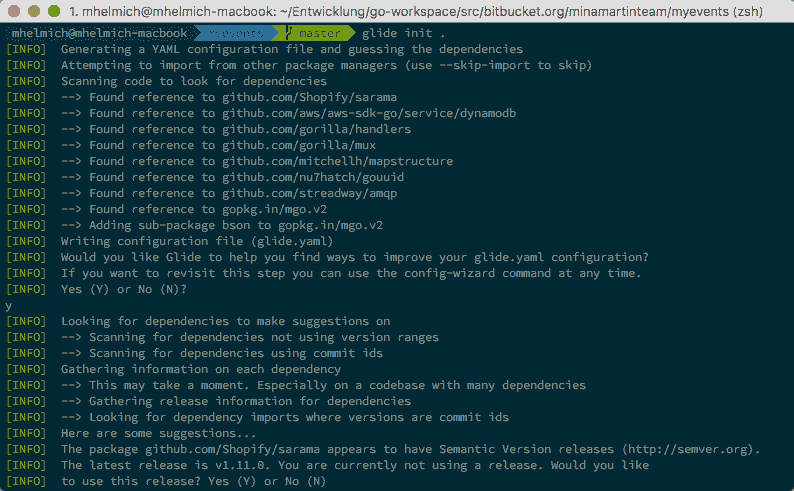
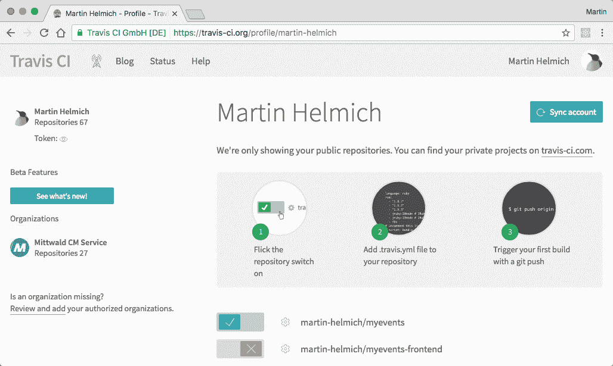
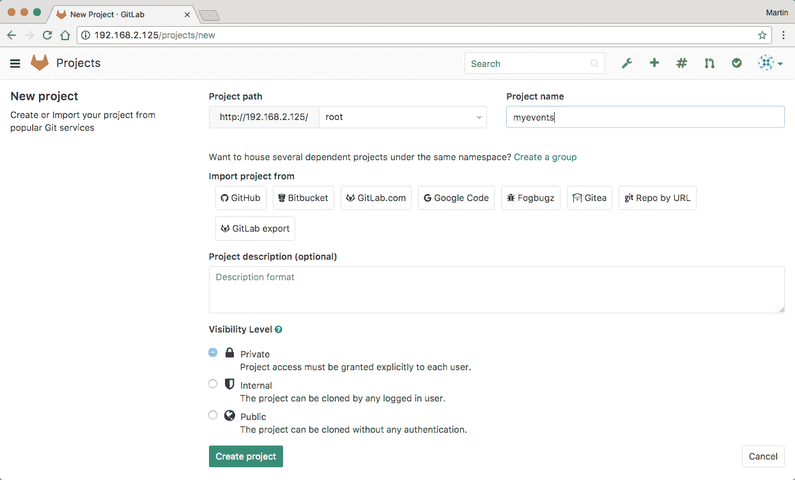
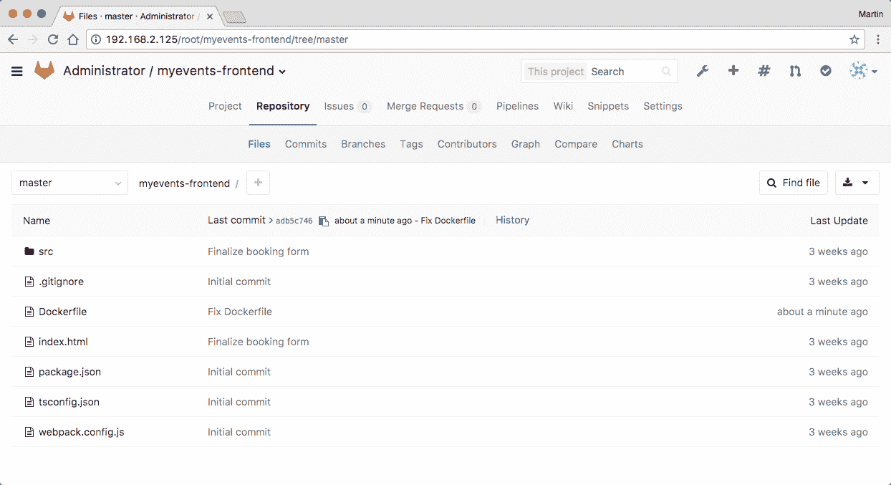
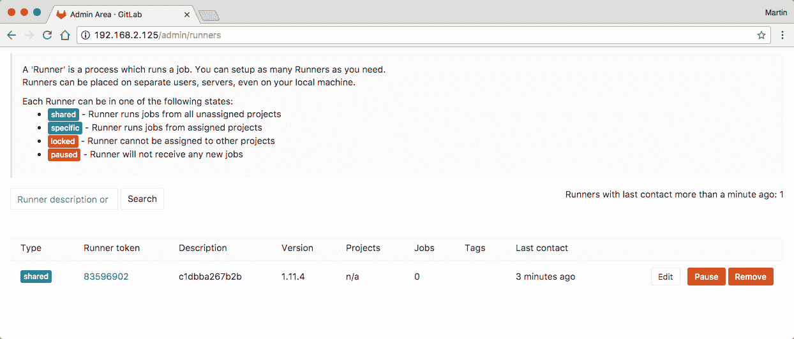
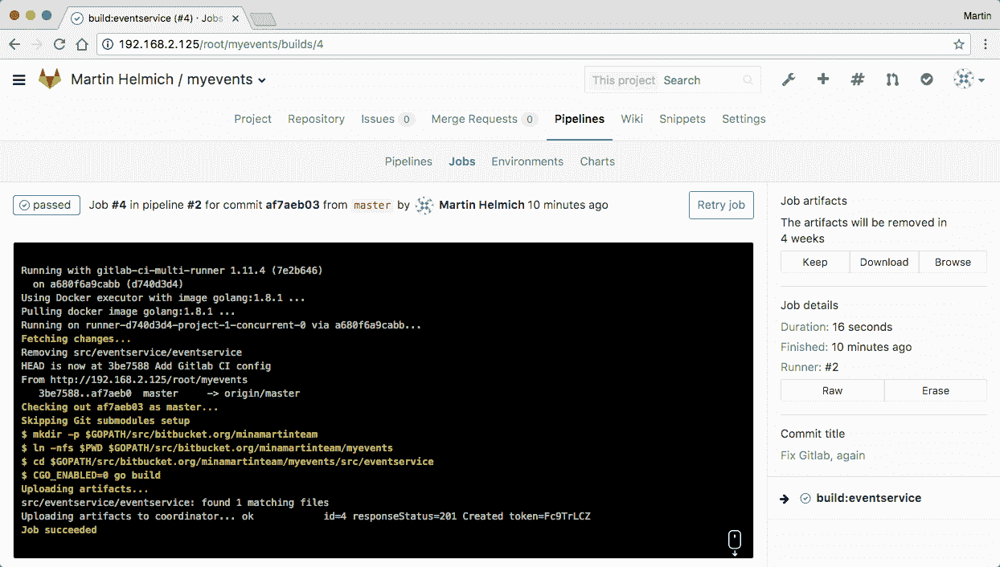
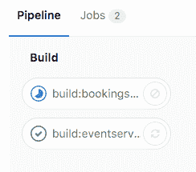
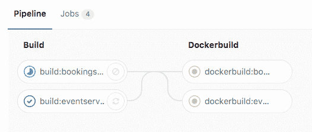

# 连续交付

在前三章中，您学习了现代容器技术和云环境，如何从应用程序（或者更准确地说，MyEvents 应用程序）创建容器映像，以及如何将它们部署到这些环境中。

在本章中，您将学习如何采用**连续集成**（**CI**）和**连续交付**（**CD**）进行应用。CI 描述了一种实践，在这种实践中，您可以不断地构建和验证您的软件项目（理想情况下，在对软件所做的每一次更改上）。CD 还通过在很短的发布周期内（当然，在本例中是在云环境中）持续部署应用程序来扩展这种方法。

这两种方法都需要高度自动化才能可靠地工作，这涉及到应用程序的构建和部署过程。在前面的章节中，我们已经介绍了如何使用容器技术部署应用程序。由于 Docker 和 Kubernetes 等技术很容易实现自动化，因此它们通常与 CD 很好地集成。

在本章中，您将学习如何设置项目以采用 CI 和 CD（例如，通过设置适当的版本控制和依赖关系管理）。我们还将介绍一些流行的工具，您可以使用这些工具在应用程序的代码发生更改时自动触发新的构建和发布。

本章将介绍以下主题：

*   在版本控制中管理 Go 项目
*   对可复制的构建使用依赖项销售
*   使用 Travis CI 和/或 GitLab 自动构建应用程序
*   自动将应用程序部署到 Kubernetes 群集

# 设置项目

在为我们的项目实际实施持续交付之前，让我们先做一些准备。稍后，这些将使我们将使用的工具更容易以自动化的方式轻松构建和部署应用程序。

# 设置版本控制

在自动构建应用程序之前，您需要一个地方来存储应用程序的源代码。这通常是**版本控制系统**（**VCS**的工作。通常，使您能够进行连续交付的工具与版本控制系统紧密集成，例如，只要源代码发生更改，就会触发应用程序的新构建和部署。

如果您自己还没有这样做，那么现在的第一步应该是将现有的代码库放入 VCS 中。在本例中，我们将使用当前事实上的标准 VCS Git。虽然还有许多其他版本控制系统，但 Git 是使用最广泛的版本控制系统；您将发现许多提供者和工具为您提供 Git 存储库作为托管服务或自托管。此外，许多（如果不是大多数的话）CD 工具都与 Git 集成。

在本章的剩余部分中，我们假设您熟悉 Git 的基本工作原理。如果您想了解如何使用 Git，我们推荐*Ferdinando Santacroce 等人的*一书*Git:Mastering Version Control*，该书也由 Packt 出版。

我们还将假设您有两个远程 Git 存储库，您可以在其中推送 Go 应用程序源代码和前端应用程序源代码。对于我们将使用的第一个连续交付工具，我们将假定您的存储库位于 GitHub 的以下 URL 处：

*   `git+ssh://git@github.com/<user>/myevents.git`
*   `git+ssh://git@github.com/<user>/myevents-frontend.git`

当然，实际的存储库 URL 将根据您的用户名而有所不同。在下面的示例中，我们将一致地使用`<user>`作为 GitHub 用户名的占位符，因此记住在必要时用实际用户名替换它。

您可以从设置本地 Git 存储库开始，以跟踪本地计算机上源代码的更改。要初始化新的 Git 存储库，请在 Go 项目的根目录（通常是 GOPATH 目录中的`todo.com/myevents`）中运行以下命令：

```go
$ git init . 
```

这将建立一个新的 Git 存储库，但尚未向版本控制添加任何文件。在将任何文件添加到存储库之前，请配置一个`.gitignore`文件，防止 Git 将编译后的文件添加到版本控制：

```go
/eventservice/eventservice 
/bookingservice/bookingservice 
```

创建`.gitignore`文件后，运行以下命令将当前代码库添加到版本控制系统：

```go
$ git add . 
$ git commit -m "Initial commit" 
```

接下来，使用`git remote`命令配置远程存储库，并使用`git push`推送源代码：

```go
$ git remote add origin ssh://git@github.com/<user>/myevents.git 
$ git push origin master 
```

拥有一个工作的源代码存储库是构建持续集成/交付管道的第一步。在以下步骤中，我们将配置 CI/CD 工具，以便在将新代码推入远程 Git 存储库的主分支时构建和部署应用程序。

使用相同的 Git 命令为前端应用程序创建新的 Git 存储库，并将其推送到 GitHub 上的远程存储库。

# 出卖你的依赖

到目前为止，我们只是使用`go get`命令安装了 MyEvents 应用程序所需的 Go 库（如`gopkg.in/mgo.v2`或`github.com/gorilla/mux`包）。虽然这对于开发来说相当有效，但使用`go get`安装依赖项有一个明显的缺点，即每次在尚未下载的软件包上运行`go get`时，它都会得到该库的最新版本（从技术上讲，是最新的*主程序*相应源代码存储库的分支）。这可能会产生恶劣的后果；假设您在某个时间点克隆了存储库，并使用`go get ./...`安装了所有依赖项。一周后，您重复这些步骤，但现在可能会得到完全不同版本的依赖项（积极维护和开发的库每天可能会收到几十个新的主分支提交）。如果其中一个更改更改了库的 API，这可能导致代码从一天到下一天不再编译，那么这一点尤其重要。

为了解决这个问题，Go 1.6 引入了**销售**的概念。使用 vendoring 可以将项目所需的库复制到包中的`vendor/`目录中（因此，在我们的例子中，`todo.com/myevents/vendor/`将包含`todo.com/myevents/vendor/github.com/gorilla/mux/`等目录）。当运行`go build`编译包时，`vendor/`目录中的库将优先于 GOPATH 中的库。然后，您可以简单地将`vendor/`目录与应用程序代码一起放入版本控制中，并在克隆源代码存储库时生成可复制的版本。

当然，手动将库复制到包的`vendor/`目录很快就会变得单调乏味。通常，这项工作由**依赖关系管理器**完成。目前，Go 有多种依赖关系管理器，最流行的是**Godep**和**Glide**。这些都是社区项目；一个官方的依赖管理器，简称为**dep**，目前正在开发中，已经被认为是安全的生产使用，但在撰写本书时，仍然被指定为实验。

有关 dep 的更多信息，请访问[https://github.com/golang/dep](https://github.com/golang/dep) 。

在本例中，我们将使用 Glide 填充应用程序的`vendor/`目录。首先，通过运行以下命令安装 Glide：

```go
$ curl https://glide.sh/get | sh 
```

这将在您的`$GOPATH/bin`目录中放置一个 glide 可执行文件。如果您想全局使用 glide，可以将其复制到路径中，如下所示：

```go
$ cp $GOPATH/bin/glide /usr/local/bin/glide 
```

Glide 的工作原理与您可能从其他编程语言（例如，Node.js 的 npm 或 PHP 的 Compose）了解的包管理器类似。它通过从包目录中读取一个`glide.yaml`文件进行操作。在这个文件中，您声明了应用程序拥有的所有依赖项，并且可以选择提供 Glide 应该为您安装的这些库的特定版本。要从现有应用程序创建`glide.yaml`文件，请在程序包目录中运行`glide init .`命令：

```go
$ glide init . 
```

在初始化项目时，Glide 将检查应用程序使用的库，并尝试自动优化依赖项声明。例如，如果 Glide 找到一个提供稳定版本（通常是 Git 标记）的库，它将提示您是否希望使用这些稳定版本中的最新版本，而不是依赖项的主分支（可能更不稳定）。

当运行`glide init`时，会产生如下类似的输出：



`glide init`命令将在应用程序的根目录中创建一个`glide.yaml`文件，其中声明了所有必需的依赖项。对于 MyEvents 应用程序，此文件应类似于以下内容：

```go
package: todo.com/myevents 
import: 
- package: github.com/Shopify/sarama 
  version: ^1.11.0 
- package: github.com/aws/aws-sdk-go 
  version: ^1.8.17 
  subpackages: 
  - service/dynamodb 
- package: github.com/gorilla/handlers 
  version: ^1.2.0 
# ... 
```

`glide.yaml`文件声明项目需要哪些依赖项。创建此文件后，您可以运行`glide update`命令来实际解析声明的依赖项，并将它们下载到您的`vendor/`目录中。

正如您在前面的屏幕截图中所看到的，`glide update`不仅会将您的`glide.yaml`文件中声明的依赖项下载到`vendor/`目录中，还会下载它们的依赖项。最后，Glide 将递归下载应用程序的整个依赖关系树，并将其放置在`vendor/`目录中：


对于下载的每个软件包，Glide 都会将准确的版本写入一个新文件`glide.lock`（您可以通过打开它来查看此文件，但它实际上并不意味着要手动编辑）。`glide.lock`文件允许您在以后任何时候通过运行`glide install`来重建这组精确的依赖项及其精确版本。您可以通过删除您的`vendor/`目录，然后运行`glide install`来验证此行为。

拥有`vendor/`目录和 Glide 配置文件，您可以选择以下两个选项：

*   您可以将整个`vendor/`目录与实际应用程序文件一起放入版本控制中。这样做的好处是，现在任何人都可以克隆您的存储库（在本例中，任何人都包括希望构建和部署代码的 CI/CD 工具），并且所有依赖项都可以在其确切的所需版本中随时可用。这样，从头开始构建应用程序实际上只不过是一个`git clone`或`go build`命令。另一方面，源代码存储库会变得更大，可能需要更多的磁盘空间来存储和克隆。
*   或者，您也可以将`glide.yaml`和`glide.lock`文件放入版本控制中，通过将`vendor/`目录添加到`.gitignore`文件中，将其从版本控制中排除。从好处看，这使您的存储库更小，克隆速度更快。但是，克隆存储库后，用户现在需要显式运行`glide install`从 internet 下载`glide.lock`文件中指定的依赖项。

这两种选择都相当有效，因此最终这是个人品味的问题。由于现在很少考虑存储库大小和磁盘空间，并且因为它使构建过程大大简化，我个人的偏好是将我的整个`vendor/`目录置于版本控制中：

```go
$ git add vendor 
$ git commit -m"Add dependencies" 
$ git push 
```

这需要照顾我们的后端服务，但也有前端的应用程序，我们需要考虑。由于我们一直在[第 5 章](05.html)中使用 npm 安装我们的依赖项，因此*使用 React*构建前端，大部分工作已经为我们完成。有趣的是，关于是否将依赖项放入版本控制（在本例中，是`node_modules/`目录而不是`vendor/`）的完全相同的论点也适用于 npm。另外，是的，就像 Go 的`vendor/`目录一样，我更喜欢将我的整个`node_modules/`目录置于版本控制中：

```go
$ git add node_modules 
$ git commit -m "Add dependencies" 
$ git push 
```

明确声明项目的依赖项（包括使用过的版本）是确保可复制构建的一大步。根据您是否选择将依赖项包括在版本控制中，用户可以在克隆源代码存储库后直接获得整个应用程序源代码（包括依赖项），或者至少可以分别通过运行`glide install`或`npm install`轻松地重建它。

现在，我们已经将项目置于版本控制中，并显式声明了依赖项，我们可以看看一些最流行的 CI/CD 工具，您可以使用这些工具持续构建和部署应用程序。

# 使用 Travis CI

**Travis CI**是一个用于持续集成的托管服务。它与 GitHub 紧密耦合（这就是为什么您需要 GitHub 上的 Git 存储库来实际使用 Travis CI）。它可以免费用于开源项目，加上良好的 GitHub 集成，使它成为许多流行项目的首选。对于构建私有 GitHub 项目，有一种付费使用模式。

Travis 构建的配置由一个`.travis.yml`文件完成，该文件需要存在于存储库的根级别。基本上，此文件可以如下所示：

```go
language: go 
go: 
  - 1.6 
  - 1.7 
  - 1.8 
 - 1.9
env: 
  - CGO_ENABLED=0 

install: true 
script: 
  - go build 
```

`language`属性描述了您的项目是用哪种编程语言编写的。根据您在此处提供的语言，您的构建环境中将提供不同的工具。`go`属性描述应该为应用程序构建哪些版本的 Go。为多个版本的 Go 测试您的代码对于可能由许多用户在可能非常不同的环境中使用的库尤其重要。`env`属性包含应传递到构建环境中的环境变量。请注意，在[第 6 章](06.html)*将应用程序部署到容器*中之前，我们已经使用了`CGO_ENABLED`环境变量来指示 Go 编译器生成静态链接的二进制文件。

`install`属性描述了设置应用程序依赖项所需的步骤。如果完全忽略，Travis 将自动运行`go get ./...`下载所有依赖项的最新版本（这正是我们不想要的）。`install: true`属性实际上指示 Travis 不要做任何事情来设置我们的依赖项，如果您的依赖项已经包含在源代码存储库中，那么这就是正确的方法。

如果您决定不在版本控制中包括您的`vendor/`目录，安装步骤需要包含 Travis 下载 Glide 的说明，然后使用它安装项目的依赖项：

```go
install: 
  - go get -v github.com/Masterminds/glide 
  - glide install 
```

然后，`script`属性包含 Travis 实际构建项目时应该运行的命令。当然，构建应用程序最明显的步骤是`go build`命令。当然，您可以在此处添加其他步骤。例如，您可以使用`go vet`命令检查源代码中的常见错误：

```go
scripts: 
  - go vet $(go list ./... | grep -v vendor)
 - cd eventservice && go build 
  - cd bookingservice && go build 
```

`$(go list ./... | grep -v vendor)`命令是一种特殊的 hack，用于指示`go vet`不要分析包目录中的`vendor/`源代码。否则，`go vet`可能会抱怨项目依赖关系中的许多问题，而这些问题无论如何都是您不想（甚至无法）修复的。

创建`.travis.yml`文件后，将其添加到版本控制并推送到远程存储库：

```go
$ git add .travis.yml 
$ git commit -m "Configure Travis CI" 
$ git push 
```

现在您的存储库中有了一个*.travis.yml*文件，您可以为此存储库启用 travis 构建。为此，请在[上登录 Travis CIhttps://travis-ci.org](https://travis-ci.org) （或[https://travis-ci.com](https://travis-ci.com) 如果您计划使用付费层，请使用您的 GitHub 凭据。登录后，您将发现一个公开可用的 GitHub 存储库列表，以及一个允许您为每个存储库启用 Travis 构建的开关（如以下屏幕截图所示）：



继续并启用`myevents`和`myevents-frontend`存储库（如果其中一个存储库中还没有`.travis.yml`文件，那还不错）。

在 Travis 用户界面中启用项目后，下一次将 Git 推入存储库将自动触发基于 Travis 的构建。例如，您可以通过对代码进行一个小的更改，或者只是在某处添加一个新的空文本文件并将其推送到 GitHub 来测试这一点。在 Travis 用户界面中，您会注意到一个新的构建很快出现在您的项目中。

生成将运行一段时间（从计划生成到实际执行可能需要一段时间）。之后，您将看到构建是否成功完成或是否发生错误（后一种情况下，您还将通过电子邮件收到通知），如下所示：


如果指定了要测试的多个 Go 版本，则会注意到每个提交都有多个构建作业（就像前面的屏幕截图一样）。单击其中任何一个以接收详细的构建输出。如果您的构建因任何原因失败（当您推送未通过`go vet`或甚至未编译的代码时，这是完全可能的），那么这一点尤其有用。


总的来说，Travis 与 GitHub 的集成非常好。在 GitHub UI 中，您还将看到每个提交的当前构建状态，还可以使用 Travis 在将请求合并到主分支之前验证请求。

到目前为止，我们已经使用 Travis 验证了存储库中的代码不包含任何错误和编译（这通常是持续集成的目标）。但是，我们尚未配置应用程序的任何实际部署。这是我们将在以下步骤中执行的操作。

在 Travis 构建中，您可以使用 Docker 构建和运行容器映像。要启用 Docker 支持，请将以下属性添加到`.travis.yml`文件的顶部：

```go
sudo: required 
services: 
  - docker 
language: go 
go: 
  - 1.9 
```

因为我们实际上不想为多个不同版本的 Go 构建 Docker 映像，所以从 Travis 文件中删除 Go 版本 1.6 到 1.8 也是完全可以的。

由于我们的项目实际上由两个部署工件（事件服务和预订服务）组成，因此我们可以进行另一个优化：我们可以使用构建矩阵并行构建这两个服务。为此，请在您的`.travis.yml`文件中添加一个`env`属性并调整`script`属性，如下所示：

```go
sudo: required 
services: 
  - docker 
language: go 
go: 1.9 
env: 
  global: 
    - CGO_ENABLED=0 
  matrix: 
    - SERVICE=eventservice 
    - SERVICE=bookingservice
 install: true 
script: 
  - go vet $(go list ./... | grep -v vendor) 
  - cd $SERVICE && go build 
```

使用此配置，Travis 将为代码存储库中的每个更改启动两个构建作业，每个构建作业构建存储库中包含的两个服务之一。

之后，您可以在`script`属性中添加`docker image build`命令，从已编译的服务中构建容器映像：

```go
script: 
  - go vet $(go list ./... | grep -v vendor) 
  - cd $SERVICE && go build 
  - docker image build -t myevents/$SERVICE:$TRAVIS_BRANCH $SERVICE 
```

前面的命令生成名为`myevents/eventservice`或`myevents/bookingservice`的 Docker 映像（取决于`$SERVICE`的当前值）。Docker 映像是以当前分支（或 Git 标记）名称作为标记构建的。这意味着对*主*分支的新推送将导致建立`myevents/eventservice:master`映像。当一个名为*v1.2.3*的 Git 标签被按下时，将创建一个`myevents/eventservice:v1.2.3`图像。

最后，您需要将新的 Docker 映像推送到注册表。为此，请将新属性`after_success`添加到您的`.travis.yml`文件中：

```go
after_success: 
  - if [ -n "${TRAVIS_TAG}" ] ; then 
      docker login -u="${DOCKER_USERNAME}" -p="${DOCKER_PASSWORD}"; 
      docker push myevents/$SERVICE:$TRAVIS_BRANCH; 
    fi 
```

`after_success`中指定的命令将在`scripts`中的所有命令成功完成后运行。在本例中，我们正在检查`$TRAVIS_TAG`环境变量的内容；因此，实际上只有为 Git 标记构建的 Docker 映像才会被推送到远程注册表。

如果您使用的 Docker 映像注册表与 Docker Hub 不同，请记住在`docker login`命令中指定注册表的 URL。例如，当使用`quay.io`作为注册表时，该命令应如下所示：`docker login -u="${DOCKER_USERNAME}" -p"${DOCKER_PASSWORD}" quay.io`。

要使此命令正常工作，您需要定义环境变量`$DOCKER_USERNAME`和`$DOCKER_PASSWORD`。理论上，您可以在`.travis.yml`文件的`env`部分中定义这些。然而，对于密码等敏感数据，在公开文件中定义它们以供所有人查看是一个非常愚蠢的想法。相反，您应该使用 Travis 用户界面为构建配置这些变量。为此，请转到项目的“设置”页面，单击“项目概述”页面上的“更多选项”按钮可找到该页面：


在“项目设置”中，您将找到一个标有“环境变量”的部分。通过指定`DOCKER_USERNAME`和`DOCKER_PASSWORD`变量，在此处配置 Docker 注册表凭据：


或者，您可以通过在将秘密变量放入版本控制之前对其进行加密，将其添加到`.travis.yml`文件中。为此，您将需要 Travis 命令行客户端 CLI。Travis CLI 是一个 Ruby 工具，您可以通过 Ruby 软件包管理器`gem`安装：

```go
$ gem install travis
```

之后，您可以使用 Travis CLI 加密变量并自动将其添加到您的`.travis.yml`文件中：

```go
$ travis encrypt DOCKER_PASSWORD="my-super-secret-password" --add
```

这将向您的`.travis.yml`文件中添加一个新变量，如下所示：

```go
...
env:
 global:
 - secure: <encrypted value>
```

通过 Travis UI 添加秘密变量和加密并将其添加到`.travis.yml`文件都是处理 Travis 构建中敏感数据的有效方法。

将新的构建配置保存在`.travis.yml`中，并将其推送到 GitHub。要构建和发布新的 Docker 映像，您现在可以推送一个新的`git`标记：

```go
$ git tag v1.0.0 
$ git push --tags 
```

此时，Travis CI 将提取您的代码，编译所有 Go 二进制文件，并将两个后端服务的两个 Docker 映像发布到构建配置中配置的 Docker 注册表中。

我们仍然需要为前端应用程序添加类似的构建配置。实际上，构建 Docker 形象的步骤完全相同；但是，我们需要运行 Webpack 模块绑定器，而不是`go build`。以下是一个应涵盖整个前端构建的`.travis.yml`文件：

```go
language: node_js 
node_js: 
  - 6 
env: 
  - SERVICE=frontend 
install: 
  - npm install -g webpack typescript 
  - npm install 
script: 
  - webpack 
after_success: 
  - if [ -n "${TRAVIS_TAG}" ] ; then 
    docker login -u="${DOCKER_USERNAME}" -p="${DOCKER_PASSWORD}"; 
    docker push myevents/${SERVICE}:${TRAVIS_BRANCH}; 
    fi 
```

# 部署到 Kubernetes

使用 GitHub 和 Travis，我们现在已经自动化了整个工作流程，从更改应用程序的源代码到构建新的二进制文件，再到创建新的 Docker 映像并将它们推送到容器注册表。这很好，但我们仍然缺少一个关键步骤，那就是让新的容器映像在您的生产环境中运行。

在前面的章节中，您已经与 Kubernetes 合作，并将容器化应用程序部署到 Minikube 环境中。在本节中，我们假设您已经有了一个可公开访问的 Kubernetes 环境并正在运行（例如，在 AWS 中使用`kops`配置的集群或 Azure 容器服务）。

首先，Travis CI 需要访问 Kubernetes 群集。为此，您可以在 Kubernetes 集群中创建一个**服务帐户**。然后，此服务帐户将接收一个 API 令牌，您可以将其配置为 Travis 构建中的一个秘密环境变量。要创建服务帐户，请在本地计算机上运行以下命令（假设您已`kubectl`设置为与 Kubernetes 群集通信）：

```go
$ kubectl create serviceaccount travis-ci 
```

前面的命令将创建一个名为`travis-ci`的新服务帐户和一个包含该帐户的 API 令牌的新秘密对象。要确定秘密，现在运行`kubectl describe serviceaccount travis-ci`命令：

```go
$ kubectl describe serviceaccount travis-ci 
Name:        travis-ci 
Namespace:   default 
Labels:      <none> 
Annotations: <none> 

Image pull secrets: <none> 
Mountable secrets:  travis-ci-token-mtxrh 
Tokens:             travis-ci-token-mtxrh 
```

使用令牌秘密名称（在本例中为`travis-ci-token-mtxrh`）访问实际的 API 令牌：

```go
$ kubectl get secret travis-ci-token-mtxrh -o=yaml 
apiVersion: v1 
kind: Secret 
data: 
  ca.crt: ... 
  namespace: ZGVmYXVsdA== 
  token: ... 
# ... 
```

您将同时需要`ca.crt`和`token`属性。这两个值都是 BASE64 编码的，因此您需要通过`base64 --decode`管道传输这两个值以访问实际值：

```go
$ echo "<token from above>" | base64 --decode 
$ echo "<ca.crt from above>" | base64 --decode 
```

与 API 服务器的 URL 一起，这两个值可用于针对 Travis CI（或其他 CI/CD 工具）的 Kubernetes 群集进行身份验证。

要在 Travis CI 构建中实际配置 Kubernetes 部署，首先在构建中设置`kubectl`，将以下命令添加到`install`部分：

```go
install: 
  - curl -LO https://storage.googleapis.com/kubernetes- 
release/release/v1.6.1/bin/linux/amd64/kubectl && chmod +x kubectl 
  - echo "${KUBE_CA_CERT}" > ./ca.crt 
  - ./kubectl config set-credentials travis-ci --token="${KUBE_TOKEN}" 
  - ./kubectl config set-cluster your-cluster --server=https://your-kubernetes-cluster --certificate-authority=ca.crt 
  - ./kubectl config set-context your-cluster --cluster=your-cluster --user=travis-ci --namespace=default 
  - ./kubectl config use-context your-cluster 
```

要使这些步骤起作用，您需要在 Travis CI 设置中将环境变量`$KUBE_CA_CERT`和`$KUBE_TOKEN`配置为机密环境变量，并使用从前面的`kubectl get secret`命令中获取的值。

在配置了`kubectl`之后，您现在可以在两个项目的`after_success`命令中添加一个额外的步骤：

```go
after_success: 
  - if [ -n "${TRAVIS_TAG}" ] ; then 
    docker login -u="${DOCKER_USERNAME}" -p="${DOCKER_PASSWORD}"; 
    docker push myevents/${SERVICE}:$TRAVIS_BRANCH; 
    ./kubectl set image deployment/${SERVICE} api=myevents/${SERVICE}:${TRAVIS_BRANCH}; 
    fi 
```

`kubectl set image`命令将更改应用于给定部署对象的容器映像（在本例中，假设您有名为`eventservice`和`bookingservice`的部署）。Kubernetes 部署控制器随后将继续使用新容器映像创建新的吊舱，并关闭运行旧映像的吊舱。

# 使用 GitLab

GitHub 和 Travis 是构建和部署开放源码项目（如果您不介意为其服务付费的话，也包括私人项目）的优秀工具。但是，在某些情况下，您可能希望在自己的环境中托管源代码管理和 CI/CD 系统，而不是依赖外部服务提供商。

这就是 GitLab 发挥作用的地方。GitLab 是一种软件，它提供了一种类似于 GitHub 和 Travis 组合（意思是源代码管理和 CI）的服务，您可以在自己的基础设施上托管该服务。在下一节中，我们将向您展示如何设置自己的 GitLab 实例，以及如何使用 GitLab 及其 CI 功能构建与上一节中构建的构建和部署管道类似的构建和部署管道。

GitLab 提供了开源的**社区版**（**CE**）和付费的**企业版**（**EE**，提供了一些附加功能。就我们而言，行政长官会做得很好。

# 建立 GitLab

您可以使用供应商提供的 Docker 映像轻松地设置自己的 GitLab 实例。要启动 GitLab CE 服务器，请运行以下命令：

```go
$ docker container run --detach \
  -e GITLAB_OMNIBUS_CONFIG="external_url 'http://192.168.2.125/';" \
  --name gitlab \
  -p 80:80 \
  -p 22:22 \
  gitlab/gitlab-ce:9.1.1-ce.0
```

注意传递到容器中的`GITLAB_OMNIBUS_CONFIG`环境变量。该变量可用于将配置代码（用 Ruby 编写）注入容器；在本例中，它用于配置 GitLab 实例的公共 HTTP 地址。在本地机器上启动 GitLab 时，通常最容易使用机器的公共 IP 地址（在 Linux 或 macOS 上，使用`ifconfig`命令查找）。

如果要在服务器上设置 GitLab 以供生产使用（而不是在本地机器上进行实验），则可能需要为配置和存储库数据创建两个数据卷，然后在容器中使用。这将允许您在以后轻松地将 GitLab 安装升级到更新版本：

```go
$ docker volume create gitlab-config
$ docker volume create gitlab-data
```

创建卷后，使用`docker container run`命令中的`-v gitlab-config:/etc/gitlab`和`-v gitlab-data:/var/opt/gitlab`标志将这些卷实际用于 Gitlab 实例。

在新创建的容器中运行的 GitLab 服务器可能需要几分钟才能完全启动。之后，您可以在`http://localhost`访问您的 GitLab 实例：


首次在浏览器中打开 GitLab 时，系统将提示您为初始用户设置新密码。设置密码后，您可以使用用户名`root`和之前设置的密码登录。如果您正在设置 GitLab 的生产实例，那么下一步将是设置一个新用户，您可以使用该用户而不是 root 用户登录。出于演示目的，继续以 root 用户身份工作也可以。

首次登录后，您将看到一个起始页，您可以在该页上创建新组和新项目。GitLab 项目（通常）总是与 Git 源代码存储库相关联。为了为 MyEvents 应用程序设置 CI/CD 管道，继续创建两个名为`myevents`和`myevents-frontend`的新项目，如下所示：



为了将代码推送到新的 GitLab 实例中，需要提供 SSH 公钥进行身份验证。为此，请单击右上角的用户图标，选择设置，然后单击 SSH 密钥选项卡。将 SSH 公钥粘贴到输入字段并保存。

接下来，将新的 GitLab 存储库作为远程对象添加到现有的 MyEvents 存储库中，并推送代码：

```go
$ git remote add gitlab ssh://git@localhost/root/myevents.git 
$ git push gitlab master:master 
```

对前端应用程序进行类似操作。之后，您将能够在 GitLab web UI 中找到您的文件：



# 设置 GitLab CI

为了使用 GitLab 的 CI 功能，您需要设置一个附加组件：GitLab CI Runner。GitLab 本身负责管理应用程序的源代码并决定何时触发新的 CI 构建，而 CI 运行程序是负责实际执行这些作业的组件。将实际的 GitLab 容器与 CI 运行程序分离，可以分发 CI 基础结构，例如，在不同的计算机上有多个运行程序。

还可以使用 Docker 映像设置 GitLab CI Runner。要设置 CI 运行程序，请运行以下命令：

```go
$ docker container run --detach \ 
    --name gitlab-runner \ 
    --link gitlab:gitlab \ 
    -v /var/run/docker.sock:/var/run/docker.sock \ 
    gitlab/gitlab-runner:v1.11.4 
```

启动 GitLab CI Runner 后，需要在主 GitLab 实例中注册它。为此，您需要 runners 注册令牌。您可以在 GitLab UI 的管理区域中找到此令牌。通过右上角的扳手图标访问管理区域，然后选择 Runners。您将在第一个文本段落中找到跑步者注册令牌：


要注册跑步者，请运行以下命令：

```go
$ docker container exec \ 
    -it gitlab-runner \ 
    gitlab-runner register -n \ 
      --url http://gitlab \ 
      --registration-token <TOKEN> \ 
      --executor docker \ 
      --docker-image ubuntu:16.04 \ 
      --docker-volumes /var/run/docker.sock:/var/run/docker.sock \
      --description "Gitlab CI Runner" 
```

此命令在主 GitLab 实例上注册以前启动的 GitLab CI 运行程序。`--url`标志配置可访问主 GitLab 实例的 URL（通常，当您的运行程序与主 GitLab 实例位于同一容器网络上时，此 URL 可以是`http://gitlab`；或者，您可以在此处使用主机的公共 IP 地址，在我的示例中为`http://192.168.2.125/`。接下来，复制并粘贴`--registration-token`标志的注册令牌。`--executor`标志将 GitLab CI Runner 配置为在其自己的独立 Docker 容器中运行每个构建作业。`--docker-image`标志配置默认情况下应用作构建环境的 Docker 映像。`--docker-volumes`标志确保您可以在构建中使用 Docker 引擎（这一点尤其重要，因为我们将在这些构建中构建自己的 Docker 映像）。

将`/var/run/docker.sock`套接字装入 Gitlab Runner 会将主机上运行的 Docker 引擎暴露给 CI 系统的用户。如果您不信任这些用户，这可能会带来安全风险。或者，您可以设置一个新的 Docker 引擎，该引擎本身在容器中运行（称为 Docker in Docker）。请参阅位于[的 GitLab 文档 https://docs.gitlab.com/ce/ci/docker/using_docker_build.html#use-docker executor](https://docs.gitlab.com/ce/ci/docker/using_docker_build.html#use-docker-in-docker-executor)中的 docker，了解详细的设置说明。

`docker exec`命令应产生与以下屏幕截图中类似的输出：


成功注册运行程序后，您应该能够在 GitLab 管理 UI 中找到它：



现在您有了一个工作的 CI 运行程序，可以开始配置实际的 CI 作业了。与 Travis CI 类似，GitLab CI 作业是通过源代码存储库中的配置文件配置的。与已知的`.travis.yml`类似，该文件名为`.gitlab-ci.yml`。虽然它们的名称相似，但格式略有不同。

每个 GitLab CI 配置由多个阶段组成（默认情况下，构建、测试和部署，尽管这是完全可定制的）。每个阶段可以由任意数量的作业组成。所有阶段一起形成一条管道。管道的每个作业都在其独立的 Docker 容器中运行。

让我们从 MyEvents 后端服务开始。在项目的根目录中放置一个新文件`.gitlab-ci.yml`*：*

 *```go
build:eventservice: 
  image: golang:1.9.2 
  stage: build 
  before_script: 
    - mkdir -p $GOPATH/src/todo.com 
    - ln -nfs $PWD $GOPATH/src/todo.com/myevents 
    - cd $GOPATH/src/todo.com/myevents/eventservice 
  script: 
    - CGO_ENABLED=0 go build 
  artifacts: 
    paths: 
      - ./eventservice/eventservice 
```

那么，这个代码片段实际上是做什么的呢？首先，它指示 GitLab CI 运行程序在 Docker 容器中基于`golang:1.9.2`映像启动此构建。这确保您可以在构建环境中访问最新的 Go SDK。`before_script`部分的三个命令负责设置`$GOPATH`，而`script`部分的一个命令是实际的编译步骤。

请注意，此生成配置假定项目的所有依赖项都存储在版本控制中。如果您的项目中只有一个`glide.yaml`文件，那么在实际运行`go build`之前，您还需要设置 Glide 并运行`glide install`。

最后，artifacts 属性定义由 Go`build`创建的`eventservice`可执行文件应作为构建工件进行归档。这将允许用户稍后下载此构建工件。此外，该工件将在同一管道的后续作业中可用。

现在，将`.gitlab-ci.yml`文件添加到源代码存储库中，并将其推送到 GitLab 服务器：

```go
$ git add .gitlab-ci.yml 
$ git commit -m "Configure GitLab CI" 
$ git push gitlab 
```

推送配置文件后，转到 GitLab web UI 中的项目页面，然后转到 Pipelines 选项卡。您将看到为您的项目启动的所有构建管道及其成功的概述：


目前，我们的管道仅包含一个阶段（`build`）和一个作业（`build:eventservice`）。您可以在`Pipelines`概述的“阶段”列中看到这一点。要检查`build:eventservice`作业的精确输出，请单击管道状态图标，然后单击`build:eventservice`作业：



接下来，我们可以扩展我们的`.gitlab-ci.yml`配置文件，以包括预订服务的构建：

```go
build:eventservice: # ... 

build:bookingservice: 
  image: golang:1.9.2 
  stage: build 
  before_script: 
    - mkdir -p $GOPATH/src/todo.com 
    - ln -nfs $PWD $GOPATH/src/todo.com/myevents 
    - cd $GOPATH/src/todo.com/myevents/bookingservice 
  script: 
    - CGO_ENABLED=0 go build 
  artifacts: 
    paths: 
      - ./bookingservice/bookingservice 
```

再次推送代码时，您会注意到，为项目启动的下一个管道由两个并行运行的作业组成（或多或少，取决于 GitLab CI Runner 的配置及其当前工作负载）：



接下来，我们可以添加两个构建实际 Docker 映像的作业。这些作业需要在已经配置的构建步骤之后执行，因为我们需要编译的 Go 二进制文件来创建 Docker 映像。因此，我们无法将 docker 构建步骤配置为在构建阶段中运行（一个阶段中的所有作业至少可能并行执行，并且不能相互依赖）。因此，我们将从重新配置项目的构建阶段开始。这也是在`.gitlab-ci.yml`文件中按项目进行的：

```go
stages: 
  - build 
  - dockerbuild 
  - publish 
  - deploy 

build:eventservice: # ... 
```

接下来，我们可以在实际构建作业中使用这些新阶段：

```go
dockerbuild:eventservice: 
  image: docker:17.04.0-ce 
  stage: dockerbuild 
  dependencies: 
    - build:eventservice 
  script: 
    - docker container build -t myevents/eventservice:$CI_COMMIT_REF_NAME eventservice 
  only: 
    - tags 
```

`dependencies`属性声明此步骤需要先完成`build:eventservice`作业。它还使该作业的构建工件在此作业中可用。`script`只包含包含当前 Git 分支或标记名称的`docker container build`命令（`$CI_COMMIT_REF_NAME`。`only`属性确保 Docker 映像仅在推送新的 Git 标记时生成。

添加相应的生成作业以生成预订服务容器映像：

```go
dockerbuild:bookingservice: 
  image: docker:17.04.0-ce 
  stage: dockerbuild 
  dependencies: 
    - build:bookingservice 
  script: 
    - docker container build -t myevents/bookingservice:$CI_COMMIT_REF_NAME bookingservice 
  only: 
    - tags 
```

将修改后的`.gitlab-ci.yml`文件添加到版本控制中，并创建一个新的 Git 标记来测试新的构建管道：

```go
$ git add .gitlab-ci.yml 
$ git commit -m"Configure Docker builds" 
$ git push gitlab 

$ git tag v1.0.1 
$ git push gitlab --tags 
```

在管道概述中，您现在将找到四个构建作业：



在构建 Docker 映像之后，我们现在可以添加第五个构建步骤，用于将创建的注册表发布到 Docker 注册表中：

```go
publish: 
  image: docker:17.04.0-ce 
  stage: publish 
  dependencies: 
    - dockerbuild:eventservice 
    - dockerbuild:bookingservice 
  before_script: 
    - docker login -u ${DOCKER_USERNAME} -p ${DOCKER_PASSWORD} 
  script: 
    - docker push myevents/eventservice:${CI_COMMIT_REF_NAME} 
    - docker push myevents/bookingservice:${CI_COMMIT_REF_NAME} 
  only: 
    - tags 
```

与之前的 Travis CI 构建类似，此构建作业依赖于环境变量`$DOCKER_USERNAME`和`$DOCKER_PASSWORD`。幸运的是，GitLab CI 提供了与 Travis CI 的秘密环境变量类似的功能。为此，请在 GitLab web UI 中打开项目的“设置”选项卡，然后选择“CI/CD 管道”选项卡并搜索“机密变量”部分：


使用此功能为您选择的容器注册表配置凭据（如果您使用的是 Docker Hub 以外的注册表，请记住相应地调整前面生成作业中的`docker login`命令）。

最后，让我们添加将应用程序实际部署到 Kubernetes 集群的最终构建步骤：

```go
deploy: 
  image: alpine:3.5 
  stage: deploy 
  environment: production 
  before_script: 
    - apk add --update openssl 
    - wget -O /usr/local/bin/kubectl https://storage.googleapis.com/kubernetes- 
release/release/v1.6.1/bin/linux/amd64/kubectl && chmod +x /usr/local/bin/kubectl 
    - echo "${KUBE_CA_CERT}" > ./ca.crt 
    - kubectl config set-credentials gitlab-ci --token="${KUBE_TOKEN}" 
    - kubectl config set-cluster your-cluster --server=https://your-kubernetes-cluster.example --certificate-authority=ca.crt 
    - kubectl config set-context your-cluster --cluster=your-cluster --user=gitlab-ci --namespace=default 
    - kubectl config use-context your-cluster 
  script: 
    - kubectl set image deployment/eventservice api=myevents/eventservice:${CI_COMMIT_REF_NAME} 
    - kubectl set image deployment/bookingservice api=myevents/eventservice:${CI_COMMIT_REF_NAME} 
  only: 
    - tags 
```

这个构建步骤使用`alpine:3.5`基本映像（一个最小的 Linux 发行版，映像大小非常小），我们首先下载并配置`kubectl`二进制文件。这些步骤类似于我们在上一节中配置的 Travis CI 部署，需要将环境变量`$KUBE_CA_CERT`和`$KUBE_TOKEN`配置为 GitLab UI 中的秘密变量。

注意，在本例中，我们使用了一个名为`gitlab-ci`的 Kubernetes 服务帐户（之前，我们创建了一个名为`travis-ci`的帐户）。因此，为了使本例起作用，您需要使用上一节中已经使用过的命令创建一个额外的服务帐户。

至此，我们基于 GitLab 的构建和部署管道已经完成。再看一看 GitLab UI 中的 Pipelines 视图，最后再看一看我们的管道：


GitLab 的管道特性是实现复杂构建和部署管道的近乎完美的解决方案。当其他 CI/CD 工具将您限制在一个环境中的单个构建作业中时，GitLab 管道允许您在构建的每个步骤中使用一个隔离的环境，甚至在可能的情况下并行运行这些环境。

# 总结

在本章中，您学习了如何轻松地自动化应用程序的构建和部署工作流。在微服务体系结构中，拥有一个自动化的部署工作流尤其重要，因为在微服务体系结构中，经常部署许多不同的组件。如果没有自动化，部署复杂的分布式应用程序将变得越来越乏味，并将消耗您的生产力。

现在我们的应用程序的部署问题已经解决了（简而言之，容器+连续交付），我们可以将注意力转移到其他事项上。我们的应用程序在我们部署它的地方运行并不意味着它实际上在做它应该做的事情。这就是为什么我们需要监视在生产环境中运行的应用程序。监视使您能够在运行时跟踪应用程序的行为并快速记录错误，这就是为什么下一章的重点将是监视应用程序。*