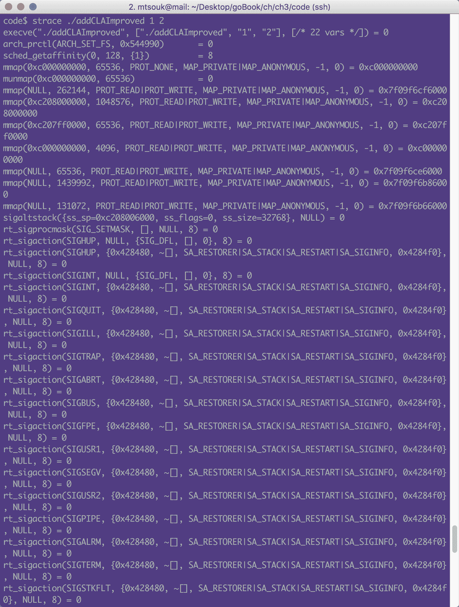
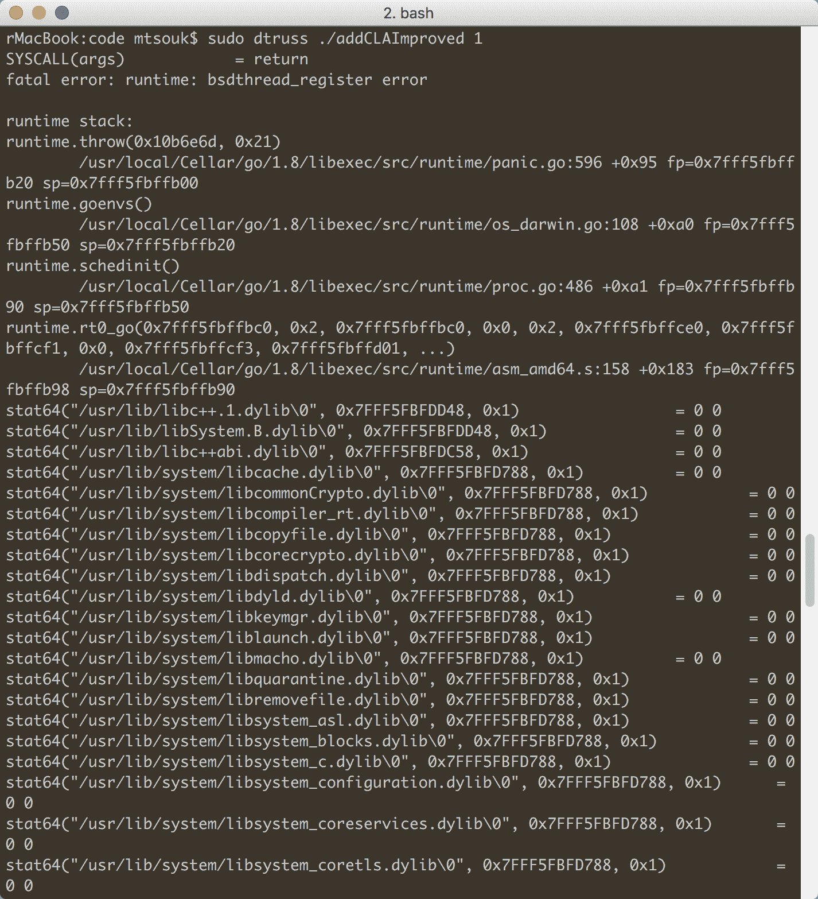

# 高级围棋功能

在上一章中，您学习了如何编译 Go 代码，如何从用户处获取输入并在屏幕上打印输出，如何创建自己的 Go 函数，Go 支持的数据结构，以及如何处理命令行参数。

本章将讨论许多有趣的事情，因此您最好为许多有趣和实用的 Go 代码做好准备，这些代码将帮助您执行许多不同但真正重要的任务，从错误处理开始，到如何避免一些常见的 Go 错误结束。如果你熟悉围棋，你可以跳过你已经知道的，但请不要跳过建议的练习。

因此，本章将介绍一些高级围棋功能，包括：

*   错误处理
*   错误记录
*   模式匹配与正则表达式
*   反射
*   如何使用`strace(1)`和`dtrace(1)`工具观看 Go 可执行文件的系统调用
*   如何检测无法访问的 Go 代码
*   如何避免各种常见的围棋错误

# Go 中的错误处理

错误总是会发生，因此捕获和处理错误是我们的工作，特别是在编写处理敏感系统信息和文件的代码时。好消息是 Go 有一种称为`error`的特殊数据类型，有助于表示错误状态；如果`error`变量有`nil`值，则不存在错误情况。

正如您在上一章开发的`addCLA.go`程序中所看到的，您可以忽略大多数 Go 函数使用`_`字符返回的`error`变量：

```go
temp, _ := strconv.Atoi(arguments[i]) 
```

但是，这不被视为良好做法，应该避免，尤其是在系统软件和其他类型的关键软件（如服务器进程）上。

正如您将在[第 6 章](06.html)中看到的，*文件输入和输出*，即使是**文件结尾**（**EOF**）也是一种错误类型，当没有任何文件可读取时返回。由于`EOF`是在`io`包中定义的，您可以如下处理：

```go
if err == io.EOF {

    // Do something 
} 
```

然而，要学习的最重要的任务是如何开发返回`error`变量的函数以及如何处理它们，下面将对此进行解释。

# 函数可以返回错误变量

Go 函数可以返回`error`变量，这意味着可以在函数内部、函数外部或函数内部和外部处理错误条件；后一种情况并不经常发生。因此，本小节将开发一个返回错误消息的函数。相关 Go 代码可在`funErr.go`中找到，并将分三部分介绍。

第一部分包含以下 Go 代码：

```go
package main 

import ( 
   "errors" 
   "fmt" 
   "log" 
) 

func division(x, y int) (int, error, error) { 
   if y == 0 { 
         return 0, nil, errors.New("Cannot divide by zero!") 
   } 
   if x%y != 0 { 
         remainder := errors.New("There is a remainder!") 
         return x / y, remainder, nil 
   } else { 
         return x / y, nil, nil 
   } 

} 
```

除了预期的前导码之外，前面的代码定义了一个名为`division()`的新函数，该函数返回一个整数和两个`error`变量。如果你记得在你的数学课上，当你把两个整数除法时，除法运算并不总是完美的，这意味着你可能得到一个不是零的余数。您在`funErr.go`中看到的`errors`Go 包中的`errors.New()`函数使用提供的字符串作为错误消息，创建了一个新的`error`变量。

`funErr.go`的第二部分有以下 Go 代码：

```go
func main() { 
   result, rem, err := division(2, 2) 
   if err != nil { 
         log.Fatal(err) 
   } else { 
         fmt.Println("The result is", result) 
   } 

   if rem != nil { 
         fmt.Println(rem) 
   } 
```

比较`error`变量和`nil`是一种非常常见的 Go 实践，以快速确定是否存在错误条件。

`funErr.go`的最后一部分如下：

```go
   result, rem, err = division(12, 5) 
   if err != nil { 
         log.Fatal(err) 
   } else { 
         fmt.Println("The result is", result) 
   } 

   if rem != nil { 
         fmt.Println(rem) 
   } 

   result, rem, err = division(2, 0) 
   if err != nil { 
         log.Fatal(err) 
   } else { 
         fmt.Println("The result is", result) 
   } 

   if rem != nil { 
         fmt.Println(rem) 
   } 
} 
```

这一部分展示了两种错误的情况。第一个是有余数的整数除法，而第二个是无效除法，因为不能将数字除以零。正如名称`log.Fatal()`所暗示的，这个日志记录函数应该只用于关键错误，因为当调用它时，它会自动终止您的程序。但是，正如您将在下一小节中看到的，还有其他更温和的方法来记录错误消息。

执行`funErr.go`生成下一个输出：

```go
$ go run funErr.go
The result is 1
The result is 2
There is a remainder!
2017/03/07 07:39:19 Cannot divide by zero!
exit status 1
```

最后一行由`log.Fatal()`功能自动生成，就在终止程序之前。重要的是要理解，调用`log.Fatal()`后的任何 Go 代码都不会执行。

# 关于错误日志记录

Go 提供的功能可以帮助您以各种方式记录错误消息。您已经在`funErr.go`中看到了`log.Fatal()`，这是一种处理简单错误的残忍方式。简单地说，在代码中使用`log.Fatal()`应该有很好的理由。一般来说，应该使用`log.Fatal()`而不是`os.Exit()`函数，因为它允许您仅使用一个函数调用打印错误消息并退出程序。

Go 在`log`标准包中提供了额外的错误记录功能，根据具体情况表现得更加温和，包括`log.Printf()`、`log.Print()`、`log.Println()`、`log.Fatalf()`、`log.Fatalln()`、`log.Panic()`、`log.Panicln()`和`log.Panicf()`。请注意，日志功能可以方便地用于调试目的，因此不要低估其功能。

`logging.go`程序使用以下 Go 代码说明了上述两种记录功能：

```go
package main 

import ( 
   "log" 
) 

func main() { 
   x := 1 
   log.Printf("log.Print() function: %d", x) 
   x = x + 1 
   log.Printf("log.Print() function: %d", x) 
   x = x + 1 
   log.Panicf("log.Panicf() function: %d", x) 
   x = x + 1 
   log.Printf("log.Print() function: %d", x) 
} 
```

如您所见，`logging.go`不需要`fmt`包，因为它有自己的输出打印功能。执行`logging.go`将产生以下输出：

```go
$ go run logging.go
2017/03/10 16:51:56 log.Print() function: 1
2017/03/10 16:51:56 log.Print() function: 2
2017/03/10 16:51:56 log.Panicf() function: 3
panic: log.Panicf() function: 3

goroutine 1 [running]:
log.Panicf(0x10b78d0, 0x19, 0xc42003df48, 0x1, 0x1)
      /usr/local/Cellar/go/1.8/libexec/src/log/log.go:329 +0xda
main.main()
      /Users/mtsouk/ch3/code/logging.go:14 +0x1af
exit status 2
```

虽然`log.Printf()`功能的工作方式与`fmt.Printf()`相同，但它会自动打印日志消息的打印日期和时间，就像`funErr.go`中的`log.Fatal()`功能一样。此外，`log.Panicf()`功能的工作方式与`log.Fatal()`类似——它们都终止当前程序。但是，`log.Panicf()`会打印一些额外的信息，这些信息对于调试非常有用。

Go 还提供了`log/syslog`包，它是 Unix 机器上运行的系统日志服务的简单接口。[第 7 章](07.html)*处理系统文件*将详细介绍`log/syslog`包。

# 重新访问 addCLA.go 程序

本小节将介绍我们在上一章中开发的`addCLA.go`程序的改进版本，使其能够处理任何类型的用户输入。新程序将被称为`addCLAImproved.go`，但您将只看到`addCLAImproved.go`和`addCLA.go`之间使用`diff(1)`命令行实用程序的区别，而不是显示其完整的 Go 代码：

```go
$ diff addCLAImproved.go addCLA.go
13,18c13,14
<           temp, err := strconv.Atoi(arguments[i])
<           if err == nil {
<                 sum = sum + temp
<           } else {
<                 fmt.Println("Ignoring", arguments[i])
<           }
---
>           temp, _ := strconv.Atoi(arguments[i])
>           sum = sum + temp
```

这个输出基本上告诉我们的是，可以在`addCLA.go`中找到并以`>`字符开头的最后两行代码被替换为以`addCLAImproved.go`中的`<`字符开头的代码行。两个文件的剩余代码完全相同。

`diff(1)`实用程序逐行比较文本文件，是发现同一文件不同版本之间代码差异的便捷方法。

执行`addCLAImproved.go`将生成以下类型的输出：

```go
$ go run addCLAImproved.go
Sum: 0
$ go run addCLAImproved.go 1 2 -3
Sum: 0
$ go run addCLAImproved.go 1 a 2 b 3.2 @
Ignoring a
Ignoring b
Ignoring 3.2
Ignoring @
Sum: 3
```

因此，新的和改进的版本工作正常，运行可靠，并允许我们区分有效和无效输入。

# 模式匹配与正则表达式

**模式匹配**是一种基于**正则表达式**的特定搜索模式在字符串中搜索一组字符的技术，在 Go 中起着关键作用。如果模式匹配成功，它允许您从字符串中提取所需的数据，或者替换或删除它。**语法**是正式语言中字符串的一组产生式规则。产生式规则描述了如何根据语言的语法从语言的字母表中创建有效的字符串。语法不描述字符串的含义，也不描述在任何上下文中可以用它做什么，只描述它的形式。重要的是要认识到语法是正则表达式的核心，因为没有语法，就无法定义或使用正则表达式。

正则表达式和模式匹配并不是万能的，所以您不应该尝试使用正则表达式解决所有问题，因为它们不适合您可能遇到的每种问题。此外，它们可能会给您的软件带来不必要的复杂性。

负责 Go 模式匹配功能的 Go 包称为`regexp`，您可以在`regExp.go`中看到。`regExp.go`的代码将分为四个部分。

第一部分是预期的序言：

```go
package main 

import ( 
   "fmt" 
   "regexp" 
) 
```

第二部分内容如下：

```go
func main() { 
match, _ := regexp.MatchString("Mihalis", "Mihalis Tsoukalos") 
   fmt.Println(match) 
   match, _ = regexp.MatchString("Tsoukalos", "Mihalis tsoukalos") 
   fmt.Println(match) 
```

对`regexp.MatchString()`的两个调用都试图在给定字符串（第二个参数）中找到一个静态字符串（第一个参数）。

第三部分包含一行重要的 Go 代码：

```go
   parse, err := regexp.Compile("[Mm]ihalis") 
```

`regexp.Compile()`函数读取提供的正则表达式并尝试解析它。如果正则表达式的解析成功，那么`regexp.Compile()`返回一个`regexp.Regexp`变量类型的值，您可以在以后使用该值。`regexp.Compile()`函数中的`[Mm]`表达式表示您要查找的内容可以以大写`M`或小写`m`开头。`[`和`]`都是不属于正则表达式的特殊字符。因此，提供的语法很简单，只与单词`Mihalis`和`mihalis`匹配。

最后一部分使用存储在`parse`变量中的上一个正则表达式：

```go
   if err != nil { 
         fmt.Printf("Error compiling RE: %s\n", err) 
   } else { 
         fmt.Println(parse.MatchString("Mihalis Tsoukalos")) 
         fmt.Println(parse.MatchString("mihalis Tsoukalos")) 
         fmt.Println(parse.MatchString("M ihalis Tsoukalos")) 
         fmt.Println(parse.ReplaceAllString("mihalis Mihalis", "MIHALIS")) 
   } 
} 
```

运行`regExp.go`生成下一个输出：

```go
$ go run regExp.go
true
false
true
true
false
MIHALIS MIHALIS
```

因此，第一个对`regexp.MatchString()`的调用是匹配的，但第二个不是，因为模式匹配区分大小写，并且`Tsoukalos`与`tsoukalos`不匹配。最后的`parse.ReplaceAllString()`函数搜索作为输入的字符串（`"mihalis Mihalis"`，并用作为第二个参数的字符串（`"MIHALIS"`替换每个匹配项）。

本节的其余部分将介绍使用静态文本的各种示例，因为您还不知道如何读取文本文件。但是，由于静态文本将存储在一个数组中，并逐行处理，因此可以轻松修改呈现的代码，以支持从外部文本文件获取输入。

# 打印行中给定列中的所有值

这是一种非常常见的情况，因为您通常需要从结构化文本文件的给定列中获取所有数据，以便在以后对其进行分析。`readColumn.go`的代码打印第三列中的值，将分两部分显示。

第一部分内容如下：

```go
package main 

import ( 
   "fmt" 
   "strings" 
) 

func main() { 
   var s [3]string 
   s[0] = "1 2 3" 
   s[1] = "11 12 13 14 15 16" 
   s[2] = "-1 2 -3 -4 -5 6" 
```

这里，您导入所需的 Go 包，并使用一个包含三个元素的数组定义一个包含三行的字符串。

第二部分包含以下 Go 代码：

```go
   column := 2 

   for i := 0; i < len(s); i++ { 
         data := strings.Fields(s[i]) 
         if len(data) >= column { 
               fmt.Println((data[column-1])) 
         } 
   } 
} 
```

首先，定义您感兴趣的列。然后，开始迭代存储在数组中的字符串。这类似于逐行读取文本文件。`for`循环中的 Go 代码分割输入行的字段，将它们存储在`data`数组中，验证所需列中的值是否存在，并将其打印在屏幕上。所有的艰苦工作都是由方便的`strings.Fields()`函数完成的，该函数根据`unicode.IsSpace()`中定义的空白字符分割字符串，并返回一段字符串。尽管`readColumn.go`没有使用`regexp.Compile()`函数，但其使用`strings.Fields()`实现的逻辑仍然基于正则表达式的原理。

需要记住的一件重要事情是，永远不要相信自己的数据。简单地说，始终验证您希望获取的数据是否存在。

执行`readColumn.go`将生成以下类型的输出：

```go
$ go run readColumn.go
2
12
2
```

[第 6 章](06.html)*文件输入和输出*将显示`readColumn.go`的一个改进版本，如果您想修改所示的其余示例，可以将其作为起点。

# 创建摘要

在本节中，我们将开发一个程序，用多行添加给定文本列的所有值。为了让事情变得更有趣，列号将作为程序中的一个参数给出。本小节的程序与上一小节的`readColumn.go`之间的主要区别在于，您需要将每个值转换为整数。

将要开发的程序名称为`summary.go`，可分为三部分。

第一部分是：

```go
package main 

import ( 
   "fmt" 
   "os" 
   "strconv" 
   "strings" 
) 

func main() { 
   var s [3]string 
   s[0] = "1 b 3" 
   s[1] = "11 a 1 14 1 1" 
   s[2] = "-1 2 -3 -4 -5" 
```

第二部分具有以下 Go 代码：

```go
   arguments := os.Args 
   column, err := strconv.Atoi(arguments[1]) 
   if err != nil { 
         fmt.Println("Error reading argument") 
         os.Exit(-1) 
   } 
   if column == 0 { 
         fmt.Println("Invalid column") 
         os.Exit(1) 
   } 
```

前面的代码读取您感兴趣的列的索引。如果您想使`summary.go`更好，可以检查`column`变量中的负值，并打印相应的错误消息。

`summary.go`的最后一部分如下：

```go
   sum := 0 
   for i := 0; i < len(s); i++ { 
         data := strings.Fields(s[i]) 
         if len(data) >= column { 
               temp, err := strconv.Atoi(data[column-1]) 
               if err == nil { 
                     sum = sum + temp 
               } else { 
                     fmt.Printf("Invalid argument: %s\n", data[column-1]) 
               } 
         } else { 
               fmt.Println("Invalid column!") 
         } 
   } 
   fmt.Printf("Sum: %d\n", sum) 
} 
```

如您所见，`summary.go`中的大部分 Go 代码都是关于处理异常和潜在错误的。`summary.go`的核心功能在几行 Go 代码中实现。

执行`summary.go`将给您以下输出：

```go
$ go run summary.go 0
Invalid column
exit status 1
$ go run summary.go 2
Invalid argument: b
Invalid argument: a
Sum: 2
$ go run summary.go 1
Sum: 11
```

# 查找出现的次数

一个非常常见的编程问题是找出 IP 地址出现在日志文件中的次数。因此，本小节中的示例将向您展示如何使用方便的地图结构来实现这一点。`occurrences.go`程序将分三部分介绍。

第一部分内容如下：

```go
package main 

import ( 
   "fmt" 
   "strings" 
) 

func main() { 

   var s [3]string 
   s[0] = "1 b 3 1 a a b" 
   s[1] = "11 a 1 1 1 1 a a" 
   s[2] = "-1 b 1 -4 a 1" 
```

第二部分内容如下：

```go
   counts := make(map[string]int) 

   for i := 0; i < len(s); i++ { 
         data := strings.Fields(s[i]) 
         for _, word := range data { 
               _, ok := counts[word] 
               if ok { 
                     counts[word] = counts[word] + 1 
               } else { 
                     counts[word] = 1 
               } 
         } 
   } 
```

在这里，我们使用上一章中的知识创建一个名为`counts`的映射，并使用两个`for`循环使用所需的数据填充它。

最后一部分非常小，因为它只打印了`counts`地图的内容：

```go
   for key, _ := range counts {

         fmt.Printf("%s -> %d \n", key, counts[key]) 
   } 
} 
```

执行`occurrences.go`并使用`sort(1)`命令行实用程序对`occurrences.go`的输出进行排序将生成以下类型的输出：

```go
$ go run occurrences.go | sort -n -r -t\  -k3,3
1 -> 8
a -> 6
b -> 3
3 -> 1
11 -> 1
-4 -> 1
-1 -> 1
```

如您所见，传统的 Unix 工具仍然很有用。

# 查找并替换

本小节中的示例将在提供的文本中搜索给定字符串的两个变体，并将其替换为另一个字符串。该程序将被命名为`findReplace.go`，并实际使用 Go 正则表达式。在本例中，使用`regexp.Compile()`函数的主要原因是它大大简化了事情，并且只允许您访问文本一次。

`findReplace.go`程序的第一部分如下：

```go
package main 

import ( 
   "fmt" 
   "os" 
   "regexp" 
) 
```

下一部分内容如下：

```go
func main() { 

   var s [3]string 
   s[0] = "1 b 3" 
   s[1] = "11 a B 14 1 1" 
   s[2] = "b 2 -3 B -5" 

   parse, err := regexp.Compile("[bB]")

   if err != nil { 
         fmt.Printf("Error compiling RE: %s\n", err) 
         os.Exit(-1) 
   } 
```

前面的 Go 代码将查找每个出现的大写字母`B`或小写字母`b`（`[bB]`）。请注意，还有一个类似于`regexp.Compile()`的`regexp.MustCompile()`。但是，`regexp.MustCompile()`不返回`error`变量；如果给定的表达式是错误的，并且无法解析，它就会惊慌失措。因此，`regexp.Compile()`是一个更好的选择。

最后一部分内容如下：

```go
   for i := 0; i < len(s); i++ { 
         temp := parse.ReplaceAllString(s[i], "C") 
         fmt.Println(temp) 
   } 
} 
```

在这里，使用`parse.ReplaceAllString()`将每个匹配项替换为大写 C。

执行`findReplace.go`生成预期输出：

```go
$ go run findReplace.go
1 C 3
11 a C 14 1 1
C 2 -3 C -5
```

`awk(1)`和`sed(1)`命令行工具可以更轻松地完成前面的大部分任务，但`sed(1)`和`awk(1)`不是通用编程语言。

# 反射

反射是一种高级 Go 功能，允许您动态了解任意对象的类型及其结构信息。您应该记得，来自[第 2 章](02.html)的`dataStructures.go`程序*在 Go*中编写程序，使用反射来查找数据结构的字段以及每个字段的类型。所有这些都是在`reflect`Go 包和返回`Type`变量的`reflect.TypeOf()`函数的帮助下发生的。

反射在`reflection.go`Go 程序中进行了说明，该程序将分为四个部分。

第一个是 Go 程序的序言，代码如下：

```go
package main 

import ( 
   "fmt" 
   "reflect" 
) 
```

第二部分内容如下：

```go
func main() { 

   type t1 int 
   type t2 int 

   x1 := t1(1) 
   x2 := t2(1) 
   x3 := 1 
```

在这里，您创建了两个新类型，分别命名为`t1`和`t2`，它们都是`int`和三个变量，分别命名为`x1`、`x2`和`x3`。

第三部分具有以下 Go 代码：

```go
   st1 := reflect.ValueOf(&x1).Elem() 
   st2 := reflect.ValueOf(&x2).Elem() 
   st3 := reflect.ValueOf(&x3).Elem() 

   typeOfX1 := st1.Type() 
   typeOfX2 := st2.Type() 
   typeOfX3 := st3.Type() 

   fmt.Printf("X1 Type: %s\n", typeOfX1) 
   fmt.Printf("X2 Type: %s\n", typeOfX2) 
   fmt.Printf("X3 Type: %s\n", typeOfX3) 
```

在这里，您可以使用`reflect.ValueOf()`和`Type()`找到`x1`、`x2`和`x3`变量的类型。

`reflection.go`的最后一部分涉及一个`struct`变量：

```go
   type aStructure struct { 
         X    uint 
         Y    float64 
         Text string 
   } 

   x4 := aStructure{123, 3.14, "A Structure"} 
   st4 := reflect.ValueOf(&x4).Elem() 
   typeOfX4 := st4.Type() 

   fmt.Printf("X4 Type: %s\n", typeOfX4) 
   fmt.Printf("The fields of %s are:\n", typeOfX4) 

   for i := 0; i < st4.NumField(); i++ { 
         fmt.Printf("%d: Field name: %s ", i, typeOfX4.Field(i).Name) 
         fmt.Printf("Type: %s ", st4.Field(i).Type()) 
         fmt.Printf("and Value: %v\n", st4.Field(i).Interface()) 
   } 
} 
```

在围棋中存在着一些支配反射的法则，但是谈论它们超出了本书的范围。您应该记住的是，您的程序可以使用反射检查自己的结构，这是一种非常强大的功能。

执行`reflection.go`打印以下输出：

```go
$ go run reflection.go
X1 Type: main.t1
X2 Type: main.t2
X3 Type: int
X4 Type: main.aStructure
The fields of main.aStructure are:
0: Field name: X Type: uint and Value: 123
1: Field name: Y Type: float64 and Value: 3.14
2: Field name: Text Type: string and Value: A Structure
```

输出的前两行显示，GO 不考虑类型 Ty0 T0 和 Sout T1 To 相等，即使两个 Ty2 T2 和 Ty3 T3 都是 ALE T4E.Type 的别名。

旧习难改！

尽管 Go 试图成为一种安全的编程语言，但有时它被迫忘记安全性，允许程序员做他/她想做的任何事情。

# 从 Go 调用 C 代码

Go 允许您调用 C 代码，因为有时执行某些任务（如与硬件设备或数据库服务器通信）的唯一方法是使用 C。然而，如果您发现自己在同一项目中多次使用此功能，您可能需要重新考虑您的方法和编程语言的选择。

在 Go 中更多地讨论此功能超出了本书的范围。您应该记住的是，您很可能永远不需要从 Go 程序调用 C 代码。不过，如果您希望探索这一 Go 功能，您可以从访问[上的`cgo`工具文档开始 https://golang.org/cmd/cgo/](https://golang.org/cmd/cgo/) 以及查看[上的代码 https://github.com/golang/go/blob/master/misc/cgo/gmp/gmp.go](https://github.com/golang/go/blob/master/misc/cgo/gmp/gmp.go) 。

# 不安全代码

不安全代码是绕过 Go 类型安全和内存安全的 Go 代码，需要使用`unsafe`包。您很可能永远不需要在 Go 程序中使用不安全的代码，但如果出于某种奇怪的原因，您需要使用不安全的代码，则可能需要使用指针。

使用不安全代码对您的程序来说可能是危险的，因此只有在绝对必要时才使用它。如果你不能完全确定你需要它，那么就不要使用它。

本小节中的示例代码保存为`unsafe.go`，将分两部分介绍。

第一部分内容如下：

```go
package main 

import ( 
   "fmt" 
   "unsafe" 
) 

func main() { 
   var value int64 = 5

   var p1 = &value 
   var p2 = (*int32)(unsafe.Pointer(p1)) 
```

首先创建一个名为`value`的新`int64`变量。然后，创建一个指向它的指针，名为`p1`。接下来，创建另一个指向`p1`的指针。然而，指向`p1`的`p2`指针是指向`int32`整数的指针，尽管`p1`指向`int64`变量。尽管 Go 规则不允许这样做，`unsafe.Pointer()`功能使这成为可能。

第二部分内容如下：

```go
   fmt.Println("*p1: ", *p1) 
   fmt.Println("*p2: ", *p2) 
   *p1 = 312121321321213212 
   fmt.Println(value) 
   fmt.Println("*p2: ", *p2) 
   *p1 = 31212132 
   fmt.Println(value) 
   fmt.Println("*p2: ", *p2) 
} 
```

执行`unsafe.go`将创建以下输出：

```go
$ go run unsafe.go
*p1:  5
*p2:  5
312121321321213212
*p2:  606940444
31212132
*p2:  31212132
```

输出显示了不安全指针的危险程度。当`value`变量的值适合`int32`内存空间（`5`和`31212132`时，`p2`工作正常并显示正确的结果。但是，当`value`变量包含不适合`int32`内存空间的值（`312121321321213212`，则`p2`会显示错误结果（`606940444`，而不会向您发出警告或错误消息。

# 比较 Go 与其他编程语言

Go 并不完美，但其他编程语言也不完美。本节将简要讨论其他编程语言，并将它们与 Go 进行比较，以便更好地了解您的选择。因此，可与 Go 进行比较的编程语言列表包括：

*   **C**：C 是用于开发系统软件的最流行的编程语言，因为每个 Unix 操作系统的可移植部分都是用 C 编写的。但是，它有一些严重的缺点，包括 C 指针非常强大且快速，可能导致难以检测错误和内存泄漏。另外，C 不提供垃圾收集；当 C 语言被创建时，垃圾收集是一种奢侈品，它可以降低计算机的运行速度。然而，现在计算机的速度相当快，垃圾收集也不再让事情变慢了。此外，与其他系统编程语言相比，C 程序需要更多的代码来开发给定的任务。最后，C 是一种古老的编程语言，不支持现代编程范式，如面向对象编程和函数式编程。
*   正如前面提到的，我不再喜欢 C++了。如果你认为应该使用 C++，那么你可能需要考虑使用 C 来代替。然而，C++的优势在于，如果需要，C++可以被用作 C。然而，C 和 C++都不能很好地支持并发编程。
*   **Rust**：Rust 是一种新的系统编程语言，它试图避免不安全代码引起的令人不快的错误。目前，Rust 的语法变化太快，但这将在最近的特性中结束。如果由于某种原因你不喜欢去，你应该试试生锈。
*   **Swift**：目前 Swift 更适合为 macOS 系统开发系统软件。然而，我相信在不久的将来，Swift 将在 Linux 机器上更受欢迎，因此您应该密切关注它。
*   **Python**：Python 是一种脚本语言，这是它的主要缺点。这是因为通常情况下，您不想让所有人都可以使用系统软件的源代码。
*   **Perl**：关于 Python 的说法也可以是关于 Perl 的。然而，这两种编程语言都有过多的模块，这将使您的生活更轻松，代码更小。

如果你问我的意见，我认为 Go 是一种现代的、可移植的、成熟的、用于编写系统软件的安全编程语言。在寻找其他选择之前，你应该试着去做。然而，如果你是一个 Go 程序员，想尝试其他东西，我建议你选择 Rust 或 Swift。然而，如果您需要编写可靠的并发程序，Go 应该是您的首选。

如果你不能在 Go 和 Rust 之间做出选择，那就试试 C。学习系统编程的基础知识比你选择的编程语言更重要。

尽管存在缺点，但请记住，所有脚本编程语言都非常适合编写原型，它们的优点是允许您为软件创建图形界面。尽管如此，很少接受用脚本语言交付系统软件，除非有很好的理由这样做。

# 分析软件

有时程序会因未知原因而失败或性能不好，您希望在不必重写代码和添加大量调试语句的情况下找出原因。因此，本节将讨论`strace(1)`和`dtrace(1)`，这两个选项允许您了解在 Unix 机器上执行程序时幕后发生的情况。虽然这两个工具都可以使用`go run`命令，但如果您首先使用`go build`创建一个可执行文件并使用此文件，则会获得较少的无关输出。这主要是因为`go run`在实际运行 Go 代码之前生成临时文件，并且您希望调试实际程序，而不是用于构建程序的编译器。

请记住，尽管`dtrace(1)`比`strace(1)`功能更强大，并且有自己的编程语言，`strace(1)`在观察程序所做的系统调用方面更通用。

# 使用 strace（1）命令行实用程序

`strace(1)`命令行实用程序允许您跟踪系统调用和信号。由于`strace(1)`在 Mac 机器上不可用，本节将使用 Linux 机器来展示`strace(1)`。然而，正如您将在后面的文章中看到的，macOS 机器有`dtrace(1)`命令行实用程序，可以做更多的事情。

程序名称后的数字指其页面所属的手册部分。虽然大多数名称只能找到一次，这意味着不需要输入章节号，但也有一些名称可以位于多个章节中，因为它们有多种含义，例如`crontab(1)`和`crontab(5)`。因此，如果您试图检索这样的页面而没有明确说明章节号，您将在手册的章节中获得具有最小章节号的条目。

为了更好地理解`strace(1)`生成的输出，请参见下图，其中`strace(1)`用于检查`addCLAImproved.go`的可执行文件：



在 Linux 机器上使用 strace（1）命令

`strace(1)`输出中真正有趣的部分是下面的一行，在上图中看不到：

```go
$ strace ./addCLAImproved 1 2 2>&1 | grep write
write(1, "Sum: 3\n", 7Sum: 3
```

我们使用`grep(1)`命令行实用程序提取包含我们感兴趣的 C 系统调用的行，在本例中是`write(2)`。这是因为我们已经知道`write(2)`用于打印输出。因此，您了解到，在本例中，一个`write(2)`C 系统调用用于在屏幕上打印所有输出；它的第一个参数是文件描述符，第二个参数是要打印的文本。

请注意，您可能希望将`strace(1)`与`-f`选项一起使用，以便同时跟踪在程序执行期间可能创建的任何子进程。

请记住，`write(2)`还有两种变体，分别命名为`pwrite(2)`和`writev(2)`，它们提供与`write(2)`相同的核心功能，但方式略有不同。

上一个命令的以下变体需要对`write(2)`进行更多调用，因为它会生成更多输出：

```go
$ strace ./addCLAImproved 1 a b 2>&1 | grep write
write(1, "Ignoring a\n", 11Ignoring a
write(1, "Ignoring b\n", 11Ignoring b
write(1, "Sum: 1\n", 7Sum: 1
```

Unix 使用文件描述符（正整数值）作为访问其所有文件的内部表示形式。默认情况下，所有 Unix 系统都支持三个特殊的标准文件名：`/dev/stdin`、`/dev/stdout`和`/dev/stderr`。还可以分别使用文件描述符 0、1 和 2 访问它们。这三个文件描述符也分别称为标准输入、标准输出和标准错误。此外，文件描述符 0 在 Mac 机器上可以作为`/dev/fd/0`访问，在 Debian Linux 机器上可以作为`/dev/pts/0`访问，因为 Unix 中的所有内容都是文件。

因此，需要将`2>&1`放在命令末尾的原因是将所有输出从标准错误（文件描述符 2）重定向到标准输出（文件描述符 1），以便能够使用`grep(1)`命令进行搜索，该命令只搜索标准输出。请注意，`grep(1)`有许多变体，包括`zegrep(1)`、`fgrep(1)`和`fgrep(1)`，它们在处理大型或大型文本文件时可能工作得更快。

这里您可以看到，即使您使用 Go 编写，生成的可执行文件也使用 C 系统调用和函数，因为除了使用机器语言之外，C 是与 Unix 内核通信的唯一方式。

# DTrace 实用程序

尽管在 FreeBSD 上工作的调试实用程序（如`strace(1)`和`truss(1)`）可以跟踪进程生成的系统调用，但它们可能很慢，因此不适合在繁忙的 Unix 系统上解决性能问题。另一个名为`dtrace(1)`的工具使用**DTrace**功能，允许您在系统范围内查看幕后发生的情况，而无需修改或重新编译任何内容。它还允许您在生产系统上工作，动态地观察正在运行的程序或服务器进程，而不会带来很大的开销。

本小节将使用`dtruss(1)`命令行实用程序，它只是一个`dtrace(1)`脚本，显示进程的系统调用。在 macOS 机器上检查`addCLAImproved.go`可执行文件时`dtruss(1)`生成的输出与您在以下屏幕截图中看到的类似：



在 macOS 机器上使用 dtruss（1）命令

输出的以下部分再次验证，在一天结束时，Unix 机器上的所有内容都被转换为 C 系统调用和函数，因为这是与 Unix 内核通信的唯一方式。您可以按如下方式显示对`write(2)`系统调用的所有调用：

```go
$ sudo dtruss -c ./addCLAImproved 2000 2>&1 | grep write
```

但是，这一次您将获得大量输出，因为 macOS 可执行文件使用`write(2)`多次而不是一次来打印相同的输出。

开始意识到并非所有 Unix 系统都以相同的方式工作，尽管它们有许多相似之处，这是了不起的。但这也意味着您不应该对 Unix 系统在幕后的工作方式做出任何假设。

真正有趣的是以下命令输出的最后一部分：

```go
$ sudo dtruss -c ./addCLAImproved 2000
CALL                                        COUNT
__pthread_sigmask                               1
exit                                            1
getpid                                          1
ioctl                                           1
issetugid                                       1
read                                            1
thread_selfid                                   1
ulock_wake                                      1
bsdthread_register                              2
close                                           2
csops                                           2
open                                            2
select                                          2
sysctl                                          3
mmap                                            7
mprotect                                        8
stat64                                         41
write                                          83
```

您获得此输出的原因是`-c`选项告诉`dtruss(1)`统计所有系统调用并打印它们的摘要，在本例中显示`write(2)`已被调用 83 次，而`stat64(2)`已被调用 41 次。

`dtrace(1)`实用程序比`strace(1)`强大得多，有自己的编程语言，但更难学习。此外，尽管有一个 Linux 版本的`dtrace(1)`，`strace(1)`在 Linux 系统上更为成熟，并且以更简单的方式跟踪系统调用。

您可以阅读 Brendan Gregg 和 Jim Mauro 撰写的《Oracle Solaris、Mac OS X 和 FreeBSD 中的动态跟踪》中的《T1:DTrace:Dynamic Tracing》，并通过访问《T3》，了解更多关于`dtrace(1)`实用程序的信息 http://dtrace.org/ 。

# 禁用 macOS 上的系统完整性保护

第一次尝试在 Mac OS X 机器上运行`dtrace(1)`和`dtruss(1)`时，您很有可能遇到问题，并收到以下错误消息：

```go
$ sudo dtruss ./addCLAImproved 1 2 2>&1 | grep -i write
dtrace: error on enabled probe ID 2132 (ID 156: syscall::write:return): invalid kernel access in action #12 at DIF offset 92
```

在这种情况下，您可能需要禁用 DTrace 限制，但仍需保持系统完整性保护在所有其他方面处于活动状态。您可以访问[了解更多关于系统完整性保护的信息 https://support.apple.com/en-us/HT204899](https://support.apple.com/en-us/HT204899) 。

# 不可达代码

无法访问的代码是永远无法执行的代码，是一种逻辑错误。由于 Go 编译器本身无法捕获此类逻辑错误，因此需要使用`go tool vet`命令进行帮助。

您不应该将无法访问的代码与从未被有意执行的代码混淆，例如不需要的函数代码，因此在程序中不会被调用。

本节示例代码另存为`cannotReach.go`，可分为两部分。

第一部分具有以下 Go 代码：

```go
package main 

import ( 
   "fmt" 
) 

func x() int {

   return -1 
   fmt.Println("Exiting x()") 
   return -1 
} 

func y() int { 
   return -1 
   fmt.Println("Exiting y()") 
   return -1 
} 
```

第二部分内容如下：

```go
func main() { 
   fmt.Println(x()) 
   fmt.Println("Exiting program...") 
} 
```

如您所见，无法访问的代码在第一部分中。`x()`和`y()`函数都有无法访问的代码，因为它们的`return`语句放在了错误的位置。但是，我们还没有完成，因为我们必须让`go tool vet`工具发现无法访问的代码。该过程很简单，包括执行以下命令：

```go
$ go tool vet cannotReach.go
cannotReach.go:9: unreachable code
cannotReach.go:14: unreachable code

```

此外，您可以看到，`go tool vet`检测到无法访问的代码，即使周围的函数根本不执行，就像`y()`一样。

# 避免常见的围棋错误

本节将简要介绍一些常见的 Go 错误，以便您在程序中避免这些错误：

*   如果 Go 函数中有错误，请记录或返回它；除非你有很好的理由这样做，否则不要同时做这两件事。
*   Go 接口定义行为，而不是数据和数据结构。
*   使用`io.Reader`和`io.Writer`接口，因为它们使代码更具可扩展性。
*   确保仅在需要时将指向变量的指针传递给函数。其余时间，只需传递变量的值。
*   错误变量不是字符串；它们是`error`值。
*   如果你害怕犯错误，你很可能最终什么都没做。所以，尽可能多地进行实验。

以下是适用于每种编程语言的一般建议：

*   在小型自主 Go 程序中测试您的 Go 代码和函数，以确保它们按照您认为应该的方式运行
*   如果您并不真正了解 Go 功能，请在首次使用它之前对其进行测试，尤其是在开发系统实用程序时
*   不要在生产机器上测试系统软件
*   在生产机器上部署系统软件时，请在生产机器不忙时执行，并确保有备份计划

# 练习

1.  查找并访问`log`包的文档页面。
2.  使用`strace(1)`检查上一章中的`hw.go`。
3.  如果您在 Mac 上，请尝试使用`dtruss(1)`检查`hw.go`可执行文件。
4.  编写一个从用户处获取输入的程序，并使用`strace(1)`或`dtruss(1)`检查其可执行文件。

5.  访问 Rust 网站[https://www.rust-lang.org/](https://www.rust-lang.org/) 。
6.  访问 Swift 网站[https://swift.org/](https://swift.org/) 。
7.  访问[处的`io`包文件页 https://golang.org/pkg/io/](https://golang.org/pkg/io/) 。
8.  自己使用`diff(1)`命令行实用程序，以了解如何更好地解释其输出。
9.  访问并阅读`write(2)`主页。
10.  访问`grep(1)`主页面。
11.  通过检查自己的结构，自己进行反思。
12.  编写一个改进版的`occurrences.go`，只显示高于已知数值阈值的频率，该阈值将作为命令行参数给出。

# 总结

本章向您介绍了一些高级 Go 功能，包括错误处理、模式匹配和正则表达式、反射和不安全代码。此外，它还谈到了`strace(1)`和`dtrace(1)`工具。

下一章将介绍许多有趣的内容，包括最新 Go 版本（1.8）中提供的新`sort.slice()`Go 函数的使用，以及大 O 表示法、排序算法、Go 包和垃圾收集。