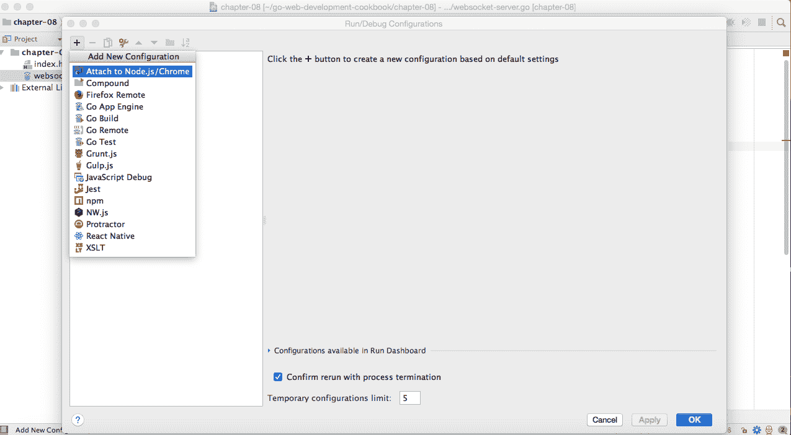
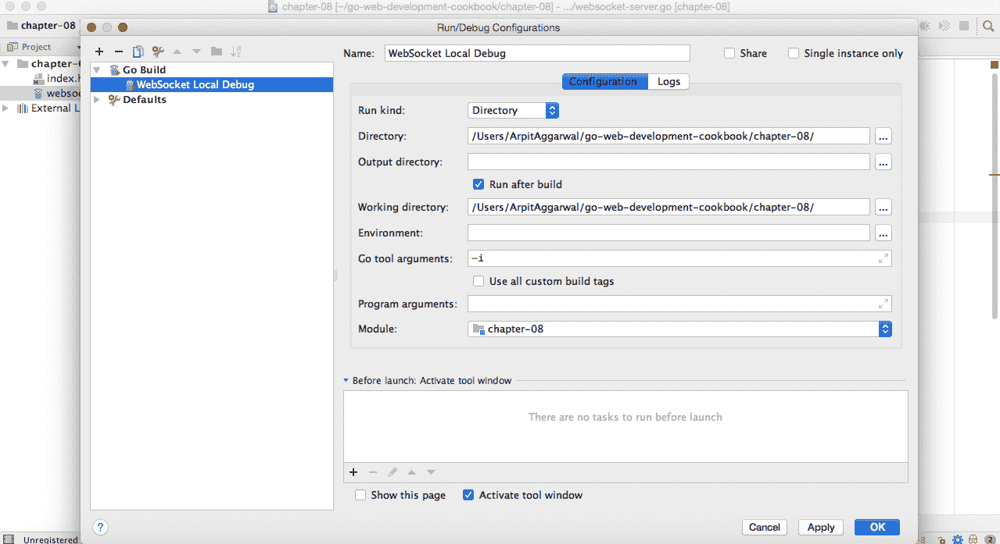
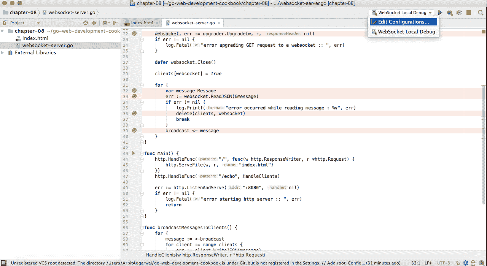
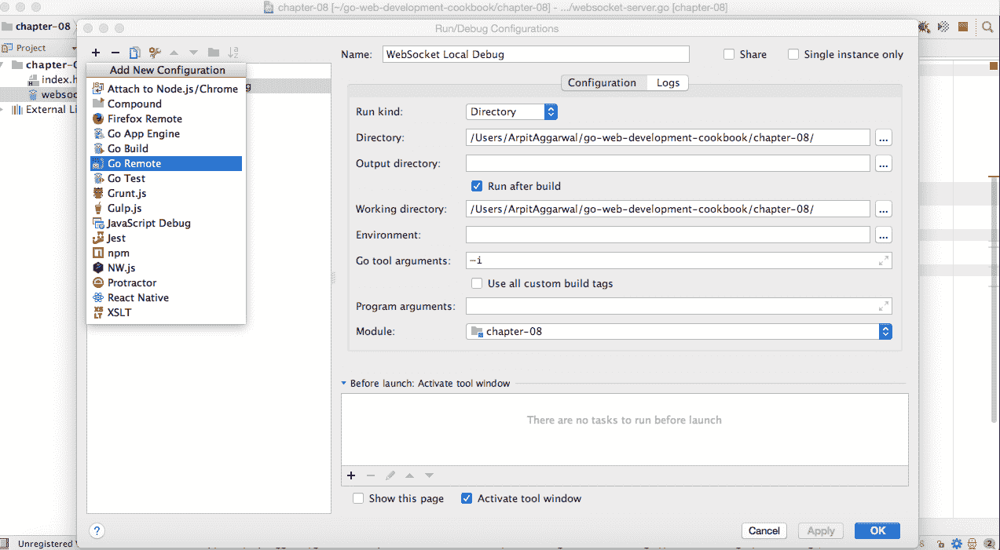
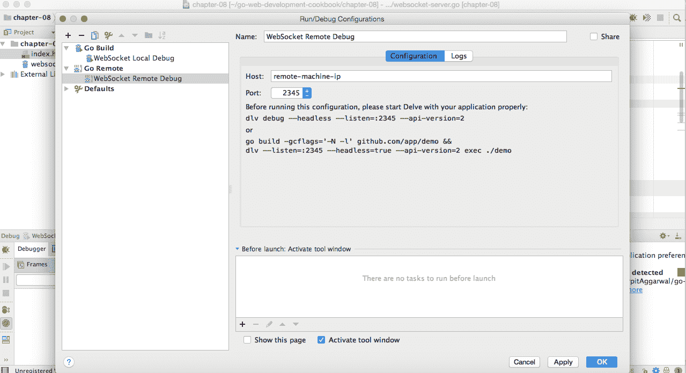

# 在 Go 中使用 WebSocket

在本章中，我们将介绍以下配方：

*   创建第一个 WebSocket 服务器
*   创建第一个 WebSocket 客户端
*   调试第一个本地 WebSocket 服务器
*   调试第一个远程 WebSocket 服务器
*   单元测试您的第一个 WebSocket 服务器

# 介绍

WebSocket 在服务器和客户端之间提供了双向、单套接字、全双工连接，使得实时通信比其他方式（如长轮询和服务器发送事件）更高效。

有了 WebSocket，客户端和服务器可以独立对话，在初次握手后，双方可以同时发送和接收信息，重用客户端到服务器和服务器到客户端的相同连接，最终大大减少了延迟和服务器负载，允许 web 应用程序以最有效的方式执行现代任务。大多数主流浏览器都支持 WebSocket 协议，包括 Google Chrome、Microsoft Edge、Internet Explorer、Firefox、Safari 和 Opera。因此不存在兼容性问题。

在本章中，我们将学习如何创建 WebSocket 服务器和客户端，编写单元测试并调试本地或远程运行的服务器。

# 创建第一个 WebSocket 服务器

在本食谱中，我们将学习如何编写 WebSocket 服务器，这是一个 TCP 应用程序，监听端口`8080`，允许连接的客户端相互发送消息。

# 怎么做…

1.  使用`go get`命令安装`github.com/gorilla/websocket`包，如下所示：

```go
$ go get github.com/gorilla/websocket
```

2.  创建`websocket-server.go`将 HTTP 请求升级到 WebSocket，从客户端读取 JSON 消息，并将其广播到所有连接的客户端，如下所示：

```go
package main 
import 
(
  "log"
  "net/http"
  "github.com/gorilla/websocket"
)
var clients = make(map[*websocket.Conn]bool)
var broadcast = make(chan Message) 
var upgrader = websocket.Upgrader{}
type Message struct 
{
  Message string `json:"message"`
}
func HandleClients(w http.ResponseWriter, r *http.Request) 
{
  go broadcastMessagesToClients()
  websocket, err := upgrader.Upgrade(w, r, nil)
  if err != nil 
  {
    log.Fatal("error upgrading GET request to a 
    websocket :: ", err)
  }
  defer websocket.Close()
  clients[websocket] = true
  for 
  {
    var message Message
    err := websocket.ReadJSON(&message)
    if err != nil 
    {
      log.Printf("error occurred while reading 
      message : %v", err)
      delete(clients, websocket)
      break
    }
    broadcast <- message
  }
}
func main() 
{
  http.HandleFunc
  (
    "/", func(w http.ResponseWriter, 
    r *http.Request) 
    {
      http.ServeFile(w, r, "index.html")
    }
  )
  http.HandleFunc("/echo", HandleClients)
  err := http.ListenAndServe(":8080", nil)
  if err != nil 
  {
    log.Fatal("error starting http server :: ", err)
    return
  }
}
func broadcastMessagesToClients() 
{
  for 
  {
    message := <-broadcast
    for client := range clients 
    {
      err := client.WriteJSON(message)
      if err != nil 
      {
        log.Printf("error occurred while writing 
        message to client: %v", err)
        client.Close()
        delete(clients, client)
      }
    }
  }
}
```

3.  使用以下命令运行程序：

```go
$ go run websocket-server.go
```

# 它是如何工作的…

一旦我们运行该程序，WebSocket 服务器将在端口`8080`上开始本地侦听

让我们了解一下我们编写的程序：

1.  我们使用了`import ("log" "net/http" "github.com/gorilla/websocket")`，这是一个预处理器命令，告诉 Go 编译器包含`log`、`net/http`和`github.com/gorilla/websocket`包中的所有文件。
2.  使用`var clients = make(map[*websocket.Conn]bool)`，我们创建了一个映射，表示连接到 WebSocket 服务器的客户端，其中 KeyType 作为 WebSocket 连接对象，ValueType 作为布尔值。
3.  使用`var broadcast = make(chan Message)`，我们创建了一个通道，在该通道中写入所有接收到的消息。
4.  接下来，我们定义了一个`HandleClients`处理程序，它在接收到`HTTP GET`请求后，将其升级到`WebSocket`，向套接字服务器注册客户端，读取请求的 JSON 消息，并将其写入广播频道。
5.  然后，我们定义了一个 Go 函数`broadcastMessagesToClients`，它获取写入广播频道的消息，并将其发送给当前连接到 WebSocket 服务器的每个客户端。

# 创建第一个 WebSocket 客户端

在此配方中，我们将创建一个简单的客户端来启动 WebSocket 握手过程。客户端将向 WebSocket 服务器发送一个标准的`HTTP GET`请求，服务器通过响应中的升级头对其进行升级。

# 怎么做…

1.  创建`index.html`，我们将在页面加载时打开与非安全 WebSocket 服务器的连接，如下所示：

```go
<html>
  <title>WebSocket Server</title>
  <input id="input" type="text" />
  <button onclick="send()">Send</button>
  <pre id="output"></pre>
  <script>
    var input = document.getElementById("input");
    var output = document.getElementById("output");
    var socket = new WebSocket("ws://" + window.
    location.host + "/echo");
    socket.onopen = function () 
    {
      output.innerHTML += "Status: Connected\n";
    };
    socket.onmessage = function (e) 
    {
      output.innerHTML += "Message from Server: " + 
      e.data + "\n";
    };
    function send() 
    {
      socket.send
      (
        JSON.stringify
        (
          {
            message: input.value
          }
        )
      );
      input.value = "";
    }
  </script>
</html>
```

一切就绪后，目录结构应如下所示：


2.  使用以下命令运行程序：

```go
$ go run websocket-server.go
```

# 它是如何工作的…

一旦我们运行该程序，WebSocket 服务器将在端口`8080`上开始本地侦听。

浏览到`http://localhost:8080`将向我们显示 WebSocket 客户端页面，其中包含一个文本框和一个发送按钮，如以下屏幕截图所示：


# 调试第一个本地 WebSocket 服务器

调试 web 应用程序是开发人员需要学习的最重要的技能之一，因为它有助于识别问题、隔离问题的根源，然后纠正问题或确定解决问题的方法。在本教程中，我们将学习如何调试使用 GoLand IDE 在本地运行的 WebSocket 服务器。

# 准备好了…

此配方假设您已安装 GoLand IDE 并将其配置为在您的机器上运行 Go 应用程序。

# 怎么做…

1.  点击 GoLand IDE 中的 Open Project 打开`websocket-server.go`，这是我们在之前的配方中写的，如下图所示：


2.  项目打开后，单击编辑配置，如以下屏幕截图所示：


3.  单击+符号选择添加新配置，如以下屏幕截图所示：



4.  选择 Go Build，将配置重命名为`WebSocket Local Debug`，将 Run kind 更改为 Directory，然后单击 Apply 和 OK，如下图所示：



5.  放置几个断点并单击调试按钮：


# 它是如何工作的…

一旦我们运行该程序，WebSocket 服务器将以调试模式本地启动，监听端口`8080`。

浏览到`http://localhost:8080`将向我们显示 WebSocket 客户端页面，其中包含一个文本框和一个发送按钮，如以下屏幕截图所示：


输入文本并单击 Send 按钮以查看程序执行在我们放置在 GoLand IDE 中的断点处停止，如下所示：


# 调试第一个远程 WebSocket 服务器

在前面的方法中，我们学习了如何调试本地运行的 WebSocket 服务器。在这个配方中，我们将学习如何调试它，如果它运行在另一台或远程机器上。

除了调试配置部分，我们将把本地主机更改为远程机器 IP 或 DNS，并启动 Delve 服务器，它是远程机器上 Go 编程语言的调试器，步骤与我们在上一个配方中采取的步骤大致相同。

# 怎么做…

1.  通过单击编辑配置添加另一个配置…如以下屏幕截图所示：



2.  单击+符号添加新配置，然后选择 Go Remote：



3.  将调试配置重命名为`WebSocket Remote Debug`，将主机更改为`remote-machine-IP`或`DNS`，点击应用并确定，如下图所示：



4.  通过执行以下命令，在目标或远程计算机上运行 headless Delve 服务器：

```go
dlv debug --headless --listen=:2345 --api-version=2
```

前面的命令将启动 API 服务器侦听端口`2345`。

5.  选择 WebSocket 远程调试配置并单击调试按钮：


# 它是如何工作的…

浏览到远程可用的 WebSocket 客户端页面，输入一些文本，然后单击 Send 按钮以查看程序执行在我们放置的断点处停止：


# 单元测试您的第一个 WebSocket 服务器

单元测试或测试驱动开发有助于开发人员设计松散耦合的代码，重点关注代码的可重用性。它还帮助我们了解何时停止编码并快速进行更改。

在这个配方中，我们将学习如何为 WebSocket 服务器编写一个单元测试，我们已经在前面的配方中编写了这个单元测试。

请参阅*创建第一个 WebSocket 服务器*的方法。

# 怎么做…

1.  使用`go get`命令安装`github.com/gorilla/websocket`和`github.com/stretchr/testify/assert`包，如下所示：

```go
$ go get github.com/gorilla/websocket
$ go get github.com/stretchr/testify/assert
```

2.  创建`websocket-server_test.go`在这里我们将创建一个测试服务器，使用 Gorilla 客户端连接到它，并最终读写消息来测试连接，如下所示：

```go
package main
import 
(
  "net/http"
  "net/http/httptest"
  "strings"
  "testing"
  "github.com/gorilla/websocket"
  "github.com/stretchr/testify/assert"
)
func TestWebSocketServer(t *testing.T) 
{
  server := httptest.NewServer(http.HandlerFunc
  (HandleClients))
  defer server.Close()
  u := "ws" + strings.TrimPrefix(server.URL, "http")
  socket, _, err := websocket.DefaultDialer.Dial(u, nil)
  if err != nil 
  {
    t.Fatalf("%v", err)
  }
  defer socket.Close()
  m := Message{Message: "hello"}
  if err := socket.WriteJSON(&m); err != nil 
  {
    t.Fatalf("%v", err)
  }
  var message Message
  err = socket.ReadJSON(&message)
  if err != nil 
  {
    t.Fatalf("%v", err)
  }
  assert.Equal(t, "hello", message.Message, "they 
  should be equal")
}
```

# 它是如何工作的…

从命令行执行一个`go test`，如下所示：

```go
$ go test websocket-server_test.go websocket-server.go
ok  command-line-arguments 0.048s
```

它将给我们响应`ok`，这意味着测试编译并执行成功。

让我们看看 Go 测试失败时的情况。将`assert`语句中的预期输出更改为其他内容。在以下情况下，`hello`已更改为`hi`：

```go
...
assert.Equal(t, "hi", message.Message, "they should be equal")
...
```

通过运行`go test`命令再次执行测试：

```go
$ go test websocket-server_test.go websocket-server.go
```

它将为我们提供故障响应以及错误跟踪，如以下屏幕截图所示：

