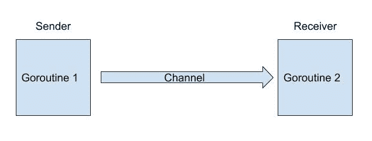

# 七、并发爬取

当你开始将越来越多的目标网站添加到你的抓取需求中时，你最终会达到一个你希望打更多、更快的电话的程度。在单个程序中，爬网延迟可能会给您的刮板增加额外的时间，从而增加处理其他站点的不必要时间。您是否看到下图中的问题？


如果这两个站点可以并行运行，就不会有任何干扰。可能访问和解析页面的时间比此网站的爬网延迟时间长，在处理第一个响应完成之前启动第二个请求也可以节省您的时间。在下图中查看情况是如何改善的：


在任何一种情况下，您都需要将并发性引入到 web 刮板中。

在本章中，我们将介绍以下主题：

*   什么是并发
*   并发陷阱
*   Go 并发模型
*   同步包帮助程序

# 什么是并发

程序中的指令由**中央处理器**（**CPU**运行。这个 CPU 可以运行多个线程，这些线程可以一起处理单独任务的指令。这是通过在两个任务之间切换并以交替方式执行指令来实现的，就像拉动拉链的两侧一样。这种任务的重叠执行称为并发。为了简单起见，我们将其描述为同时执行多个任务。下图显示了它的显示方式：


并发不应与并行混淆，并行可以同时执行两件事或两条指令。

通过向 web scraper 引入并发体系结构，您将能够向不同的站点发出多个 web 请求，而无需等待一个站点响应。这样，站点速度慢或与一台服务器的连接不好只会影响删除该特定站点的任务，而不会影响其他站点。由于 web 抓取的大部分时间都是通过网络进行通信，因此这是解决问题的一个非常好的方法。

使用并发体系结构构建程序有时可能是一项艰巨的任务，因为它会带来一系列需要考虑的新问题。当多个线程运行时，它们通常需要某种通信机制，并且在尝试同时修改相同的对象时必须非常小心。如果没有经过深思熟虑的方法，您的刮板必然会遇到各种各样的问题，这些问题很难检测和修复。

# 并发陷阱

大多数并发问题的根源在于找出如何在多个线程之间安全地共享信息，并提供对该信息的访问。最简单的解决方案似乎是拥有一个两个线程都可以访问和修改的对象，以便与另一个线程通信。这一看似无辜的策略建议起来容易做起来难。让我们看一看这个例子，其中两个线程共享相同的网页堆栈以进行爬取。他们需要知道哪些网页已经完成，以及另一个线程当前正在处理哪些网页。

本例中我们将使用一个简单的映射，如下代码所示：

```go
siteStatus := map[string]string{
  "http://example.com/page1.html" : "READY",
  "http://example.com/page2.html" : "READY",
  "http://example.com/page3.html" : "READY",
}
```

`"READY"`状态表示该场地尚未被刮平。

# 比赛条件

从一开始，这一战略就有一个重大问题。如果两个线程同时查看地图，它们将看到`page1.html`已准备好被刮除。然后，他们会将`page1.html`的值更新为`"WORKING"`，并继续同时爬取同一个站点！这不仅是重复的工作，而且还会在[example.com](http://example.com)服务器上产生额外的负载。更糟糕的情况是，如果一个线程正在将状态更新为`"WORKING"`，而另一个线程正在尝试读取状态。然后，你的铲运机就会坠毁。Go 中不允许并发读取和/或写入操作。

这种情况称为竞争条件，是构建并发程序时遇到的最常见问题之一。为了防止竞争条件发生，需要有一种机制，其中一个线程可以阻止所有其他线程访问 map。Go 标准库提供了`sync`包，其中包含许多用于构建并发应用程序的有用工具。在我们的具体情况下，`sync.Mutex`将是一个非常有用的工具。

您还可以在许多 Go 命令（例如：`go run`和`go test`）中使用`"-race"`标志来帮助检测比赛条件并提供有用的信息。更多信息请参见他们的博客帖子[https://blog.golang.org/race-detector](https://blog.golang.org/race-detector) 。

`sync.Mutex`是一个可锁定的物体，可以作为其他物体的屏障，就像门上的锁一样。要进入房间，首先要检查门是否锁好。如果它已锁定，则必须等待有人解锁后才能继续。下面的代码是如何在 Go 中使用`sync.Mutex`来保护对地图的并发读写的示例：

```go
mtx := *sync.Mutex{}

mtx.Lock()
if siteStatus["http://example.com/page1.html"] == "READY" {
  siteStatus["http://example.com/page1.html"] = "WORKING"
}
mtx.Unlock()
```

当一个线程调用`mtx.Lock()`时，它首先检查是否有任何其他线程持有现有的锁。如果已经有一个现有锁被持有，线程将等待现有锁被释放。就像前面提到的门一样，在任何给定的时间内，只有一根线可以锁住一把锁。

当对对象的访问允许并发读取，但在写入过程中必须保护对象时，`sync`包提供`sync.RWMutex`结构。其工作原理与`sync.Mutex`类似，只是将锁定分为两种不同的方法：

*   `Lock()`/`Unlock()`：在写操作进行时专门使用的锁
*   `RLock()`/`RUnlock()`：读操作进行时专门使用的锁

多个线程可以获得读锁，而不会阻止对对象的访问，尝试获得写锁的线程除外。同样，如果存在写锁，则无法获得读锁。使用`RWMutex`，前面的示例将类似于以下示例：

```go
mtx := *sync.RWMutex{}

mtx.RLock()
if siteStatus["http://example.com/page1.html"] == "READY" {
  mtx.RUnlock()
  mtx.Lock()
  siteStatus["http://example.com/page1.html"] = "WORKING"
  mtx.UnLock()
} else{
  mtx.RUnlock()
}
```

线程在检查映射之前获得一个读锁，以确保没有写操作。然后释放读锁，不管`if`a 语句是`true`还是`false`，并在更新映射之前获得写锁。使用这两种类型的互斥将有助于保护您的刮板免受竞争条件的影响。但是，它还可能增加另一个常见的并发陷阱。

# 僵局

在向并发应用程序添加锁和解锁代码时，您可能会看到应用程序已完全停止，但没有崩溃。在花了大量时间挖掘代码、添加额外的打印语句以及单步执行调试器之后，您终于看到了它；锁没有释放！这种情况被称为僵局。

Go 标准库没有任何工具来帮助检测和克服死锁。然而，开源社区也提供了支持。其中一个包是 GitHub 用户`sacha-s`的`go-deadlock`。`go-deadlock`软件包为`sync.Mutex`和`sync.RWMutex`提供了一个插入式替代品，用于监控对象上的锁被保持了多长时间。默认情况下，当它检测到死锁时，它将退出程序。

死锁超时持续时间和要采取的操作都可以通过`deadlock.Opts`对象进行配置，如下例所示：

```go
deadlock.Opts.DeadlockTimeout = 120 * time.Second // 2 minute timeout
deadlock.Opts.OnPotentialDeadlock = func() {
  printf("Deadlock detected")
  beginGracefulShutdown()  // This is a hypothetical function
}
```

使用互斥和死锁检测是确保并发线程可以在不妨碍彼此的情况下运行的一些标准方法。这些传统方法是通过 Go 编程语言提供的。然而，它们提供了一个不同的视角，说明并发线程应该如何相互通信。

# Go 并发模型

正如您所看到的，并发程序的许多问题都源于多个线程之间共享内存资源。这种共享内存用于通信状态，可能非常脆弱，需要非常小心才能确保一切正常运行。在 Go 中，并发是通过咒语来实现的：

*不要通过共享内存进行通信；相反，通过交流来共享内存。*

当您在公共对象周围使用互斥锁和锁时，您是通过共享内存进行通信的。多个线程查看同一内存位置以发出警报，并提供信息供其他线程使用。Go 提供了通过通信来帮助共享内存的工具，而不是这样做。

# 戈罗季斯

到目前为止，我们一直将并发执行路径称为线程。在 Go 中，实现这一点的同义工具被称为**goroutine**。goroutine 被描述为：

*执行的轻量级线程*。

与 C 和 Java 中的传统线程不同，Goroutine 由 Go 运行时管理，而不是 OS 线程调度程序。这允许 Go 运行时调度器仅超关注 Go 程序中的任务。它还根据需要利用操作系统线程，提供更细粒度的操作单元。操作系统线程在创建每个线程时需要大量的开销，并且确定任务应该在哪个线程上运行的能力相对较慢。Go 运行时在创建 goroutine 的分离时选择更小的封装，允许更多的 goroutine 同时运行。

按照设计，创建 goroutine 在 Go 中是一项非常简单的任务。通过在任何函数调用前加上单词`go`，它将在新的 goroutine 中运行该函数。以下示例是一个运行小型 goroutine 的简单程序：

```go
package main

import (
 "fmt"
 "time"
)

func startTicker() {
 ticks := 0
 for true {
 fmt.Println(ticks)
 ticks++
 time.Sleep(1 * time.Second)
 }
}

func main() {
 println("Starting ticker")
 go startTicker()
 time.Sleep(10 * time.Second)
}
```

当你运行这段代码时，你可以看到来自`startTicker()`的数字被打印出来，即使主 goroutine 睡眠了 10 秒。如果您修改此代码，将 Go`startTicker()`更改为`startTicker()`，此代码将永远运行，每秒钟打印一次，直到进程被强制终止。

当多个 goroutine 需要相互通信时，Go 为它们提供了一个简单的工具。

# 渠道

通道是 goroutines 发送和接收信息的管道。这是 Go 通过通信共享内存的并发模型的核心。通道允许相互进行 goroutine，而不是试图访问相同的信息。通道也是单向的，这意味着数据只能朝一个方向流动，如下图所示：



如果两个方向都需要通信，则需要使用两个通道。

在前面使用互斥锁的示例中，多个线程试图通过创建释放锁来访问包含每个网站状态的映射。通过将 scraper 线程作为单独的 goroutine 启动，并让它们通过通道将状态传回主 goroutine，我们可以使用通道作为更安全的方法。如下例所示：

```go
package main

func scrapeSite(url string, statusChan chan map[string]string) {
  // Performing scraping operations...
  statusChan <- map[string]string{url: "DONE"}
}

func main() {
  siteStatus := map[string]string{
    "http://example.com/page1.html": "READY",
    "http://example.com/page2.html": "READY",
    "http://example.com/page3.html": "READY",
  }

  updatesChan := make(chan map[string]string)

  numberCompleted := 0
  for site := range siteStatus {
    siteStatus[site] = "WORKING"
    go scrapeSite(site, updatesChan)
  }

  for update := range updatesChan {
    for url, status := range update {
      siteStatus[url] = status
      numberCompleted++
    }
    if numberCompleted == len(siteStatus) {
      close(updatesChan)
    }
  }
}
```

在该程序的主功能中，`updatesChan`被创建作为 goroutine 向主 goroutine 提供其状态的手段。这些 goroutine 通过调用 Go`scrapeSite`在第一个`for`循环中启动，它获取要爬取的网站的 URL，并引用`updatesChan`。然后，主 goroutine 进入第二个`for`循环，在该循环中侦听通过`updatesChan`发送的数据，为任何 URL 提供新的状态更新。由于每个站点都提供更新，已完成站点的数量将不断增加，直到所有站点都已完成。此时，主 goroutine 关闭通道。

关闭通道会阻止通过该通道发送和接收更多数据。就范围操作而言，这标志着流的结束，退出循环。

通过将通信方法转换为使用通道，共享数据只有一个所有者，更新映射的责任落在单个 goroutine 上。这允许 goroutine 的每个工作人员安全地提供状态更新，而不需要锁或共享内存。

# 同步包帮助程序

Goroutines 和 channels 是 Go 中并发编程的核心结构，将提供您所需的大部分实用程序。但是，Go 标准库提供了许多有用的对象，了解这些对象也很有用。我们已经看到了 To.T0 和 Ty1 T1 如何工作，但是让我们来看一下其他提供的对象。

# 条件

既然您能够将 scraper 任务启动到多个线程中，那么需要设置一些控件，这样事情就不会太失控。在 Go 中，启动 1000 个 goroutines 以从单个程序中同时爬取 1000 页是非常简单的。但是，您的机器很可能无法处理相同的负载。`sync`包提供了一些实用程序来帮助维护 web 刮板中的秩序。

您需要设置的一个常见控件是活动并发爬取线程的数量。在启动新的 goroutine 之前，您需要满足一个特定的条件，即活动线程的数量小于某个值。如果此条件未通过检查，您的新 goroutine 将不得不等待，直到收到条件通过的信号。使用`sync.Cond`对象解决此场景。

`sync.Cond`对象提供了一种机制，根据任何定义的条件告诉 goroutines 等待信号被接收。`sync.Cond`结构体包装`sync.Locker`（通常是`sync.Mutex`或`sync.RWMutex`）以控制对条件本身的访问。下面的示例说明了如何使用`sync.Cond`控制活动刮板线程的数量：

```go
package main

import (
  "sync"
  "time"
)

var sites []string = []string{
  "http://example.com/site1.html",
  "http://example.com/site2.html",
  "http://example.com/site3.html",
}
var activeThreads = 0
var doneCount = 0
const maxActiveThreads = 1

func scrapeSite(site string, condition *sync.Cond) {
  condition.L.Lock()
  if activeThreads >= maxActiveThreads {
    condition.Wait()
  }
  activeThreads++
  condition.L.Unlock()
  println("scraping " + site)
  // Scraping code goes here ...
  condition.L.Lock()

  activeThreads--
  doneCount++
  condition.L.Unlock()
  condition.Signal()
}

func main() {
  var l = sync.Mutex{}
  var c = sync.NewCond(&l)

  for _, site := range sites {
    println("starting scraper for " + site)
    go scrapeSite(site, c)
  }
  for doneCount < len(sites){
    time.Sleep(1 * time.Second)
  }
  println("Done!")
}
```

此代码的主要焦点在`scrapeSite()`函数内部。在这部分代码中，程序首先检查是否已达到最大并发线程数。如果此条件为真，它将等待。这将暂停 goroutine，直到从`sync.Cond`调用`Signal()`或`Broadcast()`。在我们的例子中，我们使用`Signal()`通知一个 goroutine 条件已经通过，并且可以继续。如果这里使用了`Broadcast()`，它将释放当前等待该条件的所有 goroutines。一个很好的用例是暂停整个系统，在`fly`上进行一些配置更改，然后恢复所有暂停的 goroutine。

# 原子计数器

在上一个示例中，我们用`Lock()`/`Unlock()`包围了`activeThreads`的任何增量或减量。如果需要多次执行，这可能会变得非常冗长，就像我们的例子一样。`sync`包提供了一个名为 atomic 的子包，它提供了无需锁即可更新对象的方法。这是通过在每次更改时创建一个新变量来实现的，同时防止同时发生多个写入。以下示例显示了将`activeThreads`用作`atomic`计数器所需的一些更改：

```go
package main

import (
  "sync"
  "sync/atomic"
)
// ...
var activeThreads int32 = 0
// ...
func scrapeSite(site string, condition *sync.Cond) {
 condition.L.Lock()
 if activeThreads >= maxActiveThreads {
 condition.Wait()
 }
 condition.L.Unlock()

 atomic.AddInt32(&activeThreads, 1)
 // Scraping code goes here ...
 atomic.AddInt32(&activeThreads, -1)
 condition.Signal()
}
// ...
```

# 总结

在本章中，我们讨论了许多有关 web 抓取中并发性的主题。我们研究了什么是并发以及如何从中获益。我们回顾了在构建并发程序时必须避免的一些常见问题。我们还了解了 Go 并发模型以及如何使用其基本对象构建并发 Go 应用程序。最后，我们看了 Go 在其`sync`包中包含的一些细节。在最后一章中，我们将介绍如何将爬虫提升到最高水平。