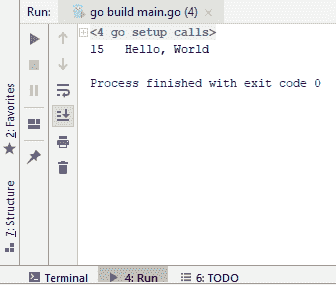
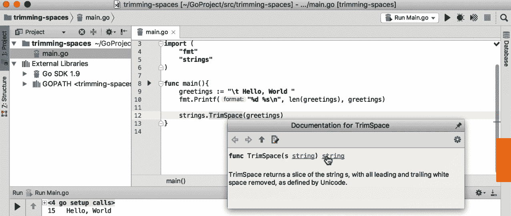
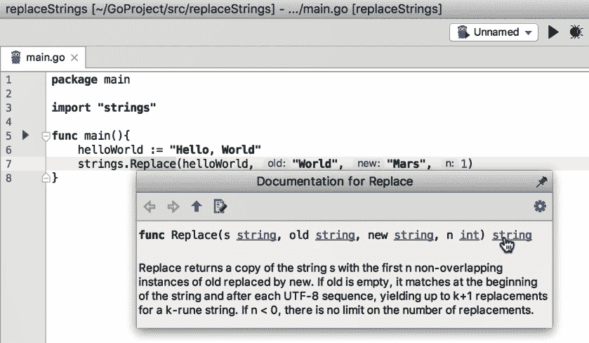
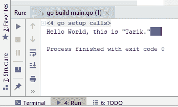
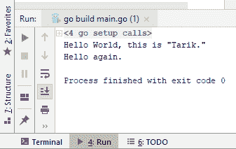
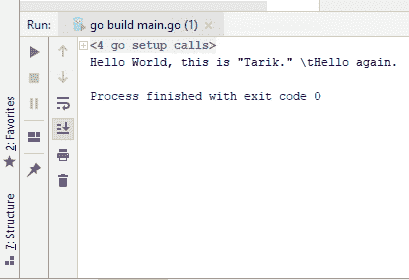

# 二、操作字符串值


现在我们对这本书将带我们通过的内容有了一个概述。我们知道如何安装 Go 二进制文件，编写 Go 代码，并使用终端运行它。在本章中，我们将学习一些处理字符串值的方法，例如从字符串的开头和结尾修剪空格、提取子字符串、替换字符串的部分、对字符串值中的字符进行转义以及将字符串值大写。


# 从字符串的开头和结尾修剪空格


让我们从修剪字符串开头和结尾的空格开始。您可能希望从字符串的开头和结尾删除空格的原因有很多；例如，如果您接受一些值，例如 firstname，则通常不需要在该字符串值的结尾或开头使用空格。

所以，让我们继续我们的项目，看看如何用 go 语言执行这个过程。因此，您必须添加一个新的项目来修剪空间，并拥有`main.go`文件，我们将把代码放入其中，然后我们将运行它；您的屏幕应如下所示：


首先，假设我们有一个字符串变量，其中有一些空格：

```go
package main
import (
  "fmt"
  "strings"
)
func main(){
  greetings := "\t Hello, World "
  fmt.Printf("%d %s\n", len(greetings), greetings)
}
```

在前面的代码片段中，`/t`是 tab，后面有一些空格。还有*hello World*和更多的空间。我已将此字符串值及其 length 属性放入控制台。`len`函数将给出问候语字符串的长度，指示该字符串中的字符数。让我们运行这个：



从屏幕截图中可以看到，它有 15 个字符，包括制表符、空格和字符串的其余部分。

现在，让我们继续从变量中修剪空格。我们有`strings.TrimSpace`，它返回另一个字符串，如下面的屏幕截图所示：



然后我们可以捕获变量中的字符串。检查以下代码：

```go
package main
import (
 "fmt"
 "strings"
)
func main(){
 greetings := "\t Hello, World "
 fmt.Printf("%d %s\n", len(greetings), greetings)
trimmed := strings.TrimSpace(greetings)
 fmt.Printf("%d %s\n", len(trimmed), trimmed)
}
```

上述代码的输出如下所示：


瞧！如您所见，我们从开始到结束的空格（包括制表符）都消失了，现在这里有 12 个字符。这就是你在 Go 中修剪空格的方法。在下一节中，我们将看到如何从字符串值中提取子字符串。


# 从字符串值中提取子字符串


在本节中，您将学习如何从字符串值中提取子字符串。Go 语言中的字符串实际上是一个只读字节片，这意味着您也可以对字符串执行任何切片操作。让我们去找我们的编辑，看看如何继续。

在编辑器中，添加一个新文件并将其命名为`main.go`。您必须将包更改为`main`并添加一个名为`main`的新函数。这个`main`函数将是我们示例的入口点。假设我们有一个字符串值，如下所示：

```go
package main
import "fmt"
func main(){
 greetings := "Hello, World and Mars"
```

我想从字符串中删除单词*Mars*以及单词*和*，然后只提取其中的*Hello，World*部分。这可以通过以下方式完成：

```go
package main
import "fmt"
func main(){
 greetings := "Hello, World and Mars"
 helloWorld := greetings[0:12]
 fmt.Println(helloWorld)
}
```

索引从 0 开始，因为它是切片。前面代码的输出如下所示：


如您所见，我们只提取了整个短语的*你好，世界*部分。如果索引中没有[T5]零，I[T4]t 仍将工作。如果我们只想要这个字符串中的*世界*和*火星*部分，那么索引可以是[6:]。

这就是如何从字符串值中提取子字符串。在下一个视频中，我们将看到如何用另一个字符串替换字符串的一部分。


# 替换字符串的各个部分


在本节中，我们将看到如何用另一个值快速替换字符串的一部分。当谈到 Go 语言中的字符串操作时，您将在 strings 包下找到许多实用方法。在这里，我们将使用相同的包用另一个值替换字符串的一部分。让我们回到编辑那里，看看如何开始这个过程。

所以，我将有一个`helloWorld`变量，我们将*世界*替换为*火星*。检查以下代码：

```go
package main
import (
 "strings"
 "fmt"
)
func main(){
 helloWorld := "Hello, World"
 helloMars := strings.Replace(helloWorld, "World", "Mars", 1)
 fmt.Println(helloMars)
}
```

下面的屏幕截图将解释我们刚才看到的代码：



如屏幕截图所示，我们将使用`strings`包，它有一个`replace`函数，它接受我们要搜索的变量作为第一个参数，即*你好，世界*。旧的字符串就是我们想要替换的字符串中的东西，这就是*世界*。新字符串将是*Mars*，我们希望应用于此替换的重复次数为“1”。

如果你看一下，这个方法的签名会返回另一个字符串，我们将把它赋给另一个变量，在本例中为`helloMars`。因此，您将看到以下输出：


正如你所看到的，我们已经用*火星*取代了*世界*。

现在，假设我们在句子中有多个*世界*实例，您使用以下代码：

```go
package main
import (
 "strings"
 "fmt"
)
```

```go
func main(){
 helloWorld := "Hello, World. How are you World, I am good, thanks World."
 helloMars := strings.Replace(helloWorld, "World", "Mars", 1)
 fmt.Println(helloMars)
}
```

因此，如果强度值是这样的，那么使用 1 将没有帮助。它只会将第一次出现的*世界*替换为*火星*，但其余部分仍将保留为*世界*，如以下截图所示：


因此，您可以通过更改重复次数来替换任意数量的*世界*实例。例如，如果您想用*火星*替换*世界*的前两个实例，则重复次数为 2，依此类推。如果你想用*火星*替换*世界*的所有实例，一个简单快捷的方法是使用减号 1，这有效地告诉 Go 替换该字符串中可以用*火星*这个词找到的 W 世界的任何实例。让我们运行以下代码：

```go
package main
import (
 "strings"
 "fmt"
)
```

```go
func main(){
 helloWorld := "Hello, World. How are you World, I am good, thanks World."
 helloMars := strings.Replace(helloWorld, "World", "Mars", -1)
 fmt.Println(helloMars)
}
```

前面的代码将给出以下输出：


现在，世界上所有的实例都被*火星*这个词所取代。Go strings 包为您提供了许多其他选项，正如您所看到的，替换字符串非常容易。在下一节中，我们将看到如何对字符串中的字符进行转义。


# 字符串中的转义字符


在本节中，我们将了解如何转义字符串值中的特殊字符。与当今市场上的许多其他语言类似，Go 以一种特殊的方式对待某些字符。例如，如果 Go 在字符串值中看到\t 个字符，它会将它们视为制表符。另外，如果不转义，就不能在双引号中包含双引号，现在我们将看到如何转义它们，以便正确地将这些字符显示到输出中。

一如既往，我们将拥有我们的`main.go`文件和`main`函数。让我们检查一个与前一个类似的示例。

```go
package main
import "fmt"
func main(){
  helloWorld := "Hello World, this is Tarik."
}
```

因此，如果我想在术语 Tarik 周围加上双引号，我可以这样做，但是，正如您所看到的，它会给我一个编译时错误，如下面的屏幕截图所示：


那么，让我们来解决这个问题。我所需要做的就是使用`\`。所以，任何时候你想逃离一个特殊的角色，你就用一个`\`来逃离它。那么，让我们继续将其添加到控制台：

```go
package main
import "fmt" 
func main(){
 helloWorld := "Hello World, this is \"Tarik.\""
fmt.Println(helloWorld)
}
```

上述代码的输出如下所示：


好吧正如你所看到的，上面写着 Hello World，这是“Tarik”。但是 Tarik 在两个双引号内。

现在，还有其他问题。让我们想象一下，出于某种原因，我想在不使用双引号的情况下输出`\t`：

```go
package main
import "fmt"
func main(){
 helloWorld := "Hello World, this is \"Tarik.\" \t"
fmt.Println(helloWorld)
}
```

这看起来很好，因为我们没有看到任何编译时错误，我们可以继续运行它。获得以下输出：



如您所见，`\t`没有出现在控制台中；事实上，我看到一个大标签，因为这是一个特殊的字符；`\t`表示制表符。还有其他类似的特殊字符，例如`\n`，意思是新行。因此，让我们尝试运行以下代码：

```go
package main
import "fmt"
func main(){
 helloWorld := "Hello World, this is \"Tarik.\" \t\nHello again."
 fmt.Println(helloWorld)
}
```

前面的代码将给出以下输出：



正如你所看到的，`Hello again`不是在同一条线上，而是在一条新线上。如果我删除`/n`并再次运行代码，hello 将返回到同一行，并且由于特殊字符`\t`，我们也将有一个很大的空间：


那么，我们怎样才能避开`\t`呢？让我们看看如果我们包含另一个`\`并运行以下代码会发生什么：

```go
package main
import "fmt"
func main(){
 helloWorld := "Hello World, this is \"Tarik.\" \\tHello again."
 fmt.Println(helloWorld)
}
```

正如您在下面的屏幕截图中所看到的，现在字符串值中有了\t，Go 不再将其视为特殊字符：



这就是在 Go 中使用转义字符的方式。在下一节中，我们将看到如何轻松地将字符串值大写。


# 大写字符串值


在本节中，我们将了解如何在 Go 中大写单词。有很多种方法可以让你在句子中把单词大写；例如，你可能想把句子中的所有字母大写，或者只把所有单词的首字母大写，我们来看看怎么做。

让我们回到我们的编辑那里。从字符串的开头和结尾修剪空格时，前几个步骤与后面的步骤相同。然而，在这里，我们有一个变量，它有“hello world，您好，今天好”，我们只想大写这个句子中所有单词的第一个字母。我们在上一节中已经看到了 strings 包，它有一个名为`title`的函数，这个方法的签名也返回另一个字符串，我们可以将它分配给另一个变量`HelloWorldtitle`。要继续，我们必须运行刚才描述的代码：

```go
package main
import (
 "strings"
 "fmt"
)
func main(){
 helloWorld := "hello world, how are you today!"
 helloWorldtitle := strings.Title(helloWorld)
 fmt.Println(helloWorldtitle)
}
```

前面的代码将给出以下输出：


正如您所看到的，代码导致了句子所有首字母的大写。现在，如果我们想将这个句子中的所有字母大写，我们必须使用新的`ToUpper`函数运行以下代码：

```go
package main
import (
 "strings"
 "fmt"
)
func main(){
 helloWorld := "hello world, how are you today!"
 helloWorldtitle := strings.Title(helloWorld)
 fmt.Println(helloWorldtitle)
helloWorldUpper := strings.ToUpper(helloWorld)
 fmt.Println(helloWorldUpper)
}
```

如果您打印`Ln`，它实际上会在新行中打印该字符串，而如果您不打印，它不会这样做。我们刚才看到的代码将提供以下输出：


这一切都是关于字符串值的大写！


# 总结


在本章中，我们学习了如何从字符串的开头和结尾修剪空格，如何从字符串值中提取子字符串，如何替换字符串的部分，如何转义字符串中的字符，以及如何将字符串值大写。至此，我们已经完成了关于字符串操作的学习。下一章将描述如何在各种类型之间执行类型转换，我们将从将池转换为字符串值开始。


