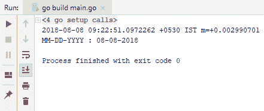
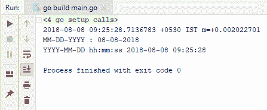
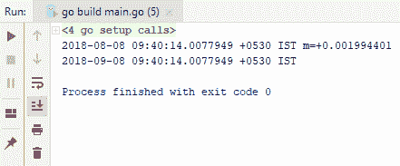
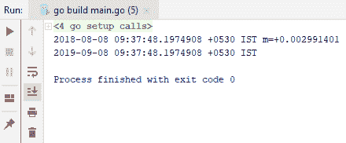
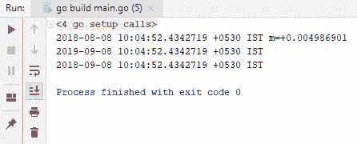
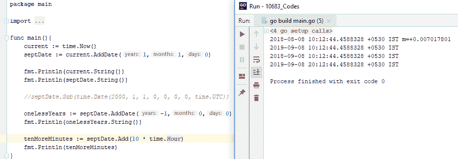
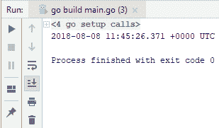

# 四、日期和时间


在本章中，我们将学习如何使用 Go 编程语言处理日期和时间。您将学习如何对`DateTime`值执行基本操作，例如查找两个日期之间的差异、获取今天的日期、对`DateTime`值执行简单的算术运算以及从字符串值解析日期。本章将介绍以下主题：

*   查找今天的日期和时间
*   日期的加减
*   找出两个日期之间的差异
*   从字符串解析日期和时间


# 查找今天的日期和时间


在本节中，我们将学习如何查找今天的日期和时间。我们可以使用`time.Now`获取今天的日期，它导入一个`time`包，`time`返回一个`time`类型，因此我们将把它分配给另一个变量并使用`String`函数。以下代码将帮助您更好地理解：

```go
package main

import (
  "time"
  "fmt"
)

func main(){
  current := time.Now()
  fmt.Println(current.String())
}
```

上述代码的输出如下所示：


正如你所看到的，我们这里有一个大字符串，它包含了所有内容，当然，我们可以根据需要格式化它。例如，我可以添加`current.Format`功能和预定义的布局，如下图所示：

```go
package main

import (
 "time"
 "fmt"
)

func main(){
 current := time.Now()
 fmt.Println(current.String())

 fmt.Println("MM-DD-YYYY :", current.Format("01-02-2006"))
}
```

前面屏幕截图中显示的代码输出如下：



在上一个屏幕截图中，您将看到今天的日期。您也可以通过绕过布局`snf`，提及您想要的输出格式（`YYYY-MM-DD hh:mm:ss`），将时间和日期放在一起，如下代码所示：

```go
package main

import (
  "time"
  "fmt"
)

func main(){
  current := time.Now()
  fmt.Println(current.String())

  fmt.Println("MM-DD-YYYY :", current.Format("01-02-2006"))

  fmt.Println("YYYY-MM-DD hh:mm:ss", current.Format("2006-01-02 15:04:05"))
}
```

在运行前面的屏幕截图中提到的代码时，我们会得到以下输出，包括年、月、日以及时间信息。这可以在以下屏幕截图中看到：



所以，这就是你如何简单地获得今天的日期，并用 Go 语言以各种方式格式化它。在下一节中，我们将学习如何添加或减去日期值。


# 日期的加减


在本节中，我们将学习如何对日期值进行加减。


# 增加日期


让我们继续学习如何将一个月添加到当前日期。但在这样做之前，我们需要知道当前日期。您可以按照我们在上一节中学习的步骤进行操作。考虑到我得到了第八（8 月 8 日）作为输出，我们必须再增加一个月到这个值。通过在`time`类型上使用`AddDate`函数，我们可以添加任意数量的年、月和日，因为它接受三个参数。以下是整个代码的外观：

```go
package main

import (
  "time"
  "fmt"
)

func main(){
  current := time.Now()
  septDate := current.AddDate(0,1,0)

  fmt.Println(current.String())
  fmt.Println(septDate.String())
}
```

因此，查看下面的输出屏幕截图，您会注意到我们通过将值`1`传递给第二个参数，成功地将一个月的时间增加到了 8 月份：



我们可以执行相同的程序来添加年份。您可以将`years:`参数更改为`1`，并在输出中将`2018`更改为`2019`。这可以在以下屏幕截图中看到：



这就是添加日期值的方式。


# 从日期中减去


我们要学习的第二件事是如何从当前日期中减去日期。正如您在下面的代码行中所看到的，我们使用了`Sub`方法，因为它接受另一种`time`类型：

```go
septDate.Sub(time.Date(2000, 1, 1, 0, 0, 0, 0, time.UTC))
```

相反，我们将使用`AddDate`并将负值传递给参数。因此，让我们将其分配给另一个变量并运行以下代码：

```go
package main

import (
  "time"
  "fmt"
)

func main(){
  current := time.Now()
  septDate := current.AddDate(1,1,0)

  fmt.Println(current.String())
  fmt.Println(septDate.String())

  //septDate.Sub(time.Date(2000, 1, 1, 0, 0, 0, 0, time.UTC))

  oneLessYears := septDate.AddDate(-1,0,0)
  fmt.Println(oneLessYears.String())
}
```

以下代码的输出如下所示：



如您所见，我们通过从`2019`中减去`1`得到`2018`。


# 添加时间


现在，考虑你需要增加时间而不是月或年。要继续，我们必须使用`Add`，它有`duration`，这是您要添加的时间量。

例如，让我们假设我们想要增加 10 分钟。检查以下代码：

```go
package main

import (
  "time"
  "fmt"
)

func main(){
  current := time.Now()
  septDate := current.AddDate(1,1,0)

  fmt.Println(current.String())
  fmt.Println(septDate.String())

  //septDate.Sub(time.Date(2000, 1, 1, 0, 0, 0, 0, time.UTC))

  oneLessYears := septDate.AddDate(-1,0,0)
  fmt.Println(oneLessYears.String())

  tenMoreMinutes := septDate.Add(10 * time.Minute)
  fmt.Println(tenMoreMinutes)
}
```

代码返回另一种类型或值，即`time`类型，如果您查看输出，如图所示，我们在 9 月日期前添加了 10 分钟：


现在，如果我看一下输出，我们可以看到我们增加了`10`分钟，因此`10:10:24`变为`10:20:24`。如果我将`Minute`改为`Hour`并运行代码，我们会看到从 9 月份开始增加了`10`小时，这可以在下面的代码块中看到：

```go
package main

import (
  "time"
  "fmt"
)

func main(){
  current := time.Now()
  septDate := current.AddDate(1,1,0)

  fmt.Println(current.String())
  fmt.Println(septDate.String())

  oneLessYears := septDate.AddDate(-1,0,0)
  fmt.Println(oneLessYears.String())

  tenMoreMinutes := septDate.Add(10 * time.Hour)
  fmt.Println(tenMoreMinutes)
}
```

我们将获得以下输出：



所以，这基本上就是你加时间的方法。在下一节中，我们将看到如何找到两个日期值之间的差异。


# 找出两个日期之间的差异


在本节中，我们将学习如何找出两个日期之间的差异。让我们假设我们有两个日期，如下面的代码块所示，您将看到此方法的签名是自解释的。因此，我们所要做的就是使用下面的代码作为减法方法，从第二个日期减去第一个日期：

```go
package main

import (
  "time"
  "fmt"
)

func main(){
  first := time.Date(2017, 1,1,0,0,0,0,time.UTC)
  second := time.Date(2018, 1,1,0,0,0,0,time.UTC)

  difference := second.Sub(first)
  fmt.Printf("Difference %v", difference)
}
```

现在，在我们运行代码并获得输出之前，如果您检查签名，您将看到该方法返回的是`Duration`，而不是日期之间的`Time`类型：


回到运行我们的代码时，您将看到以下输出：


这就是你如何发现两个日期之间的差异。在下一节中，我们将学习如何从给定字符串解析日期和时间。


# 从字符串解析日期和时间


在本节中，我们将学习如何从字符串中解析日期和时间。本节将结束本章。从字符串中解析日期和时间时，需要两件事：第一件是布局，第二件是要解析的实际字符串。那么，让我们假设我们有一个变量，它保存着[T0]字符串值

为了让 Go 理解这一点，您需要提供一个`layout`属性。`layout`属性基本上描述了字符串`DateTime`的外观；它从一年开始，接着是一个月，一天，然后是时间。一如既往，`time`软件包为我们提供了各种实用功能，我们可以使用这些功能来处理日期和时间。`Parse`方法返回两个内容，一个是解析日期，另一个是错误。如果在解析过程中发生任何事情，可以抛出一个错误，我们可以检查错误并查看出了什么问题，否则我们将只输出当前时间和解析时间的字符串表示形式。那么，让我们运行以下代码：

```go
package main

import (
  "time"
  "fmt"
)

func main(){
  str := "2018-08-08T11:45:26.371Z"
  layout := "2006-01-02T15:04:05.000Z"
  t,err := time.Parse(layout, str)
  if err != nil{
    fmt.Println(err)
  }
  fmt.Println(t.String())
}
```

我们运行的代码的输出如下所示：



正如你所看到的，我们捕捉到的正是我们试图解析作为日期的。这就是你在 Go 中解析的方式。


# 总结


在本章中，我们学习了如何查找当前日期和时间，如何添加和减去日期，如何查找两个日期之间的差异，以及如何从字符串中解析日期和时间。在下一章中，您将学习如何使用 Go 语言处理映射和数组。您将看到操作和迭代数组、合并数组和映射以及测试映射中是否存在键的实际示例。


