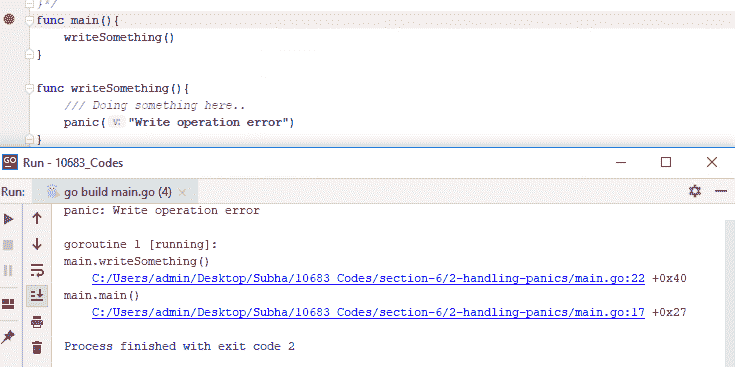
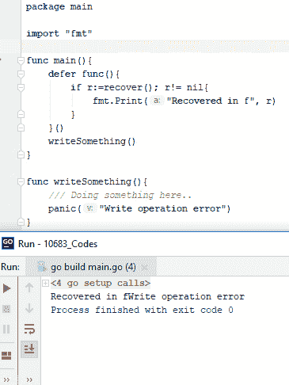
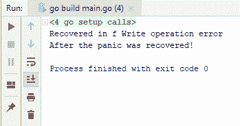

# 错误和日志记录


在本章中，我们将学习如何处理错误，并在需要时返回错误。Go 的错误机制不同于其他一些流行语言，本节将教您如何以 Go 的方式处理错误。我们还将学习如何在应用程序中执行简单的日志操作，以便深入了解正在运行的应用程序，从而更好地进行调试。本章将介绍以下主题：

*   创建自定义错误类型
*   围棋中的`try...catch`等价物
*   在应用程序中进行简单的登录
*   优雅地应对恐慌


# 创建自定义错误类型


让我们从创建自定义错误类型开始。如果您来自 C#和 Java 等语言，您可能会发现 Go 中的错误机制有些不同。此外，创建自定义错误的方法非常简单，因为 Go 是一种 duck 类型的语言，这意味着只要结构满足接口，就可以使用 Go。让我们继续使用新类型创建我们自己的自定义错误。因此，我将有两个字段，`ShortMessage`和字符串类型的`DetailedMessage`。您可以有任意多个字段，以捕获有关错误的更多信息。此外，为了满足`error`接口，我将实现一个新方法`*MyError`，它将返回一个`string`值，我们可以将这个错误输出到控制台或某个日志文件。

然后，我将要做的是返回错误消息。因此，执行此操作的方法非常简单：您可以从方法返回此错误类型。假设我们有一个返回错误的`doSomething`方法。让我们想象一下，我们在该方法中执行了几行代码，但由于某种原因，它返回了一个错误，例如`"Wohoo something happened!"`的`ShortMessage`实例。当然，您可能需要在这里使用更有意义的消息，并且不要忘记使用这个`&`操作符。它将获得您的`*MyError`对象的地址，因为我们在这里使用指针。如果你不这样做，你会看到有一个类型错误，一种修复的方法是移除`*`指针，错误就会被修复。但是，您可能不想拥有同一对象的多个副本，因此不需要执行我刚才描述的操作，您可以轻松地执行以下操作：发送一个引用，以便更好地管理内存。现在让我们看一下整个代码：

```go
package main

import "fmt"

type MyError struct{
  ShortMessage string
  DetailedMessage string
  //Name string
  //Age int
}

func (e *MyError) Error() string {
  return e.ShortMessage + "\n" +e.DetailedMessage

}
  func main(){
    err:= doSomething()
    fmt.Print(err)
}
func doSomething() error {
  //Doing something here...
  return &MyError{ShortMessage:"Wohoo something happened!", DetailedMessage:"File cannot found!"}
}
```

那么，让我们运行这个，当然它会返回一些错误；我们将在这里添加`err`，然后将其运行到控制台。现在，我们可以看到我们的消息或错误消息被写入控制台，如下屏幕截图所示：


这就是如何简单地创建自己的错误消息类型。在下一节中，我们将学习围棋中的`try...catch`等价物。


# 围棋中的试球


与其他语言不同，Go 中没有[T0]块。在本节中，我们将了解 Go 如何处理基本错误。因此，我们将要看到的第一件事是如何处理 API 调用返回的错误。我们可以使用`time.Parse()`方法，因为它接受布局和值字符串。它返回两个东西，一个是`parsedDate`，另一个是错误。Go 在大多数情况下将错误作为第二个参数返回，而不是返回异常。

现在，处理这个问题的方法是检查[T0]是否为零。如果 Go 中不是 nil，那么我们知道发生了错误，我们需要处理它。如果没有发生任何事情，我们可以安全地继续下一行，也就是将`parsedDate`的内容写入输出。为此，请检查以下代码示例：

```go
package main

import (
  "time"
  "fmt"
)

func main(){
  parsedDate, err:= time.Parse("2006", "2018")
  if err != nil {
    fmt.Println("An error occured", err.Error())
  }else{
    fmt.Println(parsedDate)
  }
}
```

前面的代码将给您以下输出：


你可以看到它工作得很好。如果我们在`2018`之后添加一些`string`值，会发生什么？让我们添加[T2]，并运行代码。如果您看到下面的屏幕截图，您可以看到在解析时间发生错误；还添加了错误消息`An error occured parsing time "2018 abc": extra text: abc`，如下图所示：


现在，本节的第二部分是当您自己返回错误时。假设我们有`doSomething`函数，它返回`err`类型。检查以下代码：

```go
package main
import (
  "fmt"
  "errors"
)
func main(){
  _, err := doSomething()
  if err != nil {
    fmt.Println(err)
  }
}
func doSomething() (string,error) {
  return "", errors.New("Something happened.")
}
```

前面的代码将给出以下输出：


所以，这就是如何在围棋中做一个简单的`try...catch`等价物。在下一节中，我们将看到如何在应用程序中进行简单的日志记录。


# 在应用程序中执行简单的日志记录


在本节中，我们将学习如何在应用程序中进行简单的日志记录。当然，有多种方法可以做到这一点，也有第三方软件包允许您这样做，但我们将使用 Go 提供的`log`软件包。因此，我们要做的第一件事是使用`os`包创建一个新文件，如果在创建`log`文件时，出现错误，我们将把它写入控制台。我们还将使用`defer`功能。在`main`方法退出之前，将调用此`defer`函数，下一步是设置输出：

```go
package main
import (
  "os"
  "fmt"
  "log"
)
func main(){
  log_file, err := os.Create("log_file")
  if err != nil{
    fmt.Println("An error occured...")
  }
  defer log_file.Close()
  log.SetOutput(log_file)
```

```go

  log.Println("Doing some logging here...")
  log.Fatalln("Fatal: Application crashed!")
}
```

当我们运行前面的代码时，将创建一个名为`log_file`的新文件，其内容如下：


您可能想知道致命错误和正常信息错误之间有什么区别。让我们对这两行重新排序，看看新的顺序如何。因此，我们将先运行`Fatalln`，然后再运行`Println`，如下所示：

```go
package main
import (
  "os"
  "fmt"
  "log"
)
func main(){
  log_file, err := os.Create("log_file")
  if err != nil{
    fmt.Println("An error occured...")
  }
  defer log_file.Close()
  log.SetOutput(log_file)
  log.Fatalln("Fatal: Application crashed!")
  log.Println("Doing some logging here...")
}
```

如果您现在运行前面的代码并检查`log_file`的内容，您将看到第二个`Println`没有被写入：


不同之处在于`Fatalln`与`Println`类似，只是后面跟着一个对`os.Exit`的调用。因此，它基本上写一个日志并退出应用程序，这是两者之间的简单区别。这就是您可以简单地在应用程序中进行日志记录的方式。当然，如果您不想像我们在这里所做的那样一直设置输出，您可以将`main`函数包装到您的包中。在下一节中，我们将看到如何优雅地应对恐慌。


# 优雅地应对恐慌


在本节中，我们将看到如何优雅地应对恐慌。与错误不同，如果您不能从恐慌中恢复，它将停止程序的执行。因此，如果你想继续你的计划，处理这些问题是很重要的。首先，让我们看看如何在围棋程序中制造恐慌。您只需使用名为`panic`的关键字，这是一个内置函数，键入 panicked，然后运行它即可获得输出：


还有另一种方法。让我们在这里使用另一个函数并编写一些东西。让我们想象一下，我们正在做一些事情，出于某种原因，它只是惊慌失措。这可能是第三方方法，这意味着它位于第三方包中，因此我们可能无法完全控制该包。因此，在这里，如果您运行前面的代码，这就是我们将在应用程序窗口中看到的内容，以及我们要写入控制台的消息，如下所示：



我们还可以在这里看到我们的`panic`的堆栈轨迹。首先，它点击主消息，然后点击`writeSomething()`方法。那么我们如何处理这个`panic`？我们有这个`defer`关键字，你必须使用这个`defer`。`defer`的意思是：；好吧，假设在方法退出之前，您想运行另一段代码，所以您只需传递一个函数，然后说“我想运行这个`defer`函数”。当然，它需要像这样：`defer func(){}()`，或者你可以在这里说`defer writeSomething()`。这并不重要，但因为我要运行一些代码，所以我将它们封装在函数中。我们还有一个名为`recover`的关键字，它在`main`函数退出之前运行`defer`函数。另外，在这个函数中，我们尝试使用[T12]。

如果恐慌发生，这个`recover`会返回一些东西，如果没有恐慌，这意味着它不会返回一些东西。因此，`r`的值将是`nil`，这意味着我们不需要向控制台写入任何内容，因为我们不需要这样做。但是，如果发生了恐慌，那么我们只需进入`if`条件，我们只需编写`recover`构建方法中的任何内容，然后继续运行以下代码，我们将得到相应的输出：



所以，现在你可以看到，我们基本上说`Recovered in f`，信息是恐慌带来的，这就是我们在这里写的东西。如果你想看到这个过程的继续，我们可以从`main`函数复制`defer func()`函数。接下来，我们将创建另一个名为`sayHello()`的方法，并将`defer func()`粘贴到其中。我想告诉你们的是，我们已经从恐慌中恢复过来，所以执行也会达到这一点。因此，我们可以继续运行以下代码：

```go
package main

import "fmt"

func main(){
  sayHello()
  fmt.Println("After the panic was recovered!")
}

func sayHello(){
  defer func(){
    if r := recover(); r != nil {
      fmt.Println("Recovered in f", r)
    }
  }()
  writeSomething()
}

func writeSomething(){
  /// Doing something here..
  panic("Write operation error")
}
```

执行`main`功能后，现在我们看到消息：



如果我们没有`defer`函数，让我们看看它会如何运行。现在您可以看到它没有命中`main`函数，我们这里有 panic 和所有堆栈跟踪，这就是如何在应用程序中优雅地处理 panic


# 总结


本章是错误和日志的演练。在下一章中，我们将学习如何在操作系统中使用文件和目录。我们还将学习解析和使用各种格式，如 XML、YAML 和 JSON。


