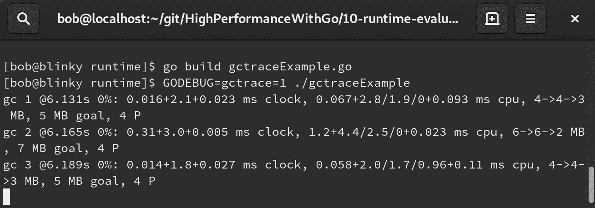
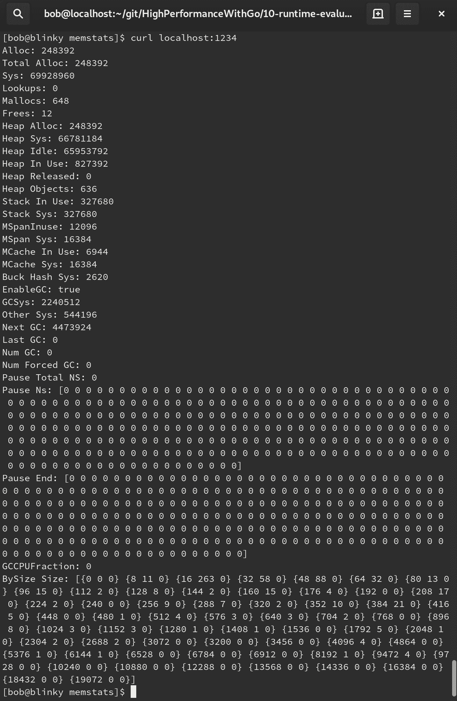

# 十、Go 中的编译时计算

Go 的作者以一种最小化依赖关系的方式编写了该语言，并且每个文件都声明了自己的依赖关系。常规语法和模块支持也有助于开发人员提高编译时间和界面满意度。在本章中，我们将看到运行时评估如何帮助加快 Go 编译，以及如何使用容器构建 Go 代码和利用 Go 构建缓存。

在本章中，我们将介绍以下主题：

*   Go 运行时
*   `GCTrace`
*   `GOGC`
*   `GOMAXPROCS`
*   `GOTRACEBACK`
*   Go build 缓存
*   贩卖
*   缓存
*   调试
*   `KeepAlive`
*   `NumCPU`
*   `ReadMemStats`

这些都是了解 Go 运行时如何工作以及如何使用它编写性能代码的有价值的主题。

# 探索 Go 运行时

在 Go 源代码中，我们可以通过查看[来查看运行时源代码 https://golang.org/src/runtime/](https://golang.org/src/runtime/) 。运行时包包含与 Go 运行时交互的操作。这个包用于控制 goroutine、垃圾收集、反射和调度等功能，这些功能对于语言的操作都是必不可少的。在运行时包中，有许多环境变量可以帮助我们更改 Go 可执行文件的运行时行为。让我们回顾一下关于 Go 运行时可以讨论的一些最重要的环境变量。

# 哥德堡

`GODEBUG`是变量的控制器，用于 Go 运行时内的调试。此变量包含由逗号分隔的`name=val`键值对列表。这些命名变量用于调整二进制文件将返回的调试信息的输出。这个变量的一个优点是，运行时允许您将其直接应用于预编译的二进制文件，而不是在构建时调用它。这很好，因为它允许您调试已经构建的二进制文件（并且可能已经在生产环境中造成危害）。您可以传递给`GODEBUG`的变量如下：

| **哥德堡变量** | **启用值** | **说明** |
| `allocfreetrace` | 1. | 用于分析每个分配。将为每个对象的分配打印堆栈跟踪，并将其释放。每个堆栈跟踪都包含单个元素的内存块、大小、类型、goroutine ID 和堆栈跟踪。 |
| `clobberfree` | 1. | GC 在释放对象时，会用坏内容对对象的内容进行重击。 |
| `cgocheck` | 0–禁用 1（默认）-便宜支票 2–昂贵支票 | 检查使用 cgo 错误传递到非 go 代码的 go 指针的程序包。将 0 设置为禁用，将 1 设置为可能遗漏某些错误的廉价检查（默认），或将 2 设置为将减慢程序速度的昂贵检查。 |
| `efence` | 1. | 分配器将确保在一个唯一的页面上分配每个对象，并且不会回收内存地址。 |
| `gccheckmark` | 1. | 通过执行第二次标记传递来验证 GC 的当前标记阶段。在第二次关卡中，世界将停止。如果第二个过程发现并发标记未找到的对象，GC 将死机。 |
| `gcpacertrace` | 1. | 打印与垃圾收集器相关的并发 pacer 内部状态的信息。 |
| `gcshrinkstackoff` | 1. | 移动 goroutine 不能移动到较小的堆栈上。Goroutine 的堆栈仅在此模式下增长。 |
| `gcstoptheworld` | 1–禁用 GC 2–禁用 GC 和并发扫描 | 1 禁用并发垃圾回收。这会将每个 GC 事件变成一个停止世界局势的事件。2 在垃圾收集完成后禁用 GC 并禁用并发扫描。 |
| `gctrace` | 1. | 参见下一页的`GCTrace`标题。 |
| `madvdontneed` | 1. | 在 Linux 上，使用`MADV_DONTNEED`而不是`MADV_FREE`将内存返回到内核。使用此标志会降低内存利用率，但也会使 RSS 内存值下降得更快。 |
| `memprofilerate` | 0–分析 1 的轮次–包括每个分配的块 X–更新`MemProfileRate`的值 | 控制在内存配置文件中报告和记录的内存分配分数。更改 X 控制记录的内存分配比例。 |
| `invalidptr` | 0–禁用此检查 1–发现无效指针时崩溃 | 如果在存储指针的位置找到无效指针的值，则垃圾收集器和堆栈复制器将崩溃。 |
| `sbrk` | 1. | 从不回收内存的操作系统交换一个普通的分配器，而不是使用默认的内存分配器和垃圾收集器。 |
| `scavenge` | 1. | 堆清除程序调试模式已启用。 |
| `scheddetail` | 1（与 schedtrace=X 一起使用） | 调度器每 X 毫秒返回一次与调度器、处理器、线程和 goroutine 进程相关的信息。 |
| `schedtrace` | X | 每 X 毫秒向 STDERR 发送一行调度程序状态摘要。 |
| `tracebackancestors` | N | 扩展了对 goroutine 及其相关堆栈的装箱位置的回溯，报告了 N 个祖先 goroutine。如果 N=0，则不返回祖先信息。 |

其他包也有可以传递给`GODEBUG`的变量。这些通常是非常有名的包，可能需要调整运行时性能，例如`crypto/tls`和`net/http`。如果包具有运行时可用的`GODEBUG`标志，则包应包含文档。

# GCTRACE

`GCTRACE`在运行时用于查看打印到 stderr 的单行，其中显示收集的总内存以及每次收集期间的暂停时间。在撰写本文时，这一行的组织如下：

```go
gc# @#s #%: #+#+# ms clock, #+#/#/#+# ms cpu, #->#-># MB, # MB goal, #P
```

我们可以使用一个简单的 HTTP 服务器来提供一个如何工作的示例。首先，我们编写了一个简单的 HTTP 服务器，它对`localhost:8080`的根有一个简单的响应`Hello Gophers`：

```go

package main
import (
    "fmt"
    "net/http"
)

func hello(w http.ResponseWriter, r *http.Request) {
    fmt.Fprintf(w, "Hello Gophers")
}

func main() {
    http.HandleFunc("/", hello)
    err := http.ListenAndServe(":8080", nil)
    if err != nil {
       fmt.Println(err)
    }
}
```

接下来，我们可以构建并运行这个简单的 web 服务器，然后我们可以使用 Apache bench（[https://httpd.apache.org/docs/2.4/programs/ab.html](https://httpd.apache.org/docs/2.4/programs/ab.html) ）模拟主机的一些负载：


在我们看到 Apache bench 的输出，表明我们的测试已经完成之后，我们将在终端中看到一些垃圾收集统计数据，我们最初在终端中实例化了简单的 HTTP 守护进程：



让我们分析一下本例的垃圾收集输出：

| **输出** | **说明** |
| gc 1 | 垃圾收集编号。此数字在每次垃圾收集时递增。 |
| @6.131s | 此垃圾回收在程序启动后 6.131 秒发生。 |
| 0% | 自程序启动以来花费在 GC 中的时间百分比。 |
| 0.016+2.1+0.023 毫秒时钟 | GC 各阶段发生的 wallclock/CPU 时间。这可以表示为*Tgc=Tseq+Tmark+Tsweep。*
**Tseq**：用户 Go 例程时间停止（停止世界扫描终止）。
**Tmark**：堆生成时间（并发标记和扫描时间）。
**Tsweep**：堆扫描时间（扫描世界标记终止）。 |
| 4->4->3MB | GC 开始、GC 结束和活动堆大小。 |
| 5MB 目标 | 目标堆大小。 |
| 4 便士 | 正在使用 4 个处理器。 |

如果我们等待几分钟，我们的终端应该产生一个输出，如下所示：

```go
scvg1: 57 MB released
scvg1: inuse: 1, idle: 61, sys: 63, released: 57, consumed: 5 (MB)
```

这是使用`gctrace > 0`进行的输出。每当 Go 运行时将内存释放回系统时，它都会生成一个摘要，也称为**清除**。在编写本文时，此输出遵循以下格式：

| **输出** | **说明** |
| scvg1:57MB 已发布 | 扫气循环次数。该数字在每次扫气时递增。这个数据点还让我们知道释放回操作系统的内存块的大小。 |
| 因纽斯：1 | 程序中使用的内存大小（MB）（这也可以表示部分使用的跨距）。 |
| 空闲时间：61 | 待清除跨距的大小（MB）。 |
| 系统:3 | 从系统映射的内存大小（MB）。 |
| 发布日期：57 | 释放到系统的内存大小（MB）。 |
| 消费：5 | 从系统分配的内存大小（MB）。 |

垃圾收集和清除输出示例都很重要，它们可以以简单易读的方式告诉我们系统中内存利用率的当前状态。

# GOGC

`GOGC`变量允许我们调整 Go 垃圾收集系统的强度。垃圾收集器（在[实例化）https://golang.org/src/runtime/mgc.go](https://golang.org/src/runtime/mgc.go) 读取`GOGC`变量并确定垃圾收集器的值。`off`值将关闭垃圾收集器。这通常对调试有用，但从长远来看并不可持续，因为程序需要释放在可执行文件堆中收集的内存。将此值设置为小于默认值 100 将导致垃圾收集器执行更频繁。将此值设置为大于默认值 100 将导致垃圾收集器执行的频率降低。对于多核大型机器，垃圾收集的发生频率通常过高，如果垃圾收集的发生频率较低，我们可以提高性能。我们可以使用标准库的编译来了解更改垃圾收集将如何影响编译时间。在下面的代码示例中，我们可以看到标准库的构建示例及其各自的计时：

```go
#!/bin/bash

export GOGC=off
printf "\nBuild with GOGC=off:"
time go build -a std
printf "\nBuild with GOGC=50:"
export GOGC=50
time go build -a std
for i in 0 500 1000 1500 2000
do
    printf "\nBuild with GOGC = $i:"
    export GOGC=$i
    time go build -a std
done
```

我们的输出显示了 Go 标准库编译时间的相应计时：


我们可以看到，通过调整垃圾收集，编译时间有很大的不同。根据您的体系结构、系统规格和 Go 版本，这将有很大的不同。重要的是要认识到这是一个旋钮，我们可以为我们的Go程序。对于需要在执行期间挤出更多性能的构建时间或高度监控、对延迟敏感的二进制文件，通常会转动此旋钮。

# GOMAXPROCS

`GOMAXPROCS`是一个可以调整的变量，允许我们控制操作系统在 Go 二进制文件中分配给 GoRoutine 的线程数。默认情况下，`GOMAXPROCS`等于应用程序可用的内核数。这可以通过运行时包进行动态配置。值得注意的是，从 Go 1.10 开始，`GOMAXPROCS`将没有上限

如果我们有一个 CPU 密集型和并行化的函数（例如 goroutine 排序字符串），如果我们调整`GOMAXPROCS`的数量，我们将看到一些严重的改进。在下面的代码示例中，我们将使用为`GOMAXPROCS`设置的不同数量来测试构建标准库：

```go
#!/bin/bash
for i in 1 2 3 4
do
    export GOMAXPROCS=$i
    printf "\nBuild with GOMAXPROCS=$i:"
    time go build -a std
done  
```

在我们的结果中，我们可以看到当我们操纵`GOMAXPROCS`的总数时会发生什么：


实际上，我们不应该手动设置`GOMAXPROCS`。很少有情况下，您可能希望根据系统上可用的资源限制特定二进制文件的 CPU 利用率，或者您可能确实需要根据手头的资源进行优化。然而，在大多数情况下，默认的`GOMAXPROCS`值是正常的。

# 山猫

`GOTRACEBACK`允许您控制 Go 程序在意外运行条件或未恢复的死机状态下生成的输出。设置一个`GOTRACEBACK`变量将允许您或多或少地查看针对特定错误或恐慌而实例化的 goroutine 的详细信息。通道/goroutine 中断引起的死机示例如下：

```go
package main
import (
    "time"
)

func main() {
    c := make(chan bool, 1)
    go panicRoutine(c)
    for i := 0; i < 2; i++ {
       <-c
    }
}

func panicRoutine(c chan bool) {
    time.Sleep(100 * time.Millisecond)
    panic("Goroutine Panic")
    c <- true
}

```

如果我们调整输出中的`GOTRACEBACK`变量，我们将看到不同级别的堆栈跟踪。设置`GOTRACEBACK=none`或`GOTRACEBACK=0`为我们提供了有关此次恐慌的最少量信息：


设置`GOTRACEBACK=single`（Go 运行时中的默认选项）将针对我们的特定请求为当前 goroutine 发出单堆栈跟踪，如下所示：


设置`GOTRACEBACK=all`或`GOTRACEBACK=1`将向我们返回用户创建的所有 goroutine 的堆栈跟踪：


设置`GOTRACEBACK=system`或`GOTRACEBACK=2`将为运行时创建的函数和 goroutine 添加所有运行时堆栈帧。

最后，我们可以设置`GOTRACEBACK=crash`。这与系统的功能类似，但允许操作系统触发内核转储。

大多数情况下，`GOTRACEBACK=single`的默认值为我们提供了有关当前上下文的足够信息，以便我们能够做出明智的决定，解释为什么我们的程序以我们意想不到的方式结束。

# 转到生成缓存

在本章中，我们讨论了为 Go 构建优化运行时的几种方法。我们还可以通过几个简单的调整来提高 Go 构建时间。Go 的团队一直在优化运行时，而不是构建时。Go 能够缓存构建时依赖项，这有助于重用以前构建中的公共工件。这些文物保存在`$GOPATH/pkg/`中。我们可以在调用 go build 时使用`-i`标志来保留这些中间结果，以便重新利用这些工件。如果我们想调试构建过程中发生的事情，我们可以使用`-x`标志运行构建，以便从 Go 构建系统生成更详细的输出。

# 供应商依赖关系

供应商也是提高构建一致性和质量的常用选择。在项目结构中，语言的作者能够接受对供应商依赖性的支持的反馈。将依赖项保留在存储库中会使其变得非常庞大，但这有助于在构建期间保持第三方依赖项在本地可用。当我们使用 Go 版本 1.11 或更高版本时，我们可以使用 Go 模块标记来允许供应商构建。我们可以使用`go mod vendor`捕获`vendor/`目录中的所有依赖项，然后在构建时使用`go build -mod vendor`

# 缓存和供应商改进

为了看到我们可以通过构建和缓存资产进行的改进，让我们构建一个具有第三方依赖关系的项目 https://prometheus.io/ 是一个流行的时间序列数据库（也是用 Go 编写的），通常用于度量数据的收集和收集。我们可能希望在任何应用程序中启动 Prometheus metrics 服务器，以便从系统角度了解更多有关当前运行的二进制文件的信息。为此，我们可以按如下方式导入普罗米修斯库：

```go
package main
import (
    "net/http"

    "github.com/prometheus/client_golang/prometheus/promhttp"
)

func main() {
    http.Handle("/promMetrics", promhttp.Handler())
    http.ListenAndServe(":1234", nil)
}
```

在我们用基本二进制文件实例化`prometheus`服务器之后，我们可以构建二进制文件并执行它。要对已经更新的包执行强制重建，我们可以使用带有`go build`的`-a`标志。如果你对超长的构建时间所花费的时间感到好奇，你也可以添加`-x`标志——它会给你一个非常详细的输出，告诉你在构建过程中发生了什么

默认情况下，较新版本的 Golang 将定义一个`GOCACHE`。您可以使用`go env GOCACHE`查看它的位置。使用`GOCACHE`和 mod 供应商的组合，我们可以看到我们的构建时间显著提高。我们列表中的第一个构建是冷构建，强制重新构建包以使其保持最新。我们的第二个版本，它有一些从国防部供应商节存储的项目，要快得多。我们的第三个构建应该缓存大多数构建元素，相比之下，它非常快。以下屏幕截图说明了这一点：


# 调试

运行时中的调试包为我们提供了许多可用于调试的函数和类型。我们可以执行以下操作：

*   使用`FreeOSMemory()`强制垃圾回收。
*   打印运行时生成的堆栈跟踪。使用`PrintStack()`堆叠至标准件。
*   使用`ReadGCStats()`阅读我们的垃圾收集统计数据。
*   使用`SetGCPercent()`设置我们的垃圾收集百分比。
*   使用`SetMaxStack()`设置单个 goroutine 的最大堆栈大小。
*   使用`SetMaxThreads()`设置操作系统线程的最大数量。
*   使用`SetPanicOndefault()`在意外地址上出错时控制运行时行为。
*   使用`SetTraceback()`设置回溯量。
*   使用`Stack()`返回 goroutine 的堆栈跟踪。
*   使用`WriteHeapDump()`写入堆转储。

# PProf/比赛/跟踪

我们将分别在[第 12 章](12.html)、*评测 Go 代码*和[第 13 章](12.html)、*评测 Go 代码*中介绍评测和跟踪 Go 程序的细节。知道运行库是这些实用程序中的关键驱动程序是明智的。能够使用 pprof/race/trace 可以帮助您以一种有意义的方式调试代码，并能够在下一节中发现新出现的错误，我们将了解运行时函数以及它们如何在运行时库中使用。

# 理解功能

Go 运行时库还有一些函数，您可以将这些函数注入到程序的运行时中，以发出运行时数据。让我们来看几个主要的例子。所有可用运行时函数的完整列表可在[中找到 https://golang.org/pkg/runtime/#pkg-索引](https://golang.org/pkg/runtime/#pkg-index)。此包中提供的许多功能也包含在`runtime/pprof`包中，我们将在[第 12 章](12.html)、*评测 Go 代码*中对其进行更详细的研究 .

# 持久连接

`runtime.KeepAlive()`函数需要`interface{}`并确保传递给它的对象未被释放，并且其终结器（由`runtime.SetFinalizer`定义）未运行。这使得传递给`KeepAlive`的参数可以到达。编译器设置`OpKeepAlive`，如**静态单赋值**（**SSA**）包（[中所定义 https://golang.org/src/cmd/compile/internal/gc/ssa.go#L2947](https://golang.org/src/cmd/compile/internal/gc/ssa.go#L2947) –这允许编译器知道作为变量的接口状态，并允许保持活动上下文

根据经验，我们不应该在正常实现中调用`KeepAlive`。它用于确保垃圾收集器不会从函数中的*不再*引用值中回收内存

# 努姆普

`NumCPU`函数返回当前进程的可用逻辑 CPU 数量。调用二进制文件时，运行时将验证启动时可用的 CPU 数量。以下代码段中有一个简单的示例：

```go
package main

import (
    "fmt"
    "runtime"
)

func main() {
    fmt.Println("Number of CPUs Available: ", runtime.NumCPU())
}
```

现在，我们可以看到进程当前可用的 CPU 数量。在我的例子中，该值最终为`4`：


有了这个，我们可以看到我的计算机有 4 个 CPU 可供使用。

# ReadMemStats

`ReadMemStats()`函数读取内存分配器统计信息并将其填充到变量中，例如`m`。`MemStats`结构有很多关于飞行内存利用率的非常有价值的信息。让我们深入研究一下它能给我们带来什么价值。允许我们查看二进制文件的内存利用率的 HTTP 处理程序函数可能会有所帮助，因为我们会在系统中发出更多请求，并希望查看内存分配的使用位置：

1.  首先，我们可以实例化程序和函数：

```go
package main

import (
    "fmt"
    "net/http"
    "runtime"
) 

func memStats(w http.ResponseWriter, r *http.Request) {
    var memStats runtime.MemStats
    runtime.ReadMemStats(&memStats)
```

2.  接下来，我们可以打印运行时提供给我们的各个内存统计信息的所有值。让我们从`Alloc`、`Mallocs`和`Frees`开始：

```go
    fmt.Fprintln(w, "Alloc:", memStats.Alloc)
    fmt.Fprintln(w, "Total Alloc:", memStats.TotalAlloc)
    fmt.Fprintln(w, "Sys:", memStats.Sys)
    fmt.Fprintln(w, "Lookups:", memStats.Lookups)
    fmt.Fprintln(w, "Mallocs:", memStats.Mallocs)
    fmt.Fprintln(w, "Frees:", memStats.Frees)
```

3.  现在，让我们看看堆信息：

```go
    fmt.Fprintln(w, "Heap Alloc:", memStats.HeapAlloc)
    fmt.Fprintln(w, "Heap Sys:", memStats.HeapSys)
    fmt.Fprintln(w, "Heap Idle:", memStats.HeapIdle)
    fmt.Fprintln(w, "Heap In Use:", memStats.HeapInuse)
    fmt.Fprintln(w, "Heap Released:", memStats.HeapReleased)
    fmt.Fprintln(w, "Heap Objects:", memStats.HeapObjects)
```

4.  接下来，我们看一下堆栈/span/cache/bucket 分配：

```go
    fmt.Fprintln(w, "Stack In Use:", memStats.StackInuse)
    fmt.Fprintln(w, "Stack Sys:", memStats.StackSys)
    fmt.Fprintln(w, "MSpanInuse:", memStats.MSpanInuse)
    fmt.Fprintln(w, "MSpan Sys:", memStats.MSpanSys)
    fmt.Fprintln(w, "MCache In Use:", memStats.MCacheInuse)
    fmt.Fprintln(w, "MCache Sys:", memStats.MCacheSys)
    fmt.Fprintln(w, "Buck Hash Sys:", memStats.BuckHashSys)
```

5.  然后，我们查看垃圾收集信息：

```go
    fmt.Fprintln(w, "EnableGC:", memStats.EnableGC)
    fmt.Fprintln(w, "GCSys:", memStats.GCSys)
    fmt.Fprintln(w, "Other Sys:", memStats.OtherSys)
    fmt.Fprintln(w, "Next GC:", memStats.NextGC)
    fmt.Fprintln(w, "Last GC:", memStats.LastGC)
    fmt.Fprintln(w, "Num GC:", memStats.NumGC)
    fmt.Fprintln(w, "Num Forced GC:", memStats.NumForcedGC)
```

6.  现在，让我们看看垃圾收集中断信息：

```go
    fmt.Fprintln(w, "Pause Total NS:", memStats.PauseTotalNs)
    fmt.Fprintln(w, "Pause Ns:", memStats.PauseNs)
    fmt.Fprintln(w, "Pause End:", memStats.PauseEnd)
    fmt.Fprintln(w, "GCCPUFraction:", memStats.GCCPUFraction)
    fmt.Fprintln(w, "BySize Size:", memStats.BySize)
```

7.  接下来，我们实例化一个简单的 HTTP 服务器：

```go
 func main() {
    http.HandleFunc("/", memStats)
    http.ListenAndServe(":1234", nil)
}
```

在这里，我们可以使用 Apache bench 工具在内存分配器上生成一点负载：

```go
ab -n 1000 -c 1000 http://localhost:1234/
```

最后，通过向`localhost:1234`发出请求，我们可以看到一些活动 HTTP 服务器信息以及响应：



所有`MemStats`值的定义可在[的文档中找到 https://golang.org/pkg/runtime/#MemStats](https://golang.org/pkg/runtime/#MemStats) 。

# 总结

在本章中，我们学习了`GODEBUG`、`GCTRACE`、`GOGC`、`GOMAXPROCS`和`GOTRACEBACK`运行时优化。我们还学习了`GOBUILDCACHE`和 Go vendoring 依赖项。最后，我们学习了如何从代码中调试和调用运行时函数。在对 Go 代码进行故障排除时使用这些技术将帮助您更容易地发现问题和瓶颈。

在下一章中，我们将讨论有效部署 Go 代码的正确方法。