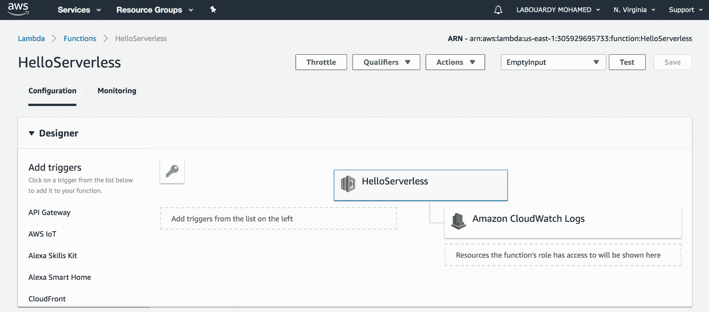
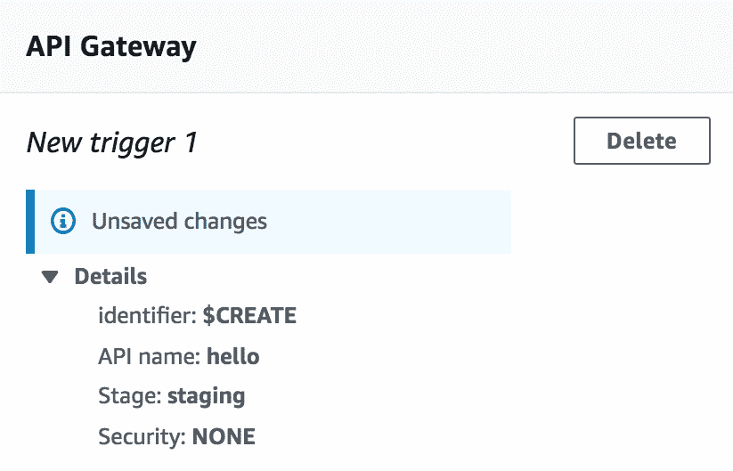
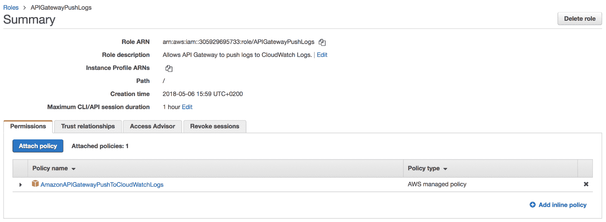
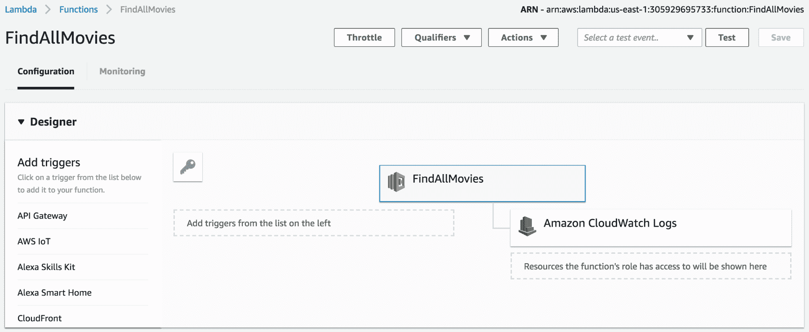
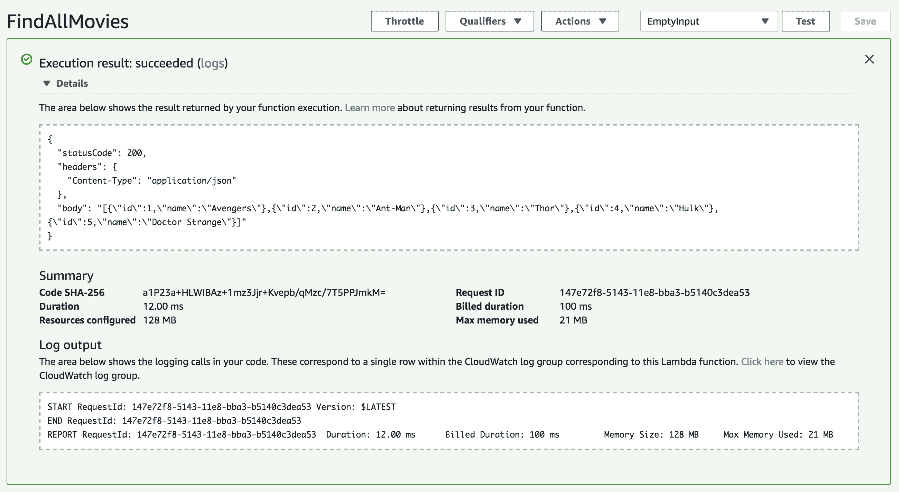
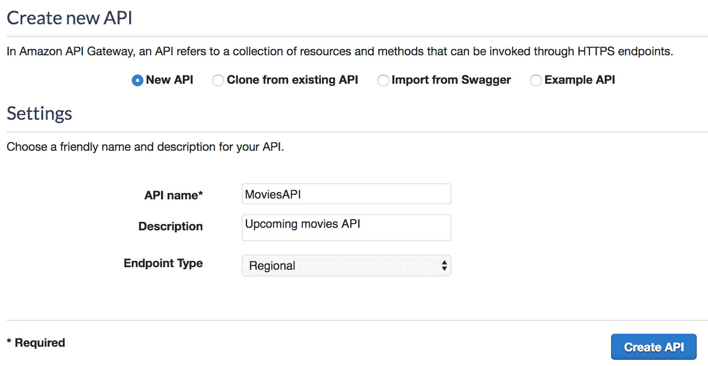
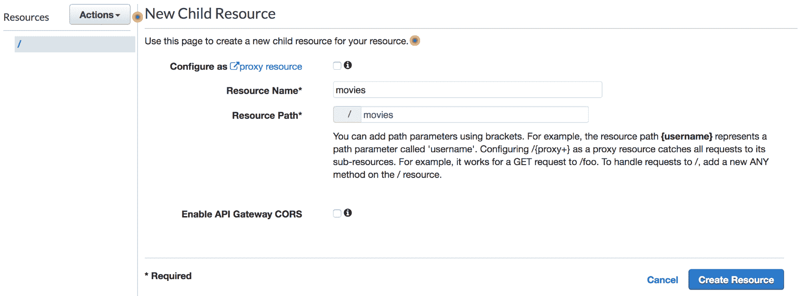
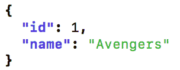
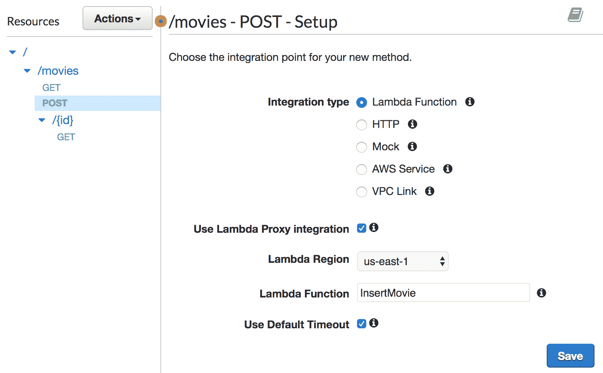
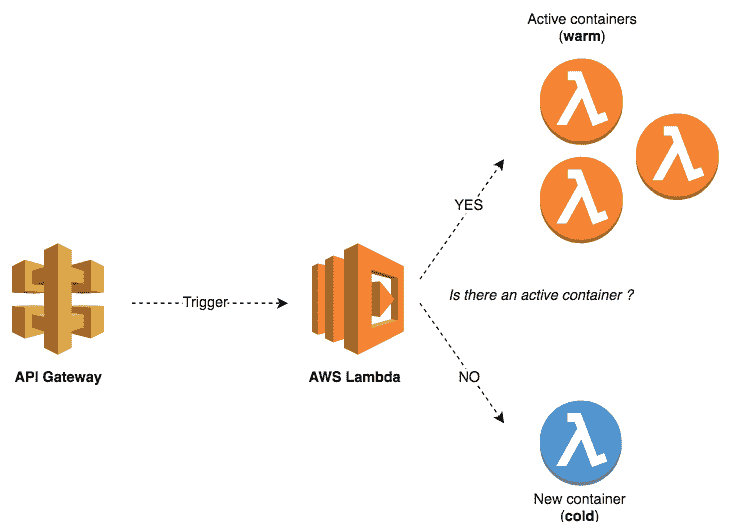

# 使用 API 网关设置 API 端点

在上一章中，我们学习了如何使用 Go 构建第一个 Lambda 函数。我们还学习了如何从控制台手动调用它。为了利用 Lambda 的强大功能，在本章中，我们将学习如何使用 AWS API 网关服务触发 Lambda 函数以响应传入的 HTTP 请求（事件驱动体系结构）。在本章末尾，您将熟悉 API 网关高级主题，如资源、部署阶段、调试等。

我们将讨论以下主题：

*   API 网关入门
*   构建 RESTful API

# 技术要求

本章是前一章的后续，因此建议先阅读前一章，以便轻松地理解本部分。此外，还需要具备 RESTful API 设计和实践的基本知识。本章的代码包托管在 GitHub 上的[https://github.com/PacktPublishing/Hands-On-Serverless-Applications-with-Go](https://github.com/PacktPublishing/Hands-On-Serverless-Applications-with-Go) 。

# API 网关入门

API 网关是一种 AWS 无服务器 API 代理服务，允许您为所有 Lambda 函数创建一个统一的入口点。它代理传入的 HTTP 请求并将其路由到相应的 Lambda 函数（映射）。从服务器端的角度来看，它是位于 Lambda 函数之上的外观或包装。然而，从客户机的角度来看，它只是一个单一的单片应用程序。

除了向客户端提供单一接口及其可扩展性外，API 网关还提供了以下强大功能：

*   **缓存**：您可以缓存端点响应，从而减少对 Lambda 函数的请求数量（成本优化），提高响应时间。
*   **CORS 配置**：默认情况下，浏览器拒绝访问来自不同域的资源。通过在 API 网关中启用**跨源资源共享**（**CORS**，可以覆盖此策略

CORS 将在[第 9 章](09.html)*中深入讨论，用 S3*构建前端，并给出一个实例。

*   **部署阶段/生命周期**：您可以管理和维护多个 API 版本和环境（沙箱、QA、阶段和生产）。
*   **监控**：对传入请求和传出响应进行故障排除和调试非常简单，可以通过启用 CloudWatch 与 API 网关的集成来完成。它将向 AWS CloudWatch 日志推送日志事件流，您可以向 CloudWatch 公开一组度量，包括：
    *   客户端错误，包括 4XX 和 5XX 状态代码
    *   给定时间段内的 API 请求总数
    *   端点响应时间（延迟）
*   **可视化编辑**：您可以直接从控制台描述您的 API 资源和方法，无需任何编码或 RESTful API 知识。
*   **文档**：您可以为您的 API 的每个版本生成 API 文档，并能够导出/导入文档，并将文档发布到一个招摇过市的规范中。
*   **安全和身份验证**：您可以使用 IAM 角色和策略保护 RESTful API 端点。API 网关还可以充当防火墙，抵御 DDoS 攻击和 SQL/脚本注入。此外，可以在此级别强制执行速率限制或节流。

这就足够了。在下一节中，我们将介绍如何设置 API 网关，以便在每次收到 HTTP 请求时触发 Lambda 函数。

除了对 AWS Lambda 的支持外，API 网关还可用于调用其他 AWS 服务（EC2、S3、Kinesis、CloudFront 等）或外部 HTTP 端点以响应 HTTP 请求。

# 设置 API 端点

以下部分介绍如何使用 API 网关触发 Lambda 函数：

1.  要设置 API 端点，请登录到**AWS 管理控制台**（[https://console.aws.amazon.com/console/home](https://console.aws.amazon.com/console/home) ），导航至 AWS Lambda 控制台，选择我们在上一章中构建的 Lambda 函数 HelloServerless：



2.  从可用触发器列表中搜索 API 网关，然后单击它：


可用触发器的列表可能会根据您使用的 AWS 区域而变化，因为 AWS Lambda 支持的源事件在所有 AWS 区域中都不可用。

3.  页面底部将显示配置触发器部分，如以下屏幕截图所示：


4.  创建一个新的 API，给它一个名称，将部署阶段设置为`staging`，并使 API 向公众开放：


表格必须填写以下参数：

*   **API 名称**：API 的唯一标识符。
*   **部署阶段**：API 阶段环境，帮助分离和维护不同的 API 环境（开发、暂存、生产等）和版本/发布（主要、次要、测试版等）。另外，如果实现了持续集成/持续部署管道，这将非常方便。
*   **安全**：定义 API 端点是公共的还是私有的：
    *   **开放**：可公开访问，每个人都可以调用
    *   **AWS IAM**：将被授予 IAM 权限的用户调用
    *   **使用访问密钥打开**：需要调用 AWS 访问密钥

5.  定义 API 后，将显示以下部分：



6.  点击页面顶部的保存按钮，创建 API 网关触发器，保存后会生成 API 网关调用 URL，格式如下：`https://API_ID.execute-api.AWS_REGION.amazonaws.com/DEPLOYMENT_STAGE/FUNCTION_NAME`，如下图所示：


7.  使用 API 调用 URL 打开您喜爱的浏览器；您应该会看到如下屏幕截图所示的消息：


8.  内部服务器错误消息表示 Lambda 方面出了问题。为了帮助我们解决和调试这个问题，我们将在 API 网关中启用日志功能

# 调试和故障排除

为了对 API 网关服务器错误进行故障排除，我们需要按如下方式启用日志：

1.  首先，我们需要将 API 网关访问权授予 CloudWatch，以便能够将 API 网关日志事件推送到 CloudWatch 日志。因此，我们需要从身份和访问管理创建一个新的 IAM 角色。

为了避免我重复自己的话，我跳过了一些部分。如果你需要一个循序渐进的过程，确保你已经遵循了上一章。

以下屏幕截图将让您大致了解如何创建 IAM 角色：


2.  从 AWS 服务列表中选择 API 网关，然后在“权限”页面上，可以执行以下操作之一：
    *   选择名为 AmazonAPIGatewayPushToCloudWatchLogs 的现有策略，如以下屏幕截图所示：


```go
{
 "Version": "2012-10-17",
 "Statement": [
 {
 "Effect": "Allow",
     "Action": [
        "logs:CreateLogGroup",
        "logs:CreateLogStream",
        "logs:DescribeLogGroups",
        "logs:DescribeLogStreams",
        "logs:PutLogEvents",
        "logs:GetLogEvents",
        "logs:FilterLogEvents"
      ],
      "Resource": "*"
    }
  ]
}
```

3.  接下来，为角色分配一个名称，并将角色 ARN（**亚马逊资源名称**复制到剪贴板：



4.  然后，从网络和内容交付部分选择 API 网关。单击设置并粘贴我们先前创建的 IAM 角色 ARN：


5.  保存它并选择 Lambda 函数创建的 API。单击导航窗格中的阶段：


6.  然后，单击日志选项卡，在 CloudWatch 设置下，单击启用 CloudWatch 日志并选择要捕获的日志级别。在这种情况下，我们对错误日志感兴趣：


7.  尝试使用 API URL 再次调用 Lambda 并跳转到 AWS CloudWatch 日志控制台；您将看到一个新的日志组已创建，格式为*API-Gateway-Execution-Logs\u AP\u ID/DEPLOYMENT\u STAGE*：


8.  单击日志组，您将看到 API 网关生成的日志流：


9.  前面的日志说明 Lambda 函数返回的响应格式不正确。正确的响应格式应包含以下属性：
    *   **Body**：必填属性，包含函数的实际输出。
    *   **状态码***：*这是功能响应状态码，如 HTTP/1.1 标准（[所述 https://tools.ietf.org/html/rfc7231#section-6](https://tools.ietf.org/html/rfc7231#section-6)）。这是必需的，否则 API 网关将显示 5XX 错误，如前一节所示。
    *   **可选参数**：包括`Headers`和`IsBase64Encoded`等。

在下一节中，我们将通过格式化 Lambda 函数返回的响应以满足 API 网关所期望的格式来修复此错误响应。

# 使用 HTTP 请求调用函数

如前一节所示，我们需要修复 Lambda 函数返回的响应。我们将返回一个带有`Body`属性的`struct`变量，该属性将包含实际的字符串值，而不是返回一个简单的字符串变量，并返回一个带有`200`值的`StatusCode`来告诉 API 网关请求成功。为此，请更新`main.go`文件以匹配以下签名：

```go
package main

import "github.com/aws/aws-lambda-go/lambda"

type Response struct {    
  StatusCode int `json:"statusCode"`
  Body string `json:"body"`
}

func handler() (Response, error) {
  return Response{
    StatusCode: 200,
    Body: "Welcome to Serverless world",
  }
, nil
}

func main() {
  lambda.Start(handler)
} 
```

更新后，使用上一章中提供的 Shell 脚本构建部署包，并使用 AWS Lambda 控制台或使用以下 AWS CLI 命令将包上载到 Lambda：

```go
aws lambda update-function-code --function-name HelloServerless \
 --zip-file fileb://./deployment.zip \
 --region us-east-1
```

确保您授予 IAM 用户`lambda:CreateFunction`和`lambda:UpdateFunctionCode`权限，使其能够在本章中使用 AWS 命令行。

返回 web 浏览器并再次调用 API 网关 URL：


祝贺您刚刚使用 Lambda 和 API 网关构建了第一个事件驱动函数。

为便于快速参考，Lambda Go 软件包提供了一种更简单的方法，通过使用`APIGatewayProxyResponse`结构将 Lambda 与 API 网关集成，如下所示：

```go
package main

import (
  "github.com/aws/aws-lambda-go/events"
  "github.com/aws/aws-lambda-go/lambda"
)

func handler() (events.APIGatewayProxyResponse, error) {
  return events.APIGatewayProxyResponse{
    StatusCode: 200,
    Body: "Welcome to Serverless world",
  }, nil
}

func main() {
  lambda.Start(handler)
}
```

既然我们知道了如何调用 Lambda 函数来响应 HTTP 请求，那么让我们进一步使用 API 网关构建一个 RESTful API。

# 构建 RESTful API

在本节中，我们将从头开始设计、构建和部署 RESTful API，以探索一些涉及 Lambda 和 API 网关的高级主题。

# API 体系结构

在深入了解该体系结构之前，我们将了解一个 AIP，它将帮助本地电影租赁店管理其可用的电影。下图显示了 API 网关和 Lambda 如何适应 API 体系结构：


AWS Lambda 支持微服务开发。也就是说，每个端点触发不同的 Lambda 函数。这些函数相互独立，可以用不同的语言编写。因此，这将导致在功能级别进行扩展、更容易进行单元测试和松耦合。

来自客户端的所有请求首先通过 API 网关。然后，它相应地将传入请求路由到正确的 Lambda 函数。

请注意，单个 Lambda 函数可以`Handle`多个 HTTP 方法（`GET`、`POST`、`PUT`、`DELETE`等等）。为了充分利用微服务的功能，我们将为每个功能创建多个 Lambda 函数。然而，构建一个 Lambda 函数来处理多个端点可能是一个很好的练习。

# 端点设计

现在已经定义了体系结构，我们将完成前面图表中描述的功能的实现

# GET 方法

要实现的第一个功能是列出电影。这就是`GET`方法发挥作用的地方。为此，请参考以下步骤：

1.  创建一个 Lambda 函数来注册一个`findAll`处理程序。此处理程序将`movies`结构的列表转换为`string`，然后返回由`APIGatewayProxyResponse`变量包装的字符串以及 200 HTTP 状态代码。它还处理转换失败时的错误。处理程序实现如下所示：

```go
package main

import (
  "encoding/json"

  "github.com/aws/aws-lambda-go/events"
  "github.com/aws/aws-lambda-go/lambda"
)

var movies = []struct {
  ID int `json:"id"`
  Name string `json:"name"`
}{
    {
      ID: 1,
      Name: "Avengers",
    },
    {
      ID: 2,
      Name: "Ant-Man",
    },
    {
      ID: 3,
      Name: "Thor",
    },
    {
      ID: 4,
      Name: "Hulk",
    }, {
      ID: 5,
      Name: "Doctor Strange",
    },
}

func findAll() (events.APIGatewayProxyResponse, error) {
  response, err := json.Marshal(movies)
  if err != nil {
    return events.APIGatewayProxyResponse{}, err
  }

  return events.APIGatewayProxyResponse{
    StatusCode: 200,
    Headers: map[string]string{
      "Content-Type": "application/json",
    },
    Body: string(response),
  }, nil
}

func main() {
  lambda.Start(findAll)
}
```

您可以使用`net/http`Go 包并使用内置的状态码变量，如`http.StatusOK`、`http.StatusCreated`、`http.StatusBadRequest`、`http.StatusInternalServerError`等，而不是硬编码 HTTP 状态码。

2.  接下来，在构建 ZIP 文件后，使用 AWS CLI 创建一个新的 Lambda 函数：

```go
aws lambda create-function --function-name FindAllMovies \
 --zip-file fileb://./deployment.zip \
 --runtime go1.x --handler main \
 --role arn:aws:iam::ACCOUNT_ID:role/FindAllMoviesRole \
 --region us-east-1
```

`FindAllMoviesRole` should be created in advance, as described in the previous chapter, with permissions to allow streaming Lambda logs to AWS CloudWatch.

3.  返回 AWS Lambda 控制台；您应该看到函数已成功创建：



4.  创建一个带有空 JSON 的示例事件，因为函数不需要任何参数，然后单击 Test 按钮：



在前面的屏幕截图中，您会注意到该函数以 JSON 格式返回预期的输出

5.  既然已经定义了函数，我们需要创建一个新的 API 网关来触发它：



6.  接下来，从操作下拉列表中，选择创建资源并将其命名为电影：



7.  通过单击 Create method，在此`/movies`资源上公开一个 GET 方法。选择集成类型部分下的 Lambda 函数，选择*FindAllMovies*函数：


8.  要部署 API，请从“操作”下拉列表中选择“部署 API”。系统将提示您创建新的部署阶段：


9.  创建部署阶段后，将显示调用 URL：


10.  将浏览器指向给定的 URL，或使用现代 REST 客户端，如 Postman 或 Discoming。我选择使用 cURL 工具，因为它默认安装在几乎所有操作系统上：

```go
curl -sX GET https://51cxzthvma.execute-api.us-east-1.amazonaws.com/staging/movies | jq '.'
```

前面的命令将返回 JSON 格式的电影列表：


调用`GET`端点时，请求将通过 API 网关，触发`findAll`处理程序。这将返回一个响应，该响应由 API 网关以 JSON 格式代理给客户端。

现在已经部署了`findAll`功能，我们可以实现`findOne`功能，通过 ID 搜索电影。

# 带参数的 GET 方法

`findOne`处理程序需要包含事件输入的`APIGatewayProxyRequest`参数。然后，使用`PathParameters`方法获取电影 ID 并进行验证。如果提供的 ID 不是有效的数字，`Atoi`方法将返回一个错误，并将 500 个错误代码返回给客户端。否则，将根据索引获取一部电影，并将其返回给客户端，状态为 200 OK，包装为`APIGatewayProxyResponse`：

```go
...

func findOne(req events.APIGatewayProxyRequest) (events.APIGatewayProxyResponse, error) {
  id, err := strconv.Atoi(req.PathParameters["id"])
  if err != nil {
    return events.APIGatewayProxyResponse{
      StatusCode: 500,
      Body:       "ID must be a number",
    }, nil
  }

  response, err := json.Marshal(movies[id-1])
  if err != nil {
    return events.APIGatewayProxyResponse{
      StatusCode: 500,
      Body:       err.Error(),
    }, nil
  }

  return events.APIGatewayProxyResponse{
    StatusCode: 200,
    Headers: map[string]string{
      "Content-Type": "application/json",
    },
    Body: string(response),
  }, nil
}

func main() {
  lambda.Start(findOne)
}
```

请注意，在前面的代码中，我们使用了两种方法来处理错误。第一个是`err.Error()`方法，它返回一个内置的 Go 错误消息，当编码失败时会引发该消息。第二个是用户定义的错误，它是特定于错误的，并且从客户机的角度很容易理解和调试

与`FindAllMovies`函数类似，创建一个新的 Lambda 函数来搜索电影：

```go
aws lambda create-function --function-name FindOneMovie \
 --zip-file fileb://./deployment.zip \
 --runtime go1.x --handler main \
 --role arn:aws:iam::ACCOUNT_ID:role/FindOneMovieRole \
 --region us-east-1
```

返回 API 网关控制台，创建一个新资源，公开`GET`方法，然后将资源链接到`FindOneMovie`函数。注意路径中`{id}`占位符的使用。`id`的值将通过`APIGatewayProxyResponse`对象提供。以下屏幕截图描述了这一点：


重新部署 API 并使用以下 cURL 命令测试端点：

```go
curl -sX https://51cxzthvma.execute-api.us-east-1.amazonaws.com/staging/movies/1 | jq '.' 
```

将返回以下 JSON：



当使用 ID 调用 API URL 时，将返回与 ID 对应的电影（如果存在）。

# POST 方法

现在我们知道了 GET 方法在使用和不使用路径参数的情况下是如何工作的。下一步是通过 API 网关将 JSON 负载传递给 Lambda 函数。代码是不言自明的。它将请求输入转换为电影结构，将其添加到电影列表中，并以 JSON 格式返回新的电影列表：

```go
package main

import (
  "encoding/json"

  "github.com/aws/aws-lambda-go/events"
  "github.com/aws/aws-lambda-go/lambda"
)

type Movie struct {
  ID int `json:"id"`
  Name string `json:"name"`
}

var movies = []Movie{
  Movie{
    ID: 1,
    Name: "Avengers",
  },
  ...
}

func insert(req events.APIGatewayProxyRequest) (events.APIGatewayProxyResponse, error) {
  var movie Movie
  err := json.Unmarshal([]byte(req.Body), &movie)
  if err != nil {
    return events.APIGatewayProxyResponse{
      StatusCode: 400,
      Body: "Invalid payload",
    }, nil
  }

  movies = append(movies, movie)

  response, err := json.Marshal(movies)
  if err != nil {
    return events.APIGatewayProxyResponse{
      StatusCode: 500,
      Body: err.Error(),
    }, nil
  }

  return events.APIGatewayProxyResponse{
    StatusCode: 200,
    Headers: map[string]string{
      "Content-Type": "application/json",
    },
    Body: string(response),
  }, nil
}

func main() {
  lambda.Start(insert)
}
```

接下来，使用以下命令*为`InsertMovie`创建一个新的 Lambda 函数*

 *```go
aws lambda create-function --function-name InsertMovie \
 --zip-file fileb://./deployment.zip \
 --runtime go1.x --handler main \
 --role arn:aws:iam::ACCOUNT_ID:role/InsertMovieRole \
 --region us-east-1
```

接下来，在`/movies`资源上创建`POST`方法，并将其链接到`InsertMovie`函数：



要测试它，请使用以下 cURL 命令，其中包含`POST`动词和`-d`标志，后跟 JSON 字符串（带有`id`和`name`属性）：

```go
curl -sX POST -d '{"id":6, "name": "Spiderman:Homecoming"}' https://51cxzthvma.execute-api.us-east-1.amazonaws.com/staging/movies | jq '.'
```

前面的命令将返回以下 JSON 响应：


如您所见，新电影已成功插入。如果您再次测试它，它应该可以正常工作：

```go
curl -sX POST -d '{"id":7, "name": "Iron man"}' https://51cxzthvma.execute-api.us-east-1.amazonaws.com/staging/movies | jq '.'
```

前面的命令将返回以下 JSON 响应：


正如您所看到的，它是成功的，并且电影按预期再次插入，但是如果我们等待几分钟，然后尝试插入第三部电影，会怎么样？将使用以下命令再次执行该命令：

```go
curl -sX POST -d '{"id":8, "name": "Captain America"}' https://51cxzthvma.execute-api.us-east-1.amazonaws.com/staging/movies | jq '.'
```

再次返回一个新的 JSON 响应：


您会发现 ID 为 6 和 7 的电影已被删除；为什么会这样？很简单。如果您还记得[第 1 章](01.html)中的*Go Serverless*，Lambda 函数是无状态的。当第一次调用`InsertMovie`函数（第一次插入）时，AWS Lambda 创建一个容器并将函数有效负载部署到容器中。然后，它在终止之前保持活动几分钟（**热启动**，这解释了第二次插入通过的原因。在第三个 insert 中，容器已经终止，因此 Lambda 创建了一个新容器（**冷启动**）来处理 insert。

因此，先前的状态将丢失。下图说明了冷/温启动问题：



这就解释了为什么 Lambda 函数应该是无状态的，为什么我们不应该假设从一次调用到下一次调用都会保留状态。那么，在使用无服务器应用程序时，我们如何管理数据持久性呢？答案是使用像 DynamoDB 这样的外部数据库，这将是下一章的主题。

# 总结

在本章中，您学习了如何使用 Lambda 和 API 网关从头构建 restfulapi。我们还介绍了如何通过启用 CloudWatch 日志功能来调试和排除传入的 API 网关请求，以及如何创建 API 部署阶段以及如何使用不同的 HTTP 方法创建多个端点。最后，我们了解了冷/热容器问题以及为什么 Lambda 函数应该是无状态的。

在下一章中，我们将使用 DynamoDB 作为数据库来管理 API 的数据持久性。*