# 六、部署无服务器应用

在前几章中，我们学习了如何从头构建无服务器 API。在本章中，我们将尝试完成以下工作：

*   通过一些高级 AWS CLI 命令构建、部署和管理我们的 Lambda 功能
*   发布 API 的多个版本
*   了解如何使用别名分隔多个部署环境（沙箱、暂存和生产环境）
*   介绍如何使用 API 网关阶段变量来更改方法终结点的行为。

# Lambda CLI 命令

在本节中，我们将介绍构建 Lambda 函数时可能使用的各种 AWS Lambda 命令。我们还将学习如何使用它们来自动化部署过程。

# 列表功能命令

如果您还记得的话，这个命令是在[第 2 章](02.html)、*AWS Lambda*入门中引入的。顾名思义，它列出了您提供的 AWS 区域中的所有 Lambda 函数。以下命令将返回北弗吉尼亚州地区的所有 Lambda 函数：

```go
aws lambda list-functions --region us-east-1
```

对于每个函数，响应包括函数的配置信息（`FunctionName`、资源使用情况、`Environment`变量、IAM 角色、`Runtime`环境等），如下图所示：

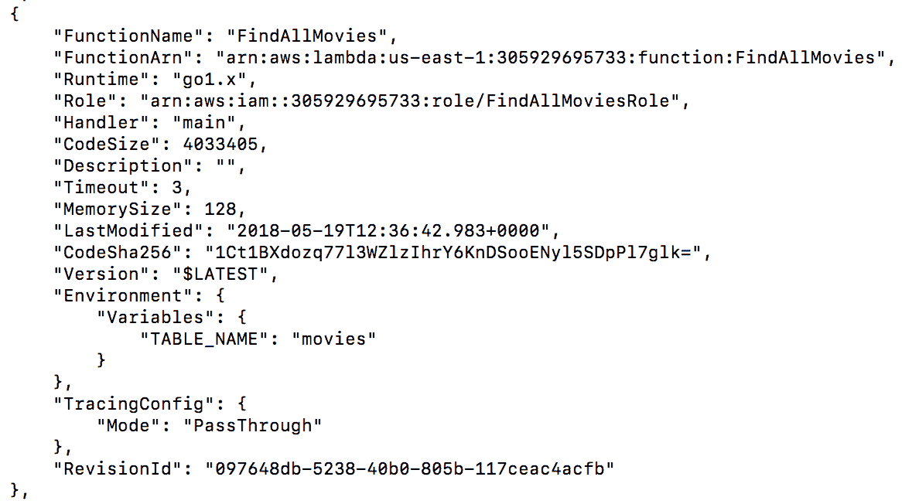

要仅列出一些属性，例如函数名，可以使用`query`过滤器选项，如下所示：

```go
aws lambda list-functions --query Functions[].FunctionName[]
```

# 创建函数命令

如果您已经阅读了前面的章节，您应该熟悉这个命令，因为它已经被多次用于从头创建一个新的 Lambda 函数

除了函数的配置外，还可以使用命令以两种方式提供部署包（ZIP）：

*   **ZIP 文件**：通过`--zip-file`选项提供您正在上传的代码的 ZIP 文件路径：

```go
aws lambda create-function --function-name UpdateMovie \
 --description "Update an existing movie" \
 --runtime go1.x \
 --role arn:aws:iam::ACCOUNT_ID:role/UpdateMovieRole \
 --handler main \
 --environment Variables={TABLE_NAME=movies} \
 --zip-file fileb://./deployment.zip \
 --region us-east-1a
```

*   **S3 Bucket object**：为 S3 Bucket 和 object name 提供`--code`选项：

```go
aws lambda create-function --function-name UpdateMovie \
 --description "Update an existing movie" \
 --runtime go1.x \
 --role arn:aws:iam::ACCOUNT_ID:role/UpdateMovieRole \
 --handler main \
 --environment Variables={TABLE_NAME=movies} \
 --code S3Bucket=movies-api-deployment-package,S3Key=deployment.zip \
 --region us-east-1
```

上述命令将以 JSON 格式返回函数设置的摘要，如下所示：


值得一提的是，在创建 Lambda 函数时，可以使用以下选项基于函数的行为覆盖计算使用和网络设置：

*   `--timeout`：默认执行超时为 3 秒。当达到三秒时，AWS Lambda 终止您的函数。您可以设置的最大超时为五分钟。
*   `--memory-size`：执行时为函数提供的内存量。默认值为 128 MB，最大值为 3008 MB（增量为 64 MB）。
*   `--vpc-config`：在私有 VPC 中部署 Lambda 功能。如果函数需要与内部资源进行通信，那么它可能会很有用，但在理想情况下应该避免，因为它会影响 Lambda 性能和可伸缩性（这将在后面的章节中讨论）。

AWS 不允许您设置函数的 CPU 使用率，因为它是根据为函数分配的内存自动计算的。CPU 使用量与内存成正比。

# 更新函数代码命令

除 AWS 管理控制台外，您还可以使用 AWS CLI 更新 Lambda 函数的代码。该命令需要目标 Lambda 函数名和新部署包。与前面的命令类似，您可以按如下方式提供包：

*   新`.zip`文件的路径：

```go
aws lambda update-function-code --function-name UpdateMovie \
    --zip-file fileb://./deployment-1.0.0.zip \
    --region us-east-1
```

*   存储`.zip`文件的 S3 存储桶：

```go
aws lambda update-function-code --function-name UpdateMovie \
    --s3-bucket movies-api-deployment-packages \
    --s3-key deployment-1.0.0.zip \
    --region us-east-1
```

此操作为 Lambda 函数代码的每次更改打印一个新的唯一 ID（称为`RevisionId`：

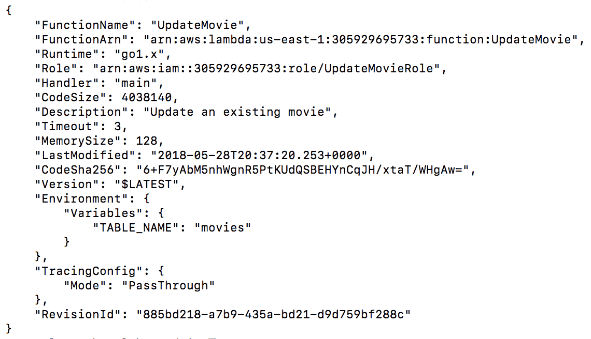

# 获取函数配置命令

要检索 Lambda 函数的配置信息，请发出以下命令：

```go
aws lambda get-function-configuration --function-name UpdateMovie --region us-east-1
```

前面的命令将在使用`create-function`命令时显示的输出中提供相同的信息。

要检索特定 Lambda 版本或别名的配置信息（以下部分），可以使用`--qualifier`选项。

# 调用命令

到目前为止，我们直接从 AWS Lambda 控制台并通过带有 API 网关的 HTTP 事件调用 Lambda 函数。除此之外，可以通过`invoke`命令从 AWS CLI 调用 Lambda：

```go
aws lambda invoke --function-name UpdateMovie result.json

```

前面的命令将调用`UpdateMovie`函数，并将函数的输出保存在`result.json`文件中：


状态代码为 400，这是正常的，因为`UpdateFunction`需要一个 JSON 输入。让我们看看如何使用`invoke`命令为函数提供 JSON。

回到 DynamoDB`movies`表，拿起一部你想要更新的电影。在本例中，我们将更新 ID 为 13 的电影，如下所示：


创建一个带有`body`属性的 JSON 文件，该属性包含新的电影项目属性，因为 Lambda 函数希望输入采用 API 网关代理请求格式：

```go
{
  "body": "{\"id\":\"13\", \"name\":\"Deadpool 2\"}"
}
```

最后，以 JSON 文件作为输入参数再次运行`invoke`函数命令：

```go
aws lambda invoke --function UpdateMovie --payload file://input.json result.json
```

如果打印`result.json`内容，则应返回更新后的电影，如下图：


您可以通过调用`FindAllMovies`函数来验证 DynamoDB 表中的电影名称是否已更新：

```go
aws lambda invoke --function-name FindAllMovies result.json
```

`body`属性应该包含新更新的电影，如下所示：


返回 DynamoDB 控制台；ID 为 13 的电影应具有新名称，如以下屏幕截图所示：


# 删除函数命令

要删除 Lambda 函数，可以使用以下命令：

```go
aws lambda delete-function --function-name UpdateMovie
```

默认情况下，该命令将删除所有函数版本和别名。要删除特定版本或别名，您可能需要使用`--qualifier`选项。

现在，您应该熟悉在 AWS Lambda 中构建无服务器应用时可能使用和需要的所有 AWS CLI 命令。在下一节中，我们将了解如何创建 Lambda 函数的不同版本，以及如何使用别名维护多个环境。

# 版本和别名

在构建无服务器应用时，必须分离部署环境以测试新更改，而不会影响生产。因此，拥有 Lambda 函数的多个版本是有意义的。

# 版本控制

版本表示函数代码和配置的时间状态。默认情况下，每个 Lambda 函数都有指向函数最新更改的`$LATEST`版本，如以下屏幕截图所示：


要从`$LATEST`版本创建新版本，请单击操作并发布新版本。我们称之为`1.0.0`，如下图所示：


将使用 ID=1（增量）创建新版本。注意以下屏幕截图窗口顶部的 ARN Lambda 函数；它的版本 ID 为：

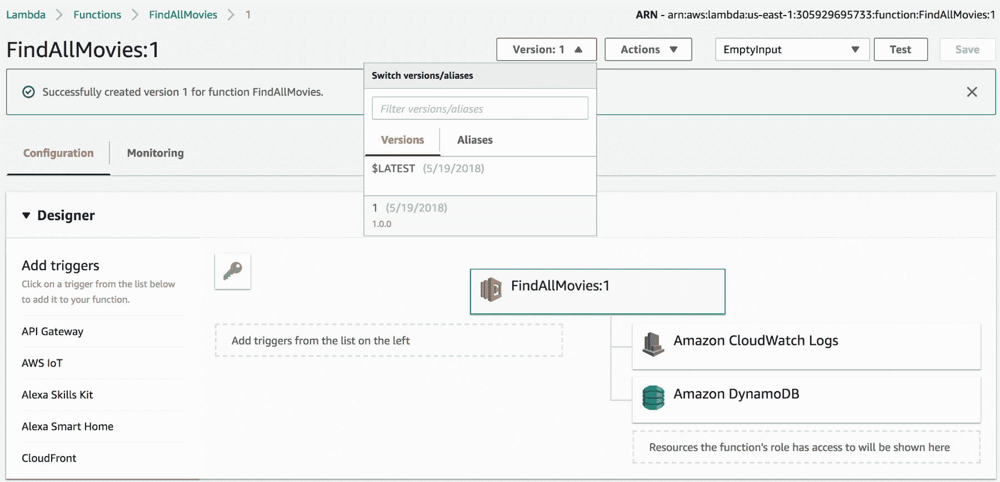

创建版本后，无法更新功能代码，如下所示：


此外，高级设置（如 IAM 角色、网络配置和计算使用）无法更改，如下所示：

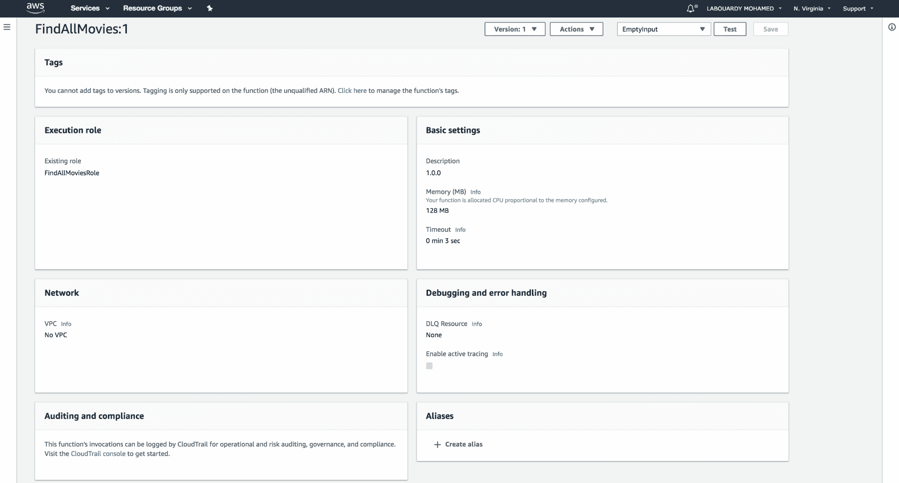

版本被称为**不可变**，这意味着一旦发布就无法更改；只有`$LATEST`版本是可编辑的。

现在，我们知道如何从控制台发布新版本。让我们使用 AWS CLI 发布一个新版本。但首先，我们需要更新`FindAllMovies`功能，因为自发布版本`1.0.0`以来，如果`$LATEST`未做任何更改，我们将无法发布新版本。

新版本将有一个分页系统。该函数将仅返回用户请求的项目数。下面的代码将读取`Count`头参数，将其转换为一个数字，并使用`Scan`操作和`Limit`参数从 DynamoDB 获取电影：

```go
func findAll(request events.APIGatewayProxyRequest) (events.APIGatewayProxyResponse, error) {
  size, err := strconv.Atoi(request.Headers["Count"])
  if err != nil {
    return events.APIGatewayProxyResponse{
      StatusCode: http.StatusBadRequest,
      Body: "Count Header should be a number",
    }, nil
  }

  ...

  svc := dynamodb.New(cfg)
  req := svc.ScanRequest(&dynamodb.ScanInput{
    TableName: aws.String(os.Getenv("TABLE_NAME")),
    Limit: aws.Int64(int64(size)),
  })

  ...
}
```

接下来，我们使用`update-function-code`命令更新`FindAllMovies`Lambda 函数的代码：

```go
aws lambda update-function-code --function-name FindAllMovies \
    --zip-file fileb://./deployment.zip
```

然后，根据当前配置和代码，使用以下命令发布新版本`1.1.0`：

```go
aws lambda publish-version --function-name FindAllMovies --description 1.1.0
```

返回 AWS Lambda 控制台并导航至您的`FindAllMovies`；应使用新 ID=2 创建新版本，如以下屏幕截图所示：


既然已经创建了我们的版本，那么让我们使用 AWS CLI`invoke`命令来测试它们。

# FindAllMovies v1.0.0

使用以下命令在 qualifier 参数中使用 ID 调用`FindAllMovies`v1.0.0 版本：

```go
aws lambda invoke --function-name FindAllMovies --qualifier 1 result.json
```

`result.json`应该在 DynamoDB`movies`表中有所有电影，如下所示：


显示 DynamoDB 电影表中所有电影的输出

# FindAllMovies v1.1.0

创建一个名为`input.json`的新文件，并粘贴以下内容。此函数的版本需要一个名为`Count`的头参数，并返回多个电影：

```go
{
  "headers": {
    "Count": "4"
  }
}
```

执行该函数，但这次使用带路径位置的`--payload`参数到`input.json`文件：

```go
aws lambda invoke --function-name FindAllMovies --payload file://input.json
    --qualifier 2 result.json
```

`result.json`应仅包含四部电影，如预期，如下所示：


这就是如何创建 Lambda 函数的多个版本。但是，Lambda 函数版本控制的最佳实践是什么？

# 语义版本控制

当您发布 Lambda 函数的新版本时，您应该给它一个重要且有意义的版本名，它允许您跟踪函数在整个开发周期中所做的不同更改。

当您构建一个将被数百万客户使用的公共无服务器 API 时，命名不同 API 版本的方式至关重要，因为它可以让您的客户知道新版本是否引入了突破性的更改。它还允许他们选择合适的时间升级到最新版本，而不必冒着中断管道的风险。

这就是语义版本控制（[https://semver.org](https://semver.org) 起作用，是一个使用三位数字序列的版本方案：

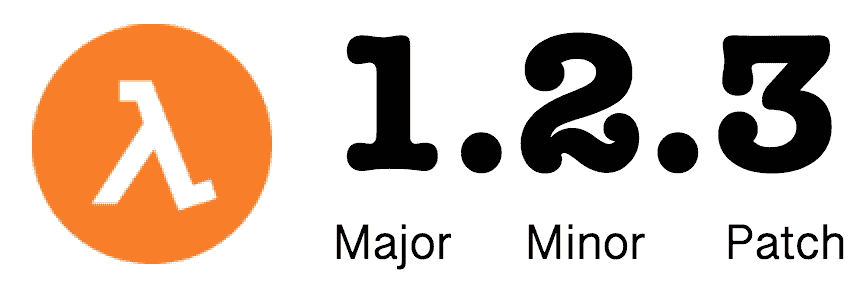

每个数字根据以下规则递增：

*   **主要**：如果 Lambda 函数与以前版本不向后兼容，则增加。
*   **次要**：如果新功能或特性已添加到该功能中且仍向后兼容，则增加。
*   **补丁**：如果 bug 和问题已经修复，且功能仍然向后兼容，则增量。

例如，`FindAllMovies`函数的版本`1.1.0`是第一个主要版本，一个次要版本带来了一个新特性（分页系统）。

# 别名

别名是指向特定版本的指针，它允许您将功能从一个环境升级到另一个环境（例如，过渡到生产）。别名是可变的，不同于不可变的版本。

为了说明别名的概念，我们将创建两个别名，如下图所示：`Production`别名指向`FindAllMovies`Lambda 函数`1.0.0`版本，以及`Staging`别名指向函数`1.1.0`版本。然后，我们将配置 API 网关以使用这些别名，而不是使用`$LATEST`版本：

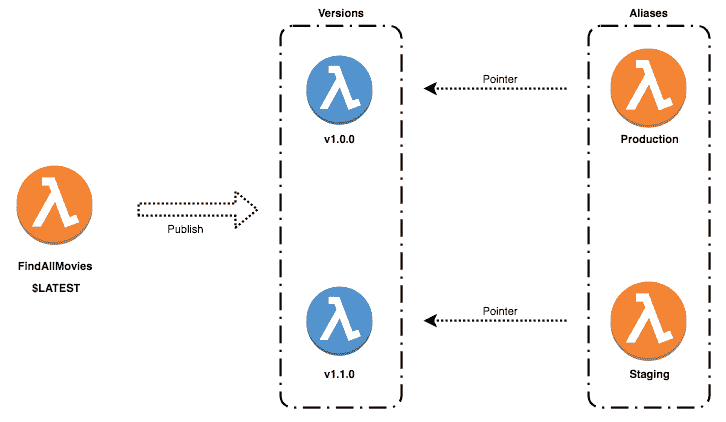

返回`FindAllMovies`配置页面。如果单击**限定符**下拉列表，您将看到一个名为`Unqualified`的默认别名，指向您的`$LATEST`版本，如以下屏幕截图所示：

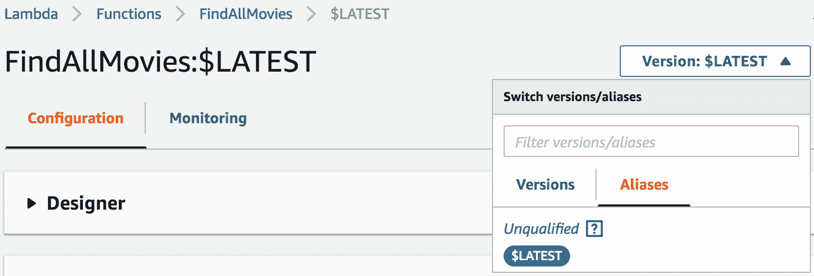

要创建新别名，请单击操作，然后创建名为`Staging`的新别名。选择`5`版本作为目标，如下图：

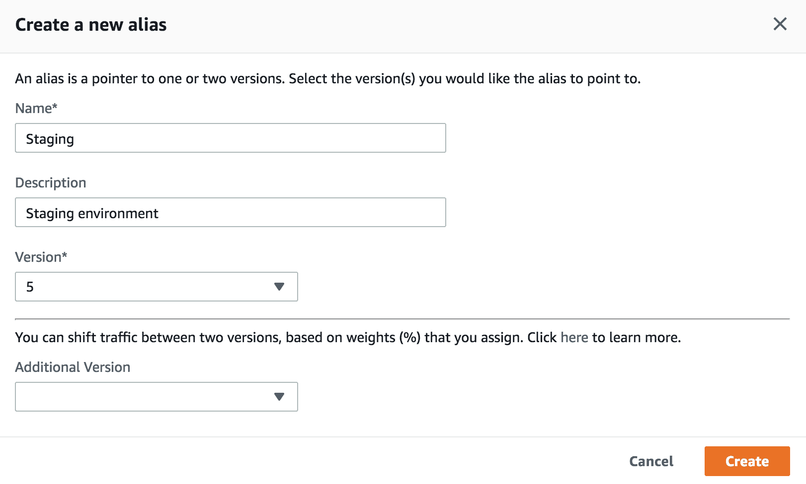

创建后，新版本应添加到别名列表中，如下所示：

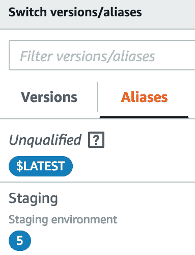

接下来，使用 AWS 命令行为指向版本`1.0.0`的`Production`环境创建一个新别名：

```go
aws lambda create-alias --function-name FindAllMovies \
    --name Production --description "Production environment" \
    --function-version 1
```

同样，应成功创建新别名：


现在我们已经创建了别名，让我们将 API 网关配置为使用带有**阶段变量**的别名。

# 阶段变量

阶段变量是环境变量，可用于更改每个部署阶段的 API 网关方法在运行时的行为。以下部分将说明如何将阶段变量与 API 网关一起使用。

在 API 网关控制台上，导航到`Movies`API，点击`GET`方法，更新目标 Lambda 函数以使用阶段变量而不是硬编码的 Lambda 函数名，如下图所示：

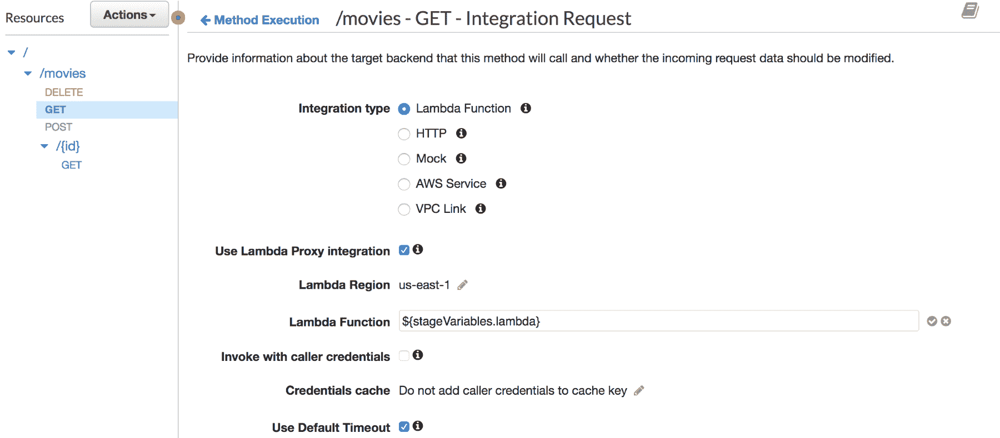

保存时，会出现一个新的提示，要求您授予 API 网关调用 Lambda 函数别名的权限，如以下屏幕截图所示：


执行以下命令以允许 API 网关调用`Production`和`Staging`别名：

*   **生产别名**：

```go
aws lambda add-permission --function-name "arn:aws:lambda:us-east-1:ACCOUNT_ID:function:FindAllMovies:Production" \
 --source-arn "arn:aws:execute-api:us-east-1:ACCOUNT_ID:API_ID/*/GET/movies" \
 --principal apigateway.amazonaws.com \
 --statement-id STATEMENT_ID \
 --action lambda:InvokeFunction
```

*   **登台别名：**

```go
aws lambda add-permission --function-name "arn:aws:lambda:us-east-1:ACCOUNT_ID:function:FindAllMovies:Staging" \
 --source-arn "arn:aws:execute-api:us-east-1:ACCOUNT_ID:API_ID/*/GET/movies" \
 --principal apigateway.amazonaws.com \
 --statement-id STATEMENT_ID \
 --action lambda:InvokeFunction
```

然后，创建一个名为`production`的新阶段，如下一个屏幕截图所示：

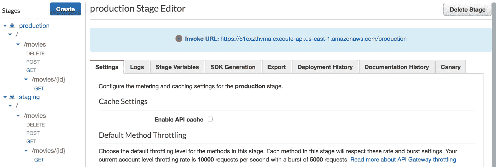

接下来，点击**阶段变量**页签，创建一个新的阶段变量`lambda`并将`FindAllMovies:Production`设置为一个值，如下图：


在`staging`环境中也要这样做，`lambda`变量指向 Lambda 函数的`Staging`别名，如下所示：


要测试端点，请使用`cURL`命令或您熟悉的任何 REST 客户端。我选择邮递员。API 网关的`production`阶段调用 URL 上的`GET`方法应该返回数据库中的所有电影，如下所示：


对登台环境也一样，使用名为`Count=4`的新`Header`键；您应该只返回四个电影项目，如下所示：


这就是如何维护 Lambda 函数的多个环境。您现在可以通过将`Production`指针改为指向`1.1.0`而不是`1.0.0`来轻松地将`1.1.0`版本升级到生产环境中，并且在出现故障时回滚到以前的工作版本，而无需更改 API 网关设置。

# 总结

AWS CLI 对于创建自动化脚本以管理 AWS Lambda 功能非常有用。

版本是不可变的，一旦发布就无法更改。另一方面，别名是动态的，它们的绑定可以随时更改以实现代码升级或回滚。对 Lambda 函数的版本采用语义版本控制可以更容易地跟踪更改。

在下一章中，我们将学习如何从头开始设置 CI/CD 管道，以自动化将 Lambda 函数部署到生产环境的过程。我们还将介绍如何在持续集成工作流中使用别名和版本。