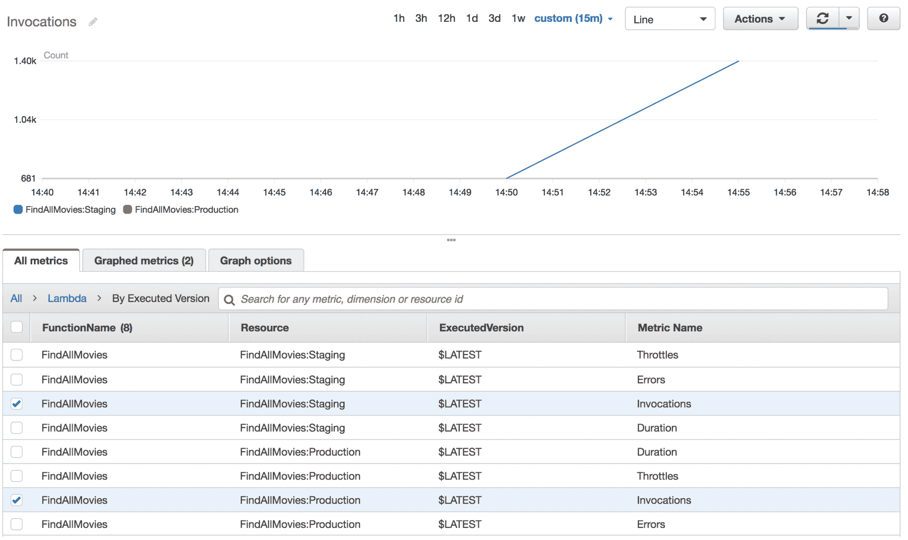
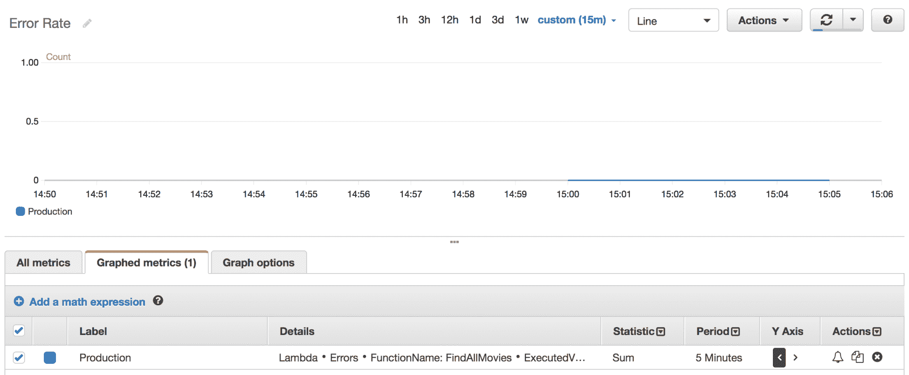

# 监测和故障排除

Lambda 监控不同于传统的应用程序监控，因为您没有管理运行代码的底层基础结构。因此，无法访问操作系统指标。但是，您仍然需要功能级别的监视来优化功能性能，并在出现故障时进行调试。在本章中，您将学习如何实现这一点，以及如何在 AWS 中调试和排除无服务器应用程序的故障。您将学习根据 CloudWatch 中的度量阈值设置警报，以通知潜在问题。您还将了解如何使用 AWS X-Ray 分析应用程序以检测异常行为。

# 使用 AWS CloudWatch 进行监视和调试

AWS CloudWatch 是监控 AWS 服务（包括 Lambda 功能）的最简单、最可靠的解决方案。它是一种集中监控服务，用于收集指标和日志，并根据它们创建警报。AWS Lambda 会自动代表您监控 Lambda 功能，通过 CloudWatch 报告指标

# CloudWatch 度量

默认情况下，每次通过 Lambda 控制台调用函数时，它都会报告有关函数资源使用情况、执行持续时间以及计费时间的关键信息：


通过单击“监视”选项卡，可以快速了解实时情况。此页面将显示多个 CloudWatch 指标的图形表示。您可以在图表区域的右上角控制可观察的时间段：


这些指标包括：

*   调用函数的次数
*   执行时间（毫秒）
*   由于并发保留和未处理事件（死信错误）导致的错误率和限制计数

有关 AWS Lambda 的 CloudWatch 中所有可用指标的列表，请参见[https://docs.aws.amazon.com/lambda/latest/dg/monitoring-functions-metrics.html](https://docs.aws.amazon.com/lambda/latest/dg/monitoring-functions-metrics.html) 。

对于每个度量，您还可以单击度量中的查看，直接查看 CloudWatch 度量：



上图表示过去 15 分钟内调用`FindAllMovies`函数的`production`和`staging`别名的次数。您可以更进一步，创建自己的自定义图。这允许您为 Lambda 函数构建自定义仪表板。它将概述负载（您可能面临的任何问题）、成本和其他重要指标。

此外，您还可以创建自己的自定义指标，并使用 CloudWatch Golang SDK 将其发布到 CloudWatch。下面的代码片段是一个 Lambda 函数的代码片段，该函数使用 CloudWatch SDK 发布自定义度量。该指标表示插入 DynamoDB 的`Action`电影数量（为简洁起见，省略了某些部分）：

```go
svc := cloudwatch.New(cfg)
req := svc.PutMetricDataRequest(&cloudwatch.PutMetricDataInput{
  Namespace: aws.String("InsertMovie"),
  MetricData: []cloudwatch.MetricDatum{
    cloudwatch.MetricDatum{
      Dimensions: []cloudwatch.Dimension{
        cloudwatch.Dimension{
          Name: aws.String("Environment"),
          Value: aws.String("production"),
        },
      },
      MetricName: aws.String("ActionMovies"),
      Value: aws.Float64(1.0),
      Unit: cloudwatch.StandardUnitCount,
    },
  },
})
```

度量由名称、命名空间、维度列表（名称-值对）、值和度量单位唯一定义。将某些值发布到 CloudWatch 后，可以使用 CloudWatch 控制台查看统计图：


现在我们知道了如何使用 AWS 提供的开箱即用指标监控 Lambda 函数，并将自定义指标插入 CloudWatch 以丰富其可观察性。让我们看看如何根据这些指标创建警报，以便在 Lambda 函数出现错误时实时向我们发出警报。

# CloudWatch 警报

CloudWatch 允许您在发生意外行为时根据可用指标创建警报。在下面的示例中，我们将根据`FindAllMovies`功能的错误率创建一个警报：



要实现这一点，请单击“操作”列中的铃声图标。然后，填写以下字段设置警报，如果五分钟内错误数超过`10`将触发警报。一旦触发报警，将使用**简单通知服务**（**SNS**发送电子邮件）：


CloudWatch 将通过 SNS 主题发送通知，您可以根据需要创建任意数量的 SNS 主题订阅，以将通知发送到您想要的位置（SMS、HTTP、电子邮件）。

点击创建报警按钮；您应该会收到一封确认订阅的电子邮件。您必须先确认订阅，然后才能发送通知：


一旦确认，每次 Lambda 函数的错误率超过定义的阈值时，警报将从 OK（正常）状态更改为 ALARM（警报）：


在此之后，将向您发送一封电子邮件，以响应事件：


您可以通过使用此 AWS CLI 命令`aws cloudwatch set-alarm-state --alarm-name ALARM_NAME --state-value ALARM --state-reason demo`临时更改报警状态来模拟报警。

# CloudWatch 日志

使用 AWS Lambda 时，调用函数时可能会遇到以下错误：

*   应用程序错误
*   权限被拒绝
*   超过超时时间
*   内存超出

除了第一个用例外，通过授予正确的 IAM 策略并增加 Lambda 函数的超时或内存使用量，其余的都可以轻松修复。但是，第一个错误需要更多的调试和故障排除，这需要在代码中添加日志语句以验证代码是否按预期工作。幸运的是，每次执行 Lambda 函数的代码以响应事件时，它都会将一个日志条目写入与 Lambda 函数相关联的 CloudWatch 日志组，即`/aws/lambda/FUNCTION_NAME`。

应授予 Lambda 函数以下权限以实现此目的：

```go
{
  "Version": "2012-10-17",
  "Statement": [
    {
      "Sid": "1",
      "Effect": "Allow",
      "Action": [
        "logs:CreateLogStream",
        "logs:CreateLogGroup",
        "logs:PutLogEvents"
      ],
      "Resource": "*"
    }
  ]
}
```

也就是说，您可以使用 Go 的内置日志库，称为`log`包。以下是如何使用`log`包的示例：

```go
package main

import (
  "log"

  "github.com/aws/aws-lambda-go/lambda"
)

func reverse(s string) string {
  runes := []rune(s)
  for i, j := 0, len(runes)-1; i < j; i, j = i+1, j-1 {
    runes[i], runes[j] = runes[j], runes[i]
  }
  return string(runes)
}

func handler(input string) (string, error) {
  log.Println("Before:", input)
  output := reverse(input)
  log.Println("After:", output)
  return output, nil
}

func main() {
  lambda.Start(handler)
}
```

代码是自解释的，它对给定的字符串执行反向操作。我使用`log.Println`方法在代码的各个部分添加了日志语句。

然后，您可以将该函数部署到 AWS Lambda，并从 AWS 控制台或使用`invoke`命令调用该函数。Lambda 自动与 Amazon CloudWatch 日志集成，并将所有日志从您的代码推送到 CloudWatch 日志，该组与 Lambda 函数关联：


到目前为止，我们已经学习了如何使用日志和运行时数据对每个调用进行故障排除和分析。在下一节中，我们将介绍如何在 Lambda 函数的代码中跟踪对外部服务的所有上游和下游调用，以快速轻松地排除错误。为了使用 AWS X-Ray 跟踪所有这些调用，我们将在执行实际工作的不同代码段中添加代码插装。

有许多第三方工具可用于监视依赖 CloudWatch 的无服务器应用程序。因此，他们在实时性问题上也失败了。随着 AWS 快速推出新的服务和功能，我们预计这一问题将在未来得到解决。

# AWS X 射线追踪

AWS X-Ray 是一种 AWS 托管服务，允许您跟踪 Lambda 函数发出的传入和传出请求。它以段的形式收集这些信息，并使用元数据记录附加数据，以帮助您调试、分析和优化功能。

总的来说，X 射线可以帮助您确定性能瓶颈。但是，它可能需要在函数执行期间进行额外的网络调用，从而增加面向用户的延迟。

要开始，请从 Lambda 函数的配置页面启用活动跟踪：


要使 Lambda 函数将跟踪段发布到 X 射线，需要以下 IAM 策略：

```go
{
  "Version": "2012-10-17",
  "Statement": {
    "Effect": "Allow",
    "Action": [
      "xray:PutTraceSegments",
      "xray:PutTelemetryRecords"
    ],
    "Resource": [
      "*"
    ]
  }
}
```

接下来，导航到 AWS X-Ray 控制台，单击跟踪，调用 Lambda 函数几次，然后刷新页面。新行将添加到跟踪列表中。对于每个跟踪，您将获得代码响应和执行时间：


这里是`FindAllMovies`函数的轨迹；它包括 Lambda 初始化函数所需的时间：


您还可以通过单击服务地图项目，以图形格式显示此信息：


对于每个跟踪调用，Lambda 将发出 Lambda 服务段及其所有子段。此外，Lambda 将发出 Lambda 函数段和 init 子段。无论函数的运行时如何，都将发出这些段，并且不需要任何代码更改或附加库。如果希望 Lambda 函数的 X 射线跟踪包含下游调用的自定义段、注释或子段，则可能需要安装以下 X 射线 Golang SDK：

```go
go get -u github.com/aws/aws-xray-sdk-go/...
```

使用`Configure`方法更新`FindAllMovies`功能代码以配置 X 射线：

```go
xray.Configure(xray.Config{
  LogLevel: "info",
  ServiceVersion: "1.2.3",
})
```

我们将通过使用`xray.AWS`调用包装 DynamoDB 客户端，在子段中跟踪对 DynamoDB 的调用，如下代码所示：

```go
func findAll(ctx context.Context) (events.APIGatewayProxyResponse, error) {
  xray.Configure(xray.Config{
    LogLevel: "info",
    ServiceVersion: "1.2.3",
  })

  sess := session.Must(session.NewSession())
  dynamo := dynamodb.New(sess)
  xray.AWS(dynamo.Client)

  res, err := dynamo.ScanWithContext(ctx, &dynamodb.ScanInput{
    TableName: aws.String(os.Getenv("TABLE_NAME")),
  })

  ...
}
```

再次调用 X 光`Traces`页面上的 Lambda 函数；将添加一个新的子段，其中包含扫描`movies`表所花费的时间：


DynamoDB 调用也将在 X 射线控制台的服务地图上显示为下游节点：


现在我们已经熟悉了 X 射线的工作原理，让我们创建一些复杂的东西。考虑一个简单的 lambda 函数，它将电影海报页面的 URL 作为输入。它解析 HTML 页面，删除数据，并将其保存到 DyDoDB 表中。此函数将对给定 URL 执行`GET`方法：

```go
res, err := http.Get(url)
if err != nil {
  log.Fatal(err)
}
defer res.Body.Close()
```

然后，它使用`goquery`库（**JQuery**基于 Go 的实现）使用 CSS 选择器从 HTML 页面中删除数据：

```go
doc, err := goquery.NewDocumentFromReader(res.Body)
if err != nil {
  log.Fatal(err)
}

title := doc.Find(".header .title span a h2").Text()
description := doc.Find(".overview p").Text()
cover, _ := doc.Find(".poster .image_content img").Attr("src")

movie := Movie{
  ID: uuid.Must(uuid.NewV4()).String(),
  Name: title,
  Description: description,
  Cover: cover,
}
```

创建电影对象后，它使用`PutItem`方法将电影保存到 DynamoDB 表：

```go
sess := session.Must(session.NewSession())
dynamo := dynamodb.New(sess)
req, _ := dynamo.PutItemRequest(&dynamodb.PutItemInput{
  TableName: aws.String(os.Getenv("TABLE_NAME")),
  Item: map[string]*dynamodb.AttributeValue{
    "ID": &dynamodb.AttributeValue{
      S: aws.String(movie.ID),
    },
    "Name": &dynamodb.AttributeValue{
      S: aws.String(movie.Name),
    },
    "Cover": &dynamodb.AttributeValue{
      S: aws.String(movie.Cover),
    },
    "Description": &dynamodb.AttributeValue{
      S: aws.String(movie.Description),
    },
  },
})
err = req.Send()
if err != nil {
  log.Fatal(err)
}
```

现在定义了我们的函数处理程序，将其部署到 AWS Lambda，并通过将 URL 作为输入参数对其进行测试。因此，电影信息将以 JSON 格式显示：


如果将浏览器指向前几章中构建的前端，则新电影应该是页面中列出的电影的一部分：


现在我们的 Lambda 函数按预期工作；让我们向下游服务添加跟踪调用。首先，配置 X 光并使用`ctxhttp.Get`方法将`GET`调用作为子段插入仪器：

```go
xray.Configure(xray.Config{
  LogLevel: "info",
  ServiceVersion: "1.2.3",
})

// Get html page
res, err := ctxhttp.Get(ctx, xray.Client(nil), url)
if err != nil {
  log.Fatal(err)
}
defer res.Body.Close()
```

接下来，围绕解析逻辑创建一个子段。该子段被称为`Parsing`，并且`AddMetaData`方法已被用于记录关于该子段的附加信息，以便进行故障排除：

```go
xray.Capture(ctx, "Parsing", func(ctx1 context.Context) error {
  doc, err := goquery.NewDocumentFromReader(res.Body)
  if err != nil {
    return err
  }

  title := doc.Find(".header .title span a h2").Text()
  description := doc.Find(".overview p").Text()
  cover, _ := doc.Find(".poster .image_content img").Attr("src")

  movie := Movie{
    ID: uuid.Must(uuid.NewV4()).String(),
    Name: title,
    Description: description,
    Cover: cover,
  }

  xray.AddMetadata(ctx1, "movie.title", title)
  xray.AddMetadata(ctx1, "movie.description", description)
  xray.AddMetadata(ctx1, "movie.cover", cover)

  return nil
})
```

最后，用`xray.AWS()`调用包装 DynamoDB 客户端：

```go
sess := session.Must(session.NewSession())
dynamo := dynamodb.New(sess)
xray.AWS(dynamo.Client)
```

因此，以下子段将出现在`ParseMovies`Lambda 函数的记录道中：


如果单击“元数据”选项卡上的“子分段–解析”，则电影属性将显示如下：


在服务映射上，还将显示对 DynamoDB 的下游调用和传出 HTTP 调用：


到目前为止，您应该清楚地知道如何轻松地解决性能瓶颈、延迟峰值和其他影响基于 Lambda 的应用程序性能的问题。

跟踪 Lambda 函数时，X 射线守护进程将自动在 Lambda 环境中运行，以收集跟踪数据并将其发送给 X 射线。如果要在将 X 射线守护进程部署到 Lambda 之前测试功能，可以在本地运行 X 射线守护进程。可在此处找到分步安装指南：[https://docs.aws.amazon.com/xray/latest/devguide/xray-daemon-local.html](https://docs.aws.amazon.com/xray/latest/devguide/xray-daemon-local.html) 。

# 总结

在本章中，您学习了如何使用 AWS CloudWatch 指标近实时监控 Lambda 函数。您还学习了如何发布自定义指标并检测警报和报告问题。此外，我们还介绍了如何将函数的代码日志流式传输到 CloudWatch。最后，我们了解了如何使用 AWS X-Ray 进行调试，如何跟踪上游和下游调用，以及如何将 X-Ray SDK 与 Golang 中的 Lambda 集成

在下一章中，您将了解如何保护无服务器应用程序。