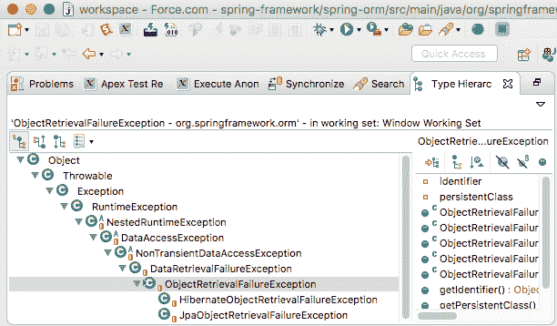
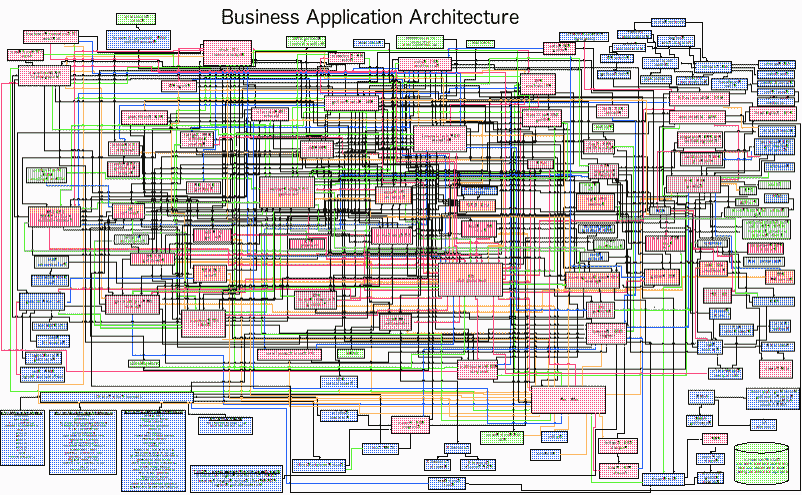
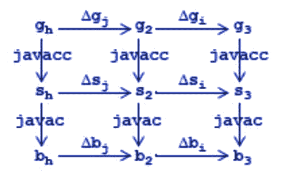
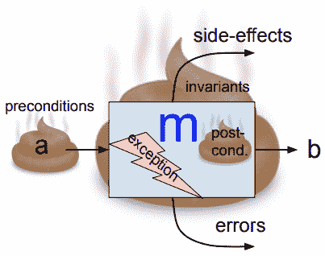
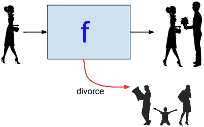
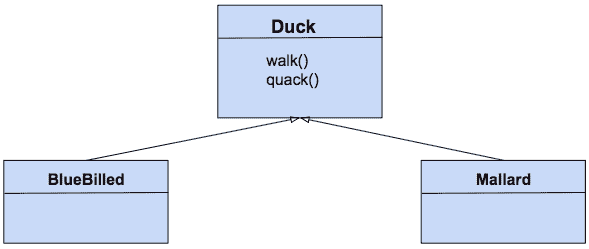
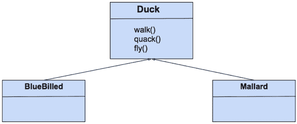
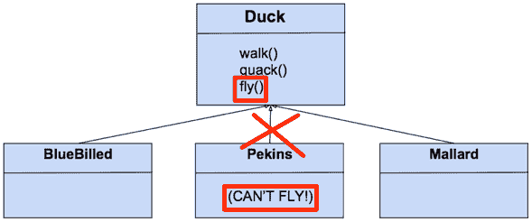

# 四、Go 中的 SOLID 设计

见过类似于*的评论吗？如果你喜欢设计模式，请使用 Java，而不是 Go*？

在本章中，我们将讨论关于软件设计模式的常见观点，以及它们如何适合开发高质量的 Go 应用程序。

本章的目标是了解以下主题：

*   为什么许多地鼠讨厌爪哇
*   为什么 Go 不支持继承
*   良好软件设计的原则
*   如何在 Go 中运用单一责任原则
*   开放/封闭原则
*   鸭子在 Go 中打字
*   如何使用接口在 Go 中建模行为
*   如何利用界面分离原理编写软件
*   内部类型升级和如何嵌入接口

## 为什么许多地鼠讨厌爪哇

*如果您喜欢设计模式，请使用 Java，而不是 Go。*

让我们想想这个想法是从哪里来的。Java（和 C++一样）倾向于关注类型层次结构和类型分类法。

以 Spring 框架中的`ObjectRetrievalFailureException`类为例：



这看起来太复杂了，太抽象了，对吧？

与 Java 不同，Go 被设计成一种实用的语言，在这种语言中，我们不会迷失在无限的继承和类型层次结构中。

当我们用一种非常强调类型层次结构、抽象层次和类继承的语言实现一个解决方案时，我们的代码重构往往更加耗时。在我们开始编码之前，最好先把设计做好。在实现 Java 解决方案时，利用设计模式可以节省大量时间。

继承在面向对象编程中创建了高度耦合。在前面的示例中，`DataAccessException`类中的更改可能会在层次结构中它上面的每个类中造成不必要的副作用。

很容易理解为什么有人会认为 Go 中没有设计模式的位置。

如果 C++和 java 是关于类型层次结构和类型的分类，那么 GO 就是关于构图的。

-罗布派克

然而，通过仔细使用抽象，软件设计模式可以完全兼容 Go 的可组合简单设计理念。

### 厌恶 Java 的更多原因

考虑下表：

|  | **Java** | **歌朗** |
| **语言规范**（PDF） | 788 页（[https://docs.oracle.com/javase/specs/jls/se8/jls8.pdf](https://docs.oracle.com/javase/specs/jls/se8/jls8.pdf) ） | 89 页（[https://golang.org/ref/spec](https://golang.org/ref/spec) ） |
| **Java JDK vs Go SDK**（压缩） | 279.59 MB（[http://jdk.java.net/9/](http://jdk.java.net/9/) ） | 13MB |
| **并发实现复杂性** | 困难的 | 容易的 |

下图从较高的层次比较了 Java 和 Go 技术堆栈：


Java/JVM 替代方案的占地面积要大得多；JVM 做的更多（应用程序将使用其中一些），并且需要更多的 RAM。此外，由于 Java/JVM 解决方案的原始源代码比 Go 多，这意味着黑客的攻击面更大。表演 JIT 编译器需要时间将应用程序的源代码转换为可执行的二进制代码，而不是本机编译的 Go。

Go 更小更简单。Java 是为盈利而创建的，并且一直在积极地进行市场推广。Go 是没有市场的。有一个简化的流程来提议对 Go 语言的更改。参见附录中的“如何提出变更建议”。（我还没有发现对 Java 或 JVM 提出修改的过程，但我只能想象这将需要更多的时间和精力）。

鉴于前面对 Go v 的比较。Java 它似乎可以归结为简单性 v。复杂性地鼠倾向于简单。

“越少越好。”

-罗布派克

### 深入研究错误处理

在 Java 中，当方法中发生异常时，创建异常对象并将其移交给运行时环境的过程称为抛出异常。

当这种情况发生时，程序的正常流程将停止，JRE 将尝试在调用堆栈中找到一个可以处理引发的异常的处理程序。

exception 对象包含大量调试信息，例如异常发生的行号、异常类型、方法层次结构、调用堆栈等。

Java 中存在几十种常见的异常处理反模式，这主要是由于设计和对 Java 类型层次结构的正确使用的误解。

“不要只检查错误，要优雅地处理它们。”

-戴夫·切尼

我们可以断言错误实现了特定的行为，而不是断言错误是特定的类型或值并传递该行：

```go
type errorBehavior interface {
       Retryable() bool
}

func IsRetryable(err error) bool {
       eb, ok := err.(errorBehavior)
       return ok && eb.Retryable()
}
```

如果发生`IsRetryable`错误，则调用方将知道他们可以重试生成错误的操作。调用者不需要导入实现抛出错误的库并尝试理解其类型层次结构的复杂性来正确处理错误。

`github.com/pkg/errors`包允许您使用上下文包装错误，以便以后可以恢复如下原因：
`func IsRetryable(err error) bool {`
`eb, ok := errors.Cause(err).(errorBehavior)`
`return ok && eb.Retryable()`
`}`

检查错误值后，应处理一次。在 Go 中，重新打包错误并将其提交给另一个处理程序处理并不是最佳做法。

#### 对话-Java 开发人员、惯用 Go 开发人员、FP 开发人员

Java 开发者：我讨厌到处写`if err != nil`。

开发人员：习惯它。

Java 开发者：为什么不抛出一个异常，让调用链上的处理程序来处理呢？

Go 开发者：所有优秀的程序员都很懒惰，这是额外的打字。

| **显影剂** | **对话** |
| JAVA | 我讨厌到处写作 |
| 去 | 习惯它。 |
| JAVA | 为什么不抛出一个异常，让调用链上的处理程序来处理呢？这就减少了输入，所有优秀的程序员都很懒，对吗？ |
| 去 | 应始终立即处理错误。如果我们的`buggyCode`函数返回了一个错误，而我们仍在继续处理，该怎么办？你能看出这是多么脆弱和错误吗？

```go
val, err := buggyCode()
// more code
return val, err
```

 |
| 计划生育 | 抛出 Java 异常最让我烦恼的是，当我们抛出一个错误来处理另一个函数时，我们只是产生了一个副作用。我们的功能并不纯粹。我们在应用程序中引入了不确定性。由于调用堆栈中的任何调用方都可以处理异常，我们如何知道哪个处理程序处理它？由于我们编写了最接近错误的代码，因此我们应该比任何其他开发人员都更清楚发生了什么以及如何最好地处理它。 |
| JAVA | 可以我明白了，但我不仅懒惰，而且如果`err != nil`代码看起来像脚手架一样，把我的代码弄得乱七八糟，让我想呕吐，我就需要额外的钱。让我用几张照片来澄清我的感受。 |

我们的守则：


| JAVA | 你能看到区别，对吗？ |
| 去 | 触碰！但您需要认识到，我主要感兴趣的是对正确性胜过美观的后端系统进行编程。您可以使用漂亮的 J2EE 企业业务应用程序，并使用任意多的异常处理程序包装它们。 |
| JAVA | 认真地你说你喜欢简单，但更多的代码在我看来更复杂。这需要维护更多的代码。这意味着我不必选择在一个地方处理所有的错误处理，而必须在整个应用程序中插入一些错误处理代码片段？倒霉！我绝对喜欢 Go 的快速编译时间、Go 的微小占地面积、并发应用程序的易编程性等等。我很沮丧。Go 中是否没有更好的错误处理解决方案？ |
| 计划生育 | 很高兴你这么问。根据你想要完成什么，有更好的方法。这种方法不仅允许您在一个地方处理所有错误，而且还可以使用纯 FP 的决定论来处理这些错误。 |
| 去 | 我现在就不读这本书了，因为这是行不通的。 |
| JAVA | 是 啊有什么问题吗？ |
| 计划生育 | 解决方案需要思考、时间和艰难的决定，但就像学习骑自行车一样。一旦你站起来开始跑步，你就会继续这样做。这很有趣，能让你更高效地到达你想去的地方，对你有好处。 |
| JAVA | 它叫什么？ |
| 计划生育 | 词法工作流解决方案 |
| 去 | 你抓住我了。我还在看书。只要说得够长，这是一个荒谬的说法，而这个名字更是如此。 |
| 计划生育 | 我知道这听起来像魔术，而且有点像。它建立在一个更荒谬的名字之上：Y 组合子和单子。但在讨论细节之前，我们还有一段路要走。这需要思考、时间和决策技巧。 |
| JAVA | 有什么要决定的？如果行得通，我就用它。 |
| 计划生育 | 词法工作流解决方案的最佳使用案例是您想要转换的数据所在的位置。您是否有输入数据、以某种方式转换数据然后生成输出的工作流？这涵盖了许多业务用例场景和一些系统级场景。 |
| JAVA | 听起来不错。它做什么和不做什么？ |
| 计划生育 | 它处理典型的工作流用例，当您遇到错误时，将处理该错误，并且该工作流中不会发生进一步的处理。如果您希望即使有错误也能继续处理，那么最好使用应用程序函子。如果 Go 支持 TCO，那么这将为更多的 FP 可能性打开大门。目前，我们需要保持它的真实性（不必担心堆栈溢出或使用递归的性能影响）。如果 Go 确实支持 TCO，那么美国 FP 编码器将能够推出大量健壮、富有表现力和高性能的 FP 解决方案。 |

## 软件设计方法

软件设计是我们：

*   收集需求
*   根据需求创建规范
*   根据规范实施解决方案
*   检查结果并迭代以改进解决方案

传统的瀑布式开发依赖于一开始就对产品需求的完美理解，以及在每个阶段执行的最小错误。来源：[http://scrumreferencecard.com/scrum-reference-card/](http://scrumreferencecard.com/scrum-reference-card/)


Scrum 将所有开发活动混合到每个迭代中，以固定的时间间隔适应发现的现实：


来源：[http://scrumreferencecard.com/scrum-reference-card/](http://scrumreferencecard.com/scrum-reference-card/)

在创建规范的过程中，经常会创建诸如**统一标记语言**（**UML**图）等工件，以帮助我们思考问题并制定可行的解决方案。

分析是我们模拟现实世界操作的地方，将各个部分分解为各个组件。设计是我们根据分析工作、我们的 IT 环境和我们可以使用的框架/技术堆栈来设计软件解决方案的地方。

我们把所有不相关的顾虑都抽离了。因此，在分析和设计过程中，我们将问题分解成可以做简单事情的组件。

实现就是当我们把这些简单的东西重新组合起来。

### 好设计

好的设计是为了长远节约资金。

如果我们的项目很小，上市时间价值很高，那么我们可以跳过设计过程。否则，我们应该努力进行适当的软件设计。这是一个普遍的事实，不管技术如何（Java、Go 等等）。

### 糟糕的设计

如果我们的应用程序架构图与下面的类似，则说明我们未能正确设计我们的应用程序：



简单并不容易，但值得努力。

我们向已经复杂的系统中添加的功能越多，它就变得越复杂。

在这样的系统中，我们不能一次考虑一件事；我们必须一起思考所有可能破坏我们系统的事情，以及所有可能的奇怪的互动。

#### 随着时间的推移，好的设计与坏的设计

下图描述了一段时间内良好设计的价值。与大多数图表一样，*x*轴描绘了时间的进程。我们在*y*轴上走得越高，我们的应用程序的功能和特性就越丰富。在**设计收益线**下方，没有设计或设计不佳的应用程序可以快速产生结果。

然而，由于缺乏设计，应用程序变得脆弱、不可扩展且难以理解：


经过适当设计的应用程序可以很容易地进行扩展，并且从长远来看更易于维护。

“90%以上的软件成本发生在维护阶段。”

-弗雷德·布鲁克斯，神话中的人月

## 实体设计原则

**面向对象编程**（**OOP**的坚实设计原则适用于 Go 软件解决方案的设计。

### 单一责任原则

单一责任原则说，*做一件事，把它做好*。我们可以在 Go 标准库中看到 SRP 的作用。这里有几个例子：


如果 pull 请求增强了`aes/crypto`包，您是否希望代码合并会影响`database/sql/driver`包（或任何包）的功能？不，当然不是。每个包都有清晰的名称间隔和高度的内聚性；他们执行特定的任务，不涉及其他问题。

一个类应该有一个且只有一个更改的原因

–罗伯特·C·马丁

当 Martin 先生说一个类应该只有一个改变的理由时，很明显他在谈论 OOP 设计，但同样的原则也适用于我们的 Go 应用程序。除了显示不同的金额外，税务计算更新是否应影响任何报告的用户界面或布局？不，为什么？因为一个是化妆品，另一个不是。这是两个独立的职责，应该由不同的松散耦合的类/模块来处理。

我们的类/模块应该具有高度的内聚性，尽可能扮演特定的角色。具有单一职责的代码可以更好地处理不断变化的需求，而不会对应用程序的其他部分产生不利影响。如果我们有一个更改类/模块的请求，并且由于它只做一件事，那么更改的原因只能与它的一个职责相关。

SRP 的应用将推动我们的设计朝着越来越小的接口方向发展。最终，我们将到达最终接口。这个接口只有一个方法。例如，在[第 5 章](05.html)中*添加了装饰功能*中，我们将看到 Go 的免费读写器界面：

```go
type Reader interface {
   Read(p []byte) (n int, err error)
}
type Writer interface {
   Write(p []byte) (n int, err error)
}
```

SRP 对 FP 的意义与 Unix 理念一致。

“尽管这一理念不能用一句话来概括，但其核心思想是，系统的力量更多地来自程序之间的关系，而不是程序本身。许多 UNIX 程序单独做一些琐碎的事情，但与其他程序结合起来，就成了通用和有用的工具。”

-罗布派克

在 lambda 演算中，每个函数只有一个参数。看起来我们的纯函数可以接受多个参数，但实际上它只是在处理参数。我们的函数接受列表中的第一个参数，并返回一个接受其余参数的函数；它将继续处理每个参数，直到它们全部被消耗。当每个函数只接受一个参数时，函数组合就起作用。

```go
three := add(1, 2)
func add1 := + 1
three == add1(2)
```

这是我们做咖喱时的伪代码。它将双参数调用转换为单参数调用。Currying 存储数据（数字 1）和操作（加法运算符），以供以后使用。这是 OOP 中的对象吗？

#### 功能组合

函数组合是指我们将两个较小的函数组合在一起，创建一个新函数，以实现与两个较小函数相同的目标。这两种方式都让我们从`a`到`c`。下面，`f<sub>1</sub>`接受一个`a`并返回一个`b`。`f<sub>2</sub>`接受`b`并返回`c`。我们可以组合/组合这两个函数，得到一个接受`a`并返回`c`的函数：


功能组合是纯 FP 的基石；它允许我们从较小的抽象中构建更大的抽象。

### 开闭原理

软件应为扩展打开，但为修改关闭。在结构中嵌入字段允许我们用一种类型扩展另一种类型。嵌入另一个（`Car`的对象（`CarWithSpare`）可以访问其字段和方法。`CarWithSpare`对象可以调用`Car`方法，但不能修改`Car`对象的方法。因此，Go 的类型在*打开进行扩展*的同时*关闭进行修改*。让我们看一个例子：

```go
package car

import "fmt"

type Car struct {
   Make string
   Model string
}
func (c Car) Tires() int { return 4 }
func (c Car) PrintInfo() {
   fmt.Printf("%v has %d tires\n", c, c.Tires())
}
```

我们定义了我们的`Car`类型和两种方法`Tires`和`PrintInfo`。接下来，我们将定义我们的`CarWithSpare`类型，并将`Car`类型嵌入为未命名字段：

```go
type CarWithSpare struct {
   Car
}
func (o CarWithSpare) Tires() int { return 5 }
```

在我们的`main.go`文件中，我们创建了一个本田雅阁，并调用它的`PrintInfo`方法。正如所料，它返回`4`轮胎。

接下来，我们创建一个丰田 Highlander，但当我们打印其信息时，它打印的是`4`轮胎，而不是`5`。为什么？

```go
package main

import (
   . "car"
 "fmt"
)

func main() {
   accord := Car{"Honda", "Accord"}
   accord.PrintInfo()
   highlander := CarWithSpare{Car{"Toyota", "Highlander"}}
   highlander.PrintInfo()
   fmt.Printf("%v has %d tires", highlander.Car, highlander.Tires())
}
```

以下是输出：

```go
{Honda Accord} has 4 tires
{Toyota Highlander} has 4 tires
{Toyota Highlander} has 5 tires
```

这是因为`PrintInfo`是`Car`的一个方法，但由于`CarWithSpare`缺少该方法，当我们调用`highlander.PrintInfo`时，我们实际上是在执行`Car`的方法（而不是`CarWithSpare`。

为了打印 highlander 的实际轮胎数量，我们必须通过直接在`fmt.Printf`语句中执行`highlander.Tires`来手动委托调用。

我们还有其他选择吗？对我们可以覆盖`PrintInfo`方法。换句话说，我们可以为我们的`CarWithSpare`定义一个`PrintInfo`方法，如下所示：

```go
func (c CarWithSpare) PrintInfo() {
   fmt.Printf("%v has %d tires\n", c, c.Tires())
}
```

以下是输出：

```go
{Honda Accord} has 4 tires
{Toyota Highlander} has 5 tires
{Toyota Highlander} has 5 tires
```

如果我们再打一次电话怎么办？我们得到以下输出：

```go
{Honda Accord} has 4 tires
```

因此，Go 允许我们：

*   隐式调用嵌入对象的方法（如果未定义）
*   手动委托以调用对象的方法
*   重写嵌入对象的方法

方法重载呢？

不允许。如果我们试图创建另一个具有不同参数签名的`PrintInfo`方法，Go 将抛出一个编译器错误：


在下一章中使用 decorator 模式，我们将看到如何在不修改现有代码的情况下扩展功能。

#### 函数式编程中的开/关原理

与前面的 Go 示例类似，我们在基本类型（`Car`中添加了一个新方法（`PrintInfo`），纯函数式编程语言也在现有数据类型上添加了新函数，而无需重新编译现有代码，同时保持静态类型安全。

*表达式问题*也称为*扩展性问题*解决了软件语言以类型安全方式向程序添加新方法和类型的能力。有关详细信息，请参见**面向功能的软件开发**（**FOSD**）程序多维数据集，其中包含一个基本程序（在称为**软件产品线**的相关程序系列中）（[http://softwareproductlines.com/](http://softwareproductlines.com/) 通过增加功能来生成复杂的程序。

下图显示了如何通过从功能组合模型，然后将这些模型转换为可执行文件来构建程序：



FOSD 方法论主张，可以通过增量添加功能来构建复杂系统，其中域模型是函数和常量，并且可以生成表示为表达式的程序来执行特定任务。

#### 幻想世界 JavaScript 规范

`FantasyLand`项目规定了通用代数结构的互操作性：


层次结构图中的每一种数据类型都被称为代数数据类型，因为每一种数据类型都由代数组成，即一组值、一组闭合的运算符以及它必须遵守的规则。

让我们举一个简单的例子，Stimo.

##### 集形代数

以下是 Setoid 规则：

| **规则名称** | **说明** |
| 自反性 | `a.equals(a) === true` |
| 对称性 | `a.equals(b) === b.equals(a)` |
| 及物性 | 若`a.equals(b)`和`b.equals(c)`，则`a.equals(c)` |
|  | 如果`b`与`Ord`不相同，则`lte`的行为未指明（建议返回 false）。`lte`必须返回布尔值（`true`或`false`。 |

规则中使用的值为`a`、`b`和`c`。具有`Ord`的值必须提供`lte`方法。equals 方法是这个代数的运算符，它只需要一个参数。

就这样。就这些！

##### Ord 代数

以下是`Ord`规则：

| **规则名称** | **说明** |
| 总体 | `a.lte(b)`或`b.lte(a)` |
| 反对称 | 若`a.lte(b)`和`b.lte(a)`，则`a.equals(b)` |
| 及物性 | 若`a.lte(b)`和`b.lte(c)`，则`a.lte(c)` |
|  | `b`必须是与`a`相同的`Ord`值。如果`b`不是同一个 Setoid，那么 equals 的行为是未指定的（建议返回 false）。`equals`变量必须返回布尔值（`true`或`false`。 |

规则中使用的值为`a`、`b`和`c`。具有 Setoid 的值必须提供一个`lte`方法。`lte`方法是这个代数的运算符，它需要一个参数。

从上图中我们可以看到，`Ord`是一个 Setoid，因此`Ord`有一个`Equals`操作符，`Ord`必须遵守 Setoid 所遵循的规则，以及它自己的规则。

在本书的后面，我们将探讨 Haskell 的类型类层次结构，并研究函子、单群和单元代数。

#### 表达问题

不同的语言以不同的方式解决表达问题：

*   公开课
*   多种方法
*   函子的余积
*   类型类
*   目标代数

他们解决的问题与我们在`CarWithSpare`示例中看到的问题相同；这一切都是关于如何在现有数据类型上添加新函数，而不必重新编译现有代码，同时保持静态类型安全。

Go 对表达式问题有基本的支持。类型类、对象代数等。不是 Go 标准库的一部分，但没有任何东西阻止我们构建上述任何解决方案。这是一个很好的开始：[https://github.com/SimonRichardson/wishful](https://github.com/SimonRichardson/wishful) 。

### 里氏代换原则

在 OOP 术语中，*Liskov 替换原则*表示相同类型或子类型的对象应该被替换，并且可以被其他对象替换，而不会影响调用者。换句话说，当我们实现一个接口时，我们的类应该实现接口中定义的所有方法并满足所有接口要求。更不用说，*满足**接口合同*。

编译器将强制我们的方法具有正确的签名。LSP 更进一步，要求我们的实现也应该具有超类或接口文档中声明或暗示的相同不变、后条件和其他属性。

#### 这种面向对象的方法很糟糕

这就是 OOP 世界中方法契约的样子：



我们的方法`m`传递了一个`a`，进行一些处理并返回`b`。可能会发生异常，可以捕获和处理异常，也可以不捕获和处理异常，并返回错误。此外，为了使该方法能够适当地满足其合同要求，我们需要阅读文档（当然，文档总是完全准确和最新的……不是！），希望我们能够涵盖所有先决条件、不变条件和后决条件。

**不变量**在方法的生命周期中必须始终为真。例如，如果我们的类有一个 duration 成员变量，则该值必须始终为正浮点。另一个例子是，我们的内部纬度和经度值必须始终位于北半球。我们甚至可以编写不变性验证器私有方法，以确保不变性符合其可接受值的范围。

**先决条件**在调用方法时必须为真。例如，在我们执行`consummateMarriage`方法之前，我们应该确保我们选择的`wouldBeSpouse`尚未与另一方结婚；否则，我们很可能会违反本州的反一夫多妻制法律。我们可能会通过执行另一个`verifyPersonIsSingle`方法来进行检查。

我们不要忘记**后条件**。一个例子可能是：在执行我们的`consummateMarriage`方法后，我们应该确保与我们达成协议的人实际上是我们结婚证书上的同一个人。嫁错人会引起各种各样的问题。

最后一个需要处理的问题是*副作用*。副作用是当我们的方法改变它输出的**b**（或错误）以外的内容时发生的情况。例如，如果我们的事后条件检查导致私人调查公司收取信用卡费用，则该费用将是一种副作用。

#### 我们的 FP 函数闻起来像玫瑰

这就是我们的功能合同在 FP 世界中的样子：


看到区别了吗？我们几乎可以闻到区别！嘿，等一下！（OOP 程序员可能会想…）

这个纯函数缺少一些东西！这是一个不公平的比较！

这是正确的。这不公平，但这是真的。

让它成为现实的是我们的输入类型。

#### 在 FP 中，合同不会说谎

让我们看一个命令式代码的示例：

```go
type Dividend struct {
   Val int
}
func (n Dividend) Divide(divisor int) int {
   return n.Val/divisor
}

func main() {
   d := Dividend{2}
   fmt.Printf("%d", d.Divide(0))
}
```

在前面的代码中，我们的合同是什么？

本合同为我方方法签字：`func (n Dividend) Divide(divisor int) int`

我们的合同必须回答哪三个问题？

1.  我们的合同要求什么？

*   答：它预期有以下几点：
    *   `Dividend.Val`将填充一个`int`
    *   除数为`int`

2.  我们的合同保证什么？

*   答：它承诺返回一个整数

3.  合同规定了什么？

*   答：不适用于这种简单的情况

当我们运行前面的代码时会发生什么？


我们遇到了运行时恐慌！我们的合同是真的，还是对我们撒谎？


在纯 FP 中，我们不依赖诸如 int、char 甚至 string 之类的低级类型。我们充分利用了惊人的类型类系统的强大功能。

在像 Haskell 这样的纯 FP 语言中，我们可以定义一个`PostiveInt`类型。因此，我们没有编写验证输入参数是否为正的方法，而是定义了一个名为`PostiveInt`的类型，以确保只输入正整数：

```go
PositiveInt :: Int -> Maybe Positive
PositiveInt n = if (n < 0) then Nothing else Just (Positive n)
```

在 FP 术语中，LSP 说，*合同不存在*；


在 FP 中，我们不必依赖我们的测试套件来验证我们的应用程序是否正确地实施了 it 需求。在 FP 中，假设我们已经正确地设计了软件，如果它能够编译，那么它就是正确的。我们让我们的类型系统执行我们的要求。

在 OOP 求爱关系中，输入（候选配偶）仅验证为女性。当我们后来发现她不是合适的类型的女人，也就是说，她已经结婚了，这将导致婚姻合同无效。

这就是当我们没有正确地检查输入时发生的情况：


这是我们使用纯 FP 时的图片：



看起来很简单，但是像姻亲这样的外部互动会导致离婚吗？孩子们呢？这不是我们所说的婚姻的副作用吗？

单子为我们的夫妻提供了一种与外部世界互动的方式；处理可能的有害影响并产生美丽的副作用。它看起来像这样：


单子的诀窍是所有的外部交互都包含在盒子里。我们将在最后一章深入讨论单子。

这本书是关于学习 Go 中的*功能*编程。因此，我们将接受术语*功能的完整含义。*功能性不仅仅意味着*纯粹。*如果我们使用函数，我们就是在进行函数编程。Go 是一种多范式语言，它不会强迫我们完全纯粹或完全命令式。现在绝大多数的 Go 代码都是必需的。。。以标准库为例。实现纯函数式编程技术是有时间和空间的。我们对 Go 的功能能力和纯功能编程概念了解得越多，我们就越有能力谨慎地应用适当的编码风格，以满足我们的应用程序开发需求。

让我们通过一个 duck 类型示例来了解 LSP 的工作原理。

#### 鸭子打字

Go 没有继承或子类型，但我们有接口。实现接口方法的函数隐式地满足接口约定。

Go 支持所谓的**鸭子输入**。如果它走路像鸭子，嘎嘎叫像鸭子，那它就是鸭子。换句话说，如果我们有一个 Go 结构，其中包含实现 Duck 接口的方法，也就是说，如果它有`Walk()`和`Quack()`方法，那么无论出于何种目的，我们的结构都是 Duck。

在面向对象语言（如 Java）中，我们会尝试按如下方式设计鸭子。

#### 继承会出什么问题？

我们被告知鸭子会走路和嘎嘎叫。所以我们在父类中实现这些行为，即`Duck`：




我们从`Mallard`和`BlueBilled`鸭子开始。我们可以通过继承重用`walk()`和`quack()`方法。

接下来，我们听说鸭子会飞。所以我们在`Duck`类中实现了飞行行为，所有子类都继承了这个新行为：



一切都很好，直到我们把鸭子加入我们的羊群。

我们在最初的设计中没有考虑到的问题是，大多数国产鸭不能飞：




对我们来说，好消息是这种设计缺陷在 Go 中根本不可能出现！

我们在 Go 中建模行为的方式是使用接口（Go 不支持继承）。

#### 界面分离原理

与一个通用接口相比，拥有许多单用途特定接口更好。我们的 API 不应该接受对它不需要的结构的引用，相反，我们的客户机实现不应该依赖于它不使用的代码。

我们将很快在我们的 Viva La Duck 代码示例中以单独的`EatBehavior`和`StrokeBehavior`接口的形式看到这一点。

当我们严格应用集成分离原则时，我们最终得到的接口只有一个方法。这些对象用行为表示数据，但也可以用数据建模为行为，这就是闭包在 FP 中的作用。

如果 Go 支持泛型，这是另一个很好的领域。为什么创建锅炉板代码来处理`Int`类型、`Customers`或`AvailableWomen`的切片，而`T`的单个枚举可以工作（代码更少）？

#### 依赖倒置原则

**依赖倒置原则**（**DIP**指出我们应该依赖抽象，而不是具体。DIP 是关于从我们的代码中删除硬连线依赖项。

例如，以下代码违反了 DIP：

```go
import "theirpkg"

func MyFunction(t *theirpkg.AType)

func MyOtherFunction(i theirpkg.AnInterface)
```

`MyOtherFunction`函数没有`MyFunction`函数那么糟糕，但两种实现都将我们的实现与另一个包的类型和接口相耦合。

一般来说，好的软件设计依赖于高内聚性，在这种内聚性中，我们编写的函数只做一件事，而且做得很好，并且是松散耦合的。

在纯函数式编程中，依赖项注入是通过传递部分应用的函数来实现的。有人称之为*好莱坞原则*，比如*不要打电话给我们，我们会打电话给你*。在 JavaScript 中，这通常是通过回调实现的。

注意回调和 continuations 之间有细微的区别。回调函数可以在应用程序流中多次调用，每次都返回结果并继续处理。当一个函数最后调用另一个函数时，第二个函数称为第一个函数的延续。

## 大揭秘

单子链连续体。

回想一下本章前面的*幻想之地*代数的层次图中的单子？

我们将在我们的书的最后一个单元里谈论更多的单子，但是现在让我们在大画面上采取一个偷偷摸摸的高峰。

前面我们看到了函数的组成：


这实际上是个问题，因为它不是单群。单群如下所示：


这就是大揭秘。单子是紫色的！

哈明白了！

除了颜色，你能看到一元函数和它上面的函数有什么不同？

那**a**进去，而**a**出来呢？这意味着，如果单群接受类型为**a**的参数（按照惯例，小写的**a**变量是类型 a 的值），那么它将吐出另一个**a**值。

猜猜那叫什么？当我们的函数返回它所输入的相同类型时？我们称之为*自同态*，其中*en*表示*相同*，而*同态*表示*函数*；因此，它从一个**a**变为一个**a**。易于理解的

那么在*单子链延续*语句中使用的*链*这个词呢？

一个漂亮的单向紫色函数链怎么样？


关于这个紫色单群链，我们还知道什么？


如果所有函数都是 monid，那么我们可以按任意顺序组合它们（关联性规则）。

很好，但是我们可以用单群链做什么呢？我们可以并行运行这些进程吗？

并行运行？那要看我们在处理什么了。许多事情可以并行进行。

理论上，是的，但实际上，我们需要处理其他 Map/Reduce 解决方案（如 Hadoop）必须处理的问题。

### 地图还原

**MapReduce**是一种将大数据集拆分为多个小数据集的技术。每个小数据集是单独的，但在不同的服务器上同时处理。然后对结果进行收集和汇总，以生成最终结果。

它是如何工作的？

假设我们有很多 web 服务器，并且我们想要确定所有这些服务器中请求最多的页面。我们可以分析 web 服务器访问日志，找到所有请求的 URL，对它们进行计数，并对结果进行排序。

以下是 MapReduce 的良好用例：

*   从服务器收集统计信息，例如，前 10 名用户、前 10 名请求的 URL
*   计算在数据中找到的所有关键字的频率

以下是不适合 MapReduce 的用例：

*   需要共享状态的作业
*   查找个人记录
*   小数据

#### MapReduce 示例

假设我们有一个 Apache web 服务器访问日志文件，其条目如下所示：

```go
198.0.200.105 - - [14/Jan/2014:09:36:51 -0800] "GET /example.com/music/js/main.js HTTP/1.1" 200 614 "http://www.example.com/music/" "Mozilla/5.0 (Macintosh; Intel Mac OS X 10_9_1) AppleWebKit/537.36 (KHTML, like Gecko) Chrome/31.0.1650.63 Safari/537.36"
```

如果我们想知道访问量最大的 5 个 JSON 文件，该怎么办？

我们可以使用标准 Unix 字符串处理命令直接从终端执行 MapReduce：

```go
$ cat access10k.log | while read line; do echo "$line" | awk '{print $7}' | grep "\.json";done | sort | uniq -c | sort -nr
 234 /example.com/music/data/artist.json
 232 /example.com/music/data/songs.json
 227 /example.com/music/data/influencers.json
  28 /example.com/music-no-links/data/songs.json
  28 /example.com/music-no-links/data/influencers.json
  28 /example.com/music-no-links/data/artist.json
   8 /example.com/music/data/influencers2.json
```

这在几千行中非常有效。如果我们在最后一个命令前面键入`time`，我们会得到如下结果：

```go
real 1m3.932s
user 0m38.125s
sys 0m42.863s
```

但是如果每台服务器都有数百万行代码，而我们有很多服务器呢？

MapReduce 的时间到了！

在每台服务器上，我们都可以执行映射；启动日志文件条目作为输入，并生成一组键值对：


接下来，我们从每个服务器获取每个中间结果，并将它们输入到我们的`reduce`函数中，然后该函数会输出结果：


我们请求最多的 5 个 JSON 文件可能如下所示：

```go
85733 /example.com/music/data/artist.json
71938 /example.com/music/data/songs.json
57837 /example.com/music/data/influencers.json
17500 /example.com/music-no-links/data/songs.json
17500 /example.com/music-no-links/data/influencers.json
```

我们可以从这个例子中得到什么？看起来 MapReduce 的最佳候选用例包括：

*   我们有太多的数据，在一台服务器上连续运行这些数据会花费太长时间
*   从`map`阶段开始，我们的输出由一系列键、值对组成
*   我们可以单独运行每个`map`或`reduce`函数，因为我们知道函数的输出只依赖于它的输入

但这里还有什么事情可能不太明显？

还有什么使映射/减少工作的过程？

隐藏在阴影中的 FP 模式是什么？（提示：我们已经看到了，它与数据类型有关。）

### 单子还能做什么？

monad 可以用来清晰地传达我们的业务逻辑和管理我们的应用程序处理流等等。


你知道我在说什么。考虑下面的代码：

```go
if err != nil {
   return nil, fmt.Errorf("%s:%d: %v", sourceFile, sourceLine, err)
}
```

那些`if err != nil`块散落在我们的代码中，模糊了我们代码的初衷。如果这是我们的快乐路径代码：

```go
happy path code
```

这是我们添加错误检查后的结果：

```go
add error checking
```

猜猜我们的 FP 代码在包含错误处理后会是什么样子？

```go
FP code including error handling
```

这怎么可能？没有内联错误检查？我们将在[第 9 章](09.html)、*函子、单群和泛型*中介绍这个主题。

## 鸭万岁

我们的下一个代码示例将说明应用于 Go 实现的几个可靠设计原则。

在我们的 Viva La Duck 应用程序中，我们的鸭子必须访问许多池塘寻找虫子吃。为了简单起见，我们假设每次中风都需要鸭子吃一只虫子。每次鸭子用脚划水（划水一次），鸭子的划水量就会减少一次。

我们不关心鸭子如何从一个池塘移动到另一个池塘，而是关心鸭子在整个池塘长度上必须划的次数。如果池塘里有虫子吃，它们会在池塘的另一边被发现。如果鸭子耗尽能量，它就会死亡。

我们的程序是一个独立的可运行 Go 源文件。其包名为`main`，并具有`main()`功能。稍后我们将在打印统计数据时使用`DASHES`常量，指示鸭子在每个池塘遇到的情况。

`Pond`结构包含每个池塘的状态，即它提供给鸭子吃的虫子数量以及穿过池塘需要多少笔划：

```go
package main

import (
       "fmt"
 "errors"
 "log"
)
const DASHES = "----------------------"

type Pond struct {
       BugSupply       int
       StrokesRequired int
}
```

我们应该做的第一件事是以简单接口的形式定义系统的行为。当我们组成系统的行为模式时，我们应该考虑如何将接口嵌入到一组更大的接口中。根据能力对事物进行分类是有意义的，因为事物是由其行为来定义的。

由于这是一本关于函数式编程的书，现在是一个很好的时机来提及使用接口的一个主要好处是，它们允许我们对应用程序的函数进行分组，以便对现实生活中的行为进行建模：

```go
type StrokeBehavior interface {
       PaddleFoot(strokeSupply *int)
}

type EatBehavior interface {
       EatBug(strokeSupply *int)
}
```

每个接口（`StrokeBehavior`和`EatBehavior`表示一种细粒度的、定义良好的行为。将我们的系统拆分为几个小部分将使我们的应用程序更灵活，更易于组合：

```go
type SurvivalBehaviors interface {
       StrokeBehavior
       EatBehavior
}
```

通过声明小型、单一用途的接口，我们现在可以自由地将它们嵌入新的、功能更丰富的接口中。

对接口进行分组是我们可以在 Go 标准库中找到的一种常见模式。例如，在`httputil`包中，我们发现以下内容：

`type writeFlusher interface {`
`io.Writer`
`http.Flusher`
`}`

接下来，我们定义我们的鸭子。我们的鸭子是无状态的，没有字段：

```go
type Duck struct{}
```

我们为鸭子定义了两种方法。接收方`Duck`必须与我们的方法`Stroke`定义在同一个包中。因为我们只使用一个主包，所以这不是问题。

在真实世界之后对我们的系统进行建模，我们为这只脚定义了一个`Foot`结构和`PaddleFoot`方法。每次我们的鸭子用脚划水时，我们都会减少鸭子的`strokeSupply`类型：

```go
type Foot struct{}
func (Foot) PaddleFoot(strokeSupply *int) {
       fmt.Println("- Foot, paddle!")
       *strokeSupply--
}
```

类似地，我们定义了一个`Bill`类型及其`EatBug`方法来增加鸭子的`strokeSupply`类型：

```go
type Bill struct{}
func (Bill) EatBug(strokeSupply *int) {
       *strokeSupply++
       fmt.Println("- Bill, eat a bug!")
}
```

每划一下，我们的鸭子都会用脚划水。

如果鸭子耗尽能量，并被困在池塘中央，我们的方法将返回一个错误：

```go
func (Duck) Stroke(s StrokeBehavior, strokeSupply *int, p Pond) (err error) {
       for i := 0; i < p.StrokesRequired; i++ {
              if *strokeSupply < p.StrokesRequired - i {
                     err = errors.New("Our duck died!")
              }
              s.PaddleFoot(strokeSupply)
       }
       return err
}
```

现在，我们定义鸭子的进食行为。当我们的鸭子到达池塘的尽头时，它会吃掉池塘里所有的虫子：

```go
func (Duck) Eat(e EatBehavior, strokeSupply *int, p Pond) {
       for i := 0; i < p.BugSupply; i++ {
              e.EatBug(strokeSupply)
       }
}
```

`SwimAndEat`方法的特征与`Eat`和`Stroke`方法略有不同。注意到区别了吗？

这三种方法都有一个`Duck`作为它们的接收器，但`SwimAndEat`方法定义了变量`d`。那是因为我们需要在`SwimAndEat`方法中引用`Stroke`和`Eat`方法。

此外，它们都将一个接口作为第一个参数，但`SwimAndEat`采用一组组合的接口，即`StrokeAndEatBehaviors`，它对`Stroke`和`Eat`都多态使用该接口：

```go
func (d Duck) SwimAndEat(se SurvivalBehaviors, strokeSupply *int, ponds []Pond) {
       for i := range ponds {
              pond := &ponds[i]
              err := d.Stroke(se, strokeSupply, *pond)
              if err != nil {
                     log.Fatal(err)  // the duck died!
 }
              d.Eat(se, strokeSupply, *pond)
       }
}
```

### 传递值还是引用？

这里有一条经验法则——如果你想共享一个状态，那么通过引用传递，也就是说，使用指针类型；否则，按值传递。因为我们需要在这个`Stroke`方法中更新 duck 的`strokeSupply`类型，所以我们将其作为`int`指针（`*int`传递。因此，只有在绝对必要时才传递指针参数。我们应该开始防御性地编写代码，假设有人可能试图同时运行我们的代码。当我们通过值传递参数时，并发使用是安全的。当我们通过引用传递时，我们可能需要添加`sync.mutex`或一些通道来协调并发。

我们的鸭子通过吃更多池塘里的虫子来恢复能量：

```go
func (Duck) Eat(e EatBehavior, strokeSupply *int, p Pond) {
       for i := 0; i < p.BugSupply; i++ {
              e.EatBug(strokeSupply)
       }
}
```

因为我们正在设计软件应用程序来模拟现实世界，所以像鸭脚和鸭嘴这样的东西自然会成为表示现实对象的结构名称的候选对象。脚用来划桨，鸭嘴用来吃虫子。每一个桨，也就是说，`stroke`，都会减少鸭子可能的划水次数。每只虫子值一杆。

我们叫鸭子的脚划桨。只要鸭子有能量，也就是说它的`strokeSupply`类型大于零，鸭子就会服从。然而，如果 ORT T1 是零，那么我们的鸭子会被困在池塘的中间，然后到达下一个虫子吃的地方：

```go
type Foot struct{}
func (Foot) PaddleFoot(strokeSupply *int) {
       fmt.Println("- Foot, paddle!")
       *strokeSupply--
}
```

请注意，我们正在传递一个指向笔划供应的指针。这意味着我们的应用程序正在维护一个状态。我们知道纯函数式编程不允许变量突变。这没关系，因为本章是关于使用 Go 进行良好的软件设计的。Go 中的纯函数编程在[第一章](01.html)、*Go 中的纯函数编程*中介绍：

```go
type Bill struct{}
func (Bill) EatBug(strokeSupply *int) {
       *strokeSupply++
       fmt.Println("- Bill, eat a bug!")
}
```

对于我们的鸭子遇到的每一个池塘，它必须游泳和吃虫子才能生存。

由于我们 duck 的`SwimAndEat`方法同时需要`StrokeBehavior`和`EatBehavior`，所以我们将`SurvivalEatBehaviors`接口集作为其第一个参数传递：

```go
func (d Duck) SwimAndEat(se SurvivalBehaviors, strokeSupply *int, ponds []Pond) {
       for i := range ponds {
              pond := &ponds[i]
              err := d.Stroke(se, strokeSupply, pond)
              if err != nil {
                     log.Fatal(err)  // the duck died!
 }
              d.Eat(se, strokeSupply, pond)
       }
}
```

回想一下鸭子的`Stroke`方法需要`StrokeBehavior`，而不是`StrokeEatBehavior`！这怎么可能？这是类型嵌入魔力的一部分。

### 带 Go 接口的类型嵌入

Go 允许我们在另一个类型中声明一个类型。在我们的`SurvivalBehaviors`接口中，我们声明了接口类型的两个字段。通过内部类型升级，Go 编译器执行接口转换，内部接口成为外部接口的一部分：

```go
type SurvivalBehaviors interface {
       StrokeBehavior
       EatBehavior
}
```

`d.Stroke`函数采用`SurvivalBehaviors`类型，如同接收到`StrokeBehavior`，而`d.Eat`函数采用`SurvivalBehaviors`类型，如同接收到`EatBehavior`。

这意味着外部类型`SurvivalBehaviors`现在实现了`StrokeBehavior`和`EatBehavior`的接口。

#### 接口嵌入以添加次要功能

下面是使用接口嵌入的另一个示例：

```go
type BytesReadConn struct {
   net.Conn
   BytesRead uint64
}

func (brc *BytesReadConn) Read(p []byte) (int, error) {
   n, err := brc.Conn.Read(p)
   brc.BytesRead += uint64(n)
   return n, err
}
```

通过在我们的`BytesReadConn`中嵌入`net.Conn`，我们可以覆盖其`Read`方法，不仅可以执行`Conn.Read`操作，还可以计算读取的字节数。

现在有一首情歌在我脑海里回荡。


### Go 错误处理习惯用法

我们的代码中还有另一种常见的 Go 模式：

```go
err := d.Stroke(se, strokeSupply, pond)
if err != nil {
       log.Fatal(err)  // the duck died!
}
```

错误应尽快处理一次。

有些人认为这是一个反模式，用代码隐藏块。现在，我们将忽略这种情绪，而倾向于它的简单和务实。

接下来，我们将定义一个`Capabilities`结构，它同时嵌入行为接口和所有重要字段。`Capabilities`类型定义鸭子可以做什么。它有许多笔划可以用来穿越每个池塘和两种行为——一种是增加笔划数，另一种是减少笔划数，但有助于它接近下一个食物来源：

```go
type Capabilities struct {
       StrokeBehavior
       EatBehavior
       strokes int
}
```

在 Go 中，外部接口可以访问嵌入式/内部接口的任何方法或字段。请注意，我们不是说父母或孩子，因为这可能意味着继承。我们称之为内部类型提升，而不是继承。只要内部字段或方法名称以大写字母开头，外部对象就可以访问它。

### 是时候运行我们的程序了

现在，是时候给鸭子提供它的起始资源和一份游泳池的清单，看看我们的鸭子是否能活下来，再活一天。

让我们假设我们的鸭子肚子里有五只虫子，相当于五杆（我们把池塘和虫子弄得很小，以简化我们的模型）：

```go
func main() {
       var duck Duck
       capabilities := Capabilities{
              StrokeBehavior: Foot{},
              EatBehavior:    Bill{},
              strokes:        5,
       }
```

我们鸭子的第一组池塘将由两个池塘组成。每个只提供一个 bug。第一个池塘需要三次划水才能到达另一边。第二个池塘需要两个笔划：

```go
ponds := []Pond{
       {BugSupply: 1, StrokesRequired: 3},
       {BugSupply: 1, StrokesRequired: 2},
}
duck.SwimAndEat(&capabilities, &capabilities.strokes, ponds)
displayDuckStats(&capabilities, ponds)
```

对 duck 的`SwimAndEat`方法的调用使用其功能的地址，因为我们希望在 duck 从一组池塘移动到另一组池塘时共享 duck 的`Capabilities`对象。

每天结束时，鸭子穿过每个池塘并吃掉它发现的虫子后，我们会显示鸭子的统计数据：

```go
func displayDuckStats(c *Capabilities, ponds []Pond) {
       fmt.Printf("%s\n", DASHES)
       fmt.Printf("Ponds Processed:")
       for _, pond := range ponds {
              fmt.Printf("\n\t%+v", pond)
       }
       fmt.Printf("\nStrokes remaining: %+v\n", c.strokes)
       fmt.Printf("%s\n\n", DASHES)
}
```

下面是这个的输出：

```go
- Foot, paddle!
- Foot, paddle!
- Foot, paddle!
- Bill, eat a bug!
- Foot, paddle!
- Foot, paddle!
- Bill, eat a bug!
----------------------
Ponds Processed:
{BugSupply:1 StrokesRequired:3}
{BugSupply:1 StrokesRequired:2}
Strokes remaining: 2
----------------------
```

第一天结束时，鸭子跨过两个池塘，准备了两次划水，开始新的一天。

第二天，我们的鸭子只有一个池塘可以游泳。我们的鸭子肚子里有两只虫子。这个池塘里有两只虫子。让我们看看我们的鸭子是否能到达另一边：

```go
ponds = []Pond{
       {BugSupply: 2, StrokesRequired: 3},
}
duck.SwimAndEat(&capabilities, &capabilities.strokes, ponds)
displayDuckStats(&capabilities, ponds)
```

下面是这个的输出：

```go
- Foot, paddle!
- Foot, paddle!
- Foot, paddle!

2017/05/12 19:11:51 Our duck died!
exit status 1
```

不幸的是，我们的鸭子没有足够的划过池塘。真倒霉


我们故事的寓意如下：

*   以有意义的（像真实世界一样）方式对应用程序进行建模
*   首先创建一组作为单一责任接口类型的行为
*   将简单的接口类型组合成更大、一致的行为集
*   确保每个函数只接受其所需的行为类型
*   别傻了

## 总结

在本章中，我们看到了如何在 Java 中使用继承来使用糟糕的设计，并将该解决方案与在 Go 中使用组合进行了对比。

**四人帮**（**GoF**的史诗书*设计模式：可重用面向对象软件的元素*，讨论了解决 Java 等面向对象语言设计缺陷的设计模式。例如，在*让重用机制发挥作用*一节中，GoF 的书指出*更喜欢对象组合而不是类继承*。

这一设计原则甚至不适用于 Go。Go 不支持继承。Go 开发者不需要额外的思考或工作。去把作文从盒子里拿出来。

“这些组合技术是赋予其风味的，这与 C++或 java 程序的味道有很大的不同。”

-罗布派克

组合是一种软件设计模式，我们应该使用它来构建更好的 API。

我们首先将系统分成几个小部分：单一责任接口。然后我们可以把这些碎片重新组合起来。当我们使用组合构建 API 时，我们的应用程序有更好的机会增长并适应可能随时间变化的需求。我们的应用程序变得更易于推理和维护。

在下一章中，我们将坚持追求好的设计，重点关注装饰图案。我们将研究 Go 的`Reader`和`Writer`接口，看看为什么*少就是多*。我们将实现通道，以便控制并发程序的生命周期，等等。