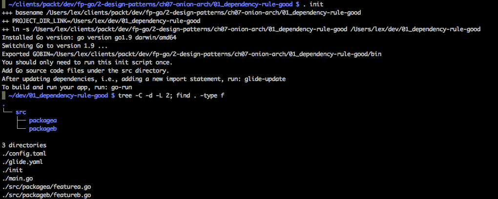
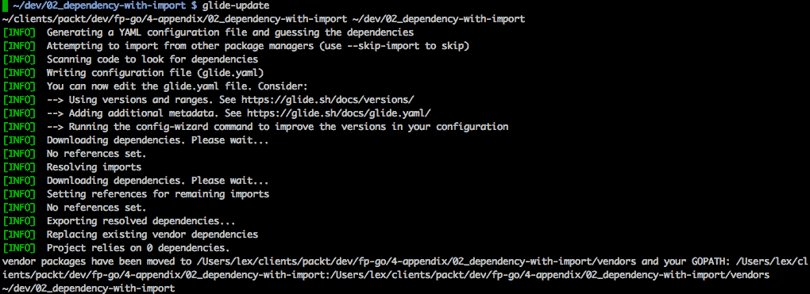
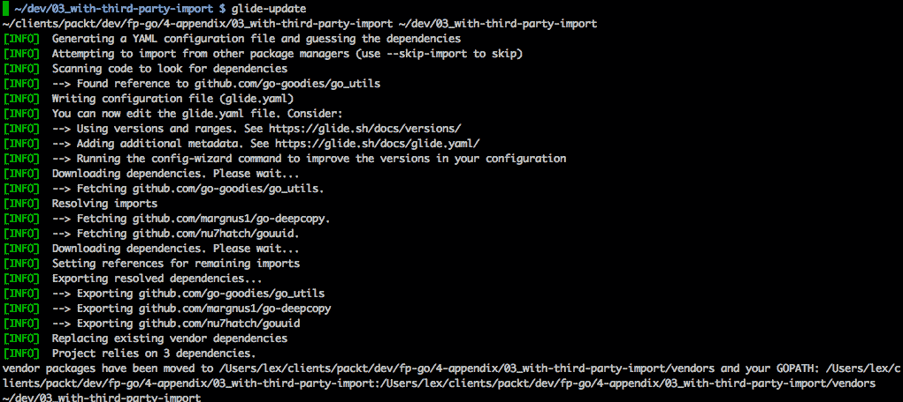
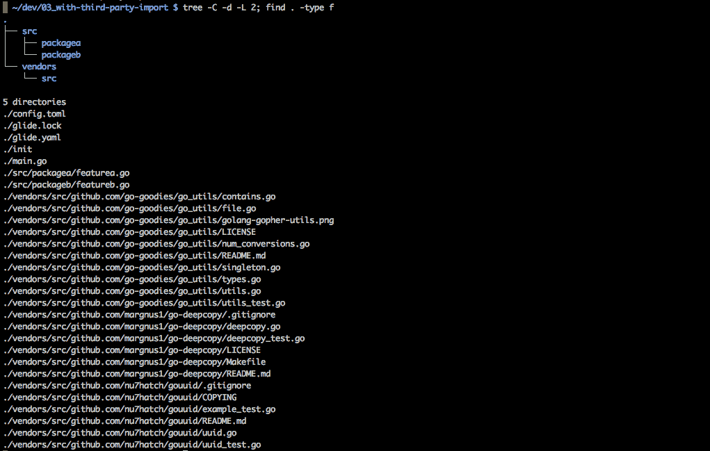
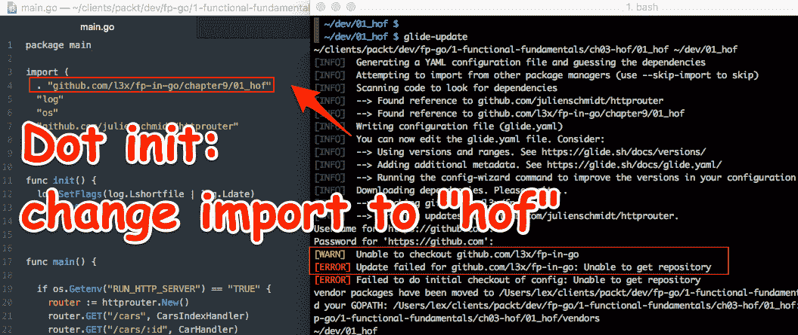
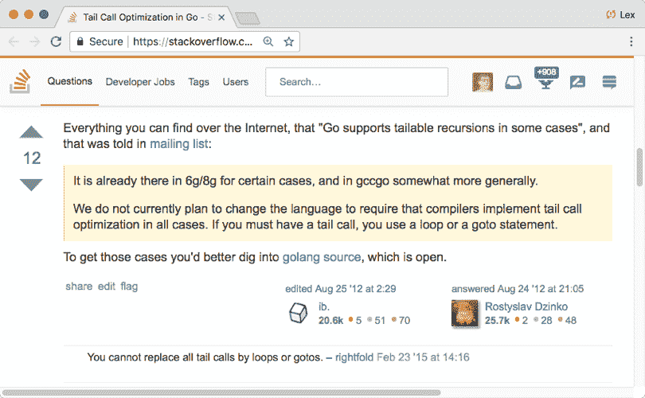

# 十二、杂项信息和如何去做

本附录分为四节：

*   如何构建和运行 Go 项目
*   如何提出变更建议
*   计划生育资源
*   明加图加泰罗尼亚数

## 如何构建和运行 Go 项目

构建和运行 Go 应用程序有多种方法。在本节中，我将向您展示我在为本书构建示例 Go 项目时使用的方法。

### TL；博士

使用`cd`命令指向项目根目录。运行`. init`一次。

准备好运行你的应用了吗？您是否更改了（非标准库）导入语句？如果是，请运行`glide-update`。

要运行应用程序，请执行`go-run`。

### 开发工作流程

这就是我们的开发工作流程：


我们将`cd`放入我们的项目源代码根目录并运行`init`。然后，我们更新代码，运行`glide-update`和`go-run`命令，然后重复，直到完成。请注意，如果我们只为 Go 的标准库中的包添加了导入，我们就不需要运行`glide-update`命令，尽管运行`glide-update`命令不会有什么坏处。

### Dot init 的特性和优点

*点初始*解决方案将执行以下操作：

1.  在`MY_DEV_DIR`目录中创建指向此项目根目录的链接。
2.  验证您正在运行正确版本的 Go。
3.  确认你有一个`src`目录（如果你没有，它会创建一个）。
4.  简化对项目本地包的引用。

5.  确认您有一个`toml`配置文件（如果您将`USES_TOML_CONFIG_YN`设置为“是”）。
6.  为方便起见，创建别名。
7.  确认已安装 glide。

在*步骤 1*中，很高兴有一个地方可以去`MY_DEV_DIR`，例如`~/myprojects`可以看到我参与的所有项目。我可以按日期排序并轻松删除指向非活动项目的链接。

使用*步骤 2*避免弄乱 GOPATH、GOROOT 或 GOBIN。

如*步骤 3*所述，`src`目录是我们放置项目本地包源文件的地方。我们的项目根目录中还有一个文件（通常名为`main.go`），主包中有`main()`函数。

执行*步骤 4*以便我们不再需要为项目本地包包含完整的 GitHub 存储库路径！

我们使用`". decorator"`代替`".github.comlearn-fp-go/2-design-patterns/ch05-decoration/02_decorator/decorator"`。请注意，如果您真的不想使用*dot init*，则需要仔细阅读源代码，并将所有简单的项目本地包引用替换为完整的存储库路径引用，然后移动代码。您可能还需要将代码从项目本地包的`src`目录中向上移动一级；它不会与您的全局 GOPATH 的`src`目录冲突。

在*步骤 5*中，`toml`配置文件（[https://github.com/BurntSushi/toml](https://github.com/BurntSushi/toml) 是默认的配置文件解决方案。`.init`文件自动包含`toml`配置文件运行时标志（只要您在`init`脚本中设置：`USES_TOML_CONFIG_YN=yes`即可）。

#### 可用别名

以下是可用的 alias 命令：

```go
alias go-test='go test ./... 2>&1 | grep -v "$(basename $(pwd))\t\[no test files"'
</span>alias go-test-bench='go test -bench=. ./... 2>&1 | grep -v "$(basename $(pwd))\t\[no test files"'
alias glide-ignore-project-dirs="printf \"ignore:\n$(find ./src -maxdepth 1 -type d | tail -n +2 | sed 's|./src\/||' | sed -e 's/^/- \.\//')\n\""
alias mvglide='mkdir -p vendors && mv vendor/ vendors/src/ && export GOPATH=$(pwd)/vendors:$(pwd);echo "vendor packages have been moved to $(pwd)/vendors and your GOPATH: $GOPATH"'
alias glide-update='if [ ! -z $(readlink `pwd`) ]; then export LINKED=true && pushd "$(readlink `pwd`)"; fi;rm -rf {vendor,vendors};rm glide.*;export GOPATH=$(pwd):$(pwd)/vendors && export GOBIN=$(pwd)/bin && glide init --non-interactive && glide-ignore-project-dirs >> glide.yaml && glide up && mvglide && if [ $LINKED==true ]; then popd;fi'
alias prune-project="(rm -rf bin pkg vendors;rm glide.lock;rm -rf ./src/mypackage;sed -i -e '/mypackage/ s/^#*/\/\//' main.go) 2>/dev/null"
alias show-path='echo $PATH | tr ":" "\n"'
alias prune-path='export PATH="$(echo $PATH | tr ":" "\n" | uniq | grep -v "$(dirname $ORIG_DIR)" | tr "\n" ":")"; if [[ "$PATH" =~ ':'$ ]]; then export PATH="${PATH::-1}";fi'
alias find-imports='find . -type f -name "*.go" -exec grep -A3 "import" {} \; -exec echo {} \; -exec echo --- \;'
alias go-fmt='set -x;goimports -w main.go src/*;{ set +x; } 2>/dev/null'
```

总之，dot init 将允许您使用一个命令（`glide-update`更新依赖项，并使用另一个命令（`go-run`编译和运行应用程序。开始使用它所要做的就是确保 init 脚本存在于项目根目录中，并运行`. init`一次。`.init`初始化减少了您必须编写和维护的代码，并尽可能简单地构建和运行您的 Go 应用程序。

#### 可用功能

以下是可用的功能：

```go
tdml() {
   if [ -z $1 ]; then LEVEL=2; else LEVEL=$1;fi
 tree -C -d -L $LEVEL
}
get-go-binary() {
    GO_BINARY_URL="$1"
 if [ -z $GO_BINARY_URL ]; then
 echo "Missing GO_BINARY_URL. Usage: get-go-binary <GO_BINARY_URL> Example: get-go-binary github.com/nicksnyder/go-i18n/goi18n"
 return
 fi
 TMP_DIR="tmp_dir_$RANDOM"; mkdir "$TMP_DIR"; pushd "$TMP_DIR"; export GOPATH="$(pwd)"; go get -u $GO_BINARY_URL; popd; rm -rf "$TMP_DIR"
}
```

### 使用 goenv 的动机

如果您总是使用最新版本的 Go 或在非 Macintosh 计算机上进行开发工作，则可以跳过本节。

如果我们需要支持多个 go 运行时，我们将 go 项目代码放在不同的目录中。为了帮助我们管理 go 运行时环境，让我们看看名为`goenv`的小实用程序脚本和在项目根目录中找到的 init 脚本。

This section assumes that you are using a Mac computer. Manage your Go runtime environment with `goenv`; visit: [https://github.com/l3x/goenv](https://github.com/l3x/goenv). For more information on the `go` command, visit: [https://golang.org/cmd/go](https://golang.org/cmd/go)

### 使用 init 脚本的动机

`init`脚本及其提供的别名命令有一个用途：

*使构建和运行 Go 应用程序变得简单。*

管理依赖项（第三方软件包）可能是一件痛苦的事情。对于本地源文件，导入语句可能太长。始终保持我们的`GOPATH`、`GOBIN`、`PATH`等更新也是一种痛苦。

我创建了 init 脚本来简化构建和运行本书中示例应用程序的过程。我发现它非常有用，所以我也将它用于其他项目。我希望它对你也很有效。

### 管理 Go 依赖关系的方法

有十几种方法可以管理 Go 依赖关系。我们可以使用本节将讨论的工具来实现这一点。

#### go-get 工具

当我开始在 Go 中开发时，我使用了`go get`工具。以下是其帮助消息中的一个片段：

```go
go get --help
...When checking out or updating a package, get looks for a branch or tag that matches the locally installed version of Go. The most important rule is that if the local installation is running version "go1", get
searches for a branch or tag named "go1". If no such version exists it retrieves the default branch of the package...
```

我很快了解到它将获得所有软件包的最新版本。不是我想要的。

我在寻找更像 Ruby 的**Gemfile**或**npm**包管理器的东西，在那里我可以指定每个包的特定版本，并创建一个`.lock`文件，以防止每次运行构建工具时都更改它。

#### Godep 工具

我用过戈德普一段时间。它工作得很好，但使用起来很麻烦。

Godep 在我的项目根目录的 Godeps 目录中创建了一个`Godeps.json`文件。然后，Godep 将所有第三方软件包的副本创建到项目根目录下的 Godep 目录中。我通常用我的其余代码将这些第三方软件包签入版本控制。

Godep 需要一些我觉得奇怪的步骤。例如，要更新项目的依赖项，您必须通过`go get -u github.com/another-thirdparty/package`命令在`GOPATH`中更新它，然后通过`godep save github.com/another-thirdparty/package`命令将它从我的`$GOPATH`复制到我的项目的 Godeps 目录。

依我的拙见，必须使用`$GOPATH`修改依赖项是很奇怪的。同时使用不同版本的依赖项修改多个项目的依赖项甚至更古怪（古怪==更多用户错误）。

我喜欢简单，不喜欢古怪。

#### Go中的自动售货机

Go 1.5 中引入了 Go 中的 Vendoring。它允许 Go 应用程序不仅从`$GOPATH/src`获取依赖项，还可以从项目根目录下名为 vendor 的子文件夹获取依赖项。以前，您必须将第三方软件包保存在全局共享的`$GOPATH`路径中。现在，您可以将依赖项放入项目的供应商文件夹中。

我仍然在寻找一种方法来确定每个包的版本，或者指定一个`MAJOR.MINOR`版本，让我的包管理器获取最新的`MAJOR.MINOR.PATCH`版本。

欲了解更多信息，请访问[https://docs.google.com/document/d/1Bz5-UB7g2uPBdOx-rw5t9MxJwkfpx90cqG9AFL0JAYo/edit](https://docs.google.com/document/d/1Bz5-UB7g2uPBdOx-rw5t9MxJwkfpx90cqG9AFL0JAYo/edit)

#### Glide-现代软件包管理器

我发现了 Glide，并欣赏它的特性和它正在积极开发/改进的事实。它让我想起了 Ruby 的 Gem 包管理。很好，但仍有很多东西需要记住。

滑翔参考文献

*   [https://github.com/Masterminds/glide](https://github.com/Masterminds/glide)
*   [https://glide.sh/](https://glide.sh/)
*   [https://glide.readthedocs.io/en/latest/getting-started/](https://glide.readthedocs.io/en/latest/getting-started/)
*   [https://glide.readthedocs.io/en/latest/commands/](https://glide.readthedocs.io/en/latest/commands/)

我只想运行一个命令来构建代码，一个命令来运行代码。我想要一些简单的东西，所以我创建了 init 脚本及其别名命令来包装 Glide 的功能。

我发现`init`、`glide-update`和`go-run`命令集非常容易使用。希望你也会。诚然，当您使用它来构建非常大的项目时，您最初需要处理导入/依赖项错误，就像处理任何依赖项管理工具一样，但我发现 Glide 是最好的工具。因此，您在本附录中看到的是一组简单的构建和运行命令，它们构建在功能齐全的构建工具 Glide 之上。

### 每个 dot init 步骤都非常详细

首先，使用`cd`命令将源代码定向到项目目录。让我们看看`01_dependency-rule-good`源代码。这恰好是[第 7 章](07.html)、*功能参数*中的第一个代码项目。接下来，让我们运行`goenv info`，它将告知我们的Go环境。

#### 将 cd 命令发送到项目根目录

在使用**点初始化**之前，您可能会看到`GOROOT`、`GOPATH`和`GOBIN`的设置无效：


前面屏幕截图中最后一行的*表示我们的 Go 版本设置为 1.8.3 版。请注意，运行`go version`返回`go1.9 darwin/amd64`，这是我们的书出版时 Go 的最新版本。
我们发现我们的`GOPATH`设置不正确，我们安装了三个版本的 Go。

##### 使用自制软件安装 Go

在 Mac 电脑上，我们可以使用自制软件安装和管理 Go 安装：

```go
brew search go
```

Running the preceding command might return result like this:

`go`
`go@1.4`
`go@1.5`
`go@1.6`
`go@1.7`
`go@1.8`

The checks indicate which versions of Go are already installed. To install go version 1.5, we can run `brew install go@1.5`. To install the latest version of go (currently 1.9), run `brew install go`.

#### 检查初始目录结构和文件

让我们检查一下初始目录结构和文件：

```go
  ~/clients/packt/dev/fp-go/2-design-patterns/ch07-onion-arch/01_dependency-rule-good $ tree -C -d -L 2; find . -type f
.
└── src
    ├── packagea
    └── packageb

3 directories
./.bash_exports
./config.toml
./glide.yaml
./init
./main.go
./src/packagea/featurea.go
./src/packageb/featureb.go
```

#### 初始化脚本内容

在运行`init`脚本之前，让我们先看看 init 脚本的内容：

```go
#!/bin/bash
# Author : Lex Sheehan
# Purpose: This script initializes a go project with glide dependency management
# For details see: https://www.amazon.com/Learning-Functional-Programming-Lex-Sheehan-ebook/dp/B0725B8MYW
# License: MIT, 2017 Lex Sheehan LLC
MY_DEV_DIR=~/dev
CURRENT_GO_VERSION=1.9.2
USES_TOML_CONFIG_YN=no
LOCAL_BIN_DIR=/usr/local/bin/
# ---------------------------------------------------------------
# Verify variables above are correct. Do not modify lines below.
if [ -L "$(pwd)" ]; then
 echo "You must be in the real project directory to run this init script. You are currently in a linked directory"
 echo "Running: ln -l \"$(pwd)\""
 ls -l "$(pwd)"
 return
fi
CURRENT_GOVERSION="go$CURRENT_GO_VERSION"
ORIG_DIR="$( cd "$( dirname "${BASH_SOURCE[0]}" )" && pwd )"
DEV_DIR="$MY_DEV_DIR/$(basename $ORIG_DIR)"
PROJECT_DIR_LINK="$MY_DEV_DIR/$(basename $ORIG_DIR)"
if [ -L "$PROJECT_DIR_LINK" ]; then
 rm "$PROJECT_DIR_LINK"
fi
if [ ! -d "$MY_DEV_DIR" ]; then
 mkdir "$MY_DEV_DIR"
fi
# Create link to project directory in MY_DEV_DIR
set -x
ln -s "$ORIG_DIR" "$PROJECT_DIR_LINK"
{ set +x; } 2>/dev/null
cd "$PROJECT_DIR_LINK"
export GOPATH=$ORIG_DIR
export GOBIN=$ORIG_DIR/bin
if [ -e "$GOBIN" ]; then
 rm "$GOBIN/*" 2>/dev/null
else
 mkdir "$GOBIN"
fi
#[ $(which "$(basename $(pwd))") ] && { echo "An executable named $(basename $(pwd)) found on path here: $(which $(basename $(pwd))). Continue anyway? (yes/no)"; read CONTINUE_YN; if [[ "$CONTINUE_YN" =~ ^(yes|y)$ ]]; then echo 'Okay, but when you run go-run it may run the pre-existing binary.'; else echo "You might want to rename this project directory ($(basename $(pwd))) to a name that does not match a pre-existing binary name."; return; fi; } 2>/dev/null
APP_NAME=$(basename $(pwd))
GOVERSION=$(go version)
echo "Installed Go version: $GOVERSION"
if [[ $(type goenv) ]]; then
 # Attempt to automatically set desired/current go version. This requires goenv.
 . goenv "$CURRENT_GO_VERSION"
 echo "GOVERSION: $GOVERSION"
 echo "CURRENT_GOVERSION: $CURRENT_GOVERSION"
 if [ -z "$GOVERSION" ] || [[ "$(echo $GOVERSION | awk '{print $3}')" != "$CURRENT_GOVERSION" ]]; then
 echo "Expected Go version $CURRENT_GOVERSION to be installed"
 return
 fi
else
 if [ -z "$GOVERSION" ] || [[ "$(echo $GOVERSION | awk '{print $3}')" != "$CURRENT_GOVERSION" ]]; then
 echo "Expected Go version $CURRENT_GOVERSION to be installed. Consider using github.com/l3x/goenv to manage your go runtimes."
 return
 fi
fi
command -v goimports >/dev/null 2>&1 || { echo >&2 "Missing goimports. For details, see: https://github.com/bradfitz/goimports"; return; }
command -v glide >/dev/null 2>&1 || { echo >&2 "Missing glide. For details, see: https://github.com/Masterminds/glide"; return; }
if [ ! -e ./src ]; then
 mkdir src
fi

if [ ! -e ./src/mypackage/ ]; then
 mkdir ./src/mypackage
fi

if [ ! -e ./src/mypackage/myname.go ]; then
 cat > ./src/mypackage/myname.go <<TEXT
package mypackage

func MyName() string { return "Alice" }
TEXT
fi

if [ ! -e ./main.go ]; then
 cat > ./main.go <<TEXT
package main

import (
 "mypackage"
)

func main() {
 println("hello from main.go")
 println(mypackage.MyName() + " says hi from mypackage")
}
TEXT
fi

if [ ! -e ./.gitignore ]; then
 cat > ./.gitignore <<TEXT
# Binaries for programs and plugins
*.exe
*.dll
*.so
*.dylib

# Test binary, build with `go test -c`
*.test

# Output of the go coverage tool, specifically when used with LiteIDE
*.out

# Project-local glide cache, RE: https://github.com/Masterminds/glide/issues/736
.glide/

# Temporary backup file created by sed in prune-project alias
main.go-e
TEXT
fi

if [ "${PATH/$GOBIN}" == "$PATH" ] ; then
 export PATH=$PATH:$GOBIN
fi

if [[ "$USES_TOML_CONFIG_YN" =~ ^(yes|y)$ ]]; then
 if [ ! -e ./config.toml ]; then
 echo You were missing the config.toml configuration file... Creating bare config.toml file ...
        echo -e "# Runtime environment\napp_env = \"development\"" > config.toml
 fi
 ls -l config.toml
    alias go-run="go install && $APP_NAME -config ./config.toml"
else
 alias go-run="go install && $APP_NAME"
fi
alias go-test='go test ./... 2>&1 | grep -v "$(basename $(pwd))\t\[no test files"'
alias go-test-bench='go test -bench=. ./... 2>&1 | grep -v "$(basename $(pwd))\t\[no test files"'
alias glide-ignore-project-dirs="printf \"ignore:\n$(find ./src -maxdepth 1 -type d | tail -n +2 | sed 's|./src\/||' | sed -e 's/^/- \.\//')\n\""
alias mvglide='mkdir -p vendors && mv vendor/ vendors/src/ && export GOPATH=$(pwd)/vendors:$(pwd);echo "vendor packages have been moved to $(pwd)/vendors and your GOPATH: $GOPATH"'
alias glide-update='if [ ! -z $(readlink `pwd`) ]; then export LINKED=true && pushd "$(readlink `pwd`)"; fi;rm -rf {vendor,vendors};rm glide.*;export GOPATH=$(pwd):$(pwd)/vendors && export GOBIN=$(pwd)/bin && glide init --non-interactive && glide-ignore-project-dirs >> glide.yaml && glide up && mvglide && if [ $LINKED==true ]; then popd;fi'
alias prune-project="(rm -rf bin pkg vendors;rm glide.lock;rm -rf ./src/mypackage;sed -i -e '/mypackage/ s/^#*/\/\//' main.go) 2>/dev/null"
alias show-path='echo $PATH | tr ":" "\n"'
alias prune-path='export PATH="$(echo $PATH | tr ":" "\n" | uniq | grep -v "$(dirname $ORIG_DIR)" | tr "\n" ":")"; if [[ "$PATH" =~ ':'$ ]]; then export PATH="${PATH::-1}";fi'
alias find-imports='find . -type f -name "*.go" -exec grep -A3 "import" {} \; -exec echo {} \; -exec echo --- \;'
alias go-fmt='set -x;goimports -w main.go src/*;{ set +x; } 2>/dev/null'
tdml() {
   if [ -z $1 ]; then LEVEL=2; else LEVEL=$1;fi
 tree -C -d -L $LEVEL
}
get-go-binary() {
    GO_BINARY_URL="$1"
 if [ -z $GO_BINARY_URL ]; then
 echo "Missing GO_BINARY_URL. Usage: get-go-binary <GO_BINARY_URL> Example: get-go-binary github.com/nicksnyder/go-i18n/goi18n"
 return
 fi
 TMP_DIR="tmp_dir_$RANDOM"; mkdir "$TMP_DIR"; pushd "$TMP_DIR"; export GOPATH="$(pwd)"; go get -u $GO_BINARY_URL; popd; rm -rf "$TMP_DIR"
}
echo You should only need to run this init script once.
echo Add Go source code files under the src directory.
echo After updating dependencies, i.e., adding a new import statement, run:  glide-update
echo To build and run your app, run:  go-run
```

我们需要做的就是验证虚线中前面的变量是否正确：

```go
MY_DEV_DIR=~/dev
CURRENT_GO_VERSION=1.9.2
USES_TOML_CONFIG_YN=no
LOCAL_BIN_DIR=/usr/local/bin/
```

如果我们不做任何更改，脚本将使用 go 版本 1.9 工作，如果它不存在，它将创建一个`~/dev`目录。

#### 运行 init 脚本

为了让我们的项目为开发做好准备，在我们的终端，只需运行`. init`。



注意，`source`和“.”做同样的事情；它们在当前 shell 环境的上下文中运行以下命令。

请注意，我们当前的目录路径较短。我们在一个新链接的目录中。这是`MY_DEV_DIR`中的链接文件。运行此脚本的一个好处或副作用是，我们可以转到我们的`MY_DEV_DIR`查看我们最近在做什么项目。在终端中没有这么长的路径名也很好（假设我们在 shell 提示符中显示完整的当前目录路径）。

#### 重新检查初始目录结构和文件

我们还运行 tree 命令查看项目目录，并运行 file 命令查看文件。

init 脚本创建的唯一新文件是`PROJECT_DIR_LINK`（在本例中为`/home/lex/dev/01_dependency-rule-good`。

#### goenv 显示已更新的内容

那个 init 脚本肯定为我们做了其他事情，对吧？让我们再次运行 goenv info 命令，看看它还做了什么：


我们收到警告，因为`GOPATH`实际上是一条路径。（如果`GOPATH`不是一个目录，大多数其他供应商解决方案将无法正常工作。）我们的`GOPATH`与我们的`PATH`环境变量一样构造。它由附加在一起的路径组成，由冒号字符分隔。

我们的`GOPATH`由两个值组成：`src`路径（包含我们的项目源文件）和供应商路径（包含我们的第三方依赖源文件）。

#### 运行 glide update 以获取第三方依赖项文件

在我们将文件添加到 src 目录并有一些导入语句之后，在运行 Go 应用程序之前，让我们确保 Go 拥有构建应用程序所需的依赖项的所有源文件。

无论何时更新任何导入语句（在运行应用程序之前），我们都会运行`glide-update`。


我们可以通过键入`go-run`来运行 Go 应用程序。这将编译我们的应用程序（将二进制文件放入我们的`GOBIN`目录）并运行它。我们的应用程序输出两行字符**A**和**B**。

运行`glide-update`将创建典型的`vendor`目录，并快速将其重命名为供应商（这进一步表明这不是标准的 glide 安装）。我们不必成为 glide 专家就可以让 glide 管理我们的依赖关系。每当我们更新依赖项（并更改导入语句）时，我们只需运行 glide update 别名，所有依赖项的代码都将进入供应商目录，我们的`GOPATH`将知道编译时会在那里查看。另外请注意，如果您使用一个奇特的 IDE，需要输入您的`GOROOT`、`GOBIN`和`GOPATH`，那么您只需运行`goenv-info`即可查看我们的项目正确设置是什么。

如果`glide-update`报告任何错误，将由我们解决。

### 添加标准库导入

我们将在`packagea`中的进口声明中添加`fmt`包：

```go
package packagea

import (
   b "packageb"
 "fmt"
)

func Atask() {
   fmt.Println("A")
   b.Btask()
}
```

我们将在`packageb`中的导入语句中添加日志包：

```go
package packageb

import (
   "log"
)

func Btask() {
   log.Println("B")
}
```

添加导入后，我们将源初始化：


接下来，我们更新我们的依赖项：



现在，我们可以运行我们的应用程序：


唯一的区别是，`log.Println`命令添加了一个时间戳。我们看到它是有效的，但是依赖性呢？供应商的目录现在是否有一些文件？


不。仍然没有文件。为什么？

这是因为`fmt`和`log`都来自 Go 的标准库。

#### Go标准图书馆

Go 标准库是一组增强和扩展该语言的核心包。
通过*核心*，我们的意思是每次编译我们的 Go 应用程序时，我们都会得到该 pkg 目录，其中将填充 Go 标准库包。
Go 标准库包具有以下功能：

*   它们不会增加额外的开销
*   它们保证永远存在
*   它们保证始终向后兼容（不会在发布周期之间中断）

使用 Go 标准库中的软件包将使我们的代码更易于管理和更可靠。
示例包包括以下内容：

*   `log`
*   `fmt`
*   `encoding/json`
*   `database/sql/driver`
*   `net/http`

For details regarding Go's Standard Library, refer to: [https://golang.org/pkg/](https://golang.org/pkg/)

### 添加第三方导入

对于本例，我们将导入一个简单的第三方实用程序包`go-goodies/go_utils`。我早在 2015 年就创建了`go-goodies/go_utils`（当时我还在学习这门语言）。我已经有一段时间没有修改过很多代码了，所以我可以回头看看我学到了多少。这一切都应该正常工作，但在许多情况下，有更好的方法来完成事情。你已经被警告了，所以请不要妄下判断。

#### 导入引用 go_utils 的语句

让我们添加第三个导入，`u "github.com/go-goodies/go_utils"`。

注意我们在`Atask`函数中使用前面的`u`来引用`PadLeft`函数：

```go
package packagea

import (
   b "packageb"
 "fmt"
 u "github.com/go-goodies/go_utils"
)

func Atask() {
   fmt.Println(u.PadLeft("A", 3))
   b.Btask()
}
```

对于`import`语句，我们可以在源文件上使用`grep`命令：


由于我们更新了导入语句，我们需要在运行应用程序之前运行`glide-update`：



这次我们可以看到`glide-update`拉入了供应商目录下的第三方（`go_utils`文件：



我们可以看到`go-goodies/go_utils`引用了以下第三方包：

*   [http://github.com/margnus1/go-deepcopy](http://github.com/margnus1/go-deepcopy)
*   [http://github.com/nu7hatch/gouuid](http://github.com/nu7hatch/gouuid)

当我们运行应用程序时，我们会看到使用`PadLeft`功能的效果：


您可以放心地使用 init 脚本及其提供的别名，以确保它们不会触及您的源文件（好吧，除了 prune project 将注释掉`./main.go`中引用`mypackage`的行之外）。他们修改的文件包括`~/dev`目录中的软链接目录文件以及`bin`、`pkg`和供应商目录。

## 开发工作流程摘要

如何管理依赖关系、构建、运行和部署应用程序是一个优先事项。让团队中的所有开发人员以相同的方式构建应用程序通常是一个好主意。本节中共享的技术演示了我为本书构建演示应用程序的方法。我保持简单。然而，故事的其余部分是，我很少像在本书中那样孤立地构建应用程序。几乎每次我都在我的`development/test/deployment`工作流程中使用 Docker。请注意，Docker 的使用超出了本书的范围。

### dot init 故障排除

这就是我如何解决将 Go 中的[第 4 章](04.html)中的*实体设计转换为 dot init 技术时出现的构建错误。*

首先，我使用了`cd`命令指向项目的根目录（其中`project`是[第 4 章](04.html)，*Go 中的 SOLID Design*，源代码）：


接下来，我运行`glide-update`告诉 Glide 将依赖项放在供应商目录中：



但是，这失败了，因为`import`声明不正确：


以下是现在导入的内容：


告诉 Glide 将第三方软件包放在供应商的目录中。


编译并运行：


真倒霉`.init`找不到二进制文件。

不用担心，只需将 cd 放回原始的项目根目录并重新进行初始化：


如果您运行`go-run`并看到*命令未找到*，只需重新运行`init`、`glide-update`和`go-run`。

还有更多的问题！

哦，对了。我忘了读 init 的消息，无法运行`glide-update`。让我们下一步这样做：


成功

当我们尝试运行测试时会发生什么？

当我们`cd`进入`02_fib`示例应用程序并键入`go test -bench=. ./...`时，我们可能会遇到一些错误：


如果我们的`GOROOT`和/或`GOPATH`设置为无效值，则可能发生这种情况。

这里有两个明显的错误。环境变量`GOROOT`和`GOPATH`均无效。

我们通过键入`brew info go|grep Cellar|grep -v export`在 Mac 电脑上找到`GOROOT`的路径：


我们只是碰巧知道，我们需要将`libexec`目录添加到返回结果的路径中，如前一个屏幕截图所示，以设置我们的`GOPATH`。我们将`GOPATH`设置为当前应用程序的根目录，即当前目录。我们还设置了`GOBIN`路径，告诉 Go 在编译源代码时创建的可执行文件的存储位置。

因为在本章中我们不需要处理任何第三方软件包，所以我们不需要处理依赖关系管理。有十几种 Go 依赖项管理工具可用。在后面的章节中，我们将使用 Glide（[https://github.com/Masterminds/glide](https://github.com/Masterminds/glide) ）用于包管理和一个非常轻量级的包装器 dot init，它进一步简化了我们的构建和运行过程。详情见附录。

请注意，dot init 消除了此类错误的可能性。

这是一个用来简化事情的工具的大量信息。没错，但几乎每一次，你需要知道的都是*TL；博士*科。

## 如何提出变更建议

我确信在 Go 中不支持泛型（甚至在 GO2.0 中也不支持），正如总结中提到的，我同意这一点。

然而，如果 Go 拥有它，我们将从中受益最大的功能是**尾部调用优化**（**TCO**。

### 第一步-搜索规格

Go 是否可能已经支持 TCO？是时候弄清楚了。

首先，我查看了 Go 语言规范中提到的 TCO 特性（[https://golang.org/ref/spec](https://golang.org/ref/spec) ）。

我没有发现关于 TCO 的任何信息。

### 第二步-谷歌搜索

接下来，我做了必要的谷歌搜索，发现：



### 官方的 Golang 变更建议流程

然后，我了解了提议变更的流程（[https://github.com/golang/proposal/](https://github.com/golang/proposal/) ）。

#### 搜索现有问题

以下是流程。

首先，访问[https://github.com/golang/go/issues](https://github.com/golang/go/issues) 并搜索要添加到 go 的语言功能，例如键入`tail call optimization`，如下图所示：


#### 阅读现有提案

我点击该行（有 13 条评论）查看详细信息：


这一特性将极大地改进我们的递归函数调用，例如 Y-Combinator。

还记得我们在[第一章](01.html)中运行`SumRecursive`函数，在 Go 中运行*纯函数编程的基准测试结果吗？它比命令式版本慢了大约三倍。TCO 的缺乏是目前一般不推荐使用 FP-on-Go 的一个最重要的原因。将 TCO 添加到 Go 的编译器功能列表中可以解决这个问题。这就是为什么这个低影响、高回报的特性如此重要的原因。*

还有其他一些建议在最初的帖子中包含了更多的信息，这是表达我们想法的更好方式。然而，当我们阅读随后的评论时，细节变得更加明显。当我读到以下评论时，我确信这项提案得到了我的投票：


我想分享一个我心目中的`@tco`注释的例子，可以让大家更加关注这个建议。但离我的书出版还有一个月左右。我现在是否输入以下评论并说，“*等待我的书获得所有荣耀细节*”还是等待？见鬼，我要去。

#### 对现有 TCO 提案添加评论

您可以在[阅读评论 https://github.com/golang/go/issues/16798](https://github.com/golang/go/issues/16798) 。


现在，我想知道我的请求是否可以为编译器指令提供一个单独的建议？例如，*建议：以注释注释*的形式添加编译器提示。

我们将保留该评论，看看会发生什么。

评论变成了一个新的提案（[https://github.com/golang/go/issues/22624](https://github.com/golang/go/issues/22624) ）。

这本书付印时，对话仍在进行中。

### 创建新提案

如果我没有找到这项现有的建议，我会这样做。转到[https://github.com/golang/go/issues/new](https://github.com/golang/go/issues/new) 要创建问题：


假设在编写提案之后，如果问题表明我没有在提案消息中明确定义提案，那么我可以创建一个设计文档来帮助澄清请求。

### 创建设计文档

我会去这里，[https://github.com/golang/proposal/](https://github.com/golang/proposal/) 点击新建文件按钮，保存为`design/NNNN-tco-annotation.md`，其中`NNNN`为 GitHub 发行号，`tco-annotation`为其简称。例如，`15292-generics.md`（[https://github.com/golang/proposal/blob/master/design/15292-generics.md](https://github.com/golang/proposal/blob/master/design/15292-generics.md) 。

设计文件应遵循[处的设计模板格式 https://github.com/golang/proposal/blob/master/design/TEMPLATE.md](https://github.com/golang/proposal/blob/master/design/TEMPLATE.md) 。

### 发送电子邮件通知 golang 开发小组

保存设计文档后，我会在`golang-dev`邮件组中发布一个新主题，如下所示：


### 范例提案

以下是一封针对一份好的提案的通知电子邮件的示例：


### 监控提案直到达成决议

我会监控我的收件箱中是否有关于提案的新消息，以检查是否需要添加澄清。一旦对设计文件的评论和修订结束，将对提案进行最终讨论，提案将被接受或拒绝。

## 计划生育资源

我将制作一个 github repo，它可以随着时间的推移进行更新，而不是编译 Go 开发人员感兴趣的函数式编程资源列表：

[https://github.com/l3x/fp-resources](https://github.com/l3x/fp-resources)

如果您知道任何丢失的链接，请随时提交拉取请求，以便我可以更新信息供大家查看。

## 明加图-加泰罗尼亚数


加泰罗尼亚数字的发现通常归功于 1844 年的尤金·加泰罗尼亚（Eugene Catalan），尽管它最初是在 100 多年前由中国数学家明加图（1730）发现的。

第 n 个加泰罗尼亚数可用以下方程式表示：


n=0、1、2、3、4、5、6 的前几个加泰罗尼亚数字是 1、1、2、5、14、42、132。

加泰罗尼亚数字是出现在许多计数和计算机科学解决方案中的一系列数字。

对我来说，解释这个概念最简单的方法是回答，你能用 n 次上下行程形成多少个*山顶*，它们都保持在原始线之上？

变量 C<sub>n</sub>包含 n 对匹配/\字符的山顶数：

```go
                                /\
           /\    /\ /\   /\    /  \
/\/\/\, /\/  \, /  \/\, /  \, /    \
```

让我们使用文本分隔符（左括号和右括号）来表示容器。

加泰罗尼亚数字是包容的一个基本概念，通常用于协助基于组合逻辑的新软件和硬件架构的概念化和设计。

变量 C<sub>n</sub>是包含 n 对匹配括号的表达式数：

```go
()()(), ()(()), (())(), (()()), ((()))
```

与 lambda 演算的联系在于，匹配括号的组合逻辑具有足够的表达能力，可以形式化递归函数，并且我们通过对 Y-组合子的研究知道递归函数是基本的。

为了更好地理解直觉，考虑到在大多数编程语言中，代码使用解释器或编译器在内部使用 SytT0.抽象语法树 Doul T1（Po.T2，AtStand T3）来表示。AST 将代码块分解为最小的部分，使转换、分析或执行代码变得容易：

```go
if b !=0 {
   result := a/b
} else {
   result := NaN
}
return result
```

以下 AST 图表表示前面的代码块：


下面是关于 LISP 中代码块的外观：

```go
(if (b != 0) ( / a b) (NaN) )
```

我们使用括号来表示 AST。开括号“（”表示从树的某一层往下走，右括号“）”表示从树的某一层往上走。

我们还可以用其他方法在代码中表示树结构。

### 解释和行动呼吁

尽管该信息直接适用于函数式编程且对函数式编程有意义，但它并未被列入函数式编程的*历史*，因为发现日期与直接导致 Alonzo Church 发明/发现 Lambda 演算的事件顺序不一致。

这表明人们的想法往往是一致的，但由于缺乏沟通/协作，没有人知道，也没有人从彼此的工作中获益。

今天，我们既不受距离的限制，也不受飞机、火车或汽车的限制，而是受人性的限制。

我相信，如果这取决于软件工程师和数学家，我们都会平等而迅速地分享。我们渴望分享我们所学到和创造的东西（以及我们所热爱的），但正是公司所有者和政府（出于贪婪和权力的动机）让我们闭口不谈。

我要感谢世界各地像明加图这样的伟大思想家，并敦促我的工程师同胞们，所有国家的工程师们，共同努力，用我们对科学的热爱和激情来取代对权力的渴望。

**f（x）**是纯的。人性可能是不纯洁的。

Lambda 演算（参考上一章中的 Y-组合子和 DNA 双螺旋部分）是经验证据，证明我们（中国人、俄罗斯人、韩国人、印度人、非洲人、阿拉伯人、美国人等）都是相似的，而不是不同的。

我们生而平等。让我们用爱的力量代替爱的力量。让我们抛开分歧，尽可能合作创造一个更美好的世界。

和平

莱克斯