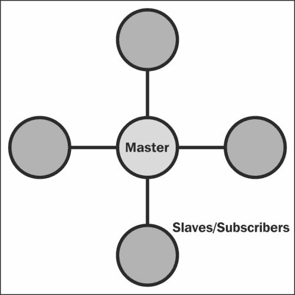
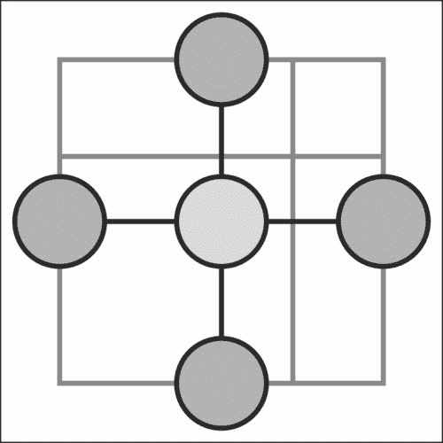
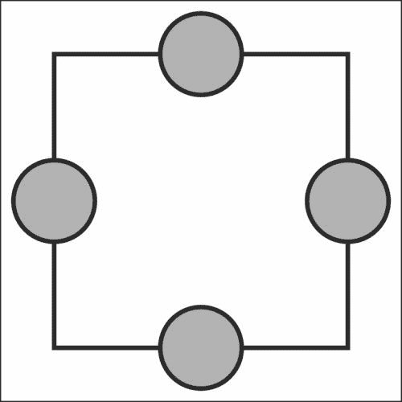

# 第 7 章性能和可扩展性

要在 Go 中用几百行代码构建一个高性能的 web 服务器，您应该非常清楚 concurrent Go 是如何为我们提供性能和稳定性方面的优秀工具的。

我们在[第 6 章](06.html#page "Chapter 6. C10K – A Non-blocking Web Server in Go")中的例子*C10K–Go*中的一个非阻塞 Web 服务器，也展示了任意或无意地将阻塞代码强加到我们的代码中会引入一些严重的瓶颈，并很快破坏任何扩展或扩展应用程序的计划。

在本章中，我们将介绍一些方法，这些方法可以更好地帮助我们采用并发应用程序，并确保它能够在未来不断扩展，并且能够在范围、设计和/或容量上进行扩展。

我们将对**pprof**进行一点扩展，这是我们在前几章中简要介绍的 CPU 评测工具，它是一种方法，用于阐明 Go 代码的编译方式，并定位可能的意外瓶颈。

然后，我们将扩展到分布式 Go，以及为我们的应用程序提供一些增强性能的并行计算概念的方法。我们还将介绍 Google 应用程序引擎，以及如何将其用于基于 Go 的应用程序，以确保可扩展性掌握在世界上最可靠的托管基础设施之一手中。

最后，我们将了解内存利用率、保存以及 Google 垃圾收集器的工作原理（有时不工作）。最后，我们将更深入地研究如何使用内存缓存来保持数据的一致性，并减少数据的短暂性，我们还将看到它如何与分布式计算相吻合。

# 围棋高性能

到目前为止，我们已经讨论了一些可以用来帮助发现减速、泄漏和低效循环的工具。

Go 的编译器及其内置的死锁检测器使我们避免犯在其他语言中常见且难以检测的错误。

我们已经根据并发模式的具体变化运行了基于时间的基准测试，这可以帮助我们使用不同的方法设计应用程序，以提高总体执行速度和性能。

## 深入 pprof

pprof 工具首次出现在[第 5 章](05.html#page "Chapter 5. Locks, Blocks, and Better Channels")、*锁、块和更好的通道*中，如果它仍然感觉有点神秘，这是完全可以理解的。pprof 在导出中显示的是一个**调用图**，我们可以使用它来帮助识别堆上循环或昂贵调用的问题。这些包括内存泄漏和可优化的处理器密集型方法。

演示这样的东西是如何工作的最好方法之一是构建不工作的东西。或者至少是一些不能正常工作的事情。

您可能会认为，具有垃圾收集功能的语言可能不会受到此类内存问题的影响，但总有一些方法可以隐藏可能导致内存泄漏的错误。如果 GC 找不到它，有时自己找会很痛苦，这会导致很多不成功的调试。

To be fair, what constitutes a memory leak is sometimes debated among computer science members and experts. A program that continuously consumes RAM may not be leaking memory by technical definition if the application itself could re-access any given pointers. But that's largely irrelevant when you have a program that crashes and burns after consuming memory like an elephant at a buffet.

在垃圾收集语言中创建内存泄漏的基本前提依赖于对编译器隐藏分配事实上，任何可以直接访问和利用内存的语言都提供了引入泄漏的机制。

我们将在本章后面对垃圾收集和 Go 的实现进行更多的回顾。

那么像 PPR 这样的工具如何提供帮助呢？简单地说，通过向您展示**内存和 CPU 利用率的去向。**

让我们首先设计一个非常明显的 CPU hog，如下所示，看看 pprof 如何为我们突出这一点：

```go
package main

import (
"os"
"flag"
"fmt"
"runtime/pprof"
)

const TESTLENGTH = 100000
type CPUHog struct {
  longByte []byte
}

func makeLongByte() []byte {
  longByte := make([]byte,TESTLENGTH)

  for i:= 0; i < TESTLENGTH; i++ {
    longByte[i] = byte(i)
  }
  return longByte
}

var profile = flag.String("cpuprofile", "", "output pprof data to 
  file")

func main() {
  var CPUHogs []CPUHog

  flag.Parse()
    if *profile != "" {
      flag,err := os.Create(*profile)
      if err != nil {
        fmt.Println("Could not create profile",err)
      }
      pprof.StartCPUProfile(flag)
      defer pprof.StopCPUProfile()

    }

  for i := 0; i < TESTLENGTH; i++ {
    hog := CPUHog{}
    hog.longByte = makeLongByte()
    _ = append(CPUHogs,hog)
  }
}
```

The output of the preceding code is shown in the following diagram:


在本例中，我们知道堆栈资源分配的方向，因为我们故意引入了循环（以及该循环中的循环）。

想象一下，我们不是故意这么做的，而是必须找到资源猪。在本例中，pprof 使这变得非常简单，向我们展示了包含大多数示例的简单字符串的创建和内存分配。

我们可以稍微修改一下，看看输出的变化。为了分配越来越多的内存来查看是否可以改变 PPROF 输出，我们可以考虑更重的类型和更多的内存。

实现这一点最简单的方法是创建一个新类型的切片，其中包含大量较重的类型，如 int64。我们很幸运地拥有 Go：在这方面，我们不容易遇到常见的 C 问题，例如缓冲区溢出和内存保护与管理，但这使得调试在我们不能故意破坏内存管理系统时变得有点棘手。

### 提示

**不安全包装**

尽管提供了内置内存保护，但 Go 还提供了另一个有趣的工具：**不安全**包。根据 Go 的文件：

*包不安全包含绕过围棋程序类型安全的操作。*

This might seem like a curious library to include—indeed, while many low-level languages allow you to shoot your foot off, it's fairly unusual to provide a segregated language.

在本章后面，我们将研究`unsafe.Pointer`，它允许您读取和写入内存分配的任意位。这显然是非常危险的（或者是有用的和邪恶的，取决于你的目标）功能，你通常会在任何开发语言中试图避免它，但它确实让我们能够更好地调试和理解我们的程序和 Go 垃圾收集器。

为了提高内存使用率，让我们按如下方式切换字符串分配，以进行随机类型分配，特别是针对我们的新结构`MemoryHog`：

```go
type MemoryHog struct {
  a,b,c,d,e,f,g int64
  h,i,j,k,l,m,n float64
  longByte []byte
}
```

There's obviously nothing preventing us from extending this into some ludicrously large set of slices, huge arrays of int64s, and so on. But our primary goal is solely to change the output of pprof so that we can identify movement in the call graph's samples and its effect on our stack/heap profiles.

我们任意昂贵的代码如下所示：

```go
type MemoryHog struct {
  a,b,c,d,e,f,g int64
  h,i,j,k,l,m,n float64
  longByte []byte
}

func makeMemoryHog() []MemoryHog {

  memoryHogs := make([]MemoryHog,TESTLENGTH)

  for i:= 0; i < TESTLENGTH; i++ {
    m := MemoryHog{}
    _ = append(memoryHogs,m)
  }

  return memoryHogs
}

var profile = flag.String("cpuprofile", "", "output pprof data to 
  file")

func main() {
  var CPUHogs []CPUHog

  flag.Parse()
    if *profile != "" {
      flag,err := os.Create(*profile)
      if err != nil {
        fmt.Println("Could not create profile",err)
      }
      pprof.StartCPUProfile(flag)
      defer pprof.StopCPUProfile()

    }

  for i := 0; i < TESTLENGTH; i++ {
    hog := CPUHog{}
    hog.mHog = makeMemoryHog()
    _ = append(CPUHogs,hog)
  }
}
```

With this in place, our CPU consumption remains about the same (due to the looping mechanism remaining largely unchanged), but our memory allocation has increased—unsurprisingly—by about 900 percent. It's unlikely that you will precisely duplicate these results, but the general trend of a small change leading to a major difference in resource allocation is reproducible. Note that memory utilization reporting is possible with pprof, but it's not what we're doing here; the memory utilization observations here happened outside of pprof.

如果我们采用前面建议的极端方法为我们的结构创建大得离谱的属性，我们可以进一步执行，但是让我们看看执行时对 CPU 配置文件的总体影响。影响如下图所示：


在左边，我们有新的分配方法，它调用更大的结构而不是字符串数组。在右边，我们有我们的初始应用程序。

一个相当戏剧性的变化，你不觉得吗？虽然这两个程序在设计上都不是错误的，但我们可以轻松地切换我们的方法来查看资源的去向，并识别我们如何减少资源的消耗。

## 并行性和并发性对 I/O 性能的影响

在使用 pprof 时，您可能会很快遇到一个问题，那就是您编写了脚本或应用程序，特别是绑定到高效运行时性能时。当您的程序执行得太快而无法正确配置文件时，这种情况最为常见。

一个相关问题涉及需要连接到配置文件的网络应用程序；在这种情况下，您可以在程序中或外部模拟流量，以允许进行适当的分析。

我们可以通过使用 goroutines 复制前面的示例来轻松演示这一点，如下所示：

```go
const TESTLENGTH = 20000

type DataType struct {
  a,b,c,d,e,f,g int64
  longByte []byte  
}

func (dt DataType) init() {

}

var profile = flag.String("cpuprofile", "", "output pprof data to 
  file")

func main() {

  flag.Parse()
    if *profile != "" {
      flag,err := os.Create(*profile)
      if err != nil {
        fmt.Println("Could not create profile",err)
      }
      pprof.StartCPUProfile(flag)
      defer pprof.StopCPUProfile()
    }
  var wg sync.WaitGroup

  numCPU := runtime.NumCPU()
  runtime.GOMAXPROCS(numCPU)

  wg.Add(TESTLENGTH)

  for i := 0; i < TESTLENGTH; i++ {
    go func() {
      for y := 0; y < TESTLENGTH; y++ {
        dT := DataType{}
        dT.init()
      }
      wg.Done()
    }()
  }

  wg.Wait()

  fmt.Println("Complete.")
}
```

下面的图显示了前面代码的输出的 PPR：


它的信息量不大，是吗？

如果我们想要获得关于 Goroutine 的堆栈跟踪的更有价值的信息，那么“照常进行”会提供一些额外的功能。

在运行时包中，有一个函数和一个方法允许我们访问和利用 goroutine 的堆栈跟踪：

*   `runtime.Lookup`：此函数返回基于名称的配置文件
*   `runtime.WriteTo`：此方法将快照发送给 I/O 编写器

如果我们在程序中添加以下行，我们将不会在`pprof`Go 工具中看到输出，但我们可以在控制台中获得 goroutine 的详细分析。

```go
pprof.Lookup("goroutine").WriteTo(os.Stdout, 1)
```

前面的代码行为我们提供了更多的抽象 goroutine 内存位置信息和包详细信息，它们类似于下面的屏幕截图：


但获得此输出的更快方法是使用`http`/`pprof`工具，该工具通过单独的服务器保持应用程序的结果处于活动状态。我们在这里使用了端口 6000，如下代码所示，但您可以根据需要进行修改：

```go
  go func() {
    log.Println(http.ListenAndServe("localhost:6000", nil))
  }()
```

虽然您无法获取goroutine 堆栈调用的SVG 输出，但您可以通过进入`http://localhost:6060/debug/pprof/goroutine?debug=1`在浏览器中实时查看它。

# Using the App Engine

While not right for every project, Google's App Engine can open up a world of scalability when it comes to concurrent applications, without the hassle of VM provisioning, reboots, monitoring, and so on.

App Engine 与 Amazon Web Services、DigitalOcean 和其他类似的应用程序并不完全不同，只是您不需要参与直接服务器设置和维护的细节。所有这些都为您的应用程序提供了获取和利用虚拟计算资源的单一场所。

相反，它可以是谷歌架构中的一个更抽象的环境，用它可以容纳和运行多种语言的代码，包括 Go 语言本身。

虽然大型应用程序会让你付出代价，但谷歌为实验和小型应用程序提供了合理配额的免费层。

与可伸缩性相关的好处有两个：您不必像在 AWS 或 DigitalOcean 场景中那样负责确保实例的正常运行时间。除了谷歌之外，还有谁不仅拥有支持任何你可以扔给它的架构，而且拥有对 Go 核心本身最快的更新？

当然，这里有一些明显的限制与优势相吻合，包括您的核心应用程序只能通过`http`访问（尽管它可以访问大量其他服务）。

### 提示

要将应用程序部署到应用程序引擎，您需要 Go SDK，可用于 Mac OS X、Linux 和 Windows，位于[https://developers.google.com/appengine/downloads#Google_App_Engine_SDK_for_Go](https://developers.google.com/appengine/downloads#Google_App_Engine_SDK_for_Go) 。

一旦您安装了 SDK，您需要对代码所做的更改很小。最值得注意的是，在大多数情况下，Go tool 命令将被`goapp`取代，后者负责在本地为您的应用程序提供服务，然后部署它。

# 分布式围棋

我们当然已经讨论了很多关于并发和并行 Go 的内容，但是对于开发人员和系统架构师来说，当今最大的基础设施挑战之一与协作计算有关。

我们前面提到的一些应用程序和设计从并行扩展到分布式计算。

Memcache（d）是内存缓存的一种形式，可以用作多个系统之间的队列。

我们在[第 4 章](04.html#page "Chapter 4. Data Integrity in an Application")*应用程序*中的数据完整性中介绍的主从和生产者-消费者模型，与 Go 中的单机编程相比，更多地与分布式计算有关，Go 以惯用方式管理并发。这些模型在许多语言中都是典型的并发模型，但也可以扩展以帮助我们设计分布式系统，不仅利用许多核心和大量资源，而且还利用冗余。

The basic premise of distributed computing is to share, spread, and best absorb the various burdens of any given application across many systems. This not only improves performance on aggregate, but provides some sense of redundancy for the system itself.

This all comes at some cost though, which are as follows:

*   网络延迟的可能性
*   在通信和应用程序执行中造成速度减慢
*   设计和维护复杂性的总体增加
*   沿分布式路由的各个节点可能存在安全问题
*   由于带宽考虑，可能会增加成本

简单地说，这就意味着，尽管构建分布式系统可以为利用并发性并确保数据一致性的大型应用程序提供巨大的好处，但这绝不是每个示例都适用的。

## 拓扑类型

分布式计算识别了一系列用于分布式设计的逻辑拓扑。拓扑是一个恰当的比喻，因为所涉及的系统的位置和逻辑通常可以表示物理拓扑。

开箱即用，并非所有接受的拓扑都适用于 Go。当我们使用 Go 设计并发的分布式应用程序时，我们通常会依赖一些简单的设计，如下所示。

### 类型 1–星型

星型拓扑（或至少是这种特殊形式的星型拓扑）类似于前面概述的主从或生产者-消费者模型。

数据传递的主要方法包括将主机用作消息传递管道；换句话说，所有请求和命令都由单个实例协调，该实例使用某种路由方法来传递消息。下图显示了星形拓扑：



我们实际上可以非常快速地为此设计一个基于 goroutine 的系统。以下代码仅是主程序（或分布式目的地）的代码，没有任何类型的安全考虑，但显示了我们如何将网络调用 parlay 到 goroutines：

```go
package main

import
(
  "fmt"
  "net"

)
```

我们的标准基本库定义如下：

```go
type Subscriber struct {
  Address net.Addr
  Connection net.Conn
  do chan Task  
}

type Task struct {
  name string
}
```

These are the two custom types we'll use here. A `Subscriber` type is any distributed helper that comes into the fray, and a `Task` type represents any given distributable task. We've left that undefined here because it's not the primary goal of demonstration, but you could ostensibly have `Task` do anything by communicating standardized commands across the TCP connection. The `Subscriber` type is defined as follows:

```go
var SubscriberCount int
var Subscribers []Subscriber
var CurrentSubscriber int
var taskChannel chan Task

func (sb Subscriber) awaitTask() {
  select {
    case t := <-sb.do:
      fmt.Println(t.name,"assigned")

  }
}

func serverListen (listener net.Listener) {
  for {
    conn,_ := listener.Accept()

    SubscriberCount++

    subscriber := Subscriber{ Address: conn.RemoteAddr(), 
      Connection: conn }
    subscriber.do = make(chan Task)
    subscriber.awaitTask()
    _ = append(Subscribers,subscriber)

  }
}

func doTask() {
  for {
    select {
      case task := <-taskChannel:
        fmt.Println(task.name,"invoked")
        Subscribers[CurrentSubscriber].do <- task
        if (CurrentSubscriber+1) > SubscriberCount {
          CurrentSubscriber = 0
        }else {
          CurrentSubscriber++
        }
    }

  }
}

func main() {

  destinationStatus := make(chan int)

  SubscriberCount = 0
  CurrentSubscriber = 0

  taskChannel = make(chan Task)

  listener, err := net.Listen("tcp", ":9000")
  if err != nil {
    fmt.Println ("Could not start server!",err)
  }
  go serverListen(listener)  
  go doTask()

  <-destinationStatus
}
```

这个本质上将每个连接都视为一个新的`Subscriber`，它根据索引获得自己的通道。然后，该主服务器使用以下非常基本的循环方法迭代现有的`Subscriber`连接：

```go
if (CurrentSubscriber+1) > SubscriberCount {
  CurrentSubscriber = 0
}else {
  CurrentSubscriber++
}
```

如前所述，这缺乏任何类型的安全模型，这意味着任何到端口 9000 的连接都将成为`Subscriber`，并且可以获得分配给它的网络消息（表面上也可以调用新消息）。但您可能已经注意到一个更大的遗漏：这个分布式应用程序什么都不做。事实上，这只是用户分配和管理的一个模型。现在，它没有任何行动的途径，但我们将在本章后面的内容中对此进行更改。

### 第 2 类-网格

网格与星形非常相似，但有一个主要的区别：每个节点不仅能够通过主节点进行通信，还可以直接与其他节点进行通信。这也称为**完整图**。下图显示了网格拓扑：



出于实际目的，主机仍必须处理分配，并将连接传递回各个节点。

通过对我们以前的服务器代码进行以下简单修改，这实际上并不特别困难：

```go
func serverListen (listener net.Listener) {
  for {
    conn,_ := listener.Accept()

    SubscriberCount++

    subscriber := Subscriber{ Address: conn.RemoteAddr(), 
      Connection: conn }
    subscriber.awaitTask()
    _ = append(Subscribers,subscriber)
    broadcast()
  }
}
```

然后，我们在中添加了以下相应的`broadcast`功能将所有可用连接共享给所有其他连接：

```go
func broadcast() {
  for i:= range Subscribers {
    for j:= range Subscribers {
      Subscribers[i].Connection.Write
        ([]byte("Subscriber:",Subscriber[j].Address))  
    }
  }
}
```

### 发布订阅模式

在前面的两种拓扑中，我们都复制了一个发布和订阅模型，其中包含一个中央/主处理交付。与单一系统中的并发模式不同，我们缺乏直接跨单独机器使用通道的能力（除非我们在应用程序中使用类似于[第 4 章](04.html#page "Chapter 4. Data Integrity in an Application")、*数据完整性*中所述的 Go 电路）。

没有直接的编程访问来发送和接收实际命令，我们依赖于某种形式的 API。在前面的示例中，没有实际的任务被发送或执行，但是我们如何才能做到这一点呢？

显然，要创建可以形式化为非代码传输的任务，我们需要一种形式的 API。我们可以通过两种方式之一实现这一点：命令序列化（理想情况下通过 JSONDirect 传输）和代码执行。

由于我们一直在处理编译代码，命令序列化选项似乎不能包含 Go 代码本身。这并不完全正确，但以任何语言传递完整代码在安全问题列表中都是相当重要的。

但让我们看一下在任务中通过 API 发送数据的两种方法，即从 URL 片段中删除 URL 以进行检索。我们首先需要在`main`函数中初始化该数组，如下代码所示：

```go
type URL struct {
  URI string
  Status int
  Assigned Subscriber
  SubscriberID int
}
```

我们数组中的每个 URL 都将包括 URI、其状态以及它被分配到的订户地址。我们将把状态点形式化为 0 表示未分配，1 表示已分配并等待，2 表示已分配并完成。

还记得我们的`CurrentSubscriber`迭代器吗？这表示下一个行内循环赋值，它将满足我们的`URL`结构的`SubscriberID`值。

接下来，我们将创建一个任意 URL 数组，它将代表我们在这里的总体工作。假设检索四个 URL 需要任何分布式系统，可能需要暂停怀疑；实际上，由于网络传输，这将导致显著的减速。我们以前在一个纯粹的单系统并发应用程序中处理过此问题：

```go
  URLs = []URL{ {Status:0,URL:"http://golang.org/"}, 
    {Status:0,URL:"http://play.golang.org/"}, 
      {Status:0,URL:"http://golang.org/doc/"}, 
        {Status:0,URL:"http://blog.golang.org/"} }
```

### 序列化数据

在 API 的第一个选项中，我们将发送和接收 JSON 格式的序列化数据。我们的船长将负责使其命令和相关数据正式化。在本例中，我们希望传输一些内容：使用相关数据做什么（在本例中，检索），完成响应时应该是什么，以及如何解决错误。

我们可以在自定义结构中表示这一点，如下所示：

```go
type Assignment struct {
  command string
  data string
  successResponse string
  errorResponse string
}
...
  asmnt := Assignment{command:"process",
    url:"http://www.golang.org",successResponse:"success",
      errorResponse:"error"}
  json, _ := json.Marshal(asmnt )
  send(string(json))
```

### 远程代码执行

远程代码执行选项不一定与命令的序列化分离，但有效负载可以是通过系统命令运行的代码，而不是结构化和解释的格式化响应。

作为的一个例子，来自任何语言的代码都可以通过网络从 shell 或另一种语言的系统调用库中执行，如下面的 Python 示例：

```go
from subprocess import call
call([remoteCode])
```

这种方法的缺点很多：它引入了严重的安全问题，并且几乎不可能在客户机中检测错误。

优点是您不需要为响应和潜在的速度改进提供特定的格式和解释器。您还可以将响应代码以任意语言卸载到另一个外部进程。

In most cases, serialization of commands is far preferable over the remote code execution option.

### 其他拓扑

存在相当多的拓扑类型，作为消息传递队列的一部分进行管理更为复杂。

下面的图显示了总线拓扑：


总线拓扑网络为单向传输系统。出于我们的目的，它既不是特别有用，也不容易管理，因为每个添加的节点都需要宣布其可用性，接受侦听器责任，并准备在新节点加入时放弃该责任。

总线的优点是可快速扩展。但这带来了严重的缺点：缺乏冗余和单点故障。

即使是更复杂的拓扑结构，也总会出现一些问题，可能会丢失系统中有价值的齿轮；在这种模块化冗余级别上，需要采取一些额外的步骤来实现始终可用的系统，包括自动双节点或三节点复制和故障切换。这比我们将要讨论的内容要多一些，但重要的是要注意，风险在任何情况下都会存在，尽管像总线这样的拓扑结构会更容易受到攻击。

The following diagram shows the ring topology:



环拓扑看起来与我们的网状拓扑相似，但缺少主节点。它本质上需要与总线相同的通信过程（通告和侦听）。请注意一个显著的区别：没有主节点，任何节点之间都可以进行通信，而不是单个侦听器。

这仅仅意味着所有节点都必须侦听并向其他节点宣布它们的存在。

### 消息传递接口

There exists a slightly more formalized version of what we built previously, called Message Passing Interface. MPI was borne from early 1990s academia as a standard for distributed communication.

它最初是用 FORTRAN 和 C 编写的，现在仍然是一个协议，因此它在很大程度上与语言无关。

MPI允许在我们能够为资源管理系统构建的基本拓扑之上和之外管理拓扑，不仅包括线路和环路，还包括公共总线拓扑。

在大多数情况下，科学界使用 MPI；它是构建大规模分布式系统的一种高度并行和类似的方法。点对点操作的定义更加严格，内置了错误处理、重试和动态生成过程。

Our previous basic examples lend no prioritization to processors, for example, and this is a core effect of MPI.

GO 没有官方实现的 GO，但是因为 C 和 C++都存在一个，所以完全可以通过它与它进行接口。

### 注

还有一个由 Marcus Thierfeld编写的简单且不完整的绑定，您可以尝试使用它。可在[获取 https://github.com/marcusthierfelder/mpi](https://github.com/marcusthierfelder/mpi) 。

您可以从[阅读更多关于 OpenMPI 的信息并安装 OpenMPIhttp://www.open-mpi.org/](http://www.open-mpi.org/) 。

Also you can read more about MPI and MPICH implementations at [http://www.mpich.org/](http://www.mpich.org/).

# 一些有用的图书馆

毫无疑问，Go 为任何编译的语言提供了一些最好的辅助工具。通过在各种系统上编译本机代码、死锁检测、pprof、fmt 等，您不仅可以构建高性能应用程序，还可以对其进行测试和格式化。

这并没有阻止社区开发其他可用于调试或帮助并发和/或分布式代码的工具。我们将看一看一些很棒的工具，这些工具可能值得包含在你的应用程序中，特别是当它非常显眼或性能关键时。

## 硝基剖面仪

As you are probably now well aware, Go's pprof is extremely powerful and useful, if not exactly user-friendly.

如果你已经喜欢 pprof，或者即使你觉得它很难而且让人困惑，你可能会对 Nitro profiler 的爱是原来的两倍。Nitro profiler 来自 spf13 的 Steve Francia，它允许您对应用程序及其功能和步骤进行更清晰的分析，并提供更可用的备用功能 a/b 测试。

### 提示

在[上阅读更多关于 Nitro profiler 的http://spf13.com/project/nitro](http://spf13.com/project/nitro) 。

您可以通过[github.com/spf13/nitro](http://github.com/spf13/nitro)获取。

与 pprof 一样，Nitro 会自动将标志注入到应用程序中，您将在结果中看到它们。

与 pprof 不同，您的应用程序不需要编译就可以从中获得概要文件分析。相反，您可以将简单地附加`-stepAnalysis`到`go run`命令。

## Heka

Heka 是一种数据管道工具，可用于收集、分析和分发原始数据。可从 Mozilla 获得的 Heka 与其说是一个库，不如说是一个独立的应用程序，但当涉及到在多台服务器上获取、分析和分发服务器日志文件等数据时，Heka 可以证明自己的价值。

Heka 也是用 Go 编写的，所以一定要查看源代码，了解 Mozilla 如何利用并发性和 Go 进行实时数据分析。

### 提示

您可以访问 Heka 主页[http://heka-docs.readthedocs.org/en/latest/](http://heka-docs.readthedocs.org/en/latest/) 和[的 Heka 源页面 https://github.com/mozilla-services/heka](https://github.com/mozilla-services/heka) 。

## GoFlow

最后，还有 GoFlow，这是一个基于流的编程范例工具，可以将应用程序划分为不同的组件，每个组件都可以绑定到端口、通道、网络或进程。

虽然 GoFlow 本身不是一个性能工具，但它可能是扩展某些应用程序并发性的合适方法。

### 提示

在[访问GoFlowhttps://github.com/trustmaster/goflow](https://github.com/trustmaster/goflow) 。

# 记忆保存

At the time of this writing, Go 1.2.2's compiler utilizes a naive mark/sweep garbage collector, which assigns a reference rank to objects and clears them when they are no longer in use. This is noteworthy only to point out that it is widely considered a relatively poor garbage collection system.

那 Go 为什么要用它呢？随着围棋的发展；语言特性和编译器速度在很大程度上优先于垃圾收集。虽然这是围棋的一个长期发展时间表，但就目前而言，这就是我们所处的位置。不过，折衷是一个很好的方法：正如你现在所知，编译 GO 代码比编译 C 或 C++代码快了几年。对于 GC 来说，现在已经足够好了。但是，您可以在垃圾收集系统中进行一些扩展和实验。

## 围棋中的垃圾收集

要了解垃圾收集器在任何时间是如何管理堆栈的，请查看`runtime.MemProfileRecord`对象，它跟踪活动堆栈跟踪中当前活动的对象。

您可以在必要时调用概要文件记录，然后根据以下方法使用它来获取一些有趣的数据：

*   `InUseBytes()`：此方法具有内存配置文件中当前使用的字节
*   `InUseObjects()`：此方法有正在使用的活动对象数
*   `Stack()`：此方法具有完整的堆栈跟踪

您可以在应用程序的重循环中放置以下代码，以了解所有这些：

```go
      var mem runtime.MemProfileRecord
      obj := mem.InUseObjects();
      bytes := mem.InUseBytes();
      stack := mem.Stack();
      fmt.Println(i,obj,bytes)
```

# Summary

We can now build some pretty high-performance applications and then utilize some of Go's built-in tools and third-party packages to seek out the most performance in a single instance application as well as across multiple, distributed systems.

在下一章中，我们将把所有内容打包在一起，以设计和构建一个并行服务器应用程序，该应用程序可以快速、独立地工作，并且可以轻松地在性能和范围上进行扩展。